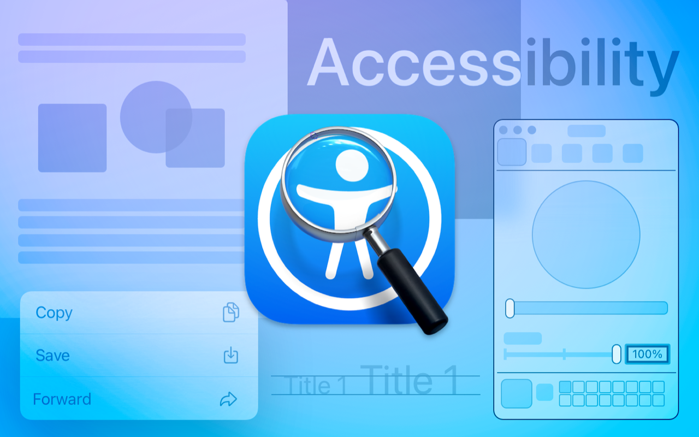

> Navigation: [Technologies](../technologies.md) · [Accessibility](../accessibility.md)

# Accessibility Inspector

Developer Tool

Reveal how your app represents itself to people using accessibility features.

## Overview

Use Accessibility Inspector to display, query, and test accessibility information for the elements in your app’s view hierarchy. Audit your app to confirm that it addresses accessibility issues such as clipped text and unlabeled elements, and uses appropriate text size and color contrast levels. The information provided by the inspector supplements accessibility testing by providing some of the raw information you need to debug accessibility issues.

To use Accessibility Inspector, open Xcode and choose Xcode \> Open Developer Tool \> Accessibility Inspector.

## Topics

### App inspection

- [Inspecting the accessibility of the screens in your app](inspecting-the-accessibility-of-screens.md) — Focus on your app with Accessibility Inspector and investigate potential issues on each screen.

### Accessibility audits

- [Performing accessibility audits for your app](performing-accessibility-audits-for-your-app.md) — Audit your app for common accessibility issues with Accessibility Inspector.

### Accessibility feature testing

- [Testing system accessibility features in your app](testing-system-accessibility-features-in-your-app.md) — Confirm that your app provides a good experience for everyone by testing system accessibility settings in Accessibility Inspector.
