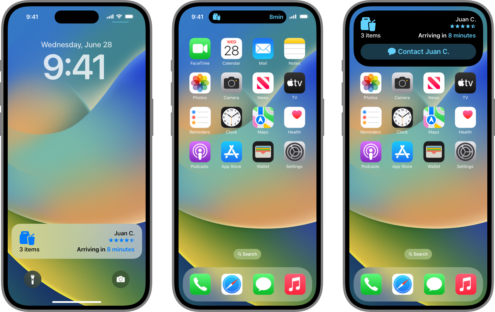

> Navigation: [Technologies](technologies.md)

# ActivityKit

Framework

Share live updates from your app as Live Activities on iPhone, iPad, Apple Watch, and the Mac.

## Overview

With the ActivityKit framework, you can start a Live Activity to share live updates from your app. Live Activities offer a rich, interactive, and highly glanceable way for people to keep track of an event or activity over several hours, especially for apps that push the limit of notifications to provide updated information. For example, a sports app might start a Live Activity that makes live information available at a glance for the duration of a game.

A Live Activity appears in highly visible contexts:

- On iPad and iPhone, it appears on the Lock Screen, in the Dynamic Island, and on the Home Screen.
- On Apple Watch, it appears in the Smart Stack.
- On Mac, it appears in the Menu bar.
- In CarPlay, it appears on the Home Screen.

In addition to viewing real-time information, people perform essential functionality without launching your app using buttons or toggles included in a Live Activity layout or tap the Live Activity to launch the app to a scene that matches the activity’s content.

Three screenshots of iPhone that show a Live Activity for a delivery app. They show the Live Activity on the Lock Screen, in the leading and trailing presentations in the Dynamic Island, and in the expanded presentation.

In your app, use ActivityKit to configure, start, update, and end the Live Activity, and create the user interface of your Live Activities with a widget extension, [WidgetKit](widgetkit.md), and [SwiftUI](swiftui.md). By using SwiftUI and WidgetKit, you can share code between widgets and Live Activities or develop them in tandem.

However, Live Activities use a different mechanism to receive updates compared to widgets. Instead of using a timeline mechanism, Live Activities receive updated data from your app with ActivityKit and from your server with ActivityKit push notifications, and you can start Live Activities with ActivityKit push notifications.

> [!note] Note
> visionOS doesn’t support Live Activities. Requests to start a Live Activity from a compatible iPad or iPhone app fail.

## Topics

### Essentials

- [Developing a WidgetKit strategy](widgetkit/developing-a-widgetkit-strategy.md) — Explore features, tasks, related frameworks, and constraints as you make a plan to implement widgets, controls, watch complications, and Live Activities.
- [ActivityKit updates](updates/activitykit.md) — Learn about important changes in ActivityKit.

### Starting a Live Activity

- [Displaying live data with Live Activities](activitykit/displaying-live-data-with-live-activities.md) — Display up-to-date data and offer quick interactions in the Dynamic Island, on the Lock Screen, in CarPlay, and on a paired Mac or Apple Watch.
- [Starting and updating Live Activities with ActivityKit push notifications](activitykit/starting-and-updating-live-activities-with-activitykit-push-notifications.md) — Use ActivityKit to receive push tokens and to remotely start, update, and end your Live Activity with ActivityKit notifications.
- [Activity](activitykit/activity.md) — The object you use to start, update, and end a Live Activity.
- [Emoji Rangers: Supporting Live Activities, interactivity, and animations](widgetkit/emoji-rangers-supporting-live-activities-interactivity-and-animations.md) — Offer Live Activities, controls, animate data updates, and add interactivity to widgets.
- [NSSupportsLiveActivities](bundleresources/information-property-list/nssupportsliveactivities.md) — A Boolean value that indicates whether an app supports Live Activities.
- [NSSupportsLiveActivitiesFrequentUpdates](bundleresources/information-property-list/nssupportsliveactivitiesfrequentupdates.md) — A Boolean value that indicates whether an app can update its Live Activities frequently.

### User interface

- [Creating custom views for Live Activities](activitykit/creating-custom-views-for-live-activities.md) — Create reusable custom views and layouts that support each Live Activity presentation.
- [Adding accessible descriptions to widgets and Live Activities](activitykit/adding-accessible-descriptions-to-widgets-and-live-activities.md) — Describe the interface elements of your widgets and Live Activities to help people understand what they represent.
- [Launching your app from a Live Activity](activitykit/launching-your-app-from-a-live-activity.md) — Use deep links to enable people to open your app’s scene that matches the data of you Live Activity.

### Widget ecosystem

- [Creating a widget extension](widgetkit/creating-a-widget-extension.md) — Display your app’s content in a convenient, informative widget on various devices.
- [Animating data updates in widgets and Live Activities](widgetkit/animating-data-updates-in-widgets-and-live-activities.md) — Use SwiftUI animations to indicate data updates in your widgets and Live Activities.
- [Creating views for widgets, Live Activities, and watch complications](widgetkit/creating-views-for-widgets-live-activities-and-watch-complications.md) — Implement glanceable views with WidgetKit and SwiftUI.
- [Linking to specific app scenes from your widget or Live Activity](widgetkit/linking-to-specific-app-scenes-from-your-widget-or-live-activity.md) — Add deep links to your widgets and Live Activities that enable people to open a specific scene in your app.
- [WidgetKit](widgetkit.md) — Extend the reach of your app by creating widgets, watch complications, Live Activities, and controls.
