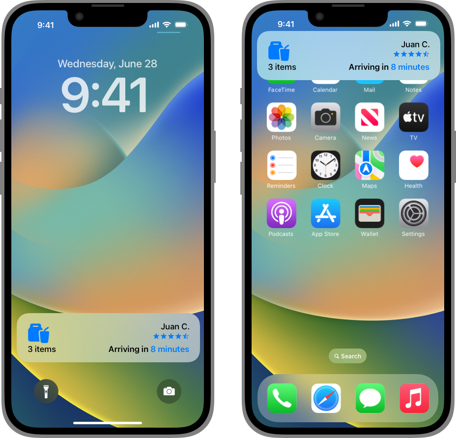
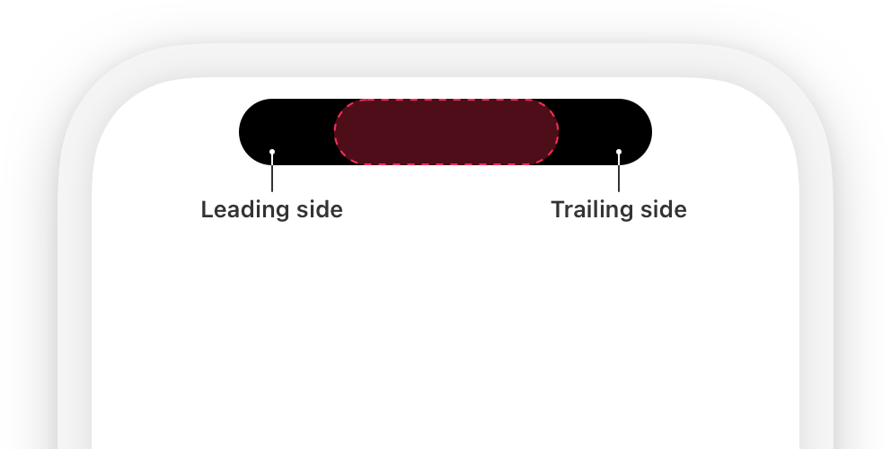
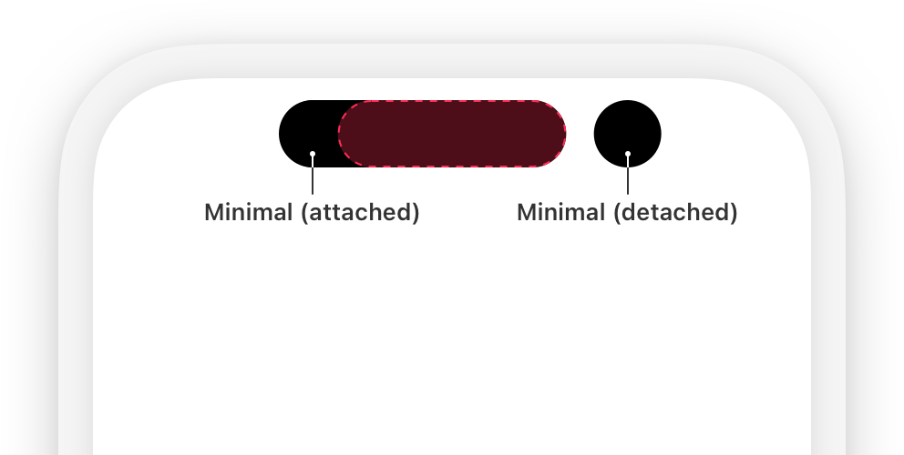
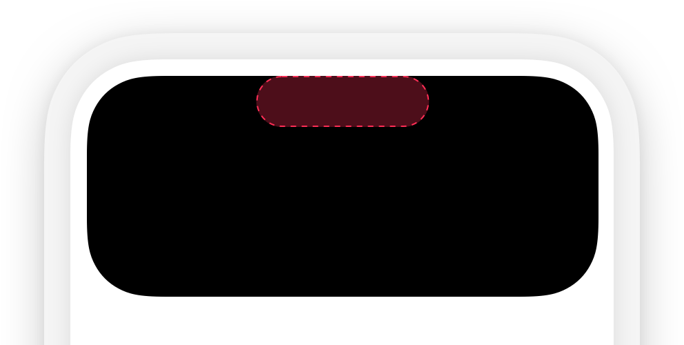
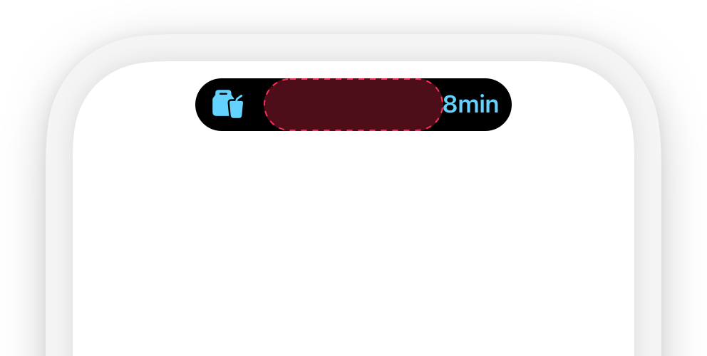
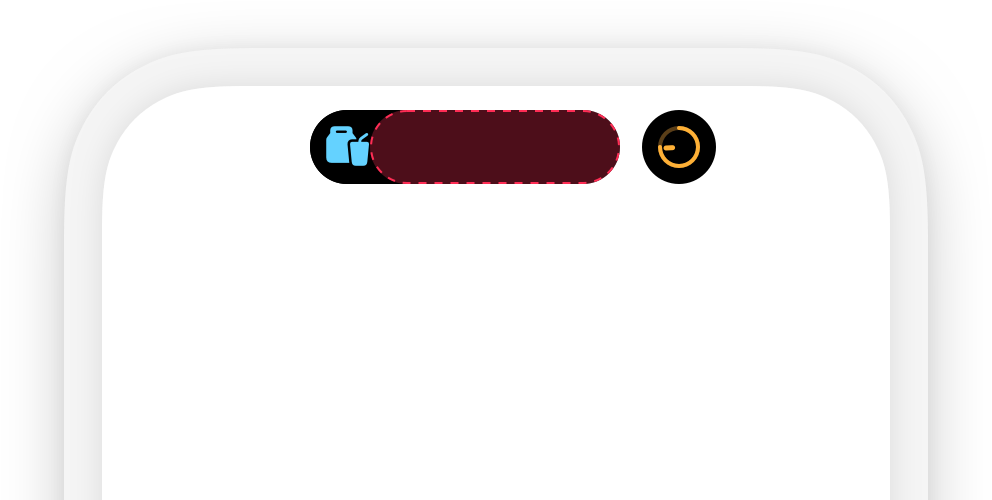
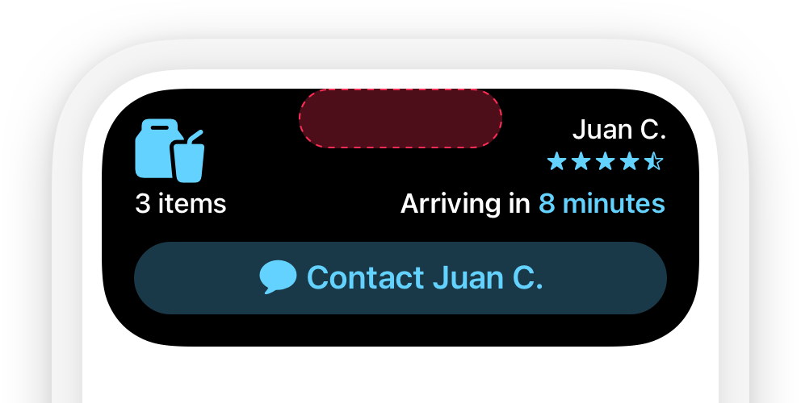
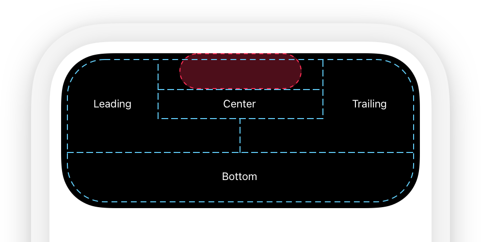
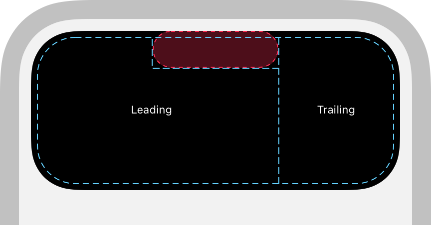

> Navigation: [Technologies](../technologies.md) · [ActivityKit](../activitykit.md)

# Displaying live data with Live Activities

<sub>Article</sub>

Display up-to-date data and offer quick interactions in the Dynamic Island, on the Lock Screen, in CarPlay, and on a paired Mac or Apple Watch.

## Overview

Live Activities display your app’s current data on the Lock Screen, in the Dynamic Island, in CarPlay, and on a paired Mac or Apple Watch, giving people access to information at a glance and allowing them to perform quick actions that are related to the displayed information.

To offer Live Activities, add code to your existing widget extension or create a new widget extension if your app doesn’t already include one. Live Activities use [WidgetKit](../widgetkit.md) functionality and [SwiftUI](../swiftui.md) for their user interface. ActivityKit’s role is to handle the life cycle of each Live Activity: You use its API to request, schedule, update, and end a Live Activity and to receive ActivityKit push notifications.

For design guidance, refer to [Human Interface Guidelines \> Live Activities](https://developer.apple.com/design/human-interface-guidelines/components/system-experiences/live-activities).

### Review Live Activity presentations on iPhone and iPad

Live Activities come in different presentations that appear in various highly visible places. To add support for Live Activities to your iOS or iPadOS app, you must support all presentations. The system automatically chooses the best presentation for each location across a person’s devices.

The Lock Screen presentation appears on the Lock Screen of iPhone and iPad. On an unlocked device that doesn’t support the Dynamic Island, the Lock Screen presentation appears as a banner for Live Activity updates that include an alert configuration. For example, if a person uses Mail on a device that doesn’t support the Dynamic Island while your app’s Live Activity receives an update with an alert configuration, the system displays the Lock Screen presentation as a banner at the top of the screen to let them know about the updated Live Activity.



<sub>Two screenshots of an iPhone that doesn’t support the Dynamic Island and shows a Live Activity for a delivery app. They show the Live Activity on the Lock Screen and the same presentation on the Home Screen as a banner.</sub>

Devices that support the Dynamic Island display Live Activities in the Dynamic Island using several presentations. When there’s only one ongoing Live Activity, the system uses the compact presentation. It’s composed of two elements: one that displays on the leading side of the TrueDepth camera, and one that displays on the trailing side. Although the leading and trailing elements are separate views, they form a cohesive view in the Dynamic Island, representing a single piece of information from your app. People can tap a compact Live Activity to open the app and get more details about the event or task.



<sub>An illustration of the Dynamic Island with a Live Activity that appears in the compact leading and trailing presentations.</sub>

When multiple Live Activities from several apps are active, the system uses the minimal presentation to display two of them in the Dynamic Island. The system chooses a Live Activity from one app to appear attached to the Dynamic Island while it presents a Live Activity from another app detached from the Dynamic Island. As with a compact Live Activity, people can tap a minimal Live Activity to open the app and get more details about the event or task.



Additionally, the minimal presentation also appears at the top of the iPhone Lock Screen when the device is in StandBy — in landscape orientation, charging, and with the display positioned at an angle to face the room. If a person taps the minimal presentation in StandBy, the Live Activity expands to fill the whole display using the Lock Screen presentation.

When people touch and hold a Live Activity in a compact or minimal presentation, the system displays the content in an expanded presentation.



For additional information on making sure your Live Activities look great on paired devices, refer to [Creating custom views for Live Activities](creating-custom-views-for-live-activities.md).

### Understand constraints

A Live Activity can be active for up to eight hours unless its app or a person ends it before this limit. After the eight-hour limit, the system automatically ends the Live Activity, and immediately removes it from the Dynamic Island. However, the Live Activity remains on the Lock Screen until a person removes it or for up to four additional hours before the system removes it — whichever comes first. As a result, a Live Activity remains on the Lock Screen for a maximum of 12 hours.

For more information about ending a Live Activity, refer to the “End the Live Activity” section below.

The system requires image assets for a Live Activity to use a resolution that’s smaller or equal to the size of the presentation for a device. If you use an image asset that’s larger than the size of the Live Activity presentation, the system might fail to start the Live Activity. For example, an image you use for the minimal presentation of your Live Activity shouldn’t exceed 45x36.67 points. For size guidance of Live Activity presentations, refer to [Human Interface Guidelines \> Live Activities](https://developer.apple.com/design/human-interface-guidelines/live-activities#Specifications).

Each Live Activity runs in its own sandbox, and — unlike a widget — it can’t access the network or receive location updates. To update the dynamic data of an active Live Activity, use ActivityKit in your app or allow your Live Activities to receive ActivityKit push notifications as described in [Starting and updating Live Activities with ActivityKit push notifications](starting-and-updating-live-activities-with-activitykit-push-notifications.md).

> [!important] Important
> Static and dynamic data for a Live Activity, including data for ActivityKit updates and ActivityKit push notifications, can’t exceed a combined size of 4 KB.

### Add support for Live Activities to your app

The code that describes the user interface of your Live Activity is part of your app’s widget extension. If you already offer widgets in your app, add code for the Live Activity to your existing widget extension and reuse code between your widgets and Live Activities. However, although Live Activities leverage WidgetKit’s functionality, they aren’t widgets. In contrast to the timeline mechanism you use to update your widgets’ user interface, you start and update a Live Activity from your app with ActivityKit or with ActivityKit push notifications.

> [!note] Note
> You can create a widget extension to adopt Live Activities without offering widgets. However, consider offering both widgets and Live Activities to allow people to add glanceable information and a personal touch to their devices.

To support Live Activities:

1. Create a widget extension if you haven’t already added one to your project and make sure to select “Include Live Activity” when you add a widget extension target to your Xcode project. For more information on creating a widget extension, refer to [WidgetKit](../widgetkit.md) and [Creating a widget extension](../widgetkit/creating-a-widget-extension.md).
2. If your project includes an `Info.plist` file, add the Supports Live Activities entry to it, and set its Boolean value to `YES`. Alternatively, open the `Info.plist` file as source code, add the [NSSupportsLiveActivities](../bundleresources/information-property-list/nssupportsliveactivities.md) key, then set the type to `Boolean` and its value to `YES`. If your project doesn’t have an `Info.plist` file, add the Supports Live Activities entry to the list of custom iOS target properties for your iOS app target and set its value to `YES`.
3. Add code that defines an [ActivityAttributes](activityattributes.md)  structure to describe the static and dynamic data of your Live Activity.
4. Use the `ActivityAttributes` you defined to create the [ActivityConfiguration](../widgetkit/activityconfiguration.md).
5. Add code to configure, start, update, and end your Live Activities.
6. Make your Live Activity interactive with [Button](../swiftui/button.md) or [Toggle](../swiftui/toggle.md) as described in [Adding interactivity to widgets and Live Activities](../widgetkit/adding-interactivity-to-widgets-and-live-activities.md).
7. Add animations to bring attention to content updates as described in [Animating data updates in widgets and Live Activities](../widgetkit/animating-data-updates-in-widgets-and-live-activities.md).

### Define a set of static and dynamic data

After you add a widget extension target that includes Live Activities to your Xcode project, describe the data that your Live Activity displays by implementing [ActivityAttributes](activityattributes.md). The [ActivityAttributes](activityattributes.md) inform the system about static data that appears in the Live Activity. You also use [ActivityAttributes](activityattributes.md) to declare the required custom [ContentState](activity/contentstate-swift.typealias.md) type that describes the dynamic data of your Live Activity. In the example below from the [Emoji Rangers: Supporting Live Activities, interactivity, and animations](../widgetkit/emoji-rangers-supporting-live-activities-interactivity-and-animations.md) sample code project, `AdventureAttributes ` describes the hero information as static data using `let hero: EmojiRanger`. Note how the code defines the [ContentState](activity/contentstate-swift.typealias.md) to encapsulate dynamic data: the current health level of the hero and a string that describes what happens to the hero.

```swift
import ActivityKit

struct AdventureAttributes: ActivityAttributes {
    struct ContentState: Codable & Hashable {
        let currentHealthLevel: Double
        let eventDescription: String
    }
    
    let hero: EmojiRanger
}
```

> [!tip] Tip
> To make your code more descriptive and easy to read, you can define a type alias for the `ContentState`; for example: `public typealias HeroStatus = ContentState`.

### Add Live Activities to the widget extension

Live Activities leverage WidgetKit. After you add code to describe the data that appears in the Live Activity with the [ActivityAttributes](activityattributes.md) structure, add code to return an [ActivityConfiguration](../widgetkit/activityconfiguration.md) in your widget implementation.

The following example uses the `AdventureAttributes` structure from the previous example:

```swift
import WidgetKit
import SwiftUI

struct AdventureActivityConfiguration: Widget {
    var body: some WidgetConfiguration {
        ActivityConfiguration(for: AdventureAttributes.self) { context in
            // Create the presentation that appears on the Lock Screen and as a
            // banner on the Home Screen of devices that don't support the
            // Dynamic Island.
            // ...
        } dynamicIsland: { context in
            // Create the presentations that appear in the Dynamic Island.
            // ...
        }
    }
}
```

> [!tip] Tip
> If you select “Include Live Activities” when you add a new widget extension target to your project, Xcode automatically creates a widget bundle for you that includes a widget and a Live Activity.

If your app already offers widgets, add the Live Activity to your [WidgetBundle](../swiftui/widgetbundle.md). If you don’t have a [WidgetBundle](../swiftui/widgetbundle.md) — for example, if you only offer one widget — create a widget bundle as described in [Creating a widget extension](../widgetkit/creating-a-widget-extension.md) and then add the Live Activity to it.

### Create the Lock Screen presentation

To create the user interface of the Live Activity, you use [SwiftUI](../swiftui.md) in the widget extension you created earlier. Similar to widgets, you don’t provide the size of the user interface for your Live Activity but let the system determine the appropriate dimensions.

Start with the presentation that appears on the Lock Screen. The following code displays the information that the `AdventureAttributes` struct describes using the custom `AdventureLiveActivityView`:

```swift
struct AdventureActivityConfiguration: Widget {
    var body: some WidgetConfiguration {
        ActivityConfiguration(for: AdventureAttributes.self) { context in
            // Create the presentation that appears on the Lock Screen and as a
            // banner on the Home Screen of devices that don't support the
            // Dynamic Island.
            AdventureLiveActivityView(
                hero: context.attributes.hero,
                isStale: context.isStale,
                contentState: context.state
            )
            .activityBackgroundTint(Color.liveActivityBackground.opacity(0.25))
        } dynamicIsland: { context in
            // Create the presentations that appear in the Dynamic Island.
            // ...
        }
    }
}
```

> [!note] Note
> The system may truncate a Live Activity if its height exceeds 160 points.

On a device that doesn’t support the Dynamic Island, the system displays the Lock Screen presentation as a banner for a Live Activity update  if:

- The device is unlocked and its app isn’t in use
- You pass an [AlertConfiguration](alertconfiguration.md) to the [update(_:alertConfiguration:)](<activity/update(__alertconfiguration_).md>) function

On iPhone in StandBy, the Lock Screen presentation appears scaled to fill the screen of the device. Make sure your assets offer a high-enough resolution for StandBy. Additionally, consider updating the Lock Screen presentation to make use of the additional space. To detect Standby, use the [isActivityFullscreen](../swiftui/environmentvalues/isactivityfullscreen.md) environment variable.

### Create the compact and minimal presentations

Live Activities appear in the Dynamic Island of devices that support it. When you start one or more Live Activities and no other app starts a Live Activity, the compact leading and trailing presentations appear together to form a cohesive presentation in the Dynamic Island for one Live Activity.



When more than one app starts a Live Activity, the system chooses which Live Activities are visible and displays two Live Activities using the minimal presentation for each: One minimal presentation appears attached to the Dynamic Island, while the other appears detached. Additionally, the detached minimal presentation appears on the Lock Screen on iPhone in StandBy. If your app starts more than one Live Activity at the same time, you can tell the system which one it should display by setting a relevance score. For more information, refer to the [Configure the Live Activity](displaying-live-data-with-live-activities.md#Configure-the-Live-Activity) section below.



The following example shows how the [Emoji Rangers: Supporting Live Activities, interactivity, and animations](../widgetkit/emoji-rangers-supporting-live-activities-interactivity-and-animations.md) app provides the required compact and minimal presentations. For the leading presentation, it reuses the custom SwiftUI view `Avatar`. For the trailing presentation, it uses a [ProgressView](../swiftui/progressview.md).

```swift
import SwiftUI
import WidgetKit

struct AdventureActivityConfiguration: Widget {
    var body: some WidgetConfiguration {
        ActivityConfiguration(for: AdventureAttributes.self) { context in
            // Create the presentation that appears on the Lock Screen and as a
            // banner on the Home Screen of devices that don't support the
            // Dynamic Island.
            // ...
        } dynamicIsland: { context in
            // Create the presentations that appear in the Dynamic Island.
            DynamicIsland {
                // Create the expanded presentation.
                // ...
            } compactLeading: {
                // Create the compact leading presentation.
                Avatar(hero: context.attributes.hero, includeBackground: true)
                    .accessibilityLabel("The avatar of \(context.attributes.hero.name).")
            } compactTrailing: {
                // Create the compact trailing presentation.
                ProgressView(value: context.state.currentHealthLevel, total: 1) {
                    let healthLevel = Int(context.state.currentHealthLevel * 100)
                    Text("\(healthLevel)")
                        .accessibilityLabel("Health level at \(healthLevel) percent.")
                }
                .progressViewStyle(.circular)
                .tint(context.state.currentHealthLevel <= 0.2 ? Color.red : Color.green)
            } minimal: {
                // Create the minimal presentation.
                // ...
            }           
        }
    }
}
```

### Create the expanded presentation

In addition to the compact and minimal presentations, you must support the expanded presentation. It appears when a person touches and holds a compact or minimal presentation, and it also appears briefly for Live Activity updates.



Use the [DynamicIslandExpandedRegionPosition](../widgetkit/dynamicislandexpandedregionposition.md) to specify detailed instructions where you want SwiftUI to position your content. The following example shows how the [Emoji Rangers: Supporting Live Activities, interactivity, and animations](../widgetkit/emoji-rangers-supporting-live-activities-interactivity-and-animations.md) app creates its expanded presentation using a [DynamicIslandExpandedContentBuilder](../widgetkit/dynamicislandexpandedcontentbuilder.md):

```swift
struct AdventureActivityConfiguration: Widget {
    var body: some WidgetConfiguration {
        ActivityConfiguration(for: AdventureAttributes.self) { context in
            // Create the presentation that appears on the Lock Screen and as a
            // banner on the Home Screen of devices that don't support the
            // Dynamic Island.
            // ...
        } dynamicIsland: { context in
            // Create the presentations that appear in the Dynamic Island.
            DynamicIsland {
                // Create the expanded presentation.
                expandedContent(
                    hero: context.attributes.hero,
                    contentState: context.state,
                    isStale: context.isStale
                )
            } compactLeading: {
                // Create the compact leading presentation.
                // ...
            } compactTrailing: {
                // Create the compact trailing presentation.
                // ...
            } minimal: {
                // Create the minimal presentation.
                // ...
            }
        }
    }
    
    @DynamicIslandExpandedContentBuilder
    private func expandedContent(hero: EmojiRanger,
                                 contentState: AdventureAttributes.ContentState,
                                 isStale: Bool) -> DynamicIslandExpandedContent<some View> {
        DynamicIslandExpandedRegion(.leading) {
            LiveActivityAvatarView(hero: hero)
        }
        
        DynamicIslandExpandedRegion(.trailing) {
            StatsView(
                hero: hero,
                isStale: isStale
            )
        }
        
        DynamicIslandExpandedRegion(.bottom) {
            HealthBar(currentHealthLevel: contentState.currentHealthLevel)
            
            EventDescriptionView(
                hero: hero,
                contentState: contentState
            )
        }
    }
}
```

To render views that appear in the expanded Live Activity, the system divides the expanded presentation into different areas. Note how the example returns a [DynamicIsland](../widgetkit/dynamicisland.md) that specifies several [DynamicIslandExpandedRegion](../widgetkit/dynamicislandexpandedregion.md) objects. Pass the following [DynamicIslandExpandedRegionPosition](../widgetkit/dynamicislandexpandedregionposition.md) values to lay out your content at a specified position in the expanded presentation:

- [center](../widgetkit/dynamicislandexpandedregionposition/center.md) places content below the TrueDepth camera.
- [leading](../widgetkit/dynamicislandexpandedregionposition/leading.md) places content along the leading edge of the expanded Live Activity next to the TrueDepth camera and wraps additional content below it.
- [trailing](../widgetkit/dynamicislandexpandedregionposition/trailing.md) places content along the trailing edge of the expanded Live Activity next to the TrueDepth camera and wraps additional content below it.
- [bottom](../widgetkit/dynamicislandexpandedregionposition/bottom.md) places content below the leading, trailing, and center content.



<sub>An illustration that shows the center, leading, trailing, and bottom positions for content for the expanded presentation in the Dynamic Island.</sub>

To render content that appears in the expanded Live Activity, the system first determines the width of the center content while taking into account the minimal width of the leading and trailing content. The system then places and sizes the leading and trailing content based on its vertical position. By default, leading and trailing positions receive an equal amount of horizontal space.

You can tell the system to prioritize one of the `DynamicIslandExpandedRegion` views by passing a `priority` to the [init(_:priority:content:)](<../widgetkit/dynamicislandexpandedregion/init(__priority_content_).md>) initializer. The system renders the view with the highest priority with the full width of the Dynamic Island. The following illustration shows leading and trailing positions in an expanded presentation with higher priority to render them below the TrueDepth camera.



<sub>An illustration that shows the leading and trailing positions in an expanded presentation with higher priority to render them below the TrueDepth camera.</sub>

> [!note] Note
> If content is too wide to appear in a leading position next to the TrueDepth camera, use the [belowIfTooWide](../widgetkit/dynamicislandexpandedregionverticalplacement/belowiftoowide.md) modifier to render leading content below the TrueDepth camera.

### Configure how your Live Activity launches your app

People tap your Live Activity to launch your app. Use deep links to take them to the scene in your app that matches the activity’s information. On Apple Watch, choose if people can open your app on iPhone or its watchOS companion by tapping your Live Activity on Apple Watch. For more information, refer to [Launching your app from a Live Activity](launching-your-app-from-a-live-activity.md).

### Add Buttons or Toggles

Like widgets, Live Activities can contain SwiftUI buttons and toggles to provide quick actions. For example, a food-ordering app might show a button in its Live Activity that people tap to check in at a restaurant when they pick up a takeout order.

To add a toggle or button to a Live Activity, adopt the [App Intents](../appintents.md) framework and use the initializers for [Button](../swiftui/button.md) and [Toggle](../swiftui/toggle.md) that take an app intent. For more information about using toggles and buttons in widget extensions, including for Live Activities, refer to [WidgetKit](../widgetkit.md).

> [!note] Note
> Buttons and toggles on Live Activities don’t perform actions in CarPlay.

### Provide accessibility labels

Designing with accessibility in mind is a foundational principle when creating an app. It also applies to Live Activities. To allow people to customize how they interact with your Live Activity and to make sure VoiceOver for your Live Activity works correctly, add accessibility labels for the SwiftUI views you create for each Live Activity presentation. For more information, refer to [Adding accessible descriptions to widgets and Live Activities](adding-accessible-descriptions-to-widgets-and-live-activities.md).

### Make sure Live Activities are available

Live Activities are available on iPhone and iPad. If your app is available on additional platforms and offers a widget extension, make sure Live Activities are available at runtime. Additionally, people can choose to deactivate Live Activities for an app in the Settings app.

To refer to if Live Activities are available and if a person allowed your app to use Live Activities:

- Use [areActivitiesEnabled](activityauthorizationinfo/areactivitiesenabled.md) to synchronously determine whether to show a user interface in your app for starting a Live Activity.
- Receive asynchronous user authorization updates by observing any user authorization changes with the [activityEnablementUpdates](activityauthorizationinfo/activityenablementupdates-swift.property.md) stream and respond to them accordingly.

> [!note] Note
> An app can start or schedule several Live Activities, and a device can run Live Activities from several apps — the exact number may depend on a variety of factors. Scheduled Live Activities count towards the limit of simultanious activities. In addition to making sure Live Activities are available, always handle any errors gracefully when starting, updating, or ending a Live Activity. For example, starting a Live Activity may fail because a person’s device may have reached its limit of active and scheduled Live Activities.

### Configure the Live Activity

Before you can start a Live Activity in your app, configure it with an [ActivityContent](activitycontent.md) structure. The activity content encapsulates the [ActivityAttributes](activityattributes.md) and additional configuration information:

- The [staleDate](activitycontent/staledate.md) tells the system when the Live Activity content becomes outdated.
- The [relevanceScore](activitycontent/relevancescore.md) determines which of your Live Activities appears in the Dynamic Island and the order of your Live Activities on the Lock Screen.

While setting the [staleDate](activitycontent/staledate.md) is optional, it’s helpful when you want to ensure your Live Activity doesn’t display outdated content. At the specified date, the [activityState](activity/activitystate.md) changes to [ActivityState.stale](activitystate/stale.md) and [isStale](../widgetkit/activityviewcontext/isstale.md) changes to `true`. Access [isStale](../widgetkit/activityviewcontext/isstale.md) to monitor the activity state and respond to outdated Live Activities that haven’t received updates. For example, while a person has network connectivity, a sports app could update the Live Activity with the latest game information and advance the stale date. If a person enters an area without network connectivity, the app can’t update the Live Activity with new information and an advanced stale date. Eventually, the Live Activity becomes stale and displays text to indicate that the displayed information is outdated. On the next app launch or when it performs background tasks, the app can also respond to the [ActivityState.stale](activitystate/stale.md) state.

If your app starts more than one Live Activity, provide a relevance score to determine the order of your Live Activities on the Lock Screen and which of your Live Activities appears in the Dynamic Island:

- If you don’t provide a relevance score or if Live Activities have the same relevance score, the system shows the first Live Activity you started in the Dynamic Island.
- If you use different relevance scores, the system shows the Live Activity with the highest relevance score in the Dynamic Island.

The system expects relative values for the relevance score. Assign a higher value for an important Live Activity content update — for example, a score of `100` — and use lower values for less important Live Activity content updates — for example, `50`.

> [!note] Note
> Keep track of the relevance scores you assign for each ongoing Live Activity so you can change the order of them as needed with each Live Activity update.

### Start the Live Activity

You start a Live Activity in your app’s code while the app is in the foreground with the [request(attributes:content:pushType:)](<activity/request(attributes_content_pushtype_).md>) function. Pass the [ActivityAttributes](activityattributes.md) and [ActivityContent](activitycontent.md) objects you created to it and, if you implement ActivityKit push notifications, the `pushType` parameter.

The following example from the [Emoji Rangers: Supporting Live Activities, interactivity, and animations](../widgetkit/emoji-rangers-supporting-live-activities-interactivity-and-animations.md) app creates the initial attributes and content state for the Emoji Rangers Live Activity.

```swift
if ActivityAuthorizationInfo().areActivitiesEnabled {
    do {
        let adventure = AdventureAttributes(hero: hero)
        let initialState = AdventureAttributes.ContentState(
            currentHealthLevel: hero.healthLevel,
            eventDescription: "Adventure has begun!"
        )
        
        let activity = try Activity.request(
            attributes: adventure,
            content: .init(state: initialState, staleDate: nil),
            pushType: .token
        )
        
        self.setup(withActivity: activity)
    } catch {
        errorMessage = """
				    Couldn't start activity
				    ------------------------
				    \(String(describing: error))
				    """
        
        self.errorMessage = errorMessage
    }
}
```

In general, your app needs to be in the foreground to start a Live Activity. You can update or end a Live Activity from your app while it runs in the background — for example, by using [Background Tasks](../backgroundtasks.md). However, you can start a Live Activity while your app is in the background by using an app intent that conforms to [LiveActivityIntent](../appintents/liveactivityintent.md). For example, you might create a control that people place in Control Center. The control could use a `LiveActivityIntent` and starts the Live Activity in the intent’s `perform()` method. For more information about app intents, refer to [App Intents](../appintents.md) and doc://com.apple.documentation/appintents/making-actions-and-content-discoverable-and-widely-available.

### Schedule a Live Activity at a specific date

You can schedule a Live Activity for a specific date using the [request(attributes:content:pushType:style:alertConfiguration:startDate:)](<activity/request(attributes_content_pushtype_style_alertconfiguration_startdate_).md>) function. For example, an app that allows people to watch or follow sports matches might want to schedule a Live Activity for an upcoming game. If you allow people to schedule a Live Activity, you must pass an [AlertConfiguration](alertconfiguration.md) to make sure they know when your app starts a Live Activity.

### Start a transient Live Activity

Live Activities can appear temporarily in the extended presentation in the Dynamic Island to allow interactions and status updates while a person is actively performing a task. Locking the device, collapsing the extended presentation in the Dynamic Island, or tapping outside the Dynamic Island ends the Live Activity. For example, the Music app displays an extended presentation in the Dynamic Island when a person starts playing audio in the app, allowing people to choose to move the audio to a HomePod that’s on the same Wi-Fi network with AirPlay. The Live Activity ends automatically when the person leaves the app.

To start a transient Live Activity, use [request(attributes:content:pushType:style:)](<activity/request(attributes_content_pushtype_style_).md>) and pass [ActivityStyle.transient](activitystyle/transient.md)  as the `style` parameter.

### Start, update, and end your Live Activity with a push notification

In addition to updating and ending a Live Activity from your app with ActivityKit, start, update, or end a Live Activity with an ActivityKit push notification that you send from your server to the Apple Push Notification service (APNs).

To learn more about using ActivityKit push notifications, refer to [Starting and updating Live Activities with ActivityKit push notifications](starting-and-updating-live-activities-with-activitykit-push-notifications.md).

### Update the Live Activity

When you start a Live Activity from your app, update the data that appears in the Live Activity using the [update(_:)](<activity/update(__).md>) function of the [Activity](activity.md) object you received when you started the Live Activity. To retrieve your app’s active Live Activities, use [activities](activity/activities.md).

For important updates, use the [update(_:alertConfiguration:)](<activity/update(__alertconfiguration_).md>) function to display an alert on iPhone, iPad, and a paired Apple Watch that tells a person about new Live Activity content. For example, the [Emoji Rangers: Supporting Live Activities, interactivity, and animations](../widgetkit/emoji-rangers-supporting-live-activities-interactivity-and-animations.md) app updates its Live Activity using an alert configuration to display an alert that lets people know that the hero has been knocked down:

```swift
guard let activity = currentActivity else {
    return
}

var alertConfig: AlertConfiguration? = nil
let contentState: AdventureAttributes.ContentState
if alert {
    let heroName = activity.attributes.hero.name
    
    alertConfig = AlertConfiguration(
        title: "\(heroName) has been knocked down!",
        body: "Open the app and use a potion to heal \(heroName).",
        sound: .default
    )
    
    contentState = AdventureAttributes.ContentState(
        currentHealthLevel: 0,
        eventDescription: "\(heroName) has been knocked down!"
    )
} else {
    contentState = AdventureAttributes.ContentState(
        currentHealthLevel: Double.random(in: 0...1),
        eventDescription: self.getEventDescription(hero: activity.attributes.hero)
    )
}

await activity.update(
    ActivityContent<AdventureAttributes.ContentState>(
        state: contentState,
        staleDate: Date.now + 15,
        relevanceScore: alert ? 100 : 50
    ),
    alertConfiguration: alertConfig
)
```

> [!note] Note
> The size of the updated data can’t exceed 4KB in size.

On Apple Watch, the system uses the `title` and `body` attributes for the alert. On iPhone and iPad, the system doesn’t show a regular alert but instead shows the expanded Live Activity in the Dynamic Island or the Lock Screen presentation as a banner on devices without the Dynamic Island.

### Animate content updates

When you define the user interface of your Live Activity, the system ignores any animation modifiers — for example, [withAnimation(_:_:)](<../swiftui/withanimation(____).md>) and [animation(_:value:)](<../swiftui/view/animation(__value_).md>) — and uses the system’s animation timing instead. However, the system performs some animation when the dynamic content of the Live Activity changes. Text views animate content changes with blurred content transitions, and the system animates content transitions for images and SF Symbols. If you add or remove views from the user interface based on content or state changes, views fade in and out. Use the following view transitions to configure these built-in transitions: [opacity](../swiftui/anytransition/opacity.md), [move(edge:)](<../swiftui/anytransition/move(edge_).md>), [slide](../swiftui/anytransition/slide.md), [push(from:)](<../swiftui/anytransition/push(from_).md>), or combinations of them. Additionally, request animations for timer text with [numericText(countsDown:)](<../swiftui/contenttransition/numerictext(countsdown_).md>).

You can animate data changes in your Live Activity with functions that give you more control over animation timing. For example, you can use [timingCurve(_:duration:)](<../swiftui/animation/timingcurve(__duration_).md>) to create an animation with a custom timing curve. For more information on SwiftUI animations, refer to [Animation](../swiftui/animation.md).

> [!note] Note
> On devices that include an Always-On display, the system doesn’t perform animations to preserve battery life in Always On. Make sure to use SwiftUI’s [isLuminanceReduced](../swiftui/environmentvalues/isluminancereduced.md) environment value to detect reduced luminance before animating content changes.

### End the Live Activity

Always end a Live Activity after the associated task or live event ends. A Live Activity that ended remains on the Lock Screen until the person removes it or the system removes it automatically. The automatic removal depends on the dismissal policy you provide to the [end(_:dismissalPolicy:)](<activity/end(__dismissalpolicy_).md>) function. Always include an updated [ContentState](activity/contentstate-swift.typealias.md) to ensure the Live Activity shows the latest and final content update after it ends. This is important because the Live Activity can remain visible on the Lock Screen for some time after it ends.

The following example shows how the [Emoji Rangers: Supporting Live Activities, interactivity, and animations](../widgetkit/emoji-rangers-supporting-live-activities-interactivity-and-animations.md) app ends its Live Activity and sets a custom dismissal policy based on a setting in the app:

```swift
func endActivity(dismissTimeInterval: Double?) async {
    guard let activity = currentActivity else {
        return
    }
    
    let hero = activity.attributes.hero
    
    let finalContent = AdventureAttributes.ContentState(
        currentHealthLevel: 1.0,
        eventDescription: "Adventure over! \(hero.name) is taking a nap."
    )
    
    let dismissalPolicy: ActivityUIDismissalPolicy
    if let dismissTimeInterval = dismissTimeInterval {
        if dismissTimeInterval <= 0 {
            dismissalPolicy = .immediate
        } else {
            dismissalPolicy = .after(.now + dismissTimeInterval)
        }
    } else {
        dismissalPolicy = .default
    }
    
    await activity.end(ActivityContent(state: finalContent, staleDate: nil), dismissalPolicy: dismissalPolicy)
}
```

With the [default](activityuidismissalpolicy/default.md) dismissal policy, the Live Activity appears on the Lock Screen for some time after it ends to allow a person to glance at their phone to refer to the latest information. A person can choose to remove the Live Activity at any time, or the system removes it automatically four hours after it ended.

To immediately remove the Live Activity that ended from the Lock Screen, use [immediate](activityuidismissalpolicy/immediate.md). Alternatively, use [after(_:)](<activityuidismissalpolicy/after(__).md>) to specify a date within a four-hour window. While you can provide any date, the system removes the ended Live Activity after the given date or after four hours from the moment the Live Activity ended — whichever comes first.

A person can remove your Live Activity from their Lock Screen at any time. This ends the Live Activity, but it doesn’t end or cancel the person’s action that started it. For example, a person may remove the Live Activity for their pizza delivery from the Lock Screen, but this doesn’t cancel the pizza order.

> [!note] Note
> When a person or the system removes a Live Activity, its [ActivityState](activitystate.md) changes to [ActivityState.dismissed](activitystate/dismissed.md).

### Keep track of updates

When you start a Live Activity, ActivityKit returns an [Activity](activity.md) object. In addition to the [id](activity/id.md) that uniquely identifies each activity, the [Activity](activity.md) offers sequences to observe content, activity state, and push token updates. Use the corresponding sequence to receive updates in your app, keep your app and Live Activities in sync, and respond to changed data:

- To observe changes to ongoing Live Activities and to asynchronously access a Live Activity when you start it, use [activityUpdates](activity/activityupdates-swift.type.property.md).
- To observe the state of an ongoing Live Activity — for example, to determine whether it’s active or has ended — use [activityStateUpdates](activity/activitystateupdates-swift.property.md).
- To observe changes to the dynamic content of a Live Activity, use [contentUpdates](activity/contentupdates-swift.property.md).
- To observe changes to the push token of a Live Activity, use [pushTokenUpdates](activity/pushtokenupdates-swift.property.md).

The following example shows how the [Emoji Rangers: Supporting Live Activities, interactivity, and animations](../widgetkit/emoji-rangers-supporting-live-activities-interactivity-and-animations.md) app tracks updates its content for ongoing Live Activities and updates its adventure view accordingly:

```swift
// Observe updates for ongoing Live Activities.
Task {
    for await content in activity.contentUpdates {
        self.updateAdventureView(content: content)
    }
}
```

### Observe active Live Activities

Your app can start more than one Live Activity. For example, a sports app may allow a person to start a Live Activity for each live sports game they’re interested in. If your app starts multiple Live Activities, keep track of ongoing Live Activities for your app using the [activities](activity/activities.md) property to make sure your app is aware of all ongoing Live Activities that ActivityKit tracks. Another use case for fetching all activities is to maintain Live Activities that are in progress and make sure you don’t keep any activities running for longer than needed. For example, the system may stop your app, or your app may crash while a Live Activity is active. When the app launches the next time, check if any activities are still active, update your app’s stored Live Activity data, and end any Live Activity that’s no longer relevant.

### Start and stop Live Activities from App Intents

The [App Intents](../appintents.md) framework enables you to extend your app’s custom functionality to support system-level services like Siri and the Shortcuts app, as well as the functionality to start a Live Activity. For example, a sports app could expose functionality to start a Live Activity for a person’s favorite sports team with the Shortcuts app or Siri.

Starting a Live Activity from an app intent is almost the same as adopting [App Intents](../appintents.md) to expose other functionality in your app:

1. Adopt the App Intents framework as described in [Getting started with the App Intents framework](../appintents/getting-started-with-the-app-intents-framework.md).
2. When you implement your app intent that starts the Live Activity, make sure it inherits from [LiveActivityIntent](../appintents/liveactivityintent.md).
3. In your `LiveActivityIntent` implementation, add code to start the Live Activity.

## See Also

### Starting a Live Activity

- [Starting and updating Live Activities with ActivityKit push notifications](starting-and-updating-live-activities-with-activitykit-push-notifications.md) — Use ActivityKit to receive push tokens and to remotely start, update, and end your Live Activity with ActivityKit notifications.
- [Activity](activity.md) — The object you use to start, update, and end a Live Activity.
- [Emoji Rangers: Supporting Live Activities, interactivity, and animations](../widgetkit/emoji-rangers-supporting-live-activities-interactivity-and-animations.md) — Offer Live Activities, controls, animate data updates, and add interactivity to widgets.
- [NSSupportsLiveActivities](../bundleresources/information-property-list/nssupportsliveactivities.md) — A Boolean value that indicates whether an app supports Live Activities.
- [NSSupportsLiveActivitiesFrequentUpdates](../bundleresources/information-property-list/nssupportsliveactivitiesfrequentupdates.md) — A Boolean value that indicates whether an app can update its Live Activities frequently.
