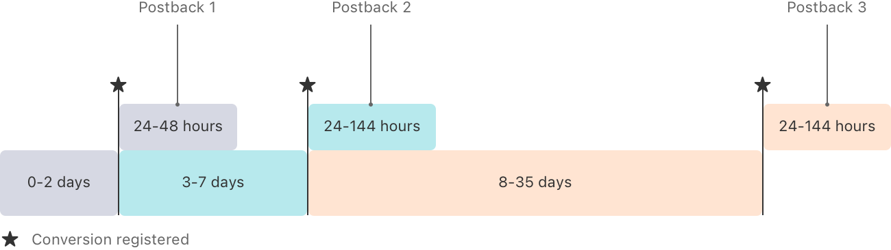
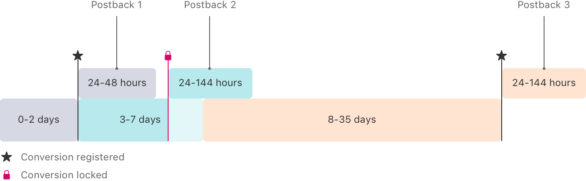

> Navigation: [Technologies](../technologies.md) · [AdAttributionKit](../adattributionkit.md)

# Receiving postbacks in multiple conversion windows

Article

Learn about the data that postbacks can contain in each conversion window.

## Overview

AdAttributionKit supports three conversion windows that can result in up to three postbacks for a winning ad attribution. The conversion window begins when the user first launches the app. The first conversion window spans days 0 to 2; the second window spans days 3 to 7; and the third window spans days 8 to 35. Apps can update conversion values during all three time-windows.

To be eligible to receive multiple postbacks, the advertised app needs to call [updateConversionValue(_:coarseConversionValue:lockPostback:)](<postback/updateconversionvalue(__coarseconversionvalue_lockpostback_).md>)or [updateConversionValue(_:lockPostback:)](<postback/updateconversionvalue(__lockpostback_).md>)to update the conversion values during each conversion window.

You can receive a single postback in the following cases:

- If the app’s postback data tier is Tier 0, the system sends only the first postback.
- Nonwinning ad attributions receive only one postback.

## Lock conversion values to receive postbacks sooner

By default, the system waits until the end of a conversion window to get the final conversion value. Apps can continue to update the conversion value until the end of the conversion window. When the conversion window ends, the system prepares the postback and sends it after a random delay:

A timeline that shows the first conversion window spans days 0 to 2, the second window spans days 3 to 7, and the third window spans days 8 to 35. At the end of the first conversion window, the system sends the postback 24 to 48 hours later. At the end of the second conversion window, the system sends the postback 24 to 144 hours later. At the end of the third conversion window, the system sends the postback 24 to 144 hours later.

The random delay is 24 to 48 hours for the first postback, and 24 to 144 hours for the second and third postbacks.

The [updateConversionValue(_:coarseConversionValue:lockPostback:)](<postback/updateconversionvalue(__coarseconversionvalue_lockpostback_).md>)method provides an option for you to lock in and finalize a conversion value before the conversion window ends. You can choose to lock the conversion value in any or all conversion windows. Below illustrates an app that locks the conversion value during the second conversion window:

A timeline that shows the first conversion window spans days 0 to 2, and the system sends the postback 24 to 48 hours later. The second conversion window spans days 3 to 7, but the app locks the conversion update before the window ends and the system sends the postback 24 to 144 hours after the lock. The remainder of the second conversion window is unavailable for further conversion value updates. The third window spans days 8 to 35, and the system accepts conversion value updates starting on day 8. At the end of the third conversion window, the system sends the postback 24 to 144 hours later.

After receiving a locked conversion value, the system immediately prepares the postback and ignores any further conversion value updates in the same conversion window. The system sends the postbacks after the same random delay following the locked conversion: a 24 to 48-hour delay for the first postback, and a 24 to 144-hour delay for the second and third postbacks. The system ignores further updates to the conversion value for the remaining time in the same conversion window.

## Receive the highest data level to help ensure crowd anonymity

To help maintain users’ privacy and ensure crowd anonymity, the device may limit the data that AdAttributionKit sends in postbacks. Apple determines a postback data tier that it assigns to each app download. The following depicts a hypothetical relationship between the tiers and relative crowd sizes.

A diagram of four 6 x 8 grids labeled Tier 0, Tier 1, Tier 2, and Tier 3. Each grid has one star on it that represents the app, and blue circles that represent the crowd. Tier 0 has six circles. Tier 1 has 16 circles, representing a larger crowd. Tier 2 has more circles than Tier 1. Tier 3 has circles that fill the entire grid, representing the largest crowd.

The postback data tier takes into account the crowd size associated with the app or domain displaying the ad, the advertised app, the country the advertised app was installed in, and the hierarchical source identifier that the ad network provides. The system computes the postback data tier for the two-, three-, and four-digit hierarchical source identifiers. It selects the source identifier with the highest postback data tier. If multiple source identifiers share the highest postback data tier, the system selects the source identifier with the most digits. If the highest postback data tier is Tier 1 or Tier 0, the system always selects the two-digit source identifier.

The postback data tier affects the following fields in the postback, which may be present or absent, or may contain a limited number of digits:

- `source-identifier`, the hierarchical source identifier that may include two, three, or four digits
- `conversion-value`, a fine-grained conversion value available only in the first postback
- `coarse-conversion-value`, a coarse conversion value that the system sends instead of the conversion value in lower postback data tiers, and in the second and third postbacks
- `publisher-item-identifier`, the app item identifier of the publisher app
- `marketplace-identifier`, the bundle id of the alternative marketplace from which the conversion came; the framework omits this property from Tier 0 postbacks.
- `country-code`, an optional field representing the country the app is installed in. The system adds this field if the crowd size for a particular country is Tier 3.

The remaining postback data fields aren’t dependent on the postback data tier and appear in all postbacks, based on the AdAttributionKit version of the postback.

## Receive the first postback

The first conversion window ends two days after the user first launches the app. The system prepares the postback after the conversion window ends, unless you use a lock. If you use a postback lock, the system prepares the first postback when the app calls [updateConversionValue(_:coarseConversionValue:lockPostback:)](<postback/updateconversionvalue(__coarseconversionvalue_lockpostback_).md>) with the lock in an enabled state. The system then sends the postback after a random 24 to 48-hour delay.

The postback data tier determines the data you receive in the first postback, as follows.

For ads in Tier 3, the first postback contains:

- `source-identifier`, the hierarchical source identifier with two, three, or four digits
- `conversion-value`, the fine-grained conversion value, if the app provides one
- `publisher-item-identifier`, the identifier for ads that display in apps
- `country-code`, an optional field representing the country the app is installed in. The system adds this field if the crowd size for a particular country is Tier 3.

For ads in Tier 2, the first postback contains:

- `source-identifier`, the hierarchical source identifier with two, three, or four digits
- `conversion-value`, the fine-grained conversion value, if the app provides one

For ads in Tier 1, the first postback contains:

- `source-identifier`, the hierarchical source identifier with two digits
- `coarse-conversion-value`, a coarse value, if the app provides one

For ads in Tier 0, the first postback contains the source-identifier, which is the hierarchical source identifier, with two digits.

## Receive the second and third postbacks

The second conversion window ends seven days after the user first launches the app, and the third conversion window ends after 35 days. The system prepares the second and third postbacks after their conversion windows end, and sends them after a random 24 to 144-hour delay.

If you use a lock with the second or third conversion value updates, the system prepares the postback when you call [updateConversionValue(_:coarseConversionValue:lockPostback:)](<postback/updateconversionvalue(__coarseconversionvalue_lockpostback_).md>) with the lock in an enabled state. The system sends the postback after a random 24 to 144-hour delay.

The postback data tier determines the data you receive in the postbacks, as follows.

For ads in Tier 1, Tier 2, and Tier 3, the second and third postbacks contain:

- source-identifier, the hierarchical source identifier with two digits
- coarse-conversion-value, the coarse conversion value, if the app provides one

For ads in Tier 0, the system doesn’t send a second or third postback.
