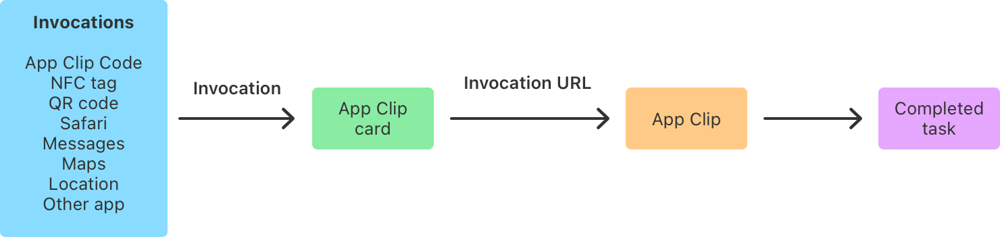

> Navigation: [Technologies](../technologies.md) · [App Clips](../appclip.md)

# Configuring App Clip experiences

Article

Review how people launch your App Clip with invocation URLs, default and demo links, and advanced App Clip experiences.

## Overview

People launch your App Clip by performing an _invocation_ — for example, by scanning an App Clip Code or tapping a Smart App Banner on a website. Upon launch, the App Clip receives an _invocation URL_ that determines what information appears on the App Clip card. To offer the best launch experience for a person’s current context, use the invocation URL on launch to update the UI of your App Clip.

To configure invocation URLs and the metadata that appears on the App Clip card, create the required _default App Clip experience_ in [App Store Connect](https://appstoreconnect.apple.com/login). For more advanced use cases — for example, to associate an App Clip with a physical location or to create an App Clip for multiple businesses — configure optional _advanced App Clip experiences_.

> [!important] Important
> In some cases, the App Clip doesn’t receive an invocation URL upon launch. Make sure to handle this use case in your code. For more information on responding to invocations where the invocation URL isn’t available, refer to  [Ensure your code handles all invocations](responding-to-invocations.md#Ensure-your-code-handles-all-invocations).

The actual configuration of your App Clip experiences typically happens when you upload the first build that contains an App Clip to App Store Connect. However, it’s important to understand how App Clip experiences work before you start developing your App Clip. Identify invocations and invocation URLs, and plan changes to your code before or in parallel with the implementation of your App Clip. Additionally, to support advanced App Clip experiences or iOS versions older than iOS 16.4, you need to make changes to your server to associate your App Clip with your website.

### Review how people invoke an App Clip

People don’t search the App Store for an App Clip. They discover it when and where they need it, and launch the App Clip by performing one of the following invocations:

- Scanning an App Clip Code, NFC tag, or QR code at a physical location
- Tapping a location-based suggestion from Siri Suggestions
- Tapping a link in the Maps app
- Tapping a Smart App Banner on a website in Safari or an app that uses [SFSafariViewController](../safariservices/sfsafariviewcontroller.md)
- Tapping the action button of an App Clip card that appears in Safari or an [SFSafariViewController](../safariservices/sfsafariviewcontroller.md) (requires iOS 15 or later)
- Tapping a link that someone shares in the Messages app (as a text message only)
- Tapping an App Clip preview or link to an App Clip in another app (requires iOS 17 or later)
- Tapping a link to an App Clip in an email or on a website

A flowchart illustrating the launch experience of an App Clip from left to right. The first element list the possible invocations: App Clip Code, NFC tag, QR code, Safari, Messages, Maps, Location, and other app. An arrow labeled with Invocation points to a box that reads App Clip card. The next arrow carries the Invocation URL label and points to the next box that reads App Clip. The last arrow in the flow chart points to a box with the label Completed task. 

With each invocation, the system verifies whether the invocation URL matches the invocation URL in App Store Connect. After it verifies the invocation, the system uses the invocation URL to determine which App Clip experience to use for launching your App Clip. It then uses the App Clip experience’s metadata to populate the App Clip card and passes the invocation URL to the App Clip.

> [!important] Important
> When people install the corresponding app for an App Clip, the full app replaces the App Clip. Every invocation from that moment on launches the full app instead of the App Clip. As a result, the full app must handle all invocations and offer the same functionality that the App Clip provides.

### Choose App Clip experiences you want to support

No matter which invocation method you want to support, you need to create a default App Clip experience in [App Store Connect](https://appstoreconnect.apple.com/login). With a default App Clip experience, App Store Connect generates a default App Clip link that supports common invocations, without requiring any changes to your server. For some App Clips, this default experience and the default App Clip link may be enough to provide their functionality.

However, your App Clip might benefit from using a custom link for your default experience, or the generated App Clip demo link. Additionally, depending on the functionality your app and App Clip provide, you may need to configure advanced App Clip experiences in addition to the default App Clip experience.

The following table shows the invocations each experience and link type supports:

| Invocations and URL constraints | Default App Clip experience with default link | Default App Clip experience with an associated website | App Clip demo link | Advanced App Clip experience |
|---|---|---|---|---|
| A Smart App Banner or the App Clip card on your website | No | Yes | No | Yes, if you associate your website with the App Clip. |
| A shared link to an App Clip in the Messages app | Yes | Yes | Yes, with a limited preview. | Yes, if you associate your website with the App Clip. |
| QR codes | Yes | Yes | Yes | Yes |
| NFC tags | Yes | Yes | Yes | Yes |
| App Clip Codes | No | No | Yes, if you use the short version of the demo link. | Yes |
| Maps | No | No | No | Yes |
| Spotlight search | Yes, excluding location-based Spotlight suggestions. | Yes, excluding location-based Spotlight suggestions. | Yes, excluding location-based Spotlight suggestions. | Yes |
| Another app that uses [Link Presentation](../linkpresentation.md) | Yes | Yes | Yes | Yes |
| Another app that uses [Link](../swiftui/link.md) or [open(_:options:completionHandler:)](<../uikit/uiapplication/open(__options_completionhandler_).md>) | Yes | Yes | Yes | No |
| Supports URL parameters | Yes | Yes | No | Yes |

If you don’t have a website for your app or don’t want to support invocations that require an associated website, configure the default experience and use the default link for your invocations. If you support iOS 16.3 and earlier or want to support additional invocations, including showing an App Clip card on your website, associate your website with your App Clip.

> [!important] Important
> Testing and using default and demo links requires your app and App Clip to pass App Store review and to be available in the App Store. For more information on testing App Clips, see [Testing the launch experience of your App Clip](testing-the-launch-experience-of-your-app-clip.md).

You can use the generated demo URL to offer a demo version of your app that launches from physical and digital experiences. Note that the demo URL doesn’t replace the default App Clip experience. It allows you to use the default App Clip experience, support digital and physical invocations, and create an App Clip with a larger uncompressed binary size. For more information, see [Keep your App Clip within size limitations](choosing-the-right-functionality-for-your-app-clip.md#Keep-your-App-Clip-within-size-limitations).

Configure an advanced App Clip experience if:

- You want your App Clip to support all possible invocations on devices that run iOS 16.3 and earlier.
- You want to display a Smart App Banner and an App Clip card on an additional website that uses a different subdomain or domain.
- You need to associate your App Clip with a physical location.
- You create an App Clip for multiple businesses to use.

### Configure a default App Clip experience

An App Clip always requires a corresponding full app, and you submit your App Clip binary together with your full app’s binary to [App Store Connect](https://appstoreconnect.apple.com/login). After you’ve uploaded your full app to App Store Connect, configure a default App Clip experience. Navigate to the page for the app version that offers an App Clip, expand the App Clip section, and provide the following metadata for the App Clip card:

- A header image
- Copy for the App Clip card’s subtitle
- The call-to-action verb that appears on the Action button people tap to launch the App Clip

For your default App Clip experience, the invocation URL that’s available to the App Clip on launch can be:

- The default App Clip link that the system generates for you for your default App Clip experience
- The App Clip demo link that the system generates for you
- The URL of the website you associated with the App Clip and that displays the Smart App Banner and the App Clip card

### Choose invocation URLs for your default experience

The default App Clip link is a URL generated by Apple that invokes your App Clip without additional setup on your server. They follow this URL scheme: `https://appclip.apple.com/id?=<bundle_id>&key=value.` Instead of the `<bundle_id>` placeholder, your default App Clip link includes the bundle ID of your app. Optionally, it can include parameters you pass with the invocation, represented as `&key=value`. For example, a default App Clip link from a QR code for a coffee shop’s app might be `https://appclip.apple.com/id?=com.example.Clip&promotion=WWDC23.` , using `promotion` as the `key` and `WWDC23` as the value for the launch parameters.

App Store Connect generates an App Clip demo link when you configure the default App Clip experience. With the demo link, you can offer an App Clip that’s a demo version of your app. Its uncompressed App Clip binary can be larger in size and supports all invocations, including physical invocations. However, App Clip demo links can’t contain URL parameters.

> [!note] Note
> If you provide a task-oriented App Clip that helps people achieve a goal, often while they are on-the-go and might experience slow internet connections, use the autogenerated default App Clip link or a custom short invocation URL – which requires you to associate your App Clip with your website. Reserve usage of the demo URL if you offer a demo version of your app.

The default and demo App Clip links offer functionality without changes to your server. However, associating your App Clip with your website and making changes to your server comes with benefits: The website can display a Smart App Banner or the App Clip card. For example, a shop might associate its App Clip with its website on https://example.com. To launch the App Clip, the website displays a Smart App Banner at various locations, for example:

- `https://example.com/menu`
- `https://example.com/contact`
- `https://example.com/menu/breakfast`
- `https://example.com/menu/lunch`

The website also displays the App Clip card on `https://appclip.example.com/,` a dedicated page that promotes the App Clip. Upon launch, the App Clip receives the website’s URL as the invocation URL and displays the functionality in the App Clip that matches the URL — for example, the coffee shop’s lunch menu.

For additional information about associating your App Clip with your website, refer to  [Associating your App Clip with your website](associating-your-app-clip-with-your-website.md).

### Customize the App Clip card

The App Clip card is the first thing people see when they discover your App Clip, which makes the App Clip card’s design especially important. To explore different imagery and text, and to test their appearance on your device, use local experiences as described in [Testing the launch experience of your App Clip](testing-the-launch-experience-of-your-app-clip.md).

An effective App Clip card matches a person’s context. For example, a business with multiple physical locations might display imagery that matches the person’s current location. Each physical location might correspond to a different image and text on the App Clip card. However, it’s not possible to programmatically change the content on the App Clip card. Instead, configure an advanced App Clip experience in App Store Connect for each context that needs its own App Clip card. You can choose text and imagery for each advanced App Clip experience.

You can also localize the text that appears on the App Clip card in App Store Connect. For more information on localization, refer to  [Localize App Store Information](https://help.apple.com/app-store-connect/#/deve6f78a8e2).

> [!note] Note
> Keep the text that appears on the App Clip card short: Use up to 30 characters for the title and up to 56 characters for the subtitle.

### Configure advanced App Clip experiences

To support additional invocations (for example, from scanning an App Clip Code), create an advanced App Clip experience in [App Store Connect](https://appstoreconnect.apple.com/login).

> [!important] Important
> If you’re using a URL with a different domain than the default App Clip link, make sure the system can verify the association between your App Clip and the domain. For more information, refer to  [Associating your App Clip with your website](associating-your-app-clip-with-your-website.md).

In App Store Connect, select your App, and then select the iOS app version for which you want to add an advanced App Clip experience. Then, click Edit Advanced Experiences and create an advanced App Clip experience. For more information, refer to  [Set up an App Clip experience](https://help.apple.com/app-store-connect/#/dev43c15c696) in the App Store Connect Help.

> [!important] Important
> To set up an advanced App Clip experience that appears in Apple Maps, create a place association that connects the App Clip experience to a physical location. Apple Maps uses any location data that you provide solely for matching an App Clip experience to an existing location. If it can’t find a match, Apple Maps doesn’t use the provided location data.

In your Xcode project, add or modify code for both your App Clip and your full app to respond to the new URL you registered. For more information, refer to  [Responding to invocations](responding-to-invocations.md).

Consider the previous example for a coffee shop’s App Clip: It would use the default App Clip experience with `https://example.com` because that’s the domain associated with the App Clip. In addition, it would use one advanced App Clip experience with `https://example.com` as its invocation URL, and generate an App Clip Code for the advanced App Clip experience. In its code, the App Clip handles the invocation from an App Clip Code just like an invocation from Smart App Banners, the App Clip card on a website, and the Messages app.

### Take advantage of URL prefix matching

In general, try to register as few URLs as possible, and register generic URLs to take advantage of _URL prefix matching_. Upon invocation, the system matches the invocation URL against URLs you registered as part of your advanced App Clip experiences. The system then chooses the App Clip experience with the URL that has the most specific matching prefix. This means that you can register one URL to cover many cases.

Consider the example for a coffee shop. By registering one advanced App Clip experience with `https://example.com` as its invocation URL, it’s possible to handle invocation URLs, for example:

- `https://example.com/menu`
- `https://example.com/contact`
- `https://example.com/menu/breakfast`

Upon launch, the App Clip receives a URL, then extracts path components and query parameters and uses them to update its UI so that it corresponds to the URL and matches the person’s context.

If the coffee shop has multiple physical locations, its App Clip could use one advanced App Clip experience for each location with a different header image, metadata, and invocation URL — for example, `https://example.com/location1`, `https://example.com/location2`, and so on. The App Clip could then, similar to the previous example, extract path components and query parameters to update its UI for each App Clip experience.

For additional information, refer to  [WWDC20: Configure and Link Your App Clips](https://developer.apple.com/wwdc20/10146).

### Choose URLs to encode in an App Clip Code

An App Clip Code is immediately recognizable to people and lets them know that an App Clip is available. The App Clip Code offers a fast and secure launch experience for your App Clip that people trust. Although App Clip Codes are a great way to launch your App Clip, an App Clip Code can only contain a limited amount of information in its visual code or NFC tag. If you plan to support invocations from App Clip Codes, refer to  [Creating App Clip Codes](creating-app-clip-codes.md) and [Encoding a URL in an App Clip Code](encoding-a-url-in-an-app-clip-code.md).

### Use short URLs or redirects

In some cases — for example, if you already use shortened URLs to deep link into your app — you may want to launch your App Clip from a short URL in addition to a long URL. In other cases, you may want to redirect from the short URL to a URL with a long path or many query parameters.

You may create both short and long URLs, as well as make URL redirects to launch App Clips. However, you need to set up both the short URL and the long URL to invoke your App Clip. For example, you may want to use `https://some.subdomain.example.com/path/to/thing?query=1234` as the invocation URL for your App Clip and a shorter URL — for example, `https://appclip.example.com?id=1` — that redirects to the long URL. For the URL forwarding to work, add both `https://some.subdomain.example.com` and `https://appclip.example.com` to your list of associated domains. Make sure to place an AASA file into the corresponding `.well-known` directory for each subdomain. Then, create App Clip experiences for both URLs.

For additional information, refer to  [Associating your App Clip with your website](associating-your-app-clip-with-your-website.md) and [Supporting associated domains](../xcode/supporting-associated-domains.md).

### Creating App Clip experiences using the App Store Connect API

The App Store Connect website offers a convenient way to create and manage your default and advanced App Clip experiences. However, if you need to manage a large number of App Clip experiences, using the website may be too cumbersome. For example, say your App Clip allows people to order food at a chain restaurant with dozens, hundreds, or even thousands of locations. For each location, you likely want to display imagery on the App Clip card for that specific restaurant. As a result, you need to create an advanced App Clip experience for each location.

To help you create and manage a large number of App Clip experiences, use the App Store Connect API to automate these tasks. For more information, refer to  [App Clips and App Clip Experiences](../appstoreconnectapi/app-clips-and-app-clip-experiences.md).

## See Also

### Essentials

- [Choosing the right functionality for your App Clip](choosing-the-right-functionality-for-your-app-clip.md) — Review frameworks available to App Clips and identify functionality that makes a great App Clip.
- [App Clips updates](../updates/appclips.md) — Learn about important changes in App Clips.
