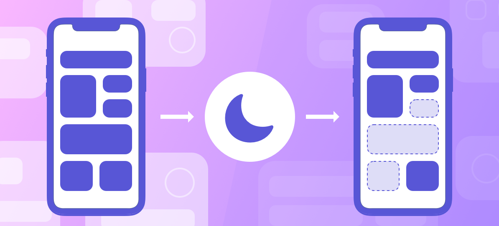

> Navigation: [Technologies](../technologies.md) · [App Intents](../appintents.md)

# Focus

API Collection

Adjust your app’s behavior and filter incoming notifications when the current Focus changes.

## Overview

People use Focus on macOS, iOS, and iPadOS to minimize distractions. For example, someone might use a Work Focus to hide notifications from personal email or message accounts. When someone engages a Focus, the system executes your app’s custom [SetFocusFilterIntent](setfocusfilterintent.md). Define a version of this intent to update your app’s configuration and filter incoming notifications.

> [!note] Related sessions from WWDC22
> Session 10121: [Meet Focus filters](https://developer.apple.com/videos/play/wwdc2022/10121).

## Topics

### Focus filters

- [SetFocusFilterIntent](setfocusfilterintent.md) — An interface for providing an app intent that you use to adapt your app’s behavior when Focus changes.
- [Defining your app’s Focus filter](defining-your-app-s-focus-filter.md) — Customize your app’s behavior to reflect the device’s current Focus.
- [FocusFilterAppContext](focusfilterappcontext.md) — A type that contains app-specific contextual information for a particular Focus, such as the notification filter criteria to apply.
- [FocusFilterSuggestionContext](focusfiltersuggestioncontext.md) — A type you use to suggest app configurations for a given Focus.

### Errors

- [SetFocusFilterIntentError](setfocusfilterintenterror.md) — Errors that can occur when you try to retrieve the current Focus configuration settings.

## See Also

### Feature integration

- [Adopting App Intents to support system experiences](adopting-app-intents-to-support-system-experiences.md) — Create app intents and entities so people can use your app’s content and actions across system experiences.
- [Apple Intelligence and Siri AI](apple-intelligence-and-siri-ai.md) — Integrate your app with Apple Intelligence and bring it to Siri AI.
- [Spotlight integration](spotlight.md) — Add your entities to your app’s Spotlight index, and automate the indexing of your content.
- [App Shortcuts](app-shortcuts.md) — Improve the experience of using your app intents and entities in system experiences like Siri, Spotlight, and the Shortcuts app.
- [Widgets, Live Activities, and Controls](widgets-live-activities-and-controls.md) — Implement interactive widgets, controls, watch complications, and Live Activities using app intents.
- [Hardware interactions](hardware-interactions.md) — Run your App Shortcuts from the Action button on iPhone or Apple Watch, or launch your own conversational app from the side button on iPhone.
- [Visual intelligence](visual-intelligence.md) — Match images to your app’s content and report the results to the Visual Intelligence framework using an app intent.
