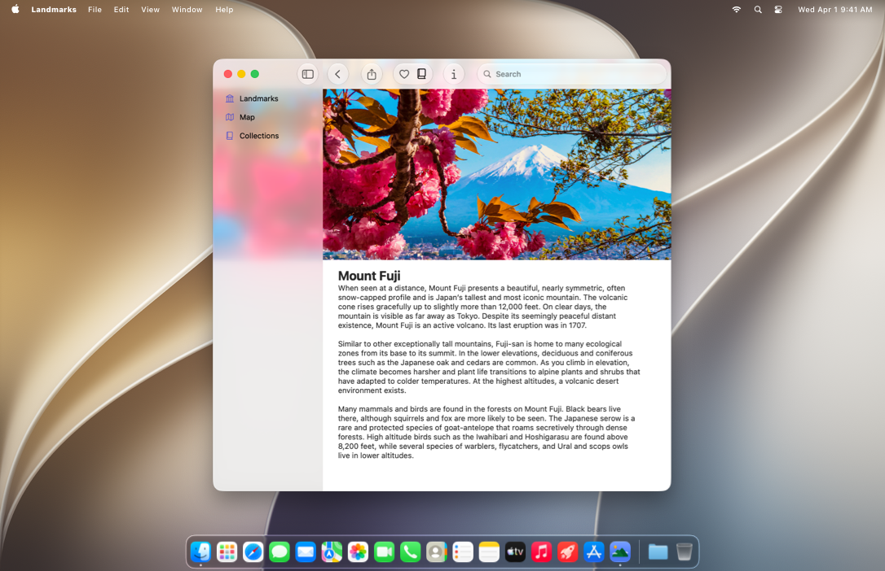

> Navigation: [Technologies](technologies.md)

# AppKit

Framework

Construct and manage a graphical, event-driven user interface for your macOS app.

## Overview

AppKit contains the objects you need to build the user interface for a macOS app. In addition to drawing windows, buttons, panels, and text fields, it handles all the event management and interaction between your app, people, and macOS.

Aside from drawing and managing interactions, AppKit handles printing, animating, as well as creating documents with large amounts of data efficiently. The framework also contains built-in support for localization and accessibility to ensure that your app reaches as many people as possible.

AppKit also works with [SwiftUI](swiftui.md), so you can implement parts of your AppKit app in SwiftUI or mix interface elements between the two frameworks. For example, you can place AppKit views and view controllers inside SwiftUI views, and vice versa.

> [!note] Note
> For information about bringing your iPad app to Mac, see [Mac Catalyst](uikit/mac-catalyst.md). To build an iOS app, you can use SwiftUI to create an app that works across all of Apple’s platforms, or use [UIKit](uikit.md) to create an app for iOS only.

## Topics

### Essentials

- [Adopting Liquid Glass](technologyoverviews/adopting-liquid-glass.md) — Find out how to bring the new material to your app.
- [AppKit updates](updates/appkit.md) — Learn about important changes to AppKit.
- [Protecting the User’s Privacy](uikit/protecting-the-user-s-privacy.md) — Secure personal data, and respect user preferences for how data is used.
- [Porting your macOS apps to Apple silicon](apple-silicon/porting-your-macos-apps-to-apple-silicon.md) — Create a version of your macOS app that runs on both Apple silicon and Intel-based Mac computers.

### App Structure

- [App and Environment](appkit/app-and-environment.md) — Learn about the objects that you use to interact with the system.
- [Documents, Data, and Pasteboard](appkit/documents-data-and-pasteboard.md) — Organize your app’s data and preferences, and share that data on the pasteboard or in iCloud.
- [Cocoa Bindings](appkit/cocoa-bindings.md) — Automatically synchronize your data model with your app’s interface using Cocoa Bindings.
- [Resource Management](appkit/resource-management.md) — Manage the storyboards and nib files containing your app’s user interface, and learn how to load data that is stored in resource files.
- [App Extensions](appkit/app-extensions.md) — Extend your app’s basic functionality to other parts of the system.

### User Interface

- [Views and Controls](appkit/views-and-controls.md) — Present your content onscreen and handle user input and events.
- [View Management](appkit/view-management.md) — Manage your user interface, including the size and position of views in a window.
- [View Layout](appkit/view-layout.md) — Position and size views using a stack view or Auto Layout constraints.
- [Appearance Customization](appkit/appearance-customization.md) — Add Dark Mode support to your app, and use appearance proxies to modify your UI.
- [Animation](appkit/animation.md) — Animate your views and other content to create a more engaging experience for users.
- [Windows, Panels, and Screens](appkit/windows-panels-and-screens.md) — Organize your view hierarchies and facilitate their display onscreen.
- [Sound, Speech, and Haptics](appkit/sound-speech-and-haptics.md) — Play sounds and haptic feedback, and incorporate speech recognition and synthesis into your interface.
- [Supporting Continuity Camera in Your Mac App](appkit/supporting-continuity-camera-in-your-mac-app.md) — Incorporate scanned documents and pictures from a user’s iPhone, iPad, or iPod touch into your Mac app using Continuity Camera.

### User Interactions

- [Mouse, Keyboard, and Trackpad](appkit/mouse-keyboard-and-trackpad.md) — Handle events related to mouse, keyboard, and trackpad input.
- [Menus, Cursors, and the Dock](appkit/menus-cursors-and-the-dock.md) — Implement menus and cursors to facilitate interactions with your app, and use your app’s Dock tile to convey updated information.
- [Gestures](appkit/gestures.md) — Encapsulate your app’s event-handling logic in gesture recognizers so that you can reuse that code throughout your app.
- [Touch Bar](appkit/touch-bar.md) — Display interactive content and controls in the Touch Bar.
- [Drag and Drop](appkit/drag-and-drop.md) — Support the direct manipulation of your app’s content using drag and drop.
- [Accessibility for AppKit](appkit/accessibility-for-appkit.md) — Make your AppKit apps accessible to everyone who uses macOS.

### Graphics, Drawing, Color, and Printing

- [Images and PDF](appkit/images-and-pdf.md) — Create and manage images, in bitmap, PDF, and other formats.
- [Drawing](appkit/drawing.md) — Draw shapes, images, and other content on the screen.
- [Color](appkit/color.md) — Represent colors using built-in or custom formats, and give users options for selecting and applying colors.
- [Printing](appkit/printing.md) — Display the system print panels and manage the printing process.

### Text

- [Text Display](appkit/text-display.md) — Display text and check spelling.
- [TextKit](appkit/textkit.md) — Manage text storage and perform custom layout of text-based content in your app’s views.
- [Fonts](appkit/fonts.md) — Manage the fonts used to display text.
- [Writing Tools](appkit/writing-tools.md) — Add support for Writing Tools to your app’s text views.

### Deprecated

- [Deprecated Symbols](appkit/deprecated-symbols.md) — Review symbols that are no longer supported, and find the replacements to use instead.

### Reference

- [Enumerations](appkit/enumerations.md) — Enumerations for use with multiple classes.
- [Constants](appkit/constants.md) — Constants for use with multiple classes.
- [Data Types](appkit/data-types.md) — Data types for use with multiple classes.
- [Macros](appkit/macros.md) — Macros for use with multiple classes.
