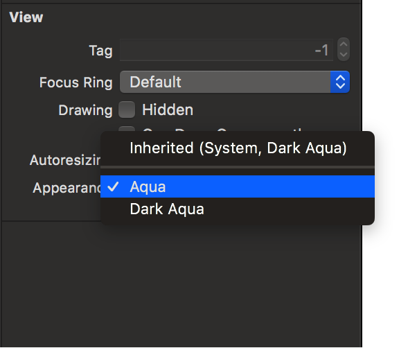

> Navigation: [Technologies](../technologies.md) · [AppKit](../appkit.md) · [Appearance Customization](appearance-customization.md) · [NSAppearanceCustomization](nsappearancecustomization.md)

# Choosing a Specific Appearance for Your macOS App

<sub>Article</sub>

Adopt a specific appearance for your windows, views, or app when it is inappropriate to support both light and dark variants.

## Overview

Supporting both light and dark appearances is a good practice, but you might have good reasons to opt out of appearance changes wholly or partially in your app. Views containing user-created content should always reflect the user’s choices. Similarly, you might choose a specific appearance for print-related views so that they reflect what the user sees on the printed page.

The system assumes that apps linked against the macOS 10.14 or later SDK support both light and dark appearances. You can assign a specific appearance to windows, views, and popovers. You can also disable support for Dark Mode entirely using an `Info.plist` key.

For general information about how to support Dark Mode, see [Supporting Dark Mode in your interface](../uikit/supporting-dark-mode-in-your-interface.md).

### Assign a Specific Appearance to a View or Window

When you want an AppKit view or window to adopt a specific appearance, assign a custom [NSAppearance](nsappearance.md) object to it. Normally, your app object inherits the system appearance and propagates that appearance to all windows and panels, and views inherit their appearance from their parent view or window. If you assign a specific appearance to an object at different points in this chain, all child objects inherit the new appearance. For example, if you assign a new appearance to a window, the window and all of its views inherit that appearance.

To assign a specific appearance to a view or window in your storyboard file, change the appearance attribute in the inspector, as shown in the following image.



<sub>An image showing how to choose a specific appearance from the Appearance pop-up menu in the attributes inspector, which causes the view to always adopt that appearance.</sub>

To make the same change programmatically, assign the appropriate [NSAppearance](nsappearance.md) object to the window or view’s [appearance](nsappearancecustomization/appearance.md) property. The following example code shows a method that assigns the Aqua appearance to a view. Each of the view’s initialization methods must call this method.

```swift
class MyContentView : NSView {

  func adoptAquaAppearance()
      self.appearance = NSAppearance(named: .aqua)
   }

}

```

### Assign a Specific Appearance to Your App

To adopt a specific appearance for your entire app, assign a value to the [appearance](nsapplication/appearance.md) property of your [NSApplication](nsapplication.md) object. Choose an app-wide appearance only when required by your design. For example, a photo editing app might always use a dark appearance so that users can focus on their photos and not the app’s chrome. The following code example shows how to assign the dark appearance to your app.

```swift
NSApp.appearance = NSAppearance(named: .darkAqua)
```

### Opt Out of Dark Mode

The system automatically opts in any app linked against the macOS 10.14 or later SDK to both light and dark appearances. If you need extra time to work on your app’s Dark Mode support, you can temporarily opt out by including the `NSRequiresAquaSystemAppearance` key (with a value of [true](../swift/true.md)) in your app’s `Info.plist` file. Setting this key to [true](../swift/true.md) causes the system to ignore the user’s preference and always apply a light appearance to your app.

> [!important] Important
> Supporting Dark Mode is strongly encouraged. Use the `NSRequiresAquaSystemAppearance` key to opt out temporarily only while you work on improvements to your app’s Dark Mode support. If you do not plan to support a dark appearance at all, apply a light appearance to your entire app, as described in [Assign a Specific Appearance to Your App](choosing-a-specific-appearance-for-your-macos-app.md#Assign-a-Specific-Appearance-to-Your-App).

If you build your app against an earlier SDK but still want to support Dark Mode, include the `NSRequiresAquaSystemAppearance` key (with a value of [false](../swift/false.md)) in your app’s `Info.plist` file. Do so only if your app’s appearance looks correct when running in macOS 10.14 and later with Dark Mode enabled.

## See Also

### Getting and Setting Appearance

- [appearance](nsappearancecustomization/appearance.md) — The appearance of the receiver, in an `NSAppearance` object.
- [effectiveAppearance](nsappearancecustomization/effectiveappearance.md) — The appearance that will be used when the receiver is drawn onscreen, in an `NSAppearance` object. (read-only)
