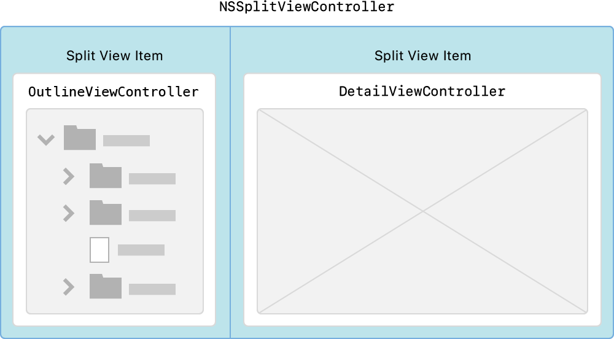
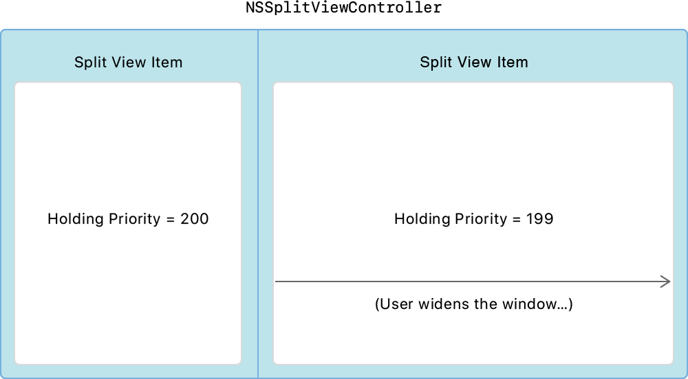

> Navigation: [Technologies](../technologies.md) · [AppKit](../appkit.md) · [Cocoa Bindings](cocoa-bindings.md)

# Navigating Hierarchical Data Using Outline and Split Views

<sub>Sample Code</sub>

Build a structured user interface that simplifies navigation in your app.

## Overview

Just as a table view organizes a list of objects linearly, an outline view organizes objects hierarchically. When an app’s user interface becomes more complex, an outline format helps to organize it.

This sample shows how to use [NSOutlineView](nsoutlineview.md) to navigate hierarchical data. [NSOutlineView](nsoutlineview.md) is a Cocoa view that uses a row-and-column format. Rows expand and collapse to control the amount of information that your app presents.  The outline is a hierarchical list of images within container groups. The `DataSource.plist` file predefines the hierarchy.

The outline view uses [NSTableViewSelectionHighlightStyleSourceList](nstableview/selectionhighlightstyle-swift.enum/sourcelist.md) to:

- Indicate row selection with a light blue highlight.
- Group nodes that look similar to the Finder sidebar.
- Blur background content to add depth to your interface.

It does this by setting the highlight appearance in the storyboard, but you can also configure it in code using `outlineView.selectionHighlightStyle = .sourceList`.

When you use `NSOutlineView` with [NSSplitViewController](nssplitviewcontroller.md), your app presents data in a primary-detail format similar to that of the Xcode Project navigator or the Finder.

### Configure the Split-View Controller

An outline view works well as part of a primary-detail user interface. When the user selects an item from the outline view on the left, the detail view shows the results of the selection. For a primary-detail configuration, use [NSSplitView](nssplitview.md), which arranges two or more views in a linear stack running horizontally. The system embeds each view in its own [NSSplitViewItem](nssplitviewitem.md). In this sample project, the left split-view item is a view controller called `OutlineViewController`, and the right split-view item is called `DetailViewController`. The `OutlineViewController` class focuses on how to use [NSOutlineView](nsoutlineview.md).



<sub>A diagram depicting the two split-view items on each side of the sample’s user interface for NSSplitViewController. The OutlineViewController on the left shows a hierarchal outline representation, and the DetailViewController on the right shows a blank box.</sub>

In a primary-detail user interface, the list view on the left must remain the same size when the split view grows or shrinks, while the detail view on the right changes size. To implement this behavior, the app uses the _holding priority_ on the split-view items. The view with the lowest holding priority is the first to increase its width as the split view grows or shrinks. To keep the left split-view item from growing, set its holding priority to `200`, and set the item on the right to `199`.



<sub>A diagram depicting the two split view items on each side of the sample’s user interface for NSSplitViewController. The split-view item on the right has a lower holding priority than the one on the left.</sub>

### Define Hierarchical Content with a Tree Controller

The [NSTreeController](nstreecontroller.md) class is the data source for the outline view. It acts as the controller when binding [NSOutlineView](nsoutlineview.md) to its hierarchical collection of objects. These objects represent _nodes_, which the `Node` class implements.

A node represents either a container or a document. A container node groups other nodes together. Each container node has its own unique identifier, whereas document nodes have an empty identifier with no children.

This sample uses two kinds of nodes:

- URL-based, representing a container or document on disk.
- Non-URL-based, representing a container or document in memory only.

The sample declares the `Node` class as follows, defining the type, title, identifier, URL, and children nodes:

```swift
class Node: NSObject, Codable {
    var type: NodeType = .unknown
    var title: String = ""
    var identifier: String = ""
    var url: URL?
    @objc dynamic var children = [Node]()
}
```

The hierarchy consists of nodes that the system reads from the `DataSource.plist` file. Node objects adopt the `Decodable` protocol and the system automatically creates them directly from the property list file.

```swift
guard let newPlistURL = Bundle.main.url(forResource: "DataSource", withExtension: "plist") else {
    fatalError("Failed to resolve URL for `DataSource.plist` in bundle.")
}
do {
    // Populate the outline view with the .plist file content.
    struct OutlineData: Decodable {
        let children: [Node]
    }
    // Decode the top-level children of the outline.
    let plistDecoder = PropertyListDecoder()
    let data = try Data(contentsOf: newPlistURL)
    let decodedData = try plistDecoder.decode(OutlineData.self, from: data)
    for node in decodedData.children {
        // Recursively add further content from the specified node.
        addNode(node)
        if node.type == .container {
            selectParentFromSelection()
        }
    }
} catch {
    fatalError("Failed to load `DataSource.plist` in bundle.")
}
```

### Handle Drag and Drop

Users drag and drop nodes from within the outline view to rearrange them, or drag nodes that represent images out to other apps. Users can also drag image files from the Finder, Photos, Mail, or Safari. For more information, see [Drag and Drop](drag-and-drop.md). This sample shows how to create promise drags by dragging a copy of an image file using [NSFilePromiseProvider](nsfilepromiseprovider.md).

### Add a Contextual Menu

The outline view uses contextual menus, or _shortcut menus_, that provide access to frequently used commands. Control-clicking an outline view node opens its contextual menu. The `NSOutlineView` [- menuForEvent:](<nsview/menu(for_).md>) function creates these contextual menus. Override this function with the [NSOutlineView](nsoutlineview.md) subclass to return a contextual menu. The contextual menu operations are: add, remove, and rename.

### Integrate with the Edit Menu

Use the Edit menu to directly affect the contents of the outline view. This sample adds a Delete menu item for deleting items from the outline view. `OutlineViewController` implements the `IBAction` delete function. The user chooses the menu item or presses the Delete key.

```swift
// The user chose the Delete menu item or pressed the Delete key.
@IBAction func delete(_ sender: AnyObject) {
    removeItems()
}
```

Use the [NSUserInterfaceValidations](nsuserinterfacevalidations.md) protocol to enable or disable the Delete menu item according to the selection in the outline view.

```swift
func validateUserInterfaceItem(_ item: NSValidatedUserInterfaceItem) -> Bool {
    if item.action == #selector(delete(_:)) {
        return !treeController.selectedObjects.isEmpty
    }
    return true
}
```

### Restore the Outline View

This sample saves and restores:

- The disclosure state of each container node.
- The outline view’s selection.

Use the window restoration system’s [- encodeRestorableStateWithCoder:](<nsresponder/encoderestorablestate(with_).md>) function to save the outline view’s node selection. The next time the app launches, use [- restoreStateWithCoder:](<nsresponder/restorestate(with_).md>) to restore that selection.

> [!note] Note
> When the user selects “Close windows when quitting an app” in the System Preferences General pane, selection restoration works if they choose Option-Command-Quit (Quit and Keep Windows).

When the outline view saves the disclosure states, it encodes each container as an archived object by using the [- outlineView:persistentObjectForItem:](<nsoutlineviewdatasource/outlineview(__persistentobjectforitem_).md>) function.

```swift
func outlineView(_ outlineView: NSOutlineView, persistentObjectForItem item: Any?) -> Any? {
    let node = OutlineViewController.node(from: item!)
    return node?.identifier // The outgoing object is the identifier.
}
```

When the outline view restores the disclosure states, it calls this function for each to translate the archived object to an outline view item.

```swift
func outlineView(_ outlineView: NSOutlineView, itemForPersistentObject object: Any) -> Any? {
    let node = nodeFromIdentifier(anObject: object)  // The incoming object is the identifier.
    return node
}
```

## See Also

### Tree-Based Data

- [NSTreeController](nstreecontroller.md) — A bindings-compatible controller that manages a tree of objects.
- [NSTreeNode](nstreenode.md) — A node in a tree of nodes.

## Download

- [NavigatingHierarchicalDataUsingOutlineAndSplitViews.zip](https://docs-assets.developer.apple.com/published/39a6b1114be3/NavigatingHierarchicalDataUsingOutlineAndSplitViews.zip)
