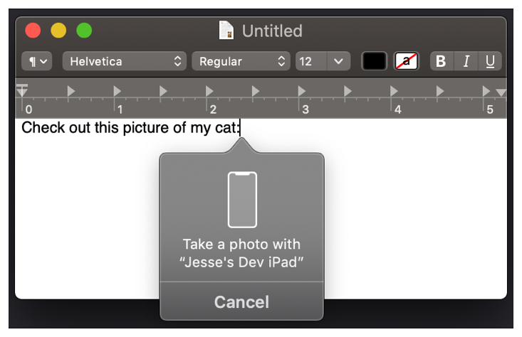
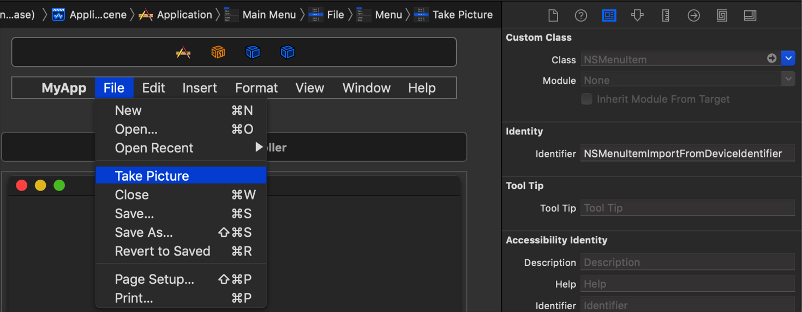

> Navigation: [Technologies](../technologies.md) · [AppKit](../appkit.md)

# Supporting Continuity Camera in Your Mac App

<sub>Article</sub>

Incorporate scanned documents and pictures from a user’s iPhone, iPad, or iPod touch into your Mac app using Continuity Camera.

## Overview

With Continuity Camera in macOS 10.14 and later, and iOS 12 and later, you can use your iPhone, iPad, or iPod touch to scan documents or take a picture of something nearby and then access those documents or pictures instantly from your app.

If your app works with images, this feature can be a convenient way to get images into the app. For example, a text-editing app can use this feature to easily incorporate images into a document. It can also be a handy way to bring images into a social media app.

Apps using `NSTextView` get Continuity Camera support automatically. When the user Control-clicks in an app’s text view, a Continuity Camera menu item appears. The user can then capture a photo or scan a document on their iPhone or iPad, and it automatically appears in the text view. The image is then accessible as an attachment in the `NSTextView` text storage object.



<sub>A screenshot showing a text view where the user Control-clicks to display the Continuity Camera dialog for taking a photo with an iOS device. The dialog shows the name of the iOS device and a Cancel button to allow the user to dismiss the dialog without taking a photo.</sub>

If you’re not using `NSTextView`, you need to add support to your macOS interface to enable Continuity Camera, and to merge photos taken from the user’s iOS device.

### Enable Support in Your Responder Objects

You must tell AppKit that your app can take advantage of any image data originating from Continuity Camera. You do this in responder objects, such as a view controller.

When the Continuity Camera menu item appears, AppKit calls the [- validRequestorForSendType:returnType:](<nsresponder/validrequestor(forsendtype_returntype_).md>) method of your responder objects in the current responder chain to find an object that can handle image data from Continuity Camera. Override this method to let AppKit know that your responder object supports image data that Continuity Camera generates. When the user captures a photo or scans a document using Continuity Camera, AppKit places the image data on the pasteboard and calls the designated responder object to handle the data.

Your responder’s `validRequestor(forSendType:returnType:)` implementation must verify that it can receive pasteboard image data of the specified type, then return the object to receive the image data when AppKit places it on the pasteboard. Your `validRequestor(forSendType:returnType:)` method can designate the same receiver object to handle the image data.

Here’s an example implementation:

```swift
override func validRequestor(forSendType sendType: NSPasteboard.PasteboardType?, returnType: NSPasteboard.PasteboardType?) -> Any? {
    if let pasteboardType = returnType,
        // The service is image-related.
        NSImage.imageTypes.contains(pasteboardType.rawValue) {
        return self  // This object can receive image data.
    } else {
        // Let objects in the responder chain handle the message.
        return super.validRequestor(forSendType: sendType, returnType: returnType)
    }
}
```

Note that your `validRequestor(forSendType:returnType:)` method can return a different object to receive the image data. For example, implement the `validRequestor(forSendType:returnType:)` method in your view controller and perform the checks, but return a view object to incorporate the data. You can also return a parent or managing object instead. For example, the following code implements `validRequestor(forSendType:returnType:)` in a window controller, but returns the active view controller to target the pasted image:

```swift
override func validRequestor(forSendType sendType: NSPasteboard.PasteboardType?, returnType: NSPasteboard.PasteboardType?) -> Any? {
    if let pasteboardType = returnType,
        // The service is image-related.
        NSImage.imageTypes.contains(pasteboardType.rawValue) {
        // Specify the active view controller to receive the image data.
        return self.contentViewController  
    } else {
        // Let objects in the responder chain handle the message.
        return super.validRequestor(forSendType: sendType, returnType: returnType)
    }
}
```

After you implement `validRequestor(forSendType:returnType:)` and specify an object to receive the image data, AppKit enables the Continuity Camera menu item for the designated menus in your app, including contextual menus associated with your view.

### Add a Continuity Camera Menu Item

The user initiates Continuity Camera by using a menu item in one of your app’s menu bar menus or contextual menus. You can add a Continuity Camera menu item to any of your app’s menu bar menus, or have AppKit automatically add a Continuity Camera menu item to one of your app’s contextual menus. A good place to include a Continuity Camera menu item is in menus that contain options for performing editing-related activities, such as the File and Insert menus.

To add a Continuity Camera menu item to one of your app’s menu bar menus, locate the storyboard file where your menu bar is defined, and follow these steps in Interface Builder:

1. Add an item to your app’s menu.
2. Set the name of the item, such as “Take Picture.” AppKit provides the name later.
3. In the Identity inspector, set the Identifier property of the menu item to `NSMenuItemImportFromDeviceIdentifier` (defined in `NSMenuItem.h`).

Here’s how it looks:



If your app doesn’t use a storyboard, you can programmatically add the menu item by following these steps:

1. Get the app’s main menu bar.
2. Get the desired menu item for the insertion from the menu bar.
3. Get the submenu for the menu item.
4. Create the Camera menu item and specify the name, such as “Take Picture.”
5. Set the Identifier property for the Camera menu item to `NSMenuItem.importFromDeviceIdentifier`.
6. Add the Camera menu item to the submenu.

A good place to do this is in your app delegate’s [- applicationWillFinishLaunching:](<nsapplicationdelegate/applicationwillfinishlaunching(__).md>) method as the following example shows:

```swift
    func applicationWillFinishLaunching(_ aNotification: Notification) {        
        let mainMenu = NSApplication.shared.mainMenu
        // Get the File menu item.
        guard let fileMenu = mainMenu?.item(at: 1) else { return }
        // Get the File menu item submenu.
        guard let subMenu = fileMenu.submenu else { return }
        // Create the Camera menu item.
        let cameraMenuItem =
            NSMenuItem(title: "Take Picture", action: nil, keyEquivalent: "")
        // Specify the Continuity Camera menu item identifier.
        cameraMenuItem.identifier = NSMenuItem.importFromDeviceIdentifier
        // Add the Camera menu item to the File menu.
        subMenu.addItem(cameraMenuItem)
    }
```

You don’t add a Continuity Camera menu item directly to your app’s contextual menus. Instead, you enable the appropriate support in your app’s responder objects as the previous section describes, and AppKit adds the menu item for you.

For example, the following code demonstrates how to display a contextual menu in response to a mouse-down event, and have AppKit insert the menu item. This code overrides the [- mouseDown:](<nsresponder/mousedown(with_).md>) method and creates a menu. It then invokes the `NSMenu` class method [+ popUpContextMenu:withEvent:forView:](<nsmenu/popupcontextmenu(__with_for_).md>), passing the event object related to the mouse-down event and the view that owns the contextual menu. AppKit automatically inserts the Continuity Camera menu item in the contextual menu for you.

```swift
override func mouseDown(with event: NSEvent) {    
    let theMenu = NSMenu(title: "Contextual Menu")
    /*
     Display a contextual menu over the view for the mouse-down event.
     AppKit automatically inserts the Continuity Camera menu item.
     */
    NSMenu.popUpContextMenu(theMenu, with: event, for: self.view)
}
```

When the user selects the Continuity Camera menu item, the system automatically launches the Continuity Camera interface on the user’s device. After the user captures an image, AppKit places that image on the app’s pasteboard.

### Incorporate the Image Data from the Pasteboard

You need to incorporate the captured images into your app after AppKit places them on the pasteboard. AppKit then calls the active responder object’s [- readSelectionFromPasteboard:](<nsservicesmenurequestor/readselection(from_).md>) method to read the image data. The `readSelection(from:)` method supports Continuity Camera image data and other types of data in your app. Use that method to determine whether the image is in a format your app supports, and incorporate that image data into your app.

Here’s an example implementation of the `readSelection(from:)` method:

```swift
func readSelection(from pasteboard: NSPasteboard) -> Bool {
    // Verify that the pasteboard contains image data.
    guard pasteboard.canReadItem(withDataConformingToTypes: NSImage.imageTypes) else {
        return false
    }
    // Load the image.
    guard let image = NSImage(pasteboard: pasteboard) else {
        return false
    }
    // Incorporate the image into the app.
    self.myImageView.image = image
    // This method has successfully read the pasteboard data.
    return true
}
```

## See Also

### User Interface

- [Views and Controls](views-and-controls.md) — Present your content onscreen and handle user input and events.
- [View Management](view-management.md) — Manage your user interface, including the size and position of views in a window.
- [View Layout](view-layout.md) — Position and size views using a stack view or Auto Layout constraints.
- [Appearance Customization](appearance-customization.md) — Add Dark Mode support to your app, and use appearance proxies to modify your UI.
- [Animation](animation.md) — Animate your views and other content to create a more engaging experience for users.
- [Windows, Panels, and Screens](windows-panels-and-screens.md) — Organize your view hierarchies and facilitate their display onscreen.
- [Sound, Speech, and Haptics](sound-speech-and-haptics.md) — Play sounds and haptic feedback, and incorporate speech recognition and synthesis into your interface.
