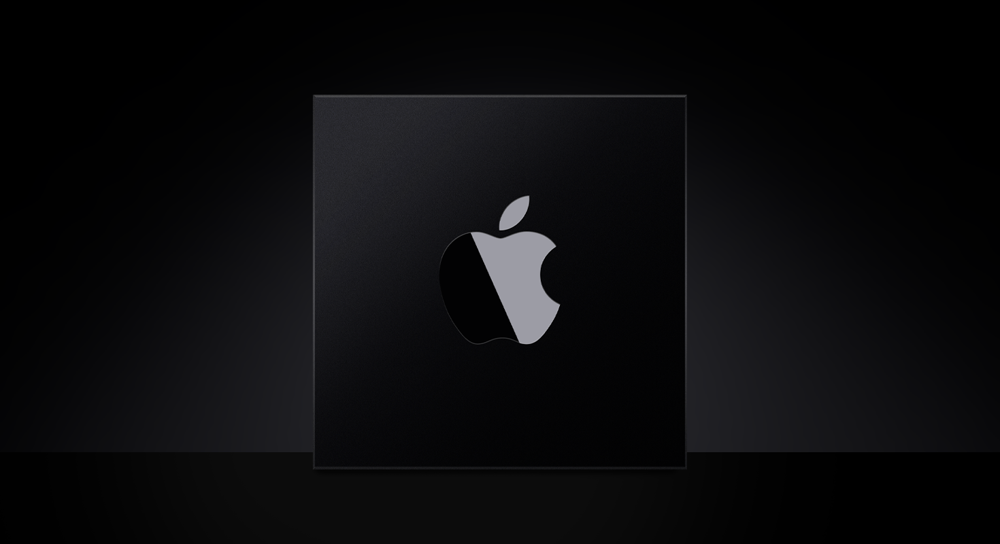

> Navigation: [Technologies](technologies.md)

# Apple silicon

Get the resources you need to create software for Macs with Apple silicon.

## Overview

Build apps, libraries, frameworks, plug-ins, and other executable code that run natively on Apple silicon. When you build executables on top of Apple frameworks and technologies, the only significant step you might need to take is to recompile your code for the `arm64` architecture. If you rely on hardware-specific details or make assumptions about low-level features, modify your code as needed to support Apple silicon.

Getting the best performance on Apple silicon sometimes requires making adjustments to the way you use hardware resources. Minimize your dependence on the hardware by using higher-level technologies whenever possible. For example, use Grand Central Dispatch instead of creating and managing threads yourself. Test your changes on Apple silicon to verify that your code behaves optimally.

## Topics

### Essentials

- [Porting your macOS apps to Apple silicon](apple-silicon/porting-your-macos-apps-to-apple-silicon.md) — Create a version of your macOS app that runs on both Apple silicon and Intel-based Mac computers.
- [Building a universal macOS binary](apple-silicon/building-a-universal-macos-binary.md) — Create macOS apps and other executables that run natively on both Apple silicon and Intel-based Mac computers.

### General porting tips

- [Addressing architectural differences in your macOS code](apple-silicon/addressing-architectural-differences-in-your-macos-code.md) — Fix problems that stem from architectural differences between Apple silicon and Intel-based Mac computers.
- [Porting your audio code to Apple silicon](apple-silicon/porting-your-audio-code-to-apple-silicon.md) — Eliminate issues in your audio-specific code when running on Apple silicon Mac computers.
- [Porting just-in-time compilers to Apple silicon](apple-silicon/porting-just-in-time-compilers-to-apple-silicon.md) — Update your just-in-time (JIT) compiler to work with the Hardened Runtime capability, and with Apple silicon.

### Graphics

- [Porting your Metal code to Apple silicon](apple-silicon/porting-your-metal-code-to-apple-silicon.md) — Create a version of your Metal app that runs on both Apple silicon and Intel-based Mac computers.

### Performance

- [Tuning your code’s performance for Apple silicon](apple-silicon/tuning-your-code-s-performance-for-apple-silicon.md) — Improve your code to get the best performance from both Apple silicon and Intel-based Mac computers.
- [Apple Silicon CPU Optimization Guide Version 4](apple-silicon/cpu-optimization-guide.md) — Identify performance optimization strategies for Apple silicon M-series and A-series chips.

### Rosetta

- [About the Rosetta translation environment](apple-silicon/about-the-rosetta-translation-environment.md) — Learn how Rosetta translates executables, and understand what Rosetta can’t translate.

### iOS apps on Mac

- [Running your iOS apps in macOS](apple-silicon/running-your-ios-apps-in-macos.md) — Modernize the iOS apps you choose to run on a Mac with Apple silicon, or opt out of running on a Mac altogether.
- [Adapting iOS code to run in the macOS environment](apple-silicon/adapting-ios-code-to-run-in-the-macos-environment.md) — Support modern iOS features that result in a better user experience when running on Apple silicon.
- [Providing touch gesture equivalents using Touch Alternatives](apple-silicon/providing-touch-gesture-equivalents-using-touch-alternatives.md) — Enable Touch Alternatives to provide keyboard, mouse, and trackpad equivalents to your iOS app when it runs on a Mac with Apple silicon.
- [Providing an edge-to-edge, full-screen experience in your iPad app running on a Mac](apple-silicon/providing-an-edge-to-edge-full-screen-experience-in-your-ipad-app-running-on-a-mac.md) — Take advantage of the true native resolution of a Mac display when running your iPad app in full-screen mode on a Mac.

### Kernel and drivers

- [Implementing drivers, system extensions, and kexts](kernel/implementing_drivers_system_extensions_and_kexts.md) — Create drivers and system extensions to communicate with hardware and provide low-level services, and only use kernel extensions for a few tasks. 
- [Installing a custom kernel extension](apple-silicon/installing-a-custom-kernel-extension.md) — Install kernel extensions using a custom installer package, and help users understand the installation process.
- [Debugging a custom kernel extension](apple-silicon/debugging-a-custom-kernel-extension.md) — Configure your system to enable the debugging of custom kernel extensions from a second Mac.

### Security

- [Improving control flow integrity with pointer authentication](apple-silicon/improving-control-flow-integrity-with-pointer-authentication.md) — Increase confidence that your code uses pointers correctly.
