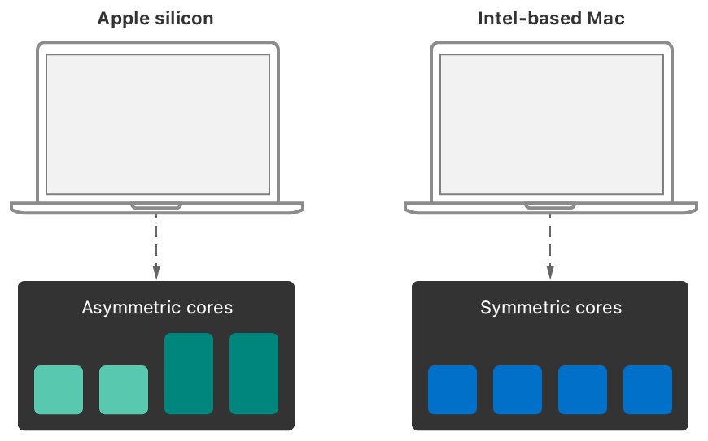

> Navigation: [Technologies](../technologies.md) · [Apple silicon](../apple-silicon.md)

# Tuning your code’s performance for Apple silicon

Article

Improve your code to get the best performance from both Apple silicon and Intel-based Mac computers.

## Overview

Tuning the performance of any code requires separate passes on both Apple silicon and Intel-based Mac computers. Code that runs well on one platform might not run well on the other, and making assumptions about the underlying hardware can lead to unexpected performance regressions in your code. Testing on actual hardware is the only way to verify that your code runs efficiently and doesn’t have any regressions.

One way to improve performance on both platforms is to leverage Apple technologies wherever possible. Apple tunes its frameworks for each architecture, and often provides APIs to help you adjust the performance of your own code. Take advantage of these APIs to ensure your code runs efficiently on all Mac computers.

### Gather Information Using Instruments and Other Apple Tools

Use Instruments to gather performance data for your app on both Apple silicon and Intel-based Mac computers. Instruments runs natively on both systems, and offers the same tools for gathering data. Use the data you gather to identify potential performance regressions, and the parts of your code that you might need to change.

### Assign Quality-of-Service (QoS) Classes to Work

QoS classes categorize the work you perform using [Operation](../foundation/operation.md) objects, [OperationQueue](../foundation/operationqueue.md) objects, [Process](../foundation/process.md) objects, [Thread](../foundation/thread.md) objects, dispatch queues, and POSIX threads (pthreads). The QoS class you assign to a work item communicates the importance of that item to the system. The system uses that information to prioritize and schedule the item accordingly. The system defines the following QoS classes:

- User interactive—Applies to work that interacts with the user, such as code that runs on the app’s main thread. If the work doesn’t happen quickly, the user interface may appear frozen. This class emphasizes maximum performance and responsiveness.
- User initiated—Applies to work that the user initiates, such as opening a saved document. The user expects your app to perform the work quickly. This class emphasizes performance and responsiveness.
- Utility—Applies to work that takes anywhere from a few seconds to a few minutes to complete. Examples include downloading a document or importing data. This class offers a balance between responsiveness, performance, and energy efficiency.
- Background—Applies to work that isn’t visible to the user and may take significant time to complete. Examples include indexing, backing up, or synchronizing data. This class emphasizes energy efficiency.

Accurately assigning QoS classes to tasks ensures that your app is both responsive and energy efficient on all Macs. On Apple silicon, a task’s QoS class influences whether the system runs that task. For example, the system is more likely to run background tasks on lower performance cores to maximize battery life. If you don’t assign QoS classes, your app’s responsiveness and efficiency may suffer as a result.

If you manually configure your thread’s priority using `pthread_setschedparam`, `setpriority`, or `thread_set_policy`, transition to APIs that set QoS classes instead. For example, use the `pthread_set_qos_class_self_np` function to set the QoS class of your POSIX threads.

For more information about how the system applies and interprets QoS classes, see [Prioritize Work at the Task Level](https://developer.apple.com/library/archive/documentation/Performance/Conceptual/power_efficiency_guidelines_osx/PrioritizeWorkAtTheTaskLevel.html) in [Energy Efficiency Guide for Mac Apps](https://developer.apple.com/library/archive/documentation/Performance/Conceptual/power_efficiency_guidelines_osx/index.html). For more information about configuring dispatch queues and QoS classes, see [Dispatch](../dispatch.md).

### Process Tasks Using Grand Central Dispatch

Grand Central Dispatch (GCD) manages the efficient execution of your app’s tasks. Use GCD to execute serially, concurrently, or in parallel on the system’s available cores. GCD handles the scheduling of tasks on system-provided threads, and schedules those threads for execution on the system’s available processor cores. On a Mac with Apple silicon, GCD takes into account the differences in core types, distributing tasks to the appropriate core type to get the needed performance or efficiency.

For most apps, GCD offers the best solution for executing tasks. Instead of custom thread pools, you use dispatch queues to schedule your tasks for execution. Dispatch queues support the execution of tasks either serially or concurrently.

For more information about how to use GCD, see [Dispatch](../dispatch.md).

### Manage Parallel-Computation Tasks Efficiently

One way to improve performance is to divide a problem into multiple pieces and execute those pieces in parallel on the available cores. Use this approach for large tasks that require significant processing resources. For example, use it to divide an image into multiple pieces and process those pieces in parallel.

In GCD, the [concurrentPerform(iterations:execute:)](<../dispatch/dispatchqueue/concurrentperform(iterations_execute_).md>) function takes a provided block and calls it multiple times on the available system cores. This function uses a work-stealing algorithm to keep each core busy with work and is an efficient way to process large tasks in parallel. On Apple silicon, the algorithm distributes work efficiently the variety of available processing cores and other code paths, adjusting the distribution of tasks dynamically as needed. To ensure the maximum benefit of this algorithm, make the number of iterations at least three times the total number of cores on the system. The system needs enough iterations to ensure appropriate distribution of the tasks across different types of cores.

If you implement parallel computations using your own thread pools, use you own work-stealing algorithm to distribute tasks dynamically. If you use a static distribution, threads running on higher efficiency cores will finish much sooner than threads running on lower efficiency cores. As with the GCD function, make the number of tasks greater than the number of cores to ensure a fair distribution of work.

### Don’t Keep Threads Active And Idle

Keeping a thread active while it tries to acquire a resource might minimize the overhead of switching thread contexts, but at great cost. When you keep a thread active but doing nothing, you prevent a CPU core from doing other work. On Apple silicon, this behavior exacerbates performance issues in producer-consumer algorithms when the consumer thread runs on a higher performance code path and the producer runs on a lower performance path. Instead, eliminate spin locks and other spin-wait code that causes your thread to hold on to a core. Replace them with an [os_unfair_lock](../os/os_unfair_lock.md), a condition variable, or a standard mutex that lets your thread block.

In addition to avoiding spin locks, avoid `pthread_yield_np` and equivalent functions that yield the thread’s time to higher-priority threads instead of blocking outright. Yield-related APIs allow the current thread to continue running when the waiting threads have lower priorities. This behavior prevents the system from scheduling some lower-priority threads and doing productive work.

For more information about synchronization primitives for threads, see [os](../os.md) framework or the pthreads API.

### Configure Daemons and Agents That Work on Your App’s Behalf

Daemons and launch agents are separate background processes that provide on-demand services for your app. You might use one to serve web pages, coordinate access to a shared database, or perform work on behalf of your foreground app. When creating a daemon or launch agent, do the following:

- Always include the `ProcessType` key in your daemon or launch agent’s `Info.plist` file. The system uses that key to determine your daemon’s purpose and adjust its available resources accordingly. For example, setting the key to `Adaptive` adjusts resources based on interactions with your app. For more information, see the `launchd.plist` man page.
- Use XPC to communicate with your daemon or launch agent. The system uses context information in XPC messages to track when a daemon or launch agent performs work on behalf of your app. If you use sockets or other IPC mechanisms for communication, the system loses that ability, which might lead to less optimal scheduling decisions.

On Apple silicon, your app’s behavior doesn’t influence the performance characteristics of any associated daemons or launch agents by default. When you use XPC, the system recognizes that a relationship exists between the app and your daemon or launch agent. That relationship causes the system to associate the daemon or launch agent’s work with your app’s performance characteristics.

When scheduling asynchronous tasks for execution from an XPC message handler, Apple technologies like Grand Central Dispatch (GCD) and Core Foundation automatically add relevant XPC context information to the corresponding thread state. The system relies on that state information to track the relationship between your app and daemon. If you distribute work using custom thread technologies, call [dispatch_block_create](../dispatch/dispatch_block_create.md) to capture and propagate any XPC context information to your custom threads.

## See Also

### Performance

- [Apple Silicon CPU Optimization Guide Version 4](cpu-optimization-guide.md) — Identify performance optimization strategies for Apple silicon M-series and A-series chips.
