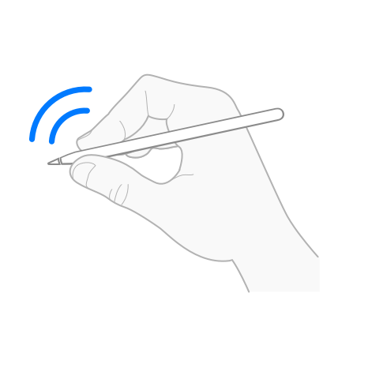

> Navigation: [Technologies](../technologies.md) · [Apple Pencil](../applepencil.md)

# Handling double taps from Apple Pencil

<sub>Article</sub>

Detect and respond to double taps a person makes on Apple Pencil.

## Overview

You can use Apple Pencil interactions to allow people to access functionality in your app quickly. Double-tapping Apple Pencil lets a person perform actions such as switching between drawing tools without moving the pencil to another location on the screen.



### Register for a double tap

To respond to double taps from Apple Pencil in your app, you need to register your view to receive double-tap interactions.

**SwiftUI**

Add an [onPencilDoubleTap(perform:)](<../swiftui/view/onpencildoubletap(perform_).md>) view modifier to your view.

```swift
MyView()
    .onPencilDoubleTap { value in
        // ...
    }
```

**UIKit**

Create a [UIPencilInteraction](../uikit/uipencilinteraction.md) object, passing an object that implements the [UIPencilInteractionDelegate](../uikit/uipencilinteractiondelegate.md) protocol to the `delegate` parameter. Then, add the interaction to your view.

```swift
class ViewController: UIViewController, UIPencilInteractionDelegate {
   
   override func viewDidLoad() {
       super.viewDidLoad()
       
       // Register for a double tap.
       let pencilInteraction = UIPencilInteraction(delegate: self) 
       view.addInteraction(pencilInteraction)
   }
   // ...
}
```

### Check the preferred double-tap action

A person can choose which action they prefer to perform when they double-tap Apple Pencil. They choose this systemwide preference in Settings \> Apple Pencil \> Actions \> Double Tap.

In your app, you can check the value of this preferred action for double tap.

**SwiftUI**

To check the preferred action, use the [preferredPencilDoubleTapAction](../swiftui/environmentvalues/preferredpencildoubletapaction.md) environment value. For possible values, see [PencilPreferredAction](../swiftui/pencilpreferredaction.md).

```swift
@Environment(\.preferredPencilDoubleTapAction) private var preferredAction
```

**UIKit**

To check the preferred action, use the [preferredTapAction](../uikit/uipencilinteraction/preferredtapaction.md) class property on [UIPencilInteraction](../uikit/uipencilinteraction.md). For possible values, see [UIPencilPreferredAction](../uikit/uipencilpreferredaction.md).

```swift
UIPencilInteraction.preferredTapAction
```

### Choose the action to perform

When possible, perform the preferred action to provide a consistent user experience across apps that support double taps. If the preferred action doesn’t make sense in your app, consider giving people a way to choose a custom action that’s suitable for your app. For design guidance, read Human Interface Guidelines \> Apple Pencil and Scribble \> [Double tap](https://developer.apple.com/design/human-interface-guidelines/apple-pencil-and-scribble#Double-tap).

The following code shows a snippet from a drawing app that provides custom drawing tools. This app allows a person to configure a custom action to quickly swap to their favorite custom drawing tool instead of using the systemwide preferred action for double taps. This app also supports the preferred actions to ignore double taps, switch to the previous tool, and switch to the eraser tool.

**SwiftUI**

```swift
enum Tool {
    case brush
    case lasso
    case eraser
    case magnifier
}

enum CustomAction: String {
    case switchLasso
    case switchMagnifier
}

@State private var currentTool: Tool? = .brush
@State private var previousTool: Tool?

@Environment(\.preferredPencilDoubleTapAction) private var preferredAction
@AppStorage("customPencilDoubleTapAction") private var customAction: CustomAction?

var body: some View {
    MyView()
        .onPencilDoubleTap { value in
            // Respect the systemwide preferred action to ignore double taps.
            guard preferredAction != .ignore else { return }
        
            // If the person chooses to override the systemwide
            // double-tap action to perform a custom action in this app,
            // check which custom action they prefer and perform that action.
            if let customAction {
                if customAction == .switchLasso, currentTool != .lasso {
                    (currentTool, previousTool) = (.lasso, currentTool)
                }
                else if customAction == .switchMagnifier, currentTool != .magnifier {
                    (currentTool, previousTool) = (.magnifier, currentTool)
                }
            }
        
            // If the person prefers to use the systemwide double-tap action, 
            // perform the actions that are appropriate in the context of this app: 
            // switch to the previous tool, or switch to the eraser tool.
            else if preferredAction == .switchPrevious {
                (currentTool, previousTool) = (previousTool, currentTool)
            }
            else if preferredAction == .switchEraser, currentTool != .eraser {
                (currentTool, previousTool) = (.eraser, currentTool)
            }
        }
}
```

**UIKit**

```swift
enum Tool {
    case brush
    case lasso
    case eraser
    case magnifier
}

enum CustomAction {
    case switchLasso
    case switchMagnifier
}

private var currentTool: Tool? = .brush
private var previousTool: Tool?
private var customAction: CustomAction?

override func viewDidLoad() {
    super.viewDidLoad()
    
    // Register for a double tap.
    let pencilInteraction = UIPencilInteraction(delegate: self)
    view.addInteraction(pencilInteraction)
}

func pencilInteraction(_ interaction: UIPencilInteraction,
                   didReceiveTap tap: UIPencilInteraction.Tap) {
    let preferredAction = UIPencilInteraction.preferredTapAction
    
    // Respect the systemwide preferred action to ignore double taps.
    guard preferredAction != .ignore else { return }

    // If the person chooses to override the systemwide
    // double-tap action to perform a custom action in this app,
    // check which custom action they prefer and perform that action.
    if let customAction {
        if customAction == .switchLasso, currentTool != .lasso {
            (currentTool, previousTool) = (.lasso, currentTool)
        }
        else if customAction == .switchMagnifier, currentTool != .magnifier {
            (currentTool, previousTool) = (.magnifier, currentTool)
        }
    }
    
    // If the person prefers to use the systemwide double-tap action, 
    // perform the actions that are appropriate in the context of this app: 
    // switch to the previous tool, or switch to the eraser tool.
    else if preferredAction == .switchPrevious {
        (currentTool, previousTool) = (previousTool, currentTool)
    }
    else if preferredAction == .switchEraser, currentTool != .eraser {
        (currentTool, previousTool) = (.eraser, currentTool)
    }
}
```

## See Also

#### Related articles

- [Handling squeezes from Apple Pencil](handling-squeezes-from-apple-pencil.md)

#### Related reference in SwiftUI

- [onPencilDoubleTap(perform:)](<../swiftui/view/onpencildoubletap(perform_).md>)
- [PencilDoubleTapGestureValue](../swiftui/pencildoubletapgesturevalue.md)
- [PencilPreferredAction](../swiftui/pencilpreferredaction.md)
- [PencilHoverPose](../swiftui/pencilhoverpose.md)

#### Related reference in UIKit

- [UIPencilInteraction](../uikit/uipencilinteraction.md)
- [UIPencilInteractionDelegate](../uikit/uipencilinteractiondelegate.md)
- [UIPencilInteraction.Tap](../uikit/uipencilinteraction/tap.md)
- [UIPencilInteraction.Phase](../uikit/uipencilinteraction/phase.md)
- [UIPencilHoverPose](../uikit/uipencilhoverpose.md)
