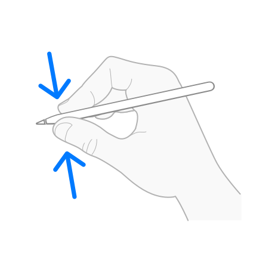

> Navigation: [Technologies](../technologies.md) · [Apple Pencil](../applepencil.md)

# Handling squeezes from Apple Pencil

<sub>Article</sub>

Detect and respond to squeezes a person makes on Apple Pencil Pro.

## Overview

You can use Apple Pencil interactions to allow people to access functionality in your app quickly. Squeezing Apple Pencil Pro lets a person perform actions such as showing a contextual palette without moving the pencil to another location on the screen.



> [!note] Note
> Only Apple Pencil Pro supports squeeze interactions.

### Register for a squeeze

To respond to squeezes from Apple Pencil Pro in your app, you need to register your view to receive squeeze interactions.

**SwiftUI**

Add an [onPencilSqueeze(perform:)](<../swiftui/view/onpencilsqueeze(perform_).md>) view modifier to your view.

```swift
MyView()
    .onPencilSqueeze { phase in
        // ...
    }
```

**UIKit**

Create a [UIPencilInteraction](../uikit/uipencilinteraction.md) object, passing an object that implements the [UIPencilInteractionDelegate](../uikit/uipencilinteractiondelegate.md) protocol to the `delegate` parameter. Then, add the interaction to your view.

```swift
class ViewController: UIViewController, UIPencilInteractionDelegate {
   
   override func viewDidLoad() {
       super.viewDidLoad()
       
       // Register for a squeeze.
       let pencilInteraction = UIPencilInteraction(delegate: self)
       view.addInteraction(pencilInteraction)
   }
   // ...
}
```

### Check the preferred squeeze action

A person can choose which action they prefer to perform when they squeeze Apple Pencil Pro. They choose this preference in Settings \> Apple Pencil \> Actions \> Squeeze. In addition to drawing-specific actions like switching drawing tools, people can configure the preferred action for squeeze to perform any App Shortcut, including pre-configured shortcuts you provide for your app.

In your app, you can check the value of this preferred action for squeeze.

**SwiftUI**

To check the preferred action, use the [preferredPencilSqueezeAction](../swiftui/environmentvalues/preferredpencilsqueezeaction.md) environment value. For possible values, see [PencilPreferredAction](../swiftui/pencilpreferredaction.md).

```swift
@Environment(\.preferredPencilSqueezeAction) private var preferredAction
```

**UIKit**

To check the preferred action, use the [preferredSqueezeAction](../uikit/uipencilinteraction/preferredsqueezeaction.md) class property on [UIPencilInteraction](../uikit/uipencilinteraction.md). For possible values, see [UIPencilPreferredAction](../uikit/uipencilpreferredaction.md).

```swift
UIPencilInteraction.preferredSqueezeAction
```

### Choose the action to perform

When possible, perform the preferred action to provide a consistent user experience across apps that support squeezes. If the preferred action doesn’t make sense in your app, consider giving people a way to specify a custom action that’s suitable for your app. For design guidance, read Human Interface Guidelines \> Apple Pencil and Scribble \> [Squeeze](https://developer.apple.com/design/human-interface-guidelines/apple-pencil-and-scribble#Squeeze).

The following code shows a snippet from a drawing app that provides custom drawing tools. This app allows a person to configure a custom action to quickly swap to their favorite custom drawing tool instead of using the systemwide preferred action for squeezes. This app also supports the preferred actions to ignore squeezes, switch to the previous tool, and show a custom contextual palette near the Apple Pencil Pro tip.

**SwiftUI**

```swift
enum Tool {
    case brush
    case lasso
    case eraser
    case magnifier
}

enum CustomAction: String {
    case switchLasso
    case switchMagnifier
}

@State private var currentTool: Tool? = .brush
@State private var previousTool: Tool?
@State private var contextualPalettePresented = false
@State private var contextualPaletteAnchor: PopoverAttachmentAnchor?

@Environment(\.preferredPencilSqueezeAction) private var preferredAction
@AppStorage("customPencilSqueezeAction") private var customAction: CustomAction?

var body: some View {
    MyView()
        .onPencilSqueeze { phase in
            // Respect the systemwide preferred action to ignore squeezes.
            guard preferredAction != .ignore else { return }
            
            // If the person chooses to override the systemwide
            // squeeze action to perform a custom action in this app,
            // check which custom action they prefer and perform that action.
            if let customAction, case let .ended(value) = phase {
                if customAction == .switchLasso, currentTool != .lasso {
                    (currentTool, previousTool) = (.lasso, currentTool)
                }
                else if customAction == .switchMagnifier, currentTool != .magnifier {
                    (currentTool, previousTool) = (.magnifier, currentTool)
                }
            }
            
            // If the person prefers to use the systemwide squeeze action,
            // perform the actions that are appropriate in the context of this app:
            // show a custom palette near the Apple Pencil Pro tip, or switch to the previous tool.
            if preferredAction == .showContextualPalette, case let .ended(value) = phase {
                if let anchorPoint = value.hoverPose?.anchor {
                    contextualPaletteAnchor = .point(anchorPoint)
                }
                contextualPalettePresented = true
            }
            else if preferredAction == .switchPrevious, case let .ended(value) = phase {
                (currentTool, previousTool) = (previousTool, currentTool)
            }
        }
        .popover(
            isPresented: $contextualPalettePresented,
            attachmentAnchor: contextualPaletteAnchor ?? .point(.center)
        ) {
            MyContextualPalette()
        }
}
```

**UIKit**

```swift
enum Tool {
    case brush
    case lasso
    case eraser
    case magnifier
}

enum CustomAction {
    case switchLasso
    case switchMagnifier
}

private var currentTool: Tool? = .brush
private var previousTool: Tool?
private var customAction: CustomAction?

override func viewDidLoad() {
    super.viewDidLoad()
    
    // Register for a squeeze.
    let pencilInteraction = UIPencilInteraction(delegate: self)
    view.addInteraction(pencilInteraction)
}

func pencilInteraction(_ interaction: UIPencilInteraction,
                   didReceiveSqueeze squeeze: UIPencilInteraction.Squeeze) {
    let preferredAction = UIPencilInteraction.preferredSqueezeAction
    
    // Respect the systemwide preferred action to ignore squeezes.
    guard preferredAction != .ignore else { return }
    
    // If the person chooses to override the systemwide
    // squeeze action to perform a custom action in this app,
    // check which custom action they prefer and perform that action.
    if let customAction, squeeze.phase == .ended {
        if customAction == .switchLasso, currentTool != .lasso {
            (currentTool, previousTool) = (.lasso, currentTool)
        }
        else if customAction == .switchMagnifier, currentTool != .magnifier {
            (currentTool, previousTool) = (.magnifier, currentTool)
        }
    }
    
    // If the person prefers to use the systemwide squeeze action,
    // perform the actions that are appropriate in the context of this app:
    // show a custom palette near the Apple Pencil Pro tip, or switch to the previous tool.
    if preferredAction == .showContextualPalette, squeeze.phase == .ended {
        if let anchorPoint = squeeze.hoverPose?.location {
            presentContextualPalette(atLocation: anchorPoint)
        }
    }
    else if preferredAction == .switchPrevious, squeeze.phase == .ended {
        (currentTool, previousTool) = (previousTool, currentTool)
    }
}
```

## See Also

#### Related articles

- [Handling double taps from Apple Pencil](handling-double-taps-from-apple-pencil.md)

#### Related reference in SwiftUI

- [onPencilSqueeze(perform:)](<../swiftui/view/onpencilsqueeze(perform_).md>)
- [PencilSqueezeGesturePhase](../swiftui/pencilsqueezegesturephase.md)
- [PencilSqueezeGestureValue](../swiftui/pencilsqueezegesturevalue.md)
- [PencilPreferredAction](../swiftui/pencilpreferredaction.md)
- [PencilHoverPose](../swiftui/pencilhoverpose.md)

#### Related reference in UIKit

- [UIPencilInteraction](../uikit/uipencilinteraction.md)
- [UIPencilInteractionDelegate](../uikit/uipencilinteractiondelegate.md)
- [UIPencilInteraction.Squeeze](../uikit/uipencilinteraction/squeeze.md)
- [UIPencilInteraction.Phase](../uikit/uipencilinteraction/phase.md)
- [UIPencilHoverPose](../uikit/uipencilhoverpose.md)
