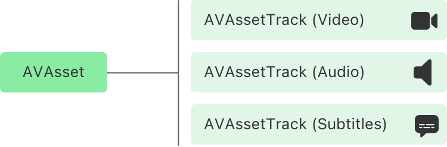

> Navigation: [Technologies](../technologies.md) · [AVFoundation](../avfoundation.md)

# AVAsset

<sub>Class</sub>

An object that models timed audiovisual media.

<sub>iOS, iPadOS, Mac Catalyst, macOS, tvOS, visionOS, watchOS</sub>

```swift
class AVAsset
```

## Overview

An asset models file-based media like a QuickTime movie or an MP3 audio file, and also media streamed using HTTP Live Streaming (HLS). An asset is a container object for one or more instances of [AVAssetTrack](avassettrack.md) that model the uniformly typed tracks of media. The most commonly used track types are audio and video, but assets may also contain supplementary tracks, like closed captions, subtitles, and timed metadata.



<sub>A diagram of four rectangular items. The rectangle on the left represents AVAsset. A line connects it to three stacked rectangles on the right that represent AVAssetTrack (Video), AVAssetTrack (Audio), and AVAssetTrack (Subtitles) from top to bottom.</sub>

You load the tracks for an asset by asynchronously loading its [tracks](avpartialasyncproperty/tracks-48zyw.md) property. In some cases, you may want to perform operations on a subset of an asset’s tracks rather than on its complete collection. For those situations, an asset provides methods to retrieve subsets of tracks according to particular criteria, such as identifier, media type, or characteristic.

## Relationships

- **Inherits From**: [NSObject](../objectivec/nsobject-swift.class.md)

- **Inherited By**: [AVComposition](avcomposition.md), [AVMovie](avmovie.md), [AVURLAsset](avurlasset.md)

- **Conforms To**: [AVAsynchronousKeyValueLoading](avasynchronouskeyvalueloading.md), [CVarArg](../swift/cvararg.md), [CustomDebugStringConvertible](../swift/customdebugstringconvertible.md), [CustomStringConvertible](../swift/customstringconvertible.md), [Equatable](../swift/equatable.md), [Hashable](../swift/hashable.md), [NSCopying](../foundation/nscopying.md), [NSObjectProtocol](../objectivec/nsobjectprotocol.md)

## Topics

### Creating an asset

- [+ assetWithURL:](<avasset/init(url_)-42gl8.md>) — Creates an asset that models the media at the specified URL. _(deprecated)_

### Loading duration and timing

- [duration](avpartialasyncproperty/duration.md) — A time value that represents the duration of the asset.
- [providesPreciseDurationAndTiming](avpartialasyncproperty/providesprecisedurationandtiming.md) — A Boolean value that indicates whether the asset provides precise duration and timing.
- [minimumTimeOffsetFromLive](avpartialasyncproperty/minimumtimeoffsetfromlive.md) — A time value that indicates how closely playback follows the latest live stream content.

### Loading tracks

- [tracks](avpartialasyncproperty/tracks-48zyw.md) — The tracks of media that an asset contains.
- [- loadTrackWithTrackID:completionHandler:](<avasset/loadtrack(withtrackid_completionhandler_).md>) — Loads a track that contains the specified identifier.
- [- loadTracksWithMediaType:completionHandler:](<avasset/loadtracks(withmediatype_completionhandler_).md>) — Loads tracks that contain media of a specified type.
- [- loadTracksWithMediaCharacteristic:completionHandler:](<avasset/loadtracks(withmediacharacteristic_completionhandler_).md>) — Loads tracks that contain media of a specified characteristic.
- [- findUnusedTrackIDWithCompletionHandler:](<avasset/findunusedtrackid(completionhandler_).md>) — Loads an identifier that no other track in the asset uses.

### Loading track groups

- [trackGroups](avpartialasyncproperty/trackgroups.md) — The track groups an asset contains.

### Loading metadata

- [metadata](avpartialasyncproperty/metadata-16qej.md) — The metadata items that an asset contains for all metadata identifiers.
- [commonMetadata](avpartialasyncproperty/commonmetadata-3j3n4.md) — The metadata items that an asset contains for common metadata identifiers.
- [availableMetadataFormats](avpartialasyncproperty/availablemetadataformats-4yiq8.md) — The formats of metadata that an asset contains.
- [- loadMetadataForFormat:completionHandler:](<avasset/loadmetadata(for_completionhandler_).md>) — Loads an array of metadata items that the asset contains for the specified format.
- [creationDate](avpartialasyncproperty/creationdate.md) — A metadata item that indicates the creation date of an asset.
- [lyrics](avpartialasyncproperty/lyrics.md) — The lyrics of the asset in a language suitable for the current locale.

### Loading suitability

- [isPlayable](avpartialasyncproperty/isplayable-45h5v.md) — A Boolean value that indicates whether an asset contains playable content.
- [isExportable](avpartialasyncproperty/isexportable.md) — A Boolean value that indicates whether you can export an asset using an export session.
- [isReadable](avpartialasyncproperty/isreadable.md) — A Boolean value that indicates whether you can extract the asset’s media data using an asset reader.
- [isComposable](avpartialasyncproperty/iscomposable.md) — A Boolean value that indicates whether you can use the asset in a media composition.
- [isCompatibleWithAirPlayVideo](avpartialasyncproperty/iscompatiblewithairplayvideo.md) — A Boolean value that indicates whether the asset is compatible with AirPlay Video.
- [isCompatibleWithSavedPhotosAlbum](avpartialasyncproperty/iscompatiblewithsavedphotosalbum.md) — A Boolean value that indicates whether you can write the asset to the Saved Photos album.

### Loading asset preferences

- [preferredRate](avpartialasyncproperty/preferredrate.md) — The asset’s rate preference for playing its media.
- [preferredVolume](avpartialasyncproperty/preferredvolume-20mb3.md) — The asset’s volume preference for playing its audible media.
- [preferredTransform](avpartialasyncproperty/preferredtransform-80d13.md) — The asset’s transform preference to apply to its visual content during presentation or processing.
- [preferredDisplayCriteria](avpartialasyncproperty/preferreddisplaycriteria.md) — The asset’s display mode preference for optimal playback of its content.
- [AVDisplayCriteria](avdisplaycriteria.md) — An object the system uses to guide the selection of a display mode in tvOS.

### Loading media selections

- [allMediaSelections](avpartialasyncproperty/allmediaselections.md) — The available media selections for an asset.
- [preferredMediaSelection](avpartialasyncproperty/preferredmediaselection.md) — The default media selections for the media selection groups of an asset.
- [availableMediaCharacteristicsWithMediaSelectionOptions](avpartialasyncproperty/availablemediacharacteristicswithmediaselectionoptions.md) — The media characteristics that provide media selection options.
- [- loadMediaSelectionGroupForMediaCharacteristic:completionHandler:](<avasset/loadmediaselectiongroup(for_completionhandler_).md>) — Loads a media selection group that contains one or more options with the specified media characteristic.

### Loading chapter metadata

- [availableChapterLocales](avpartialasyncproperty/availablechapterlocales.md) — The locales of an asset’s chapter metadata.
- [loadChapterMetadataGroups(withTitleLocale:containingItemsWithCommonKeys:)](<avasset/loadchaptermetadatagroups(withtitlelocale_containingitemswithcommonkeys_).md>) — Loads chapter metadata that contains the specified title locale and common keys.
- [- loadChapterMetadataGroupsBestMatchingPreferredLanguages:completionHandler:](<avasset/loadchaptermetadatagroups(bestmatchingpreferredlanguages_completionhandler_).md>) — Loads chapter metadata with a locale that best matches the list of preferred languages.

### Loading content protections

- [hasProtectedContent](avpartialasyncproperty/hasprotectedcontent.md) — A Boolean value that indicates whether the asset contains protected content.

### Loading fragment support

- [canContainFragments](avpartialasyncproperty/cancontainfragments.md) — A Boolean value that indicates whether you can extend the asset by fragments.
- [containsFragments](avpartialasyncproperty/containsfragments.md) — A Boolean value that indicates whether at least one movie fragment extends the asset.
- [overallDurationHint](avpartialasyncproperty/overalldurationhint.md) — A hint to the total duration of fragments that currently exist or may exist in the future.

### Canceling property loading

- [- cancelLoading](<avasset/cancelloading().md>) — Cancels all pending requests to asynchronously load property values.

### Retrieving reference restrictions

- [referenceRestrictions](avasset/referencerestrictions.md) — The restrictions that an asset places on how it resolves references to external media.
- [AVAssetReferenceRestrictions](avassetreferencerestrictions.md) — Restrictions to use when resolving references to external media data.

### Deprecated

- [Deprecated symbols](avasset-deprecated-symbols.md) — Review unsupported symbols and their replacements.

### Initializers

- [init(URL:)](<avasset/init(url_)-8cql6.md>) _(deprecated)_

## See Also

### Assets

- [AVURLAsset](avurlasset.md) — An asset that represents media at a local or remote URL.
- [AVAssetTrack](avassettrack.md) — An object that models a track of media that an asset contains.
- [AVAssetTrackSegment](avassettracksegment.md) — An object that represents a time range segment of an asset track.
- [AVAssetTrackGroup](avassettrackgroup.md) — A group of related tracks in an asset.
