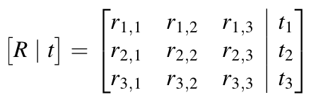

> Navigation: [Technologies](../../technologies.md) · [AVFoundation](../../avfoundation.md) · [AVCameraCalibrationData](../avcameracalibrationdata.md)

# extrinsicMatrix

<sub>Instance Property</sub>

A matrix relating a camera’s position and orientation to a world or scene coordinate system.

<sub>iOS, iPadOS, Mac Catalyst, macOS, tvOS, visionOS</sub>

```swift
var extrinsicMatrix: matrix_float4x3 { get }
```

## Discussion

The extrinsic matrix consists of a unitless 3 x 3 rotation matrix (`R`) on the left and a 3 x 1 column vector translation (`t`) on the right. The translation vector’s units are millimeters.



The camera’s pose is expressed with respect to a reference camera (camera-to-world view). If the rotation matrix is an identity matrix, then this camera is the reference camera.

> [!note] Note
> A [matrix_float4x3](../../simd/matrix_float4x3.md) matrix is column major with 3 rows and 4 columns.

## See Also

### Mapping pixels to scene geometry

- [intrinsicMatrix](intrinsicmatrix.md) — A matrix that relates a camera’s internal properties to an ideal pinhole-camera model.
- [intrinsicMatrixReferenceDimensions](intrinsicmatrixreferencedimensions.md) — The image dimensions to which the camera’s intrinsic matrix values are relative.
- [pixelSize](pixelsize.md) — The size, in millimeters, of one image pixel.
