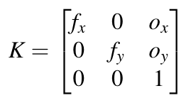

> Navigation: [Technologies](../../technologies.md) · [AVFoundation](../../avfoundation.md) · [AVCameraCalibrationData](../avcameracalibrationdata.md)

# intrinsicMatrix

<sub>Instance Property</sub>

A matrix that relates a camera’s internal properties to an ideal pinhole-camera model.

<sub>iOS, iPadOS, Mac Catalyst, macOS, tvOS, visionOS</sub>

```swift
var intrinsicMatrix: matrix_float3x3 { get }
```

## Discussion

The intrinsic matrix allows you to transform 3D coordinates to 2D coordinates on an image plane using the pinhole camera model. Equations like the following commonly represent the intrinsic matrix as `K:`



<sub>A mathematical equation for the intrinsic matrix. K equals a three-by-three matrix that corresponds to specific pixel values.</sub>

The equation expresses all values in pixels. The values `fx` and `fy` are the pixel focal length, and are identical for square pixels. The `ox` and `oy` values are the offsets of the principal point, from the top-left corner of the image frame. The principal point is relative to the top-left corner of the top-left pixel. Each pixel value represents a sampled value from the center of that pixel.

## See Also

### Mapping pixels to scene geometry

- [intrinsicMatrixReferenceDimensions](intrinsicmatrixreferencedimensions.md) — The image dimensions to which the camera’s intrinsic matrix values are relative.
- [extrinsicMatrix](extrinsicmatrix.md) — A matrix relating a camera’s position and orientation to a world or scene coordinate system.
- [pixelSize](pixelsize.md) — The size, in millimeters, of one image pixel.
