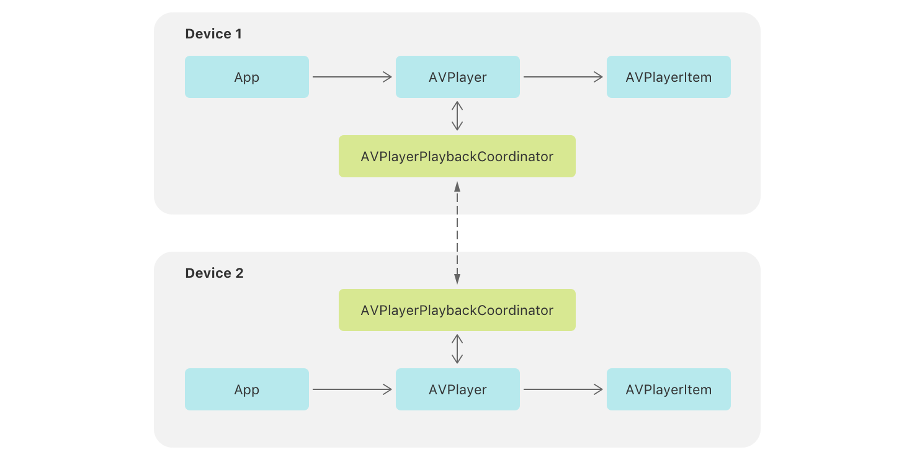

> Navigation: [Technologies](../technologies.md) · [AVFoundation](../avfoundation.md)

# AVPlayerPlaybackCoordinator

<sub>Class</sub>

A playback coordinator subclass that coordinates the playback of player objects in a connected group.

<sub>iOS, iPadOS, Mac Catalyst, macOS, tvOS, visionOS</sub>

```swift
class AVPlayerPlaybackCoordinator
```

## Overview

This object coordinates the state of [AVPlayer](avplayer.md) objects. You don’t create an instance of the coordinator, but instead access the player’s instance through its [playbackCoordinator](avplayer/playbackcoordinator.md) property.

Use the standard interfaces of [AVPlayer](avplayer.md) to control playback in your app. The coordinator automatically intercepts calls that affect transport control state, like [- setRate:time:atHostTime:](<avplayer/setrate(__time_athosttime_).md>), [- pause](<avplayer/pause().md>), and [- seekToTime:completionHandler:](<avplayer/seek(to_completionhandler_)-75bls.md>), and propagates them to other participants in the group when appropriate. Similarly, the coordinator observes rate and time changes from other participants and imposes them on the player. If this occurs, the player item posts notifications that identify the originating participant.



<sub>A diagram representing two devices that each contain representations of the app, AVPlayer, AVPlayerItem, and AVPlayerPlaybackCoordinator relationships. The two AVPlayerPlaybackCoordinator items have a two-way dotted-line connection between the two devices.</sub>

This object may automatically suspend coordinated playback when a system state change causes the player’s [timeControlStatus](avplayer/timecontrolstatus-swift.property.md) value to change from a playing state to a waiting or paused state. A suspension that begins because the player enters a waiting state due to an event like a network stall or interstitial playback, ends automatically when the player finishes waiting. However, if the system pauses playback due to a system state change, such as an audio session interruption, the suspension ends only after the player’s rate changes back to nonzero.

> [!important] Important
> A playback coordinator doesn’t manage the playback queue of connected players. You need to implement custom logic to enqueue the same item across all connected players.

## Relationships

- **Inherits From**: [AVPlaybackCoordinator](avplaybackcoordinator.md)

- **Conforms To**: [CVarArg](../swift/cvararg.md), [CustomDebugStringConvertible](../swift/customdebugstringconvertible.md), [CustomStringConvertible](../swift/customstringconvertible.md), [Equatable](../swift/equatable.md), [Hashable](../swift/hashable.md), [NSObjectProtocol](../objectivec/nsobjectprotocol.md), [Sendable](../swift/sendable.md), [SendableMetatype](../swift/sendablemetatype.md)

## Topics

### Accessing the player

- [player](avplayerplaybackcoordinator/player.md) — A player that participates in coordinated playback.

### Configuring the delegate

- [delegate](avplayerplaybackcoordinator/delegate.md) — A delegate object for the playback coordinator.
- [AVPlayerPlaybackCoordinatorDelegate](avplayerplaybackcoordinatordelegate.md) — A protocol that defines the methods to implement to participate in playback coordination.

### Managing coordination

- [- coordinateUsingCoordinationMedium:error:](<avplayerplaybackcoordinator/coordinate(using_).md>) — Connects the playback coordinator to the coordination medium
- [playbackCoordinationMedium](avplayerplaybackcoordinator/playbackcoordinationmedium.md) — The AVPlaybackCoordinationMedium this playback coordinator is connected to.

## See Also

### SharePlay

- [Destination Video](../visionos/destination-video.md) — Leverage SwiftUI to build an immersive media experience in a multiplatform app.
- [Supporting coordinated media playback](supporting-coordinated-media-playback.md) — Create synchronized media experiences that enable users to watch and listen across devices.
- [AVPlaybackCoordinator](avplaybackcoordinator.md) — An object that coordinates the playback of players in a connected group.
- [AVDelegatingPlaybackCoordinator](avdelegatingplaybackcoordinator.md) — A playback coordinator subclass that coordinates the playback of custom player objects in a connected group.
- [AVPlaybackCoordinationMedium](avplaybackcoordinationmedium.md) — The AVPlaybackCoordinationMedium passes states and messages between its connected playback coordinators.
