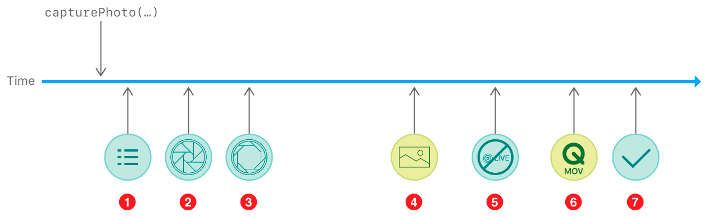

> Navigation: [Technologies](../technologies.md) · [AVFoundation](../avfoundation.md) · [Photo capture](photo-capture.md) · [Capturing still and Live Photos](capturing-still-and-live-photos.md)

# Capturing and saving Live Photos

<sub>Article</sub>

Capture Live Photos like those created in the system Camera app and save them to the Photos library.

## Overview

A Live Photo is a picture that includes motion and sound from the moments just before and after its capture. Your app can capture and record Live Photos using the AVFoundation capture system and the [AVCapturePhotoOutput](avcapturephotooutput.md) class.

> [!note] Note
> If you’re not already familiar with capture sessions, input setup, and photo capture, see [Setting up a capture session](setting-up-a-capture-session.md) and [Capturing still and Live Photos](capturing-still-and-live-photos.md).

### Enable Live Photo capture

For a still photo your capture session needs only a video input, but a Live Photo includes sound, so you’ll need to also connect an audio capture device to your session:

```swift
enum CameraError: Error {
    case configurationFailed
    // ... additional error cases ...
}

func configureSession() throws {
    captureSession.beginConfiguration()
    
    // ... add camera input and photo output ...
    
    guard let audioDevice = AVCaptureDevice.default(for: .audio),
          let audioDeviceInput = try? AVCaptureDeviceInput(device: audioDevice) else {
              throw CameraError.configurationFailed
    }
    
    if captureSession.canAddInput(audioDeviceInput) {
        captureSession.addInput(audioDeviceInput)
    } else {
        throw CameraError.configurationFailed
    }
    
    // ... configure photo output and start running ...
    
    captureSession.commitConfiguration()
}
```

Because you’re already using a built-in camera device for video (see [Setting up a capture session](setting-up-a-capture-session.md)), you can simply use the default audio capture device—the system automatically uses the best microphone configuration for the camera position.

Capturing Live Photos requires an internal reconfiguration of the capture pipeline, which takes time and interrupts any in-progress captures. Before shooting your first Live Photo, make sure you’ve configured the pipeline appropriately by enabling Live Photo capture on your [AVCapturePhotoOutput](avcapturephotooutput.md) object:

```swift
let photoOutput = AVCapturePhotoOutput()

// Attempt to add the photo output to the session.
if captureSession.canAddOutput(photoOutput) {
    captureSession.sessionPreset = .photo
    captureSession.addOutput(photoOutput)
} else {
    throw CameraError.configurationFailed
}

// Configure the photo output's behavior.
photoOutput.isHighResolutionCaptureEnabled = true
photoOutput.isLivePhotoCaptureEnabled = photoOutput.isLivePhotoCaptureSupported

// Start the capture session.
captureSession.startRunning()
```

### Capture a Live Photo

Once your photo output is ready for Live Photos, you can choose still image or Live Photo capture for each shot. To capture a Live Photo, create an [AVCapturePhotoSettings](avcapturephotosettings.md) object, choosing the format for the still image portion of the Live Photo and providing a URL for writing the movie portion of the Live Photo. Then, call [- capturePhotoWithSettings:delegate:](<avcapturephotooutput/capturephoto(with_delegate_).md>) to trigger capture:

```swift
let photoSettings = AVCapturePhotoSettings(format: [AVVideoCodecKey: AVVideoCodecType.hevc])
photoSettings.livePhotoMovieFileURL = // output url

// Shoot the Live Photo, using a custom class to handle capture delegate callbacks.
let captureProcessor = LivePhotoCaptureProcessor()
photoOutput.capturePhoto(with: photoSettings, delegate: captureProcessor)
```

### Handle Live Photo results

A Live Photo appears to users in the Photos app as a single asset, but it’s actually composed of separate files: the primary still image, and a movie file containing motion and sound from the moments before and after. The capture system delivers these results separately, as soon as each becomes available.

The [- captureOutput:didFinishProcessingPhoto:error:](<avcapturephotocapturedelegate/photooutput(__didfinishprocessingphoto_error_).md>) method delivers the still image portion of the Live Photo as an [AVCapturePhoto](avcapturephoto.md) object. Because you’ll need to save the still image and movie files together, it’s best to extract the image file data from the [AVCapturePhoto](avcapturephoto.md) and keep it until the movie file finishes recording, as shown below. (You can also use this method to indicate in your UI that the still image has been captured.)

```swift
func photoOutput(_ output: AVCapturePhotoOutput,
                 didFinishProcessingPhoto photo: AVCapturePhoto,
                 error: Error?) {
    guard error != nil else {
        print("Error capturing Live Photo still: \(error!)");
        return
    }
    
    // Get and process the captured image data.
    processImage(photo.fileDataRepresentation())
}
```

The [- captureOutput:didFinishProcessingLivePhotoToMovieFileAtURL:duration:photoDisplayTime:resolvedSettings:error:](<avcapturephotocapturedelegate/photooutput(__didfinishprocessinglivephototomoviefileat_duration_photodisplaytime_resolvedsettings_error_).md>) method fires later, indicating that the URL you specified when triggering the capture now contains a complete movie file. Once you have both the still image and movie portions of your Live Photo, you can save them together:

```swift
func photoOutput(_ output: AVCapturePhotoOutput,
                 didFinishProcessingLivePhotoToMovieFileAt outputFileURL: URL,
                 duration: CMTime,
                 photoDisplayTime: CMTime,
                 resolvedSettings: AVCaptureResolvedPhotoSettings,
                 error: Error?) {
    
    guard error != nil else {
        print("Error capturing Live Photo movie: \(error!)");
        return
    }
    
    guard let stillImageData = stillImageData else { return }
    
    // Save Live Photo.
    saveLivePhotoToPhotosLibrary(stillImageData: stillImageData,
                                 livePhotoMovieURL: outputFileURL)
}
```

> [!note] Note
> To display Live Photos after capture, see [PHLivePhoto](../photos/phlivephoto.md) and [PHLivePhotoView](../photosui/phlivephotoview.md).

### Save a Live Photo to the photos library

Use the [PHAssetCreationRequest](../photos/phassetcreationrequest.md) class to create a single Photos asset consisting of media from multiple files—in the case of a Live Photo, the still image and its paired video. As in [Saving captured photos](saving-captured-photos.md), you’ll need to wrap that request in a [PHPhotoLibrary](../photos/phphotolibrary.md) change block, and first make sure that your app has the user’s permission to access Photos.

```swift
func saveLivePhotoToPhotosLibrary(stillImageData: Data, livePhotoMovieURL: URL) {    PHPhotoLibrary.requestAuthorization { status in
        guard status == .authorized else { return }
        
        PHPhotoLibrary.shared().performChanges({
            // Add the captured photo's file data as the main resource for the Photos asset.
            let creationRequest = PHAssetCreationRequest.forAsset()
            creationRequest.addResource(with: .photo, data: stillImageData, options: nil)
            
            // Add the movie file URL as the Live Photo's paired video resource.
            let options = PHAssetResourceCreationOptions()
            options.shouldMoveFile = true
            creationRequest.addResource(with: .pairedVideo, fileURL: livePhotoMovieURL, options: options)
        }) { success, error in
            // Handle completion.
        }
    }
}
```

> [!tip] Tip
> Use the [shouldMoveFile](../photos/phassetresourcecreationoptions/shouldmovefile.md) option so that iOS can transfer the movie file from your app’s sandbox to the system Photos library without an expensive data-copying operation.

### Track Live Photo progress

Capturing Live Photos adds two additional steps to the process shown in [Tracking photo capture progress](tracking-photo-capture-progress.md): after delivery of the still photo result (step 4), the photo output notifies you of movie capture status (step 5) and delivers the movie result (step 6). (Final cleanup becomes step 7.)



When the user captures a Live Photo in the system Camera app, a “Live” indicator appears for a few seconds to let the user know that video and audio are still being recorded. To provide a similar interface in your app, implement these methods in your photo capture delegate:

- The [- captureOutput:willBeginCaptureForResolvedSettings:](<avcapturephotocapturedelegate/photooutput(__willbegincapturefor_).md>) method tells you that capture has started: implement this method to show a recording indicator.
- The [- captureOutput:didFinishRecordingLivePhotoMovieForEventualFileAtURL:resolvedSettings:](<avcapturephotocapturedelegate/photooutput(__didfinishrecordinglivephotomovieforeventualfileat_resolvedsettings_).md>) method tells you that a Live Photo movie is no longer recording: implement this method to hide the indicator. (Note that the movie file is not yet available at this time.)

You can have multiple Live Photo captures running at the same time, so it’s best to use these methods to keep track of the number of captures “in flight” and hide your indicator only when that number reaches zero:

```swift
class LivePhotoCaptureProcessor: NSObject, AVCapturePhotoCaptureDelegate {
    // ... other PhotoCaptureDelegate methods and supporting properties ...
    
    // A handler to call when Live Photo capture begins and ends.
    var livePhotoStatusHandler: (Bool) -> () = { _ in }
    
    // A property for tracking in-progress captures and updating UI accordingly.
    var livePhotosInProgress = 0 {
        didSet {
            // Update the UI accordingly based on the value of this property
        }
    }
    
    // Call the handler when PhotoCaptureDelegate methods indicate Live Photo capture is in progress.
    func photoOutput(_ output: AVCapturePhotoOutput,
                     willBeginCaptureFor resolvedSettings: AVCaptureResolvedPhotoSettings) {
        let capturingLivePhoto = (resolvedSettings.livePhotoMovieDimensions.width > 0 && resolvedSettings.livePhotoMovieDimensions.height > 0)
        livePhotoStatusHandler(capturingLivePhoto)
    }
    
    func photoOutput(_ output: AVCapturePhotoOutput,
                     didFinishRecordingLivePhotoMovieForEventualFileAt outputFileURL: URL,
                     resolvedSettings: AVCaptureResolvedPhotoSettings) {
        livePhotoStatusHandler(false)
    }
}
```

## See Also

### Next steps

- [Saving captured photos](saving-captured-photos.md) — Add an image and other data from a photo capture to the photo library.
- [Tracking photo capture progress](tracking-photo-capture-progress.md) — Monitor key events during capture to provide feedback in your camera UI.
