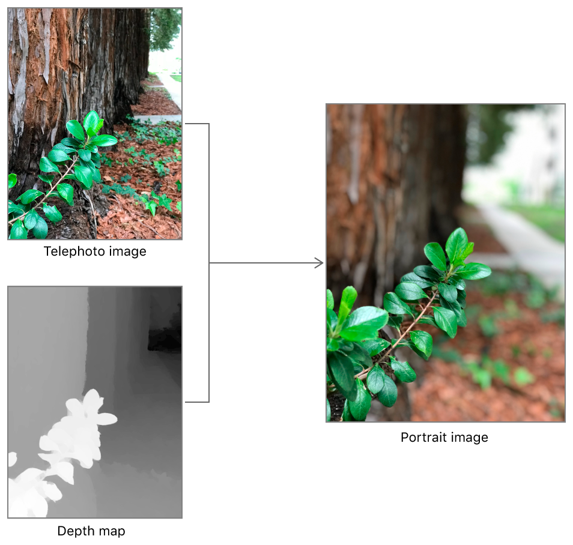
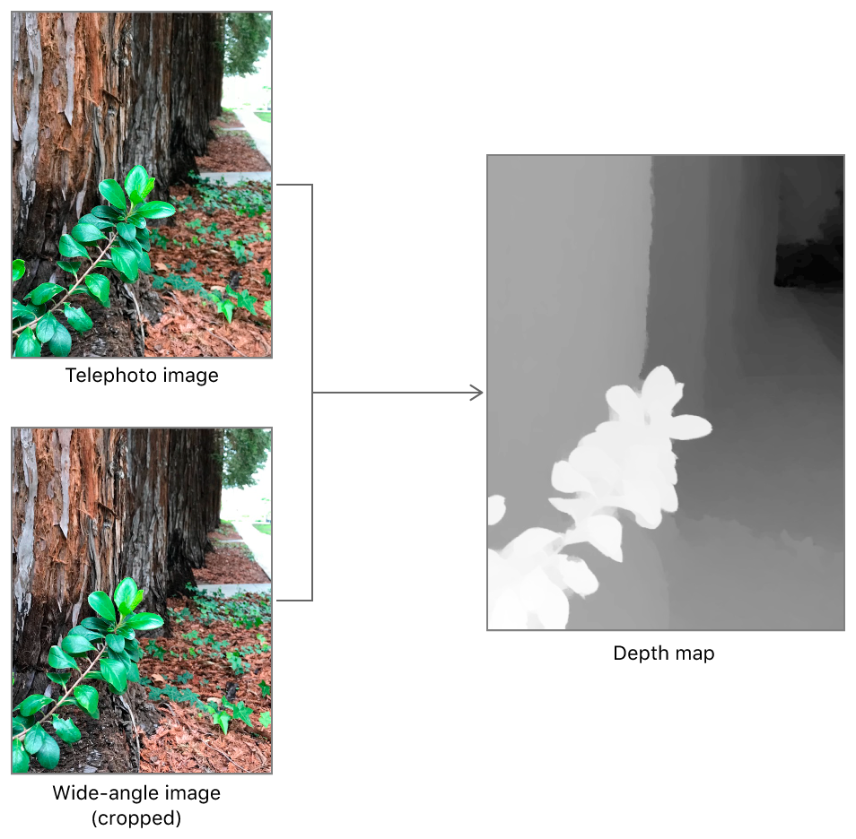

> Navigation: [Technologies](../technologies.md) · [AVFoundation](../avfoundation.md) · [Additional data capture](additional-data-capture.md)

# Capturing photos with depth

<sub>Article</sub>

Get a depth map with a photo to create effects like the system camera’s Portrait mode (on compatible devices).

## Overview

On iOS devices with a back-facing dual camera or a front-facing TrueDepth camera, the capture system can record depth information. A depth map is like an image; however, instead of each pixel providing a color, it indicates distance from the camera to that part of the image (either in absolute terms, or relative to other pixels in the depth map).

You can use a depth map together with a photo to create image-processing effects that treat foreground and background elements of a photo differently, like the Portrait mode in the iOS Camera app. By saving color and depth data separately, you can even apply and change these effects long after a photo has been captured.



You can add depth capture to many of the other photography workflows covered in [Capturing still and Live Photos](capturing-still-and-live-photos.md) by adding the following steps.

### Prepare for depth photo capture

To capture depth maps, you’ll need to first select a [AVCaptureDeviceTypeBuiltInDualCamera](avcapturedevice/devicetype-swift.struct/builtindualcamera.md) or [AVCaptureDeviceTypeBuiltInTrueDepthCamera](avcapturedevice/devicetype-swift.struct/builtintruedepthcamera.md) capture device as your session’s video input. Even if an iOS device has a dual camera or TrueDepth camera, selecting the default back- or front-facing camera doesn’t enable depth capture.

Capturing depth also requires an internal reconfiguration of the capture pipeline, briefly delaying capture and interrupting any in-progress captures. Before shooting your first depth photo, make sure you configure the pipeline appropriately by enabling depth capture on your [AVCapturePhotoOutput](avcapturephotooutput.md) object.

```swift
// Select a depth-capable capture device.
guard let videoDevice = AVCaptureDevice.default(.builtInDualCamera,
    for: .video, position: .back)
    else { fatalError("No dual camera.") }
guard let videoDeviceInput = try? AVCaptureDeviceInput(device: videoDevice),
    self.captureSession.canAddInput(videoDeviceInput)
    else { fatalError("Can't add video input.") }
self.captureSession.beginConfiguration()
self.captureSession.addInput(videoDeviceInput)

// Set up photo output for depth data capture.
let photoOutput = AVCapturePhotoOutput()
guard self.captureSession.canAddOutput(photoOutput)
    else { fatalError("Can't add photo output.") }
self.captureSession.addOutput(photoOutput)
self.captureSession.sessionPreset = .photo
// Enable delivery of depth data after adding the output to the capture session.
photoOutput.isDepthDataDeliveryEnabled = photoOutput.isDepthDataDeliverySupported
self.captureSession.commitConfiguration()
```

> [!note] Note
> Enabling depth capture on a dual camera locks the zoom factor of both the wide and telephoto cameras.

### Choose settings

Once your photo output is ready for depth capture, you can request that any individual photos capture a depth map along with the color image. Create an [AVCapturePhotoSettings](avcapturephotosettings.md) object, choosing the format for the color image. Then, enable depth capture and depth output (and any other settings you’d like for that photo) and call the [- capturePhotoWithSettings:delegate:](<avcapturephotooutput/capturephoto(with_delegate_).md>) method.

```swift
let photoSettings = AVCapturePhotoSettings(format: [AVVideoCodecKey: AVVideoCodecType.hevc])
photoSettings.isDepthDataDeliveryEnabled = photoOutput.isDepthDataDeliverySupported

// Shoot the photo, using a custom class to handle capture delegate callbacks.
let captureProcessor = PhotoCaptureProcessor()
photoOutput.capturePhoto(with: photoSettings, delegate: captureProcessor)
```

### Handle results

After a capture, the photo output calls your delegate’s [- captureOutput:didFinishProcessingPhoto:error:](<avcapturephotocapturedelegate/photooutput(__didfinishprocessingphoto_error_).md>) method, providing the photo and captured depth data as an [AVCapturePhoto](avcapturephoto.md) object.

If you plan to use the captured depth data immediately—for example, to display a preview of a depth-based image processing effect—you can find it in the photo object’s [depthData](avcapturephoto/depthdata.md) property.

Otherwise, the capture output embeds depth data and depth-related metadata when you use the [- fileDataRepresentation](<avcapturephoto/filedatarepresentation().md>) method to produce file data for saving the photo. If you add the resulting file to the Photos library, other apps (including the system Photos app) automatically recognize the depth data within and can apply depth-based image processing effects. (If you need to disable this option, see the [embedsDepthDataInPhoto](avcapturephotosettings/embedsdepthdatainphoto.md) setting).

### About disparity, depth, and accuracy

When you enable depth capture with the back-facing dual camera on compatible devices (see [iOS Device Compatibility Reference](https://developer.apple.com/library/archive/documentation/DeviceInformation/Reference/iOSDeviceCompatibility/Introduction/Introduction.html#//apple_ref/doc/uid/TP40013599)), the system captures imagery using both cameras. Because the two parallel cameras are a small distance apart on the back of the device, similar features found in both images show a parallax shift: objects that are closer to the camera shift by a greater distance between the two images. The capture system uses this difference, or _disparity_, to infer the relative distances from the camera to objects in the image, as shown below.



Each point in a depth map captured by a dual camera device measures disparity units of 1/meters, and offers [AVDepthDataAccuracyRelative](avdepthdata/accuracy/relative.md) accuracy. An individual point isn’t a good estimate of real-world distance, but the variation between points is consistent enough to use for depth-based image processing effects.

The TrueDepth camera projects an infrared light pattern in front of the camera and images that pattern with an infrared camera. By observing how objects in the scene distorts the pattern, the capture system can calculate the distance rom the camera to each point in the image.

The TrueDepth camera produces disparity maps by default so that the resulting depth data is similar to that produced by a dual camera device. However, unlike a dual camera device, the TrueDepth camera can directly measure depth (in meters) with [AVDepthDataAccuracyAbsolute](avdepthdata/accuracy/absolute.md) accuracy. To capture depth instead of disparity, set the [activeDepthDataFormat](avcapturedevice/activedepthdataformat.md) of the capture device before starting your capture session:

```swift
// Select a depth (not disparity) format that works with the active color format.
let availableFormats = captureDevice.activeFormat.supportedDepthDataFormats

let depthFormat = availableFormats.filter { format in
    let pixelFormatType =
        CMFormatDescriptionGetMediaSubType(format.formatDescription)
    
    return (pixelFormatType == kCVPixelFormatType_DepthFloat16 ||
            pixelFormatType == kCVPixelFormatType_DepthFloat32)
}.first

// Set the capture device to use that depth format.
captureSession.beginConfiguration()
captureDevice.activeDepthDataFormat = depthFormat
captureSession.commitConfiguration()
```

## See Also

### Depth data capture

- [Creating auxiliary depth data manually](creating-auxiliary-depth-data-manually.md) — Generate a depth image and attach it to your own image.
- [Capturing depth using the LiDAR camera](capturing-depth-using-the-lidar-camera.md) — Access the LiDAR camera on supporting devices to capture precise depth data.
- [AVCamFilter: Applying filters to a capture stream](avcamfilter-applying-filters-to-a-capture-stream.md) — Render a capture stream with rose-colored filtering and depth effects.
- [Streaming depth data from the TrueDepth camera](streaming-depth-data-from-the-truedepth-camera.md) — Visualize depth data in 2D and 3D from the TrueDepth camera.
- [Enhancing live video by leveraging TrueDepth camera data](enhancing-live-video-by-leveraging-truedepth-camera-data.md) — Apply your own background to a live capture feed streamed from the front-facing TrueDepth camera.
- [AVCaptureDepthDataOutput](avcapturedepthdataoutput.md) — A capture output that records scene depth information on compatible camera devices.
- [AVDepthData](avdepthdata.md) — A container for per-pixel distance or disparity information captured by compatible camera devices.
- [AVCameraCalibrationData](avcameracalibrationdata.md) — Information about the camera characteristics used to capture images and depth data.
