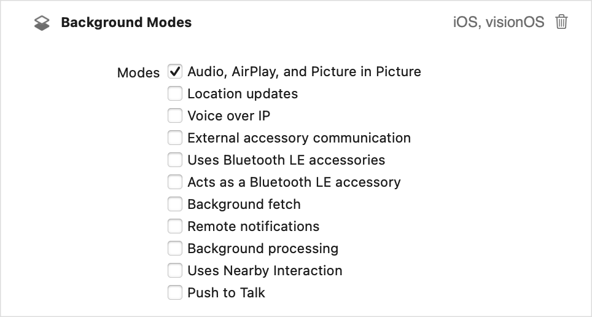

> Navigation: [Technologies](../technologies.md) · [AVFoundation](../avfoundation.md) · [Media playback](media-playback.md)

# Configuring your app for media playback

<sub>Article</sub>

Configure apps to enable standard media playback behavior.

## Overview

When you build media playback apps for iOS, tvOS, and visionOS, you need to do additional configuration to enable the expected playback behavior. Configuring the audio experience and background operations helps ensure that your app’s audio works as intended. It also enables advanced features like AirPlay streaming and Picture in Picture playback on supported platforms.

### Configure the audio session

Apple platforms, other than macOS which primarily leaves control to an app, provide an audio experience that the operating system manages. This enables the OS to provide a seamless audio experience to people as they switch between apps and receive high-priority audio requests such as phone or FaceTime calls.

Your app uses an [AVAudioSession](../avfaudio/avaudiosession.md) to configure its audio behavior semantically, for example to have a primary purpose of playback or recording. You delegate the management of those details to the audio session, which ensures that the operating system can best manage a person’s audio experience.

Your app automatically has an audio session that the system configures with this default behavior:

- Audio playback in your app silences other background audio
- Support for audio playback but not audio recording
- Ring/Silent switch set to silent mode in iOS silences app audio
- Locked device in iOS silences app audio

The default audio session provides useful behavior, but typically doesn’t provide the experience and features you need when building a playback app. To add the required behavior, configure your app’s audio session category.

An audio session category defines the general audio behavior your app requires. AVFoundation defines several audio session categories you can use, but the one most relevant for media playback apps is [playback](../avfaudio/avaudiosession/category-swift.struct/playback.md). This category indicates that media playback is a central feature of your app. When you specify this category, the system doesn’t silence your app’s audio when someone sets the Ring/Silent switch to silent mode in iOS only. Enabling this category means your app can play background audio if you’re using the Audio, AirPlay, and Picture in Picture background mode as explained in the section below.

Use an [AVAudioSession](../avfaudio/avaudiosession.md) object to configure your app’s audio session. An audio session is a singleton object you use to set the audio session [category](../avfaudio/avaudiosession/category-swift.property.md), [mode](../avfaudio/avaudiosession/mode-swift.property.md), and other settings. To configure the audio session for optimized playback of movies:

```swift
class PlayerModel: ObservableObject {
    
    func configureAudioSession() {
        do {
            let session = AVAudioSession.sharedInstance()
            // Configure the app for playback of long-form movies.
            try session.setCategory(.playback, mode: .moviePlayback)
        } catch {
            // Handle error.
        }
    }
}
```

To enable this category, activate the audio session using the [setActive(_:options:)](<../avfaudio/avaudiosession/setactive(__options_).md>) method.

> [!note] Note
> You can activate the audio session at any time after setting its category, but it’s recommended to defer this call until your app begins audio playback. Deferring the call ensures that you don’t prematurely interrupt any other background audio that may be in progress.

Setting the category is the minimal interaction with an audio session, but other configuration options and features are available. For example, in visionOS, you customize a user’s spatial audio experience by configuring the audio session. For more information, see [AVAudioSession](../avfaudio/avaudiosession.md).

### Configure the background modes

The system requires you to enable certain capabilities to perform some background operations. A common capability that playback apps require is playing background audio. With this capability enabled, your app’s audio continues when people switch to another app or lock their iOS device. Your app also needs this capability to enable advanced playback features like AirPlay streaming and Picture in Picture playback on supported platforms.

Use Xcode to configure this capability:

1. Select your app’s target in Xcode and select the Signing & Capabilities tab.
2. Click the + Capability button and add the Background Modes capability to the project.
3. In the Background Modes interface, select the Audio, AirPlay, and Picture in Picture option under its list of background modes.



<sub>A screenshot of the Background Modes section of an Xcode target’s Signing & Capabilities tab. It shows a Background Modes heading at the top of the image and a vertical list of checkboxes below it to enable specific modes. The top checkbox is enabled to indicate that the app supports the Audio, Airplay, and Picture in Picture background mode.</sub>

With this mode enabled and your audio session configured, your app is ready to play background audio. In iOS, when you enable this option, your app can stream its content over AirPlay, and in iOS and tvOS it can use Picture in Picture playback.
