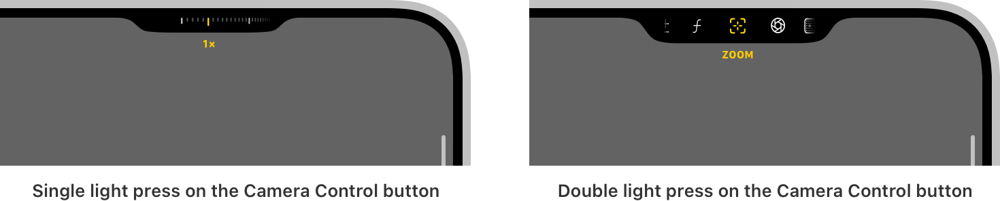
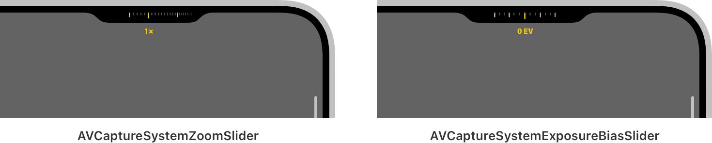
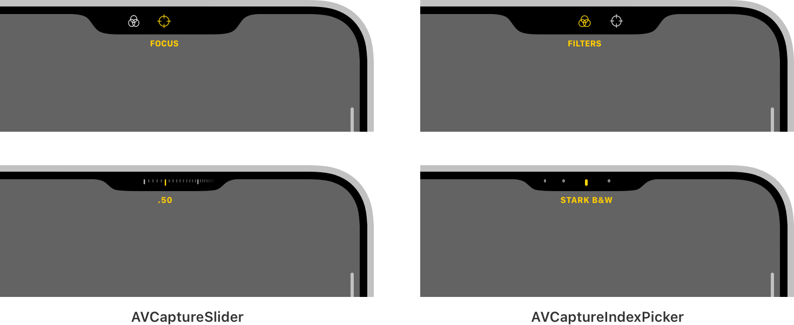

> Navigation: [Technologies](../technologies.md) · [AVFoundation](../avfoundation.md) · [Capture setup](capture-setup.md)

# Enhancing your app experience with the Camera Control

<sub>Article</sub>

Provide direct access to your camera app’s features to help people quickly capture the perfect shot.

## Overview

iPhone 16 devices provide a new hardware interface — the Camera Control — that enables direct interaction with the camera system. By default, iOS configures the Camera Control to launch and control the Camera app. By adopting support for this feature, you can bring this same level of integration to your camera app.

> [!note] Note
> To handle capture events from the Capture Control, your app must adopt the [AVCaptureEventInteraction](../avkit/avcaptureeventinteraction.md) class from the AVKit framework. To launch your app from the Camera Control, it needs to adopt the [LockedCameraCapture](../lockedcameracapture.md) framework. For an example of how to provide full support for the Camera Control in your app, see [AVCam: Building a camera app](avcam-building-a-camera-app.md).

Interacting with the Camera Control reveals a new controls interface like shown below. A single light press of the Camera Control presents an overlay that enables a person to adjust the value of a particular control like the camera’s zoom or exposure. Then by lightly double tapping the button, the user can switch between the controls the app provides by sliding their finger on the Camera Control.



<sub>An image with two screenshots arranged horizontally. The screenshot on the left shows the user interface of a control that adjusts camera zoom. The screenshot on the right shows the controls overlay the system reveals when a user lightly double presses the Camera Control.</sub>

The items this menu presents are instances of [AVCaptureControl](avcapturecontrol.md), used to define the abstract interface for control objects. This article describes the framework’s available control types and how to configure your app to use them.

> [!note] Note
> For design considerations when adopting this feature, see [Camera Control](https://developer.apple.com/design/human-interface-guidelines/camera-control) in Human Interface Guidelines.

### Adopt system controls

The framework provides two ready-to-use control implementations that support common camera app features:

- [AVCaptureSystemZoomSlider](avcapturesystemzoomslider.md): A continuous slider that modifies the value of a camera device’s [videoZoomFactor](avcapturedevice/videozoomfactor.md) property.
- [AVCaptureSystemExposureBiasSlider](avcapturesystemexposurebiasslider.md): A continuous slider that modifies the value of the camera device’s [exposureTargetBias](avcapturedevice/exposuretargetbias.md) property.

Both control types determine their range by querying the associated device’s active format for a system-recommended value. When a device format changes, such as switching from a photo to a video format, the controls update their values accordingly.

Configuring your app to use these controls provides user interfaces like shown below:



<sub>An image with two screenshots arranged horizontally. The left screenshot shows the user interface of an AVCaptureSystemZoomSlider. This control displays a row of vertical tick marks across the top to show the range of zoom values, and below it a label that indicates a 1x zoom level. The right screenshot shows the user interface of an AVCaptureSystemExposureBiasSlider. This control displays a row of vertical tick marks with prominent values across its range, and below it a label that indicates an exposure of 0 EV.</sub>

Adopting system controls is straightforward. You create an instance by passing it an [AVCaptureDevice](avcapturedevice.md) object to configure and, optionally, an action to perform after a change occurs. The system calls this action on the `@MainActor` so your app can update its user interface in response to value changes.

```swift
// Retrieve the capture device to configure.
guard let device = activeVideoInput?.device else { return }

// Create a control to adjust the device's video zoom factor.
let systemZoomSlider = AVCaptureSystemZoomSlider(device: device) { zoomFactor in
    // Calculate and display a zoom value.
    let displayZoom = device.displayVideoZoomFactorMultiplier * zoomFactor
    // Update the user interface.
}

// Create a control to adjust the device's exposure bias.
let systemBiasSlider = AVCaptureSystemExposureBiasSlider(device: device)
```

### Define custom controls

The framework also provides two general-purpose control types that you use to define custom controls:

- [AVCaptureSlider](avcaptureslider.md): A continuous slider that selects a floating-point value from a bounded range.
- [AVCaptureIndexPicker](avcaptureindexpicker.md): A control that selects a value by index from a mutually exclusive set.

Create an instance of these controls by specifying a localized title that describes the control’s action, a symbol name from the SF Symbols library that defines its visual representation, and a collection of values:

```swift
// Create a control to adjust a capture device's lens position.
let focusSlider = AVCaptureSlider("Focus", symbolName: "scope", in: 0...1)

// Retrieve the titles from a list of camera filters.
let titles = filters.map { $0.localizedTitle }

// Create a control to select from a list of camera filters.
let filterPicker = AVCaptureIndexPicker("Filters", symbolName: "camera.filters", localizedIndexTitles: titles)
```

Configuring your app to use these controls provides user interfaces like shown below:



<sub>An image with screenshots of a custom focus slider and a custom camera filter picker. The top-left image shows the focus control’s presentation in the overlay, which displays its SF Symbol and localized title. The screenshot below it shows the user interface the control presents to modify the focus. The top-right image shows the camera filter control’s presentation in the overlay, which displays its SF Symbol and localized title. The screenshot below it shows the user interface the control presents to modify the filter selection. </sub>

Each control type defines a `value` property that represents its current state, which it updates in response to user interaction. If the state a control represents can change from elsewhere in your app, such as other UI that selects a camera filter, update the control’s `value` property accordingly to keep its state in sync.

You define a control’s behavior by calling its [setActionQueue(_:action:)](<avcaptureslider/setactionqueue(__action_).md>) method, which takes an action to perform and a delegate queue on which to call it. Because camera apps typically use multiple actors to define key parts of their functionality, specifying the dispatch queue to use provides the flexibility to target a control’s behavior as necessary. For example, an app that isolates its camera behavior to a `CameraService` actor can define a serial dispatch queue to use as the actor’s executor as shown below:

```swift
actor CameraService {
    
    private let captureSession = AVCaptureSession()

    // A serial dispatch queue to use as the actor's executor.
    private let sessionQueue = DispatchSerialQueue(label: "com.myapp.sessionQueue")
    
    nonisolated var unownedExecutor: UnownedSerialExecutor {
        sessionQueue.asUnownedSerialExecutor()
    }
}
```

The app can then define a control’s action to target the session queue as follows:

```swift
// Create a control to adjust a capture device's lens position.
let focusSlider = AVCaptureSlider("Focus", symbolName: "scope", in: 0...1)
// Perform the slider's action on the session queue.
focusSlider.setActionQueue(sessionQueue) { lensPosition in
    do {
        try device.lockForConfiguration()
        device.setFocusModeLocked(lensPosition: lensPosition)
        device.unlockForConfiguration()
    } catch {
        print("Unable to change the lens position: \(error)")
    }
}
```

### Configure the capture session

You make controls available to the system by adding them to your app’s capture session. Like the interfaces [AVCaptureSession](avcapturesession.md) defines for configuring a session’s inputs and outputs, it provides similar API for configuring capture controls as shown here:

```swift
func configureControls(_ controls: [AVCaptureControl]) {
    
    // Verify the host system supports controls; otherwise, return early.
    guard captureSession.supportsControls else { return }
    
    // Begin configuring the capture session.
    captureSession.beginConfiguration()
    
    // Remove previously configured controls, if any.
    for control in captureSession.controls {
        captureSession.removeControl(control)
    }
    
    // Iterate over the passed in controls.
    for control in controls {
        // Add the control to the capture session if possible.
        if captureSession.canAddControl(control) {
            captureSession.addControl(control)
        } else {
            print("Unable to add control \(control).")
        }
    }
    
    // Commit the capture session configuration.
    captureSession.commitConfiguration()
}
```

An app can only configure controls when supported by the host platform, so the example begins by determining support before proceeding. It then removes any previously configured controls from the session. Finally, it iterates over the controls and adds each supported instance to the capture session.

> [!important] Important
> Always call the capture session [- canAddControl:](<avcapturesession/canaddcontrol(__).md>) method before attempting to add a control. Even on supported platforms, the session may not be able to add a control due to other system state. For example, this method returns `false` if the capture session reaches its [maxControlsCount](avcapturesession/maxcontrolscount.md) value. Attempting to call the [- addControl:](<avcapturesession/addcontrol(__).md>) method in this case results in an exception.

### Specify a controls delegate

For the system to present the configured controls, a capture session needs to define a controls delegate. The framework provides the [AVCaptureSessionControlsDelegate](avcapturesessioncontrolsdelegate.md) protocol for this purpose that defines the following methods to respond to control activation and presentation events:

```swift
func sessionControlsDidBecomeActive(_ session: AVCaptureSession) {
    // The system presented controls.
}

func sessionControlsWillEnterFullscreenAppearance(_ session: AVCaptureSession) {
    // Hide user interface that distracts from control interactions.
}

func sessionControlsWillExitFullscreenAppearance(_ session: AVCaptureSession) {
    // Restore previously hidden user interface.
}

func sessionControlsDidBecomeInactive(_ session: AVCaptureSession) {
    // The system dismissed controls.
}
```

The protocol defines methods to respond to activation state changes, which indicate when the system presents and dismisses controls. It also defines methods to respond to the fullscreen presentation of controls. When controls enter a fullscreen state, apps should minimize camera UI to help people focus on the control interaction. Similarly, when controls exit this state, apps should restore the previous user interface.

After adopting this protocol in your app, set the delegate by calling the capture session’s [- setControlsDelegate:queue:](<avcapturesession/setcontrolsdelegate(__queue_).md>) method. You pass this method the delegate object and a dispatch queue for the system to use to call its methods.

## See Also

### Capture controls

- [AVCaptureControl](avcapturecontrol.md) — An abstract base class for controls that interact with the camera system.
- [AVCaptureSystemZoomSlider](avcapturesystemzoomslider.md) — A control that adjusts the video zoom factor of a capture device within the system-recommended range.
- [AVCaptureSystemExposureBiasSlider](avcapturesystemexposurebiasslider.md) — A control that adjusts the exposure bias of a capture device within the system-recommended range.
- [AVCaptureSlider](avcaptureslider.md) — A slider control that selects a value from a bounded range.
- [AVCaptureIndexPicker](avcaptureindexpicker.md) — A control for selecting from a set of mutually exclusive values by index.
