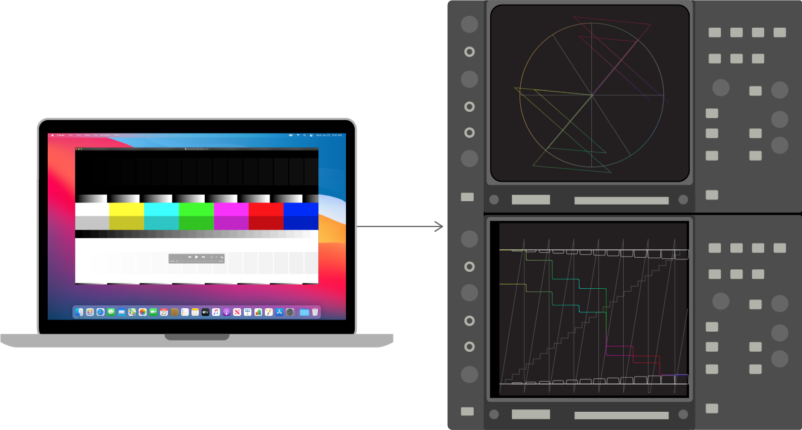

> Navigation: [Technologies](../technologies.md) · [AVFoundation](../avfoundation.md) · [Media reading and writing](media-reading-and-writing.md) · [Evaluating an app’s video color](evaluating-an-app-s-video-color.md)

# Evaluating an app’s video color using video test equipment

Article

Output test pattern files to a vectorscope or waveform analyzer to review the video signals.

## Overview

AVFoundation automatically applies color management to video during playback. Verify that the system properly color manages your video by using either of the following techniques:

- Output the test pattern files to a vectorscope or waveform analyzer to analyze the video signals.
- Verify the correct colorspace conversion matrices on a vectorscope, and verify the gamma, quantization errors, and range expansion or compression on a waveform monitor.

An illustration showing two test pattern analyses. At the top is an analysis using a vectorscope, and at the bottom is an analysis using a waveform analyzer.

### Analyze your video signal using a vectorscope

A vectorscope plots the two chroma components of a video signal and measures their color relationship. Vectorscopes often include printed boxes indicating standard colors. Ideally, a correctly reproduced color bar signal should “hit” the vectorscope boxes.

Output QuickTime test patterns to a vectorscope to analyze the video signals. View the test pattern on a vectorscope and verify the correct colorspace conversion matrices and the presence of a color match.

> [!important] Important
> Don’t evaluate the display outputs (Display Port or DVI) using standard vectorscope targets. The system adjusts gamma for displays, but not for video devices. Use standard vectorscope targets for video outputs (HDMI, Composite, or Component video output).

Typically, vectorscopes contain a set of six boxes (yellow, cyan, green, magenta, red, and blue) representing 75% color bars, and another set for 100% color bars. These boxes correspond to sections C and D of the test pattern file `QuickTime_Test_Pattern_HD.mov,` shown below:

A QuickTime test pattern HD movie file with color and grayscale patterns. The top of the movie contains dark levels, the middle has multi-colored bars and the bottom has white light levels.

Consider the color correct if the representation’s color vector “hits” inside the corresponding box during testing.

These boxes typically represent only HD or only SD color bars, not content converted from one standard to the other. For example, Rec. 709 (HD) 75% red is different from Rec. 601 (SD) 75% red, and a converted signal typically wouldn’t either hit HD or SD targets.

To learn how to use test pattern files to confirm the proper color management of your app’s video, see [Open test patterns and verify color characteristics](evaluating-video-using-quicktime-test-pattern-files.md#Open-test-patterns-and-verify-color-characteristics).

### Analyze your video signal using a waveform monitor

A waveform monitor displays the composite of the amplitude of all lines in a given frame of video over time. Among other things, this instrument helps ensure the use of all values with no truncated (crushed) range of blacks or whites.

Output your video to a waveform analyzer and view the test pattern on a waveform monitor. Verify the gamma, quantization errors, and range expansion or compression.

The following are elements of the QuickTime Test Pattern movie file to examine on a waveform monitor:

- Black boxes on a black background. A test signal on the waveform monitor visible as 16 steps beginning with true black (row A in the figure above).
- Gradient. A monotonically increasing gradient that includes super-whites and super-blacks. You should expect rendering processes that include full-range RGB to crush such a gradient (row B in figure above). The result on the waveform monitor should range from true-black to full-white. However, you may see clamping of the beginning and end of the repeating pattern to black or white for the extent of the range corresponding to super-white and super-black. The gradient should form a straight line on the waveform monitor’s display (otherwise it indicates a gamma conversion). Any uneven lines on the display indicate the effects of quantization.
- White boxes on a full-white background. On the waveform monitor, this portion of the test signal should be visible as 16 steps beginning from full-white (row F in the figure above).
- Quantized gradient. The waveform monitor plots the area under those targets for the gamma of the signal (row E in the figure above).

## See Also

### Video evaluation

- [Evaluating video using QuickTime test pattern files](evaluating-video-using-quicktime-test-pattern-files.md) — Check color reproduction of your app or workflow by using test pattern files.
- [Evaluating an app’s video color using light-measurement Instruments](evaluating-an-app-s-video-color-using-light-measurement-instruments.md) — Measure front-of-screen luminance by using test pattern files with a spectroradiometer or colorimeter.
