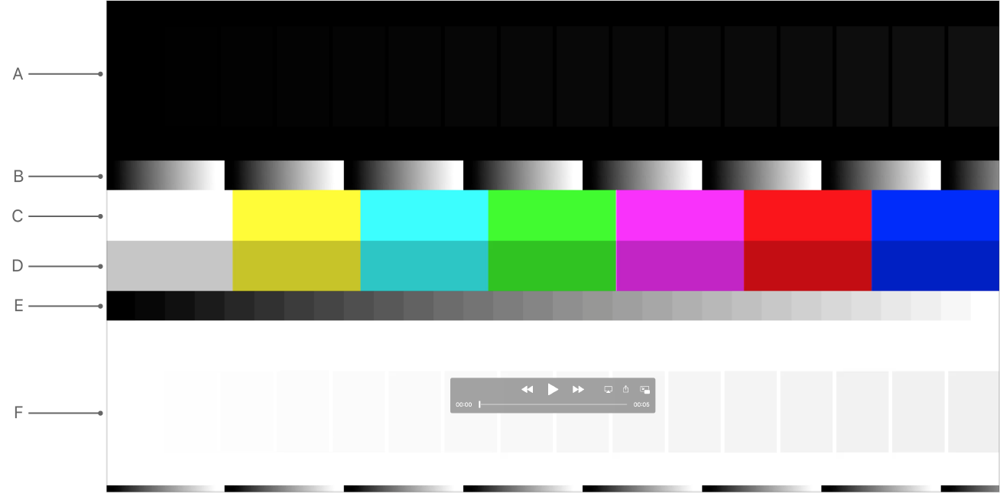
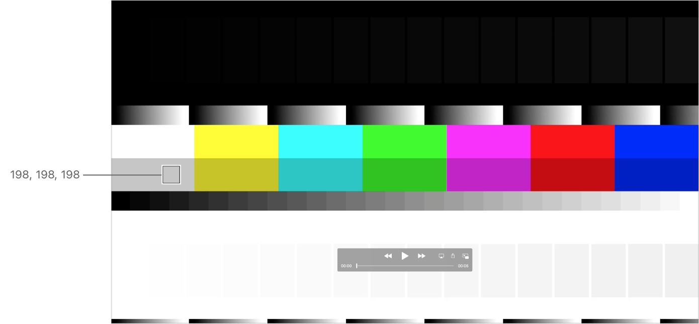
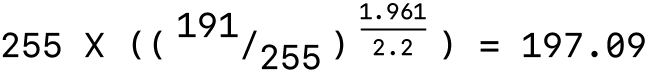

> Navigation: [Technologies](../technologies.md) · [AVFoundation](../avfoundation.md) · [Media reading and writing](media-reading-and-writing.md) · [Evaluating an app’s video color](evaluating-an-app-s-video-color.md)

# Evaluating video using QuickTime test pattern files

Article

Check color reproduction of your app or workflow by using test pattern files.

## Overview

QuickTime Test Pattern movie files produce known results when displayed on Mac computers. Use these files to evaluate the color characteristics of your AVFoundation-based app or workflow. The simplest way to check color management in your app is with the 75% gray bars in the test pattern file.

### Open test patterns and verify color characteristics

The video industry commonly evaluates color using known, standard test patterns. Comparing your video’s color to the known standard gives you an indication of how recording or transmission altered the video signal. Use this information to determine the modifications you must make to return the signal to the standard. Typically, in an analog video environment, you use Society of Motion Picture and Television Engineers (SMPTE) color bars or Engineering Guideline EG 1.1990.

> [!important] Important
> As with any content, you must tag the color bars themselves to ensure their correct interpretation. [Tagging media with video color information](tagging-media-with-video-color-information.md) discusses video tagging.

To begin evaluating video with the test pattern technique, download the QuickTime Test Pattern movie files from the [AVFoundation Developer page](https://developer.apple.com/av-foundation/) (see “Color Test Patterns”). These files produce known results on Mac computers.

Open the files using the QuickTime Player app (version 10.5 or later) or another app or workflow that supports the [QuickTime File Format](../quicktime-file-format.md). Use the test pattern files to evaluate the color characteristics of your AVFoundation-based app or workflow.

The figure below shows the example test pattern file `QuickTime_Test_Pattern_HD.mov`, which contains color and grayscale patterns. Use it to evaluate the characteristics shown here:

A QuickTime test pattern HD movie file with color and grayscale patterns. The top of the movie contains dark levels, the middle has multi-colored bars and the bottom has white light levels.

- 16 black levels on black or black crush test/range expansion (row A in the figure)
- Continuous gradient or quantization/super-black, super-white handling (row B)
- 100% color bars, or matrix, color match (row C)
- 75% color bars, or matrix, color match (row D)
- Quantized gradient or gamma (row E)
- 16 white levels on white or white crush test/range expansion (row F)

Open the test pattern in your app and visually inspect it for the above features. Read the display buffer pixel values using the Digital Color Meter app (see below).

### Interpret gray levels using the digital color meter app

The simplest way to check color management in your app is with the 75% gray bars shown in the example test pattern file `QuickTime_Test_Pattern_HD.mov`.

MacOS 10.6 and later process 75% gray bars with a 1.96 to 2.2 gamma conversion, resulting in a 198 value as shown here.

A QuickTime test pattern HD movie file with color and grayscale patterns. The top of the movie contains dark levels, the middle has multi-colored bars and the bottom has white light levels. There’s a callout that points to the 75% gray bars showing the gamma converted 198 values as reported by the digital color meter app.

AVFoundation uses a value of approximately 1.96 as the gamma of video (the gamma value without the boost required for classic dim surround viewing environments). To derive that number, you first measure the response of a CRT. Most CRTs report a gamma of between 2.4 and 2.5 (depending upon the brightness and contrast settings on the monitor). You choose a value halfway between the two (2.45) and remove the contrast enhancement (the 1.25 gamma boost provided for viewing in dimly lit environments). The result is a value very close to 1.96 (2.45/1.25 = 1.96).

MacOS 10.6 and later converts the video gamma to the 2.2 display buffer gamma when the app performs the color match to the display. You derive the 1.96 to 2.2 gamma conversion calculation for 75% gray bars as follows:

A mathematical equation of the gamma conversion calculation for 75% gray bars, resulting in a value of approximately 198.

With rounding error, you’ll see results in this range. This is the default behavior for an AVFoundation app during playback. If you get values of 191 or other values, it probably means the system didn’t apply color management. See [Ensure accurate color application of your app’s video](evaluating-an-app-s-video-color.md#Ensure-accurate-color-application-of-your-apps-video).

By default, the system performs color matches using perceptual rendering intent. However, with matrix-based profiles, the system color matching reports identical results for all rendering intents.

### Verify that the color match maintains gray levels

Given a correct display profile, a color match won’t change a gray value from appearing gray in a color-managed app. It may adjust the brightness based on the gamma correction, but it won’t add color to it (grays remain R=G=B). Therefore, the color match reports identical values for the RGB components of a given gray value from any of the color bars. If it doesn’t, you should investigate the issue (see [Ensure accurate color application of your app’s video](evaluating-an-app-s-video-color.md#Ensure-accurate-color-application-of-your-apps-video)).

### Interpret non-gray colors in the color bar

Pixel values that aren’t gray may change due to the color match. This color match ensures the color fidelity of the original video during playback. The system performs color matches using perceptual rendering intent. This means a 75% green may get any one of many color shifts during the color match, depending on the nature of the source profile and display profile. For example, a 75% green value (0, 191, 0) may change to (40, 200, 8) after the color match.

## See Also

### Video evaluation

- [Evaluating an app’s video color using video test equipment](evaluating-an-app-s-video-color-using-video-test-equipment.md) — Output test pattern files to a vectorscope or waveform analyzer to review the video signals.
- [Evaluating an app’s video color using light-measurement Instruments](evaluating-an-app-s-video-color-using-light-measurement-instruments.md) — Measure front-of-screen luminance by using test pattern files with a spectroradiometer or colorimeter.
