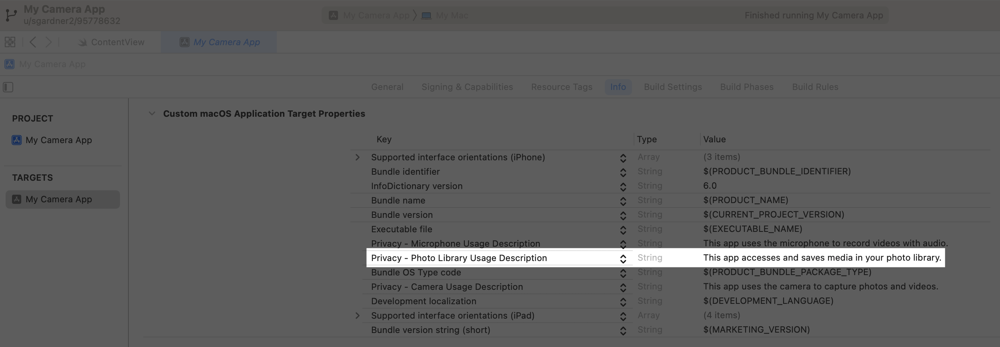
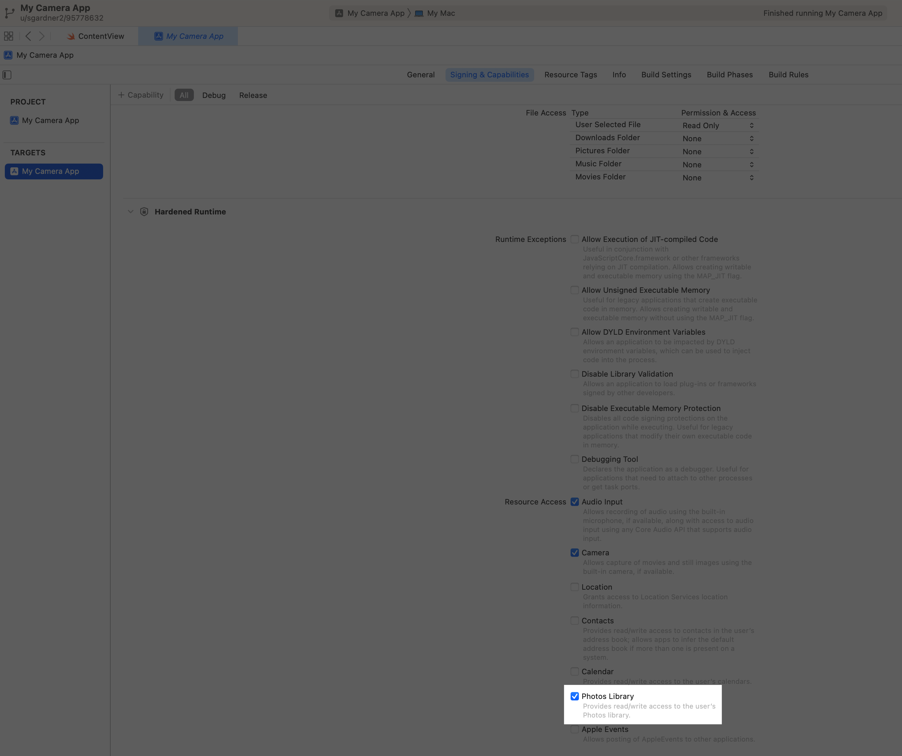

> Navigation: [Technologies](../technologies.md) · [AVFoundation](../avfoundation.md) · [Photo capture](photo-capture.md) · [Capturing still and Live Photos](capturing-still-and-live-photos.md)

# Saving captured photos

<sub>Article</sub>

Add an image and other data from a photo capture to the photo library.

## Overview

When you complete a photo capture with [AVCapturePhotoOutput](avcapturephotooutput.md), you receive an [AVCapturePhoto](avcapturephoto.md) object that contains the image data, camera metadata, and any auxiliary images you requested, such as thumbnails or depth maps. You can retrieve this data individually from the [AVCapturePhoto](avcapturephoto.md) object. Or you can call its [- fileDataRepresentation](<avcapturephoto/filedatarepresentation().md>) method to get a [Data](../foundation/data.md) object that’s ready to save using the codec and file format you requested for that photo in [AVCapturePhotoSettings](avcapturephotosettings.md).

After capturing a photo, use [PhotoKit](../photokit.md) to add that data to the user’s photo library.

> [!note] Note
> If your app only needs to access content in the photo library, you can use the [PhotoKit](../photokit.md) Photos picker instead, which doesn’t require you to request access from the user. To learn more, see [Selecting Photos and Videos in iOS](../photokit/selecting-photos-and-videos-in-ios.md).

### Configure properties and capabilities for your app targets

You can use [PhotoKit](../photokit.md) to enable read/write access to the user’s photo library. To do so, provide a static message for the [NSPhotoLibraryUsageDescription](../bundleresources/information-property-list/nsphotolibraryusagedescription.md) key in the `Info.plist` file to display to the user when your app requests access.



<sub>A screenshot showing the photo library usage description in the Info tab of the app target. The highlighted string for Privacy Photo Library Usage Description reads This app accesses and saves media in your photo library. </sub>

In macOS, you also need to enable the [Photos Library Entitlement](../bundleresources/entitlements/com.apple.security.personal-information.photos-library.md) in the Signing & Capabilities tab for your app targets.



> [!important] Important
> Your app needs to contain the appropriate key in its `Info.plist` file, and the appropriate entitlement enabled in macOS, before it requests authorization or attempts to use a device. Otherwise, the system terminates your app.

### Request permission to access the user’s photo library

Use the [PHPhotoLibrary](../photos/phphotolibrary.md) [requestAuthorization(for:handler:)](<../photos/phphotolibrary/requestauthorization(for_handler_).md>) to request access to the photo library at an appropriate time, such as when the user first opens your app’s camera feature. Here’s an example:

```swift
var isPhotoLibraryReadWriteAccessGranted: Bool {
    get async {
        let status = PHPhotoLibrary.authorizationStatus(for: .readWrite)
        
        // Determine if the user previously authorized read/write access.
        var isAuthorized = status == .authorized
        
        // If the system hasn't determined the user's authorization status,
        // explicitly prompt them for approval.
        if status == .notDetermined {
            isAuthorized = await PHPhotoLibrary.requestAuthorization(for: .readWrite) == .authorized
        }
        
        return isAuthorized
    }
}
```

> [!note] Note
> Don’t wait to request access to the photo library until after the user takes their first photo because the permission alert prevents their ability to take multiple photos.

### Use a creation request to add a photo asset

Perform these steps to receive a captured photo and save it to the photo library:

1. Adopt the [AVCapturePhotoCaptureDelegate](avcapturephotocapturedelegate.md) protocol and implement its [- captureOutput:didFinishProcessingPhoto:error:](<avcapturephotocapturedelegate/photooutput(__didfinishprocessingphoto_error_).md>) method to receive a callback for each photo delivered in a capture request.
2. Call [- fileDataRepresentation](<avcapturephoto/filedatarepresentation().md>) on the [AVCapturePhoto](avcapturephoto.md) object provided by the protocol method to receive a data object containing the photo image data and its attachments, such as camera metadata and auxilliary images.
3. Create a [PHAssetCreationRequest](../photos/phassetcreationrequest.md) to add the photo resource.

The following code provides an example of this workflow:

```swift
func photoOutput(_ output: AVCapturePhotoOutput, didFinishProcessingPhoto photo: AVCapturePhoto, error: Error?) {
    if let error {
        print("Error processing photo: \(error.localizedDescription)")
        return
    }
    
    Task {
        await save(photo: photo)
    }
}

func save(photo: AVCapturePhoto) async {
    // Confirm the user granted read/write access.
    guard await isPhotoLibraryReadWriteAccessGranted else { return }
    
    // Create a data representation of the photo and its attachments.
    if let photoData = photo.fileDataRepresentation() {
        PHPhotoLibrary.shared().performChanges {
            // Save the photo data.
            let creationRequest = PHAssetCreationRequest.forAsset()
            creationRequest.addResource(with: .photo, data: photoData, options: nil)
        } completionHandler: { success, error in
            if let error {
                print("Error saving photo: \(error.localizedDescription)")
                return
            }
        }
    }
}
```

## See Also

### Next steps

- [Tracking photo capture progress](tracking-photo-capture-progress.md) — Monitor key events during capture to provide feedback in your camera UI.
- [Capturing and saving Live Photos](capturing-and-saving-live-photos.md) — Capture Live Photos like those created in the system Camera app and save them to the Photos library.
