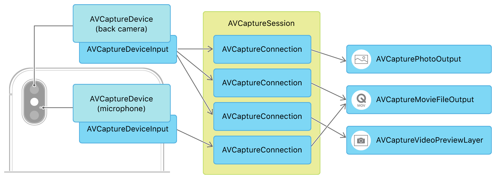

> Navigation: [Technologies](../technologies.md) · [AVFoundation](../avfoundation.md) · [Capture setup](capture-setup.md)

# Setting up a capture session

<sub>Article</sub>

Configure input devices, output media, preview views, and basic settings before capturing photos or video.

## Overview

An [AVCaptureSession](avcapturesession.md) is the basis for all media capture in iOS and macOS. It manages your app’s exclusive access to the OS capture infrastructure and capture devices, as well as the flow of data from input devices to media outputs. How you configure connections between inputs and outputs defines the capabilities of your capture session. For example, the diagram below shows a capture session that can capture both photos and movies and provides a camera preview, using the iPhone back camera and microphone.



<sub>Block diagram of detailed capture session architecture example: separate AVCaptureDeviceInput objects for camera and microphone connect, through AVCaptureConnection objects managed by AVCaptureSession, to AVCapturePhotoOutput, AVCaptureMovieFileOutput, and AVCaptureVideoPreviewLayer.</sub>

### Connect inputs and outputs to the session

All capture sessions need at least one capture input and capture output. Capture inputs ([AVCaptureInput](avcaptureinput.md) subclasses) are media sources—typically recording devices like the cameras and microphone built into an iOS device or Mac. Capture outputs ([AVCaptureOutput](avcaptureoutput.md) subclasses) use data provided by capture inputs to produce media, like image and movie files.

To use a camera for video input (to capture photos or movies), select an appropriate [AVCaptureDevice](avcapturedevice.md), create a corresponding [AVCaptureDeviceInput](avcapturedeviceinput.md), and add it to the session:

```swift
captureSession.beginConfiguration()
let videoDevice = AVCaptureDevice.default(.builtInWideAngleCamera,
                                          for: .video, position: .unspecified)
guard
    let videoDeviceInput = try? AVCaptureDeviceInput(device: videoDevice!),
    captureSession.canAddInput(videoDeviceInput)
    else { return }
captureSession.addInput(videoDeviceInput)
```

> [!note] Note
> iOS offers several other ways to select a camera device. For more information, see [Choosing a capture device](choosing-a-capture-device.md).

Next, add outputs for the kinds of media you plan to capture from the camera you’ve selected. For example, to enable capturing photos, add an [AVCapturePhotoOutput](avcapturephotooutput.md) to the session:

```swift
let photoOutput = AVCapturePhotoOutput()
guard captureSession.canAddOutput(photoOutput) else { return }
captureSession.sessionPreset = .photo
captureSession.addOutput(photoOutput)
captureSession.commitConfiguration()
```

A session can have multiple inputs and outputs. For example:

- To record both video and audio in a movie, add inputs for both camera and microphone devices.
- To capture both photos and movies from the same camera, add both [AVCapturePhotoOutput](avcapturephotooutput.md) and [AVCaptureMovieFileOutput](avcapturemoviefileoutput.md) to your session.

> [!important] Important
> Call [- beginConfiguration](<avcapturesession/beginconfiguration().md>) before changing a session’s inputs or outputs, and call [- commitConfiguration](<avcapturesession/commitconfiguration().md>) after making changes.

### Display a camera preview

It’s important to let the user see input from the camera before choosing to snap a photo or start video recording, as in the viewfinder of a traditional camera. You can provide such a preview by connecting an [AVCaptureVideoPreviewLayer](avcapturevideopreviewlayer.md) to your capture session, which displays a live video feed from the camera whenever the session is running.

[AVCaptureVideoPreviewLayer](avcapturevideopreviewlayer.md) is a Core Animation layer, so you can display and style it in your interface as you would any other [CALayer](../quartzcore/calayer.md) subclass. The simplest way to add a preview layer to a UIKit app is to define a [UIView](../uikit/uiview.md) subclass whose [layerClass](../uikit/uiview/layerclass.md) is [AVCaptureVideoPreviewLayer](avcapturevideopreviewlayer.md), as shown below.

```swift
class PreviewView: UIView {
    override class var layerClass: AnyClass {
        return AVCaptureVideoPreviewLayer.self
    }
    
    /// Convenience wrapper to get layer as its statically known type.
    var videoPreviewLayer: AVCaptureVideoPreviewLayer {
        return layer as! AVCaptureVideoPreviewLayer
    }
}
```

Then, to use the preview layer with a capture session, set the layer’s [session](avcapturevideopreviewlayer/session.md) property:

```swift
self.previewView.videoPreviewLayer.session = self.captureSession
```

> [!note] Note
> If your app supports multiple interface orientations, use the preview layer’s [connection](avcapturevideopreviewlayer/connection.md) to the capture session to set a [videoOrientation](avcaptureconnection/videoorientation.md) matching that of your UI.

### Run the capture session

After you’ve configured inputs, outputs, and previews, call [- startRunning](<avcapturesession/startrunning().md>) to let data flow from inputs to outputs.

With some capture outputs, running the session is all you need to begin media capture. For example, if your session contains an [AVCaptureVideoDataOutput](avcapturevideodataoutput.md), you start receiving delivering video frames as soon as the session is running.

With other capture outputs, you first start the session running, then use the capture output class itself to initiate capture. In a photography app, for example, running the session enables a viewfinder-style preview, but you use the [AVCapturePhotoOutput](avcapturephotooutput.md) [- capturePhotoWithSettings:delegate:](<avcapturephotooutput/capturephoto(with_delegate_).md>) method to snap a picture.

## See Also

### Capture sessions

- [Accessing the camera while multitasking on iPad](../avkit/accessing-the-camera-while-multitasking-on-ipad.md) — Operate the camera in Split View, Slide Over, Picture in Picture, and Stage Manager modes.
- [AVCam: Building a camera app](avcam-building-a-camera-app.md) — Capture photos and record video using the front and rear iPhone and iPad cameras.
- [Build a responsive camera app that launches quickly](build-a-responsive-camera-app-that-launches-quickly.md) — Build a fast camera launch experience for your iOS and iPadOS apps.
- [Capturing Cinematic video](capturing-cinematic-video.md) — Capture video with an adjustable depth of field and focus points.
- [Supporting Center Stage front camera in your iOS app](supporting-center-stage-front-camera-in-your-ios-app.md) — Enable Center Stage for photos and videos on the iPhone front camera.
- [AVMultiCamPiP: Capturing from Multiple Cameras](avmulticampip-capturing-from-multiple-cameras.md) — Simultaneously record the output from the front and back cameras into a single movie file by using a multi-camera capture session.
- [AVCamBarcode: detecting barcodes and faces](avcambarcode-detecting-barcodes-and-faces.md) — Identify machine readable codes or faces by using the camera.
- [AVCaptureSession](avcapturesession.md) — An object that configures capture behavior and coordinates the flow of data from input devices to capture outputs.
- [AVCaptureMultiCamSession](avcapturemulticamsession.md) — A capture session that supports simultaneous capture from multiple inputs of the same media type.
- [AVCaptureInput](avcaptureinput.md) — An abstract superclass for objects that provide input data to a capture session.
- [AVCaptureOutput](avcaptureoutput.md) — An abstract superclass for objects that provide media output destinations for a capture session.
- [AVCaptureConnection](avcaptureconnection.md) — An object that represents a connection from a capture input to a capture output.
