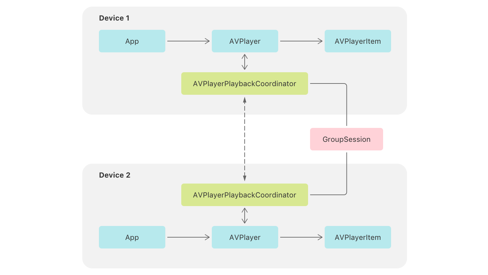

> Navigation: [Technologies](../technologies.md) · [AVFoundation](../avfoundation.md) · [Media playback](media-playback.md)

# Supporting coordinated media playback

<sub>Sample Code</sub>

Create synchronized media experiences that enable users to watch and listen across devices.

## Overview

Watching TV and movies, and listening to music, can be more fun when you do it with friends and family. However, getting together in person isn’t always an option. Beginning with iOS 15, tvOS 15, and macOS 12, you have the ability to create media apps that let people watch and listen together wherever they are. This capability is possible using AVFoundation and the new GroupActivities frameworks.

AVFoundation introduces a new class, [AVPlayerPlaybackCoordinator](avplayerplaybackcoordinator.md), that synchronizes the timing of [AVPlayer](avplayer.md) objects across devices. Apps use the GroupActivities framework to connect playback coordinators using a [GroupSession](../groupactivities/groupsession.md) object.



<sub>A diagram that represents two devices with a connection through a GroupSession object. Device 1 and Device 2 each contain representations of the app, AVPlayer, AVPlayerItem, and AVPlayerPlaybackCoordinator relationships. The two AVPlayerPlaybackCoordinator items have a two-way dotted-line connection between the two devices.</sub>

This sample app shows you how to add coordinated media playback support to your app. It provides a simple movie-playing app, where a user selects a movie from the library and plays it in a standard player user interface.

### Configure the sample code project

- You must build the sample with Xcode 13 and Swift 5.5.
- You must run the sample on a physical device with iOS 15 or later.

To experience coordinated playback, you need to install the app on two or more devices with unique Apple IDs. Start a FaceTime call between the devices, and select an item from the library on one of them. The system prompts you to play the movie locally or with the group. Select to play it with the group, and starting playback on one device starts it on the other. The system automatically propagates rate and time changes to all playback coordinators to keep group playback in sync.

### Create an activity

The sample app plays movies, which it represents with a `Movie` structure that defines essential data about an item in its library.

```swift
struct Movie: Hashable, Codable {
    var url: URL
    var title: String
    var description: String
}
```

To make movie watching a group experience, the sample creates a structure called `MovieWatchingActivity` that adopts the [GroupActivity](../groupactivities/groupactivity.md) protocol. This protocol defines a shareable experience in the app. The activity stores the movie to share with the group, and provides supporting metadata that the system displays when a user shares an activity.

```swift
// A group activity to watch a movie together.
struct MovieWatchingActivity: GroupActivity {
    
    // The movie to watch.
    let movie: Movie
    
    // Metadata that the system displays to participants.
    var metadata: GroupActivityMetadata {
        var metadata = GroupActivityMetadata()
        metadata.type = .watchTogether
        metadata.fallbackURL = movie.url
        metadata.title = movie.title
        return metadata
    }
}
```

> [!note] Note
> `GroupActivity` extends [Codable](../swift/codable.md), so any data that an activity stores must also conform to `Codable`.

### Share an activity

When a user selects a movie, the sample determines whether it needs to play the movie for the current user only, or share it with the group. It makes this determination by calling the activity’s asynchronous [prepareForActivation()](<../groupactivities/groupactivity/prepareforactivation().md>) method, which enables the system to present an interface for the user to select their preferred action.

```swift
// Create a new activity for the selected movie.
let activity = MovieWatchingActivity(movie: selectedMovie)

// Await the result of the preparation call.
switch await activity.prepareForActivation() {
    
case .activationDisabled:
    // Playback coordination isn't active, or the user prefers to play the
    // movie apart from the group. Enqueue the movie for local playback only.
    self.enqueuedMovie = selectedMovie
    
case .activationPreferred:
    // The user prefers to share this activity with the group.
    // The app enqueues the movie for playback when the activity starts.
    do {
        _ = try await activity.activate()
    } catch {
        print("Unable to activate the activity: \(error)")
    }
    
case .cancelled:
    // The user cancels the operation. Do nothing.
    break
    
default: ()
}
```

The call returns a result that indicates the appropriate action to take. A result of [GroupActivityActivationResult.activationDisabled](../groupactivities/groupactivityactivationresult/activationdisabled.md) indicates that group playback isn’t active, or the user selects to play the movie locally only. In this case, the app sets the movie as the `enqueuedMovie`, which enqueues it for local playback. A result of [GroupActivityActivationResult.activationPreferred](../groupactivities/groupactivityactivationresult/activationpreferred.md) indicates that group playback is possible, and the user wants to start a group activity. When this occurs, the sample calls the activity’s [activate()](<../groupactivities/groupactivity/activate().md>) method, which starts a group session and shares the activity with the group. The sample doesn’t immediately enqueue the movie for playback, but instead waits until the group session notifies all participants of the new activity.

### Await group sessions

When the sample activates a `MovieWatchingActivity`, the system creates a group session. It accesses the session by calling the [sessions()](<../groupactivities/groupactivity/sessions().md>) method, which returns sessions for the activity as an asynchronous sequence.

```swift
// Await new sessions to watch movies together.
for await groupSession in MovieWatchingActivity.sessions() {
    // Set the app's active group session.
    self.groupSession = groupSession
    
    // Remove previous subscriptions.
    subscriptions.removeAll()
    
    // Observe changes to the session state.
    groupSession.$state.sink { [weak self] state in
        if case .invalidated = state {
            // Set the groupSession to nil to publish
            // the invalidated session state.
            self?.groupSession = nil
            self?.subscriptions.removeAll()
        }
    }.store(in: &subscriptions)
    
    // Join the session to participate in playback coordination.
    groupSession.join()
    
    // Observe when the local user or a remote participant starts an activity.
    groupSession.$activity.sink { [weak self] activity in
        // Set the movie to enqueue it in the player.
        self?.enqueuedMovie = activity.movie
    }.store(in: &subscriptions)
}
```

When the sample receives a new session, it sets it as the active group session, and then joins it, which makes the app eligible to participate in the session. Then it subscribes to the session’s activity publisher and, when it receives a new value, it enqueues the activity’s movie for playback.

### Prepare for coordinated playback

The last step the sample takes to enable group playback is to access the player’s coordinator and connect it with the group session. It does this by calling the coordinator object’s [coordinateWithSession(_:)](<avplaybackcoordinator/coordinatewithsession(__).md>) method, which connects it with the coordinators of other participants in the session.

```swift
// The group session to coordinate playback with.
private var groupSession: GroupSession<MovieWatchingActivity>? {
    didSet {
        guard let session = groupSession else {
            // Stop playback if a session terminates.
            player.rate = 0
            return
        }
        // Coordinate playback with the active session.
        player.playbackCoordinator.coordinateWithSession(session)
    }
}
```

After the sample makes this connection, the system coordinates rate and time changes across participant players. The app continues to enqueue movies in a typical way, and controls playback using the player’s standard transport methods like [- play](<avplayer/play().md>), [- pause](<avplayer/pause().md>), and [- seekToTime:](<avplayer/seek(to_)-87h2r.md>). The coordinator intercepts these changes and communicates them to other coordinators as appropriate. Likewise, it also responds to rate and time changes from other participants and sets them on its local player.

### Suspend participation in coordinated playback

In most cases, the sample keeps playback in sync with the group. However, there are times when it needs to prevent local interruptions from impacting other participants. In these situations, it disconnects from the group temporarily by issuing a playback suspension. An [AVPlayerPlaybackCoordinator](avplayerplaybackcoordinator.md) automatically issues playback suspensions for common system events like network stalls and audio session interruptions. Apps can also define custom suspensions.

The sample provides a feature that lets a viewer quickly catch up with content they miss. This action doesn’t impact the group, so the app begins a custom playback suspension. It creates an extension on [Reason](avcoordinatedplaybacksuspension/reason-swift.struct.md) that defines a new `whatHappened` suspension reason.

```swift
extension AVCoordinatedPlaybackSuspension.Reason {
    static var whatHappened = AVCoordinatedPlaybackSuspension.Reason(rawValue: "com.example.groupwatching.suspension.what-happened")
}
```

When a user taps the feature’s button in the user interface, the sample calls its `performWhatHappened()`  method. In this method, it starts the custom suspension, rewinds by 10 seconds, and then plays at double speed until playback catches up with the group.

```swift
func performWhatHappened() {
    
    // Rewind 10 seconds.
    let rewindDuration = CMTime(value: 10, timescale: 1)
    let rewindTime = player.currentTime() - rewindDuration
    
    // Start a custom suspension.
    let suspension = player.playbackCoordinator.beginSuspension(for: .whatHappened)
    player.seek(to: rewindTime)
    player.rate = 2.0
    
    DispatchQueue.main.asyncAfter(deadline: .now() + rewindDuration.seconds) {
        // End the suspension and resume playback with the group.
        suspension.end()
    }
}
```

After the local device catches up with group playback, the sample ends the suspension. Although it sets the player’s rate to `2.0` after beginning the suspension, it doesn’t have to explicitly set it back to the original rate when it ends because the coordinator sets it automatically when the player rejoins group playback.

## See Also

### SharePlay

- [Destination Video](../visionos/destination-video.md) — Leverage SwiftUI to build an immersive media experience in a multiplatform app.
- [AVPlaybackCoordinator](avplaybackcoordinator.md) — An object that coordinates the playback of players in a connected group.
- [AVPlayerPlaybackCoordinator](avplayerplaybackcoordinator.md) — A playback coordinator subclass that coordinates the playback of player objects in a connected group.
- [AVDelegatingPlaybackCoordinator](avdelegatingplaybackcoordinator.md) — A playback coordinator subclass that coordinates the playback of custom player objects in a connected group.
- [AVPlaybackCoordinationMedium](avplaybackcoordinationmedium.md) — The AVPlaybackCoordinationMedium passes states and messages between its connected playback coordinators.

## Download

- [SupportingCoordinatedMediaPlayback.zip](https://docs-assets.developer.apple.com/published/367117687a0a/SupportingCoordinatedMediaPlayback.zip)
