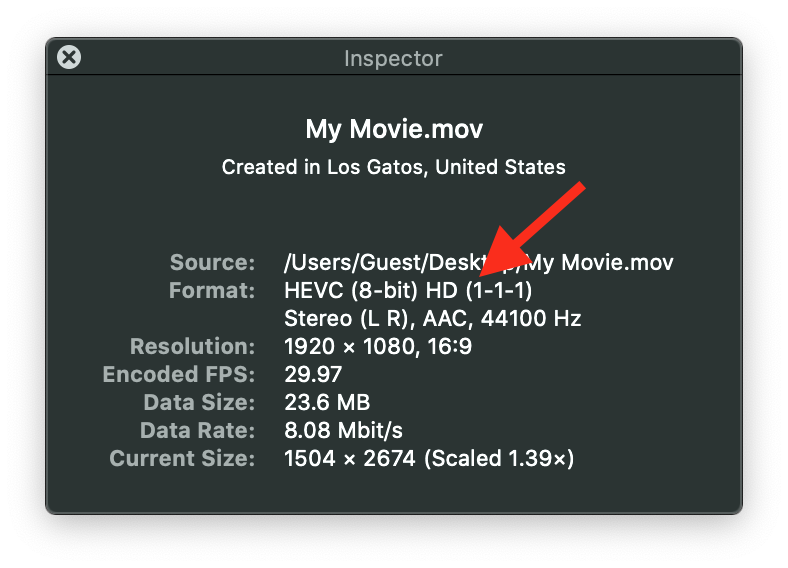
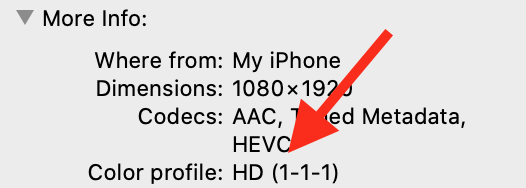

> Navigation: [Technologies](../technologies.md) · [AVFoundation](../avfoundation.md) · [Media reading and writing](media-reading-and-writing.md)

# Tagging media with video color information

<sub>Article</sub>

Inspect and set video color space information when writing and transcoding media.

## Overview

Media files may contain video color space information tags that describe the video media. The system’s color management uses these video color tags to ensure a consistent color appearance across all environments. You can retrieve and inspect the color information tags from your media, and specify new tags when writing and transcoding media. You can also detect wide color media to prevent clamping of the media to a smaller gamut color space.

### Video tags describe key video parameters

For historical reasons, color scientists defined many permutations of broadcast video color spaces. As a result, you should _tag_ your media files with color information that describes the video media. If you don’t, the untagged media content might not match your intentions across all the different configurations and environments your customers encounter.

> [!note] Note
> The term _tagging_ refers to optional color space information parameters in the media that describe the content. The tags describe video colorimetry in a simplified way.

This color information tagging mechanism supports three key video parameters:

- **Color Primaries** — An index into a table specifying the CIE 1931 xy chromaticity coordinates of the white point and the red, green, and blue primaries. The table of primaries specifies the white point and the red, green, and blue primary color points for a video system.
- **Transfer Function** — Defines an index into a table specifying the nonlinear transfer function coefficients that translate between RGB color space values and Y´CbCr values. The table of transfer function coefficients specifies the nonlinear function coefficients that translate between the stored Y´CbCr values and a video capture or display system.
- **Conversion Matrix** — An index into a table specifying the transformation matrix coefficients that translate between RGB color space values and Y´CbCr values. The table of matrixes specifies the matrix for the translation.

> [!note] Note
> Each represents indices, not actual values. The [QuickTime File Format](../quicktime-file-format.md) and [Uncompressed Y´CbCr Video in QuickTime Files](https://developer.apple.com/library/archive/technotes/tn2162/_index.html#//apple_ref/doc/uid/DTS40013070-CH1-TNTAG10) describe these indices in the `‘colr’` extension of type `‘nclc’`.

ColorSync uses these video parameters to generate one of the following video color spaces:

- SD (SMPTE-C)
- HD (Rec. 709)
- P3 (D65)
- UHD (Rec. 2020)

[ISO/IEC 23001-8:2016](https://www.iso.org/standard/69661.html), _Coding-Independent Code Points_ defines these standard tag numbers.

### Tag your video using asset writer

When you initialize an [AVAssetWriterInput](avassetwriterinput.md) object, you can optionally specify a dictionary that contains the settings for encoding the media that you append to the output. The [AVVideoColorPropertiesKey](avvideocolorpropertieskey.md) is a dictionary that contains properties specifying video color (see [Setting color properties for a specific resolution](setting-color-properties-for-a-specific-resolution.md) for the details). Set this key in the `AVAssetWriterInput` output settings dictionary to override the tagging of color properties in the video.

If the video color properties key is present in the output settings, the writer tags the output as follows:

- If the source buffers don’t have color property tags, the asset writer tags the output according to the video color properties.
- If the source buffers also have color property tags, the writer (if necessary) color-converts the source buffers to match the video color properties. The writer also tags the output according to the video color properties.

If you don’t intend to override the color property tags in your video, don’t set a value for the video color properties key. If the video color properties key isn’t present in the output settings, the framework tags the output as follows:

- If the source buffers have color property tags, the writer tags the output according to the source buffer color properties.
- If the source buffers don’t have color property tags, the writer doesn’t tag the output with any color properties.

The following example code specifies the Rec. 709 output color space for the video color properties key in the output settings:

```swift
// Use the asset writer object you create.
let writer = AVAssetWriter(contentType: .movie)
        
let colorPropertySettings = [
    AVVideoColorPrimariesKey: AVVideoColorPrimaries_ITU_R_709_2,
    AVVideoYCbCrMatrixKey: AVVideoTransferFunction_ITU_R_709_2,
    AVVideoTransferFunctionKey: AVVideoYCbCrMatrix_ITU_R_709_2
]
        
let compressionSettings: [String: Any] = [
    AVVideoCodecKey: AVVideoCodecType.h264,
    AVVideoWidthKey: 1920,
    AVVideoHeightKey: 1080,
    AVVideoColorPropertiesKey: colorPropertySettings
]

let input = AVAssetWriterInput(mediaType: .video,
                               outputSettings: compressionSettings)
writer.add(input)
```

### Specify color space information for your video composition

You configure video compositions with color space information using analogous properties.

You designate a working color space for the entire video composition using the [colorPrimaries](avmutablevideocomposition/colorprimaries.md) property. Set the transfer function using the [colorTransferFunction](avmutablevideocomposition/colortransferfunction.md) key, and the Y’CbCr matrix using the [colorYCbCrMatrix](avmutablevideocomposition/colorycbcrmatrix.md) key. Specify values suitable for the `AVVideoColorPrimariesKey`, [AVVideoTransferFunctionKey](avvideotransferfunctionkey.md), and [AVVideoYCbCrMatrixKey](avvideoycbcrmatrixkey.md) keys, respectively.

Here’s a code example:

```swift
let videoComposition = AVMutableVideoComposition()
videoComposition.colorPrimaries = AVVideoColorPrimaries_P3_D65
videoComposition.colorTransferFunction = AVVideoTransferFunction_ITU_R_709_2
videoComposition.colorYCbCrMatrix = AVVideoYCbCrMatrix_ITU_R_709_2
```

> [!note] Note
> The default value for the above properties is `nil`. When the value of a property is `nil`, the system adopts and propogates the source’s value.

### Tag your core video buffers with color space information

If you generate Core Video source buffers for rendering (for example, using a pixel buffer pool in Metal), you should tag them with color information.

You explicitly set the color space tags in the dictionary of attachments of the buffer as shown in the example below:

```swift
CVBufferSetAttachment(pixelBuffer, kCVImageBufferColorPrimariesKey, kCVImageBufferColorPrimaries_P3_D65, .shouldPropagate)
CVBufferSetAttachment(pixelBuffer, kCVImageBufferTransferFunctionKey, kCVImageBufferTransferFunction_ITU_R_709_2, .shouldPropagate)
CVBufferSetAttachment(pixelBuffer, kCVImageBufferYCbCrMatrixKey, kCVImageBufferYCbCrMatrix_ITU_R_709_2, .shouldPropagate)
inputPixelBufferAdaptor.append(pixelBuffer, withPresentationTime: presentationTime)
```

### Get your media’s color space information

You access the low-level details about an asset’s video track media using [CMFormatDescription](../coremedia/cmformatdescription.md). A `CMFormatDescriptionRef` object describes the media of a particular type (audio, video, and so on). You get the format descriptions for the asset track’s media sample references using the [AVAssetTrack](avassettrack.md) [formatDescriptions](avassettrack/formatdescriptions.md) property. Look in the format description for the [kCVImageBufferColorPrimariesKey](../corevideo/kcvimagebuffercolorprimarieskey.md) extension key that defines the color properties of the media. The `CMFormatDescription.h` header defines the color primary key values.

Here’s an example that checks for the [kCMFormatDescriptionColorPrimaries_ITU_R_709_2](../coremedia/kcmformatdescriptioncolorprimaries_itu_r_709_2-swift.var.md) color primary key value in the [kCVImageBufferColorPrimariesKey](../corevideo/kcvimagebuffercolorprimarieskey.md) extension:

```swift
let assetTracks = try await asset.loadTracks(withMediaType: .video)
        
for assetTrack in assetTracks {
    let formatDescriptions = try await assetTrack.load(.formatDescriptions)
    for formatDescription in formatDescriptions {
        guard let colorPrimaries = CMFormatDescriptionGetExtension(formatDescription, extensionKey: kCMFormatDescriptionExtension_ColorPrimaries) else {
            return
        }

        if CFGetTypeID(colorPrimaries) == CFStringGetTypeID() {
            let result = CFStringCompareWithOptions((colorPrimaries as! CFString),
                                                    kCMFormatDescriptionColorPrimaries_ITU_R_709_2,
                                                    CFRangeMake(0, CFStringGetLength((colorPrimaries as! CFString))),
                                                    CFStringCompareFlags.compareCaseInsensitive)

            if result == CFComparisonResult.compareEqualTo {
                // The color space is Rec. 709.
            }
        }
    }
}
```

### View your media’s color information

You can use the Show Movie Inspector command in the macOS QuickTime Player app to view the color space information for the video media in a file. Open the file in the app and choose Window \> Show Movie Inspector. The Inspector window displays the color information and other details about the video media.



<sub>Screenshot of the Inspector window in the QuickTime Player app with an arrow pointing to the Format information for a video.</sub>

The Finder Get Info command also shows the color information for the video media in a file. Select a file in the Finder and choose File \> Get Info. The More Info section contains the color profile information.



### Detect wide color tags in your media

The [AVMediaCharacteristicUsesWideGamutColorSpace](avmediacharacteristic/useswidegamutcolorspace.md) media characteristic indicates that the video track contains color primaries wider than Rec. 709 that the system can’t accurately represent. A wide color space, such as P3 D65, contains additional dynamic range that may benefit from special treatment when compositing in your workflow. You should exercise care to avoid clamping the colors back to the Rec. 709 space. If you don’t, it’s generally best to stay within the Rec. 709 space for your processing.

Here’s an example:

```swift
let asset = <# Your AVAsset #>
let wideGamutTracks = asset.tracks(withMediaCharacteristic: .usesWideGamutColorSpace)
if wideGamutTracks.count > 0 {
    // Use wide color aware processing.
} else {
    // Use Rec 709 processing.
}
```

### Preserve wide color in your media

Set the [AVAssetReaderOutput](avassetreaderoutput.md) [AVVideoAllowWideColorKey](avvideoallowwidecolorkey.md) property to `true` to receive buffers in their original color space. The default value (`false`) permits implicit color conversions to a nonwide gamut color space.

```swift
let allowWideColorSettings = [AVVideoAllowWideColorKey: true]
let readerOutput = AVAssetReaderOutput(outputSettings: allowWideColorSettings) 
```

### Support wide color in custom video compositors

You implement the optional [supportsWideColorSourceFrames](avvideocompositing/supportswidecolorsourceframes.md) property and return `true` to indicate your custom video compositor handles frames that contain wide color properties. In this case, the compositor examines and honors color space tags on every single source frame buffer.

```swift
class MyCustomVideoCompositor : AVVideoCompositing { 
   // ...
   var supportsWideColorSourceFrames: Boolean  { return true }
}
```

## See Also

### Media writing

- [Converting projected video to Apple Projected Media Profile](converting-projected-video-to-apple-projected-media-profile.md) — Convert content with equirectangular or half-equirectangular projection to APMP.
- [Converting side-by-side 3D video to multiview HEVC and spatial video](converting-side-by-side-3d-video-to-multiview-hevc-and-spatial-video.md) — Create video content for visionOS by converting an existing 3D HEVC file to a multiview HEVC format, optionally adding spatial metadata to create a spatial video.
- [Adding a display mask rectangle metadata track to a movie file](adding-a-display-mask-rectangle-metadata-track-to-a-movie-file.md) — Show a specific area of a video by using timed display mask rectangle metadata.
- [Writing fragmented MPEG-4 files for HTTP Live Streaming](writing-fragmented-mpeg-4-files-for-http-live-streaming.md) — Create an HTTP Live Streaming presentation by turning a movie file into a sequence of fragmented MPEG-4 files.
- [Creating spatial photos and videos with spatial metadata](../imageio/creating-spatial-photos-and-videos-with-spatial-metadata.md) — Add spatial metadata to stereo photos and videos to create spatial media for viewing on Apple Vision Pro.
- [Evaluating an app’s video color](evaluating-an-app-s-video-color.md) — Check color reproduction for a video in your app by using test patterns, video test equipment, and light-measurement instruments.
- [AVOutputSettingsAssistant](avoutputsettingsassistant.md) — An object that builds audio and video output settings dictionaries.
- [AVAssetWriter](avassetwriter.md) — An object that writes media data to a container file.
- [AVAssetWriterInput](avassetwriterinput.md) — An object that appends media samples to a track in an asset writer’s output file.
- [AVAssetWriterInputPixelBufferAdaptor](avassetwriterinputpixelbufferadaptor.md) — An object that appends video samples to an asset writer input. _(deprecated)_
- [AVAssetWriterInputTaggedPixelBufferGroupAdaptor](avassetwriterinputtaggedpixelbuffergroupadaptor.md) — An object that appends tagged buffer groups to an asset writer input. _(deprecated)_
- [AVAssetWriterInputMetadataAdaptor](avassetwriterinputmetadataadaptor.md) — An object that appends timed metadata groups to an asset writer input. _(deprecated)_
- [AVAssetWriterInputGroup](avassetwriterinputgroup.md) — A group of inputs with tracks that are mutually exclusive to each other for playback or processing.
