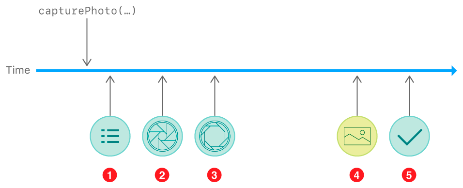

> Navigation: [Technologies](../technologies.md) · [AVFoundation](../avfoundation.md) · [Photo capture](photo-capture.md) · [Capturing still and Live Photos](capturing-still-and-live-photos.md)

# Tracking photo capture progress

<sub>Article</sub>

Monitor key events during capture to provide feedback in your camera UI.

## Overview

Capturing a photo with an iOS device camera is a complex process involving physical camera mechanisms, image signal processing, the operating system, and your app. While it’s possible for your app to ignore many stages of this process and simply wait for a final result, you can create a more responsive camera interface by monitoring each step.

After you call [- capturePhotoWithSettings:delegate:](<avcapturephotooutput/capturephoto(with_delegate_).md>), your delegate object can follow along with five major steps in the process (or more, depending on your photo settings). Depending on your capture workflow and the capture UI you want to create, your delegate can handle some or all of these steps:



1. Settings resolved
2. Exposure started
3. Exposure complete
4. Result data delivery
5. Capture complete

The capture system provides an [AVCaptureResolvedPhotoSettings](avcaptureresolvedphotosettings.md) object at each step in this process. Because multiple captures can be in progress at the same time, each resolved photo settings object has a [uniqueID](avcaptureresolvedphotosettings/uniqueid.md) whose value matches the [uniqueID](avcapturephotosettings/uniqueid.md) of the [AVCapturePhotoSettings](avcapturephotosettings.md) you used to take the photo.

### Get resolved capture settings

When you specify the settings for a photo, some of the settings you choose can be automatic, left for the capture system to decide at precisely the moment of capture. For example, you can choose [AVCaptureFlashModeAuto](avcapturedevice/flashmode-swift.enum/auto.md) flash mode, allowing the camera itself to determine based on scene lighting whether to fire the flash when exposing the photo.

Just before starting the exposure, the photo output calls your delegate’s [- captureOutput:willBeginCaptureForResolvedSettings:](<avcapturephotocapturedelegate/photooutput(__willbegincapturefor_).md>) method, whose `resolvedSettings` parameter tells you the actual settings for that capture. For example, if you chose [AVCaptureFlashModeAuto](avcapturedevice/flashmode-swift.enum/auto.md) flash mode, the resolved settings object tells you whether the flash is in use for the current capture—you could use this information to show in your UI that the flash was used.

### Handle exposure start

When the exposure time begins, the photo output calls your delegate’s [- captureOutput:willCapturePhotoForResolvedSettings:](<avcapturephotocapturedelegate/photooutput(__willcapturephotofor_).md>) method. In traditional photography, this moment is equivalent to the opening of the camera shutter. The system also automatically plays a shutter sound at this time.

In your UI, you can respond to this method to display a shutter animation or some other indicator that the requested photo is being taken.

### Handle exposure end

The photo output calls your delegate’s [- captureOutput:didCapturePhotoForResolvedSettings:](<avcapturephotocapturedelegate/photooutput(__didcapturephotofor_).md>) method as soon as the exposure time completes. The system still needs time to process camera data before providing an image to your app, but you can use this moment to display in your UI that the exposure is complete. For example, you can simulate a shutter effect by hiding the camera preview in the `willCapturePhoto` method and showing it again in the `didCapturePhoto` method.

### Handle photo results

When the photo output has image data available for your app, it calls your delegate’s [- captureOutput:didFinishProcessingPhoto:error:](<avcapturephotocapturedelegate/photooutput(__didfinishprocessingphoto_error_).md>) method. Depending on your photo settings, the photo output may call this method multiple times:

- If you request bracketed capture, this method fires (at least) once for each exposure in the bracket, providing the image for that exposure.
- If you request capture in both RAW and processed formats (such as HEIF/HEVC or JPEG), this method fires (at least) once for each format.

For example, if you request RAW+HEIF capture in a three-exposure bracket, the photo output calls your delegate’s `didFinishProcessingPhoto` method six times (2 formats × 3 exposures), providing six [AVCapturePhoto](avcapturephoto.md) objects. To keep track of multiple results, compare the [photoCount](avcapturephoto/photocount.md) from each photo to the [expectedPhotoCount](avcaptureresolvedphotosettings/expectedphotocount.md) of your resolved settings.

> [!note] Note
> If you request Live Photo capture, additional delegate methods provide feedback on that process. See [Capturing and saving Live Photos](capturing-and-saving-live-photos.md).

### Clean up when capture is complete

When all of the system’s work for a capture is complete, the photo output calls your delegate’s [- captureOutput:didFinishCaptureForResolvedSettings:error:](<avcapturephotocapturedelegate/photooutput(__didfinishcapturefor_error_).md>) method. You can use this moment to finish your app’s part of the capture process:

- If your capture expects multiple results, cache those in your [- captureOutput:didFinishProcessingPhoto:error:](<avcapturephotocapturedelegate/photooutput(__didfinishprocessingphoto_error_).md>) (and [- captureOutput:didFinishProcessingLivePhotoToMovieFileAtURL:duration:photoDisplayTime:resolvedSettings:error:](<avcapturephotocapturedelegate/photooutput(__didfinishprocessinglivephototomoviefileat_duration_photodisplaytime_resolvedsettings_error_).md>)) methods, then save results to local storage or add them to the Photos library in your `didFinishCapture` method.
- If your capture process manages other resources, clean up those resources in your `didFinishCapture` method. If you use a separate photo capture delegate object for each capture, this is a good time to remove any strong references to such objects.

The code below shows one way to manage multiple photo capture delegate objects:

```swift
class PhotoCaptureProcessor: NSObject, AVCapturePhotoCaptureDelegate {
    var completionHandler: () -> () = {}
    func photoOutput(_ output: AVCapturePhotoOutput, didFinishCaptureFor resolvedSettings: AVCaptureResolvedPhotoSettings, error: Error?) {
        completionHandler()
    }
    // ... other delegate methods to handle capture results...
}

// Keep a set of in-progress capture delegates.
var capturesInProgress = Set<PhotoCaptureProcessor>()

func shootPhoto() {    
    // Make a new capture delegate for each capture and add it to the set.
    let captureProcessor = PhotoCaptureProcessor()
    capturesInProgress.insert(captureProcessor)
    
    // Schedule for the capture delegate to be removed from the set after capture.
    captureProcessor.completionHandler = { [weak self] in
        self?.capturesInProgress.remove(captureProcessor); return
    }
    
    self.photoOutput.capturePhoto(with: self.settingsForNextPhoto(), delegate: captureProcessor)
}

```

## See Also

### Next steps

- [Saving captured photos](saving-captured-photos.md) — Add an image and other data from a photo capture to the photo library.
- [Capturing and saving Live Photos](capturing-and-saving-live-photos.md) — Capture Live Photos like those created in the system Camera app and save them to the Photos library.
