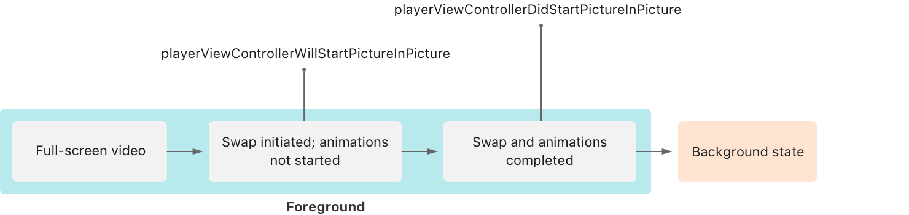
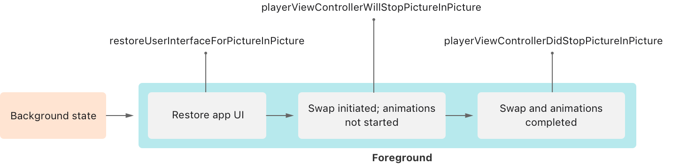
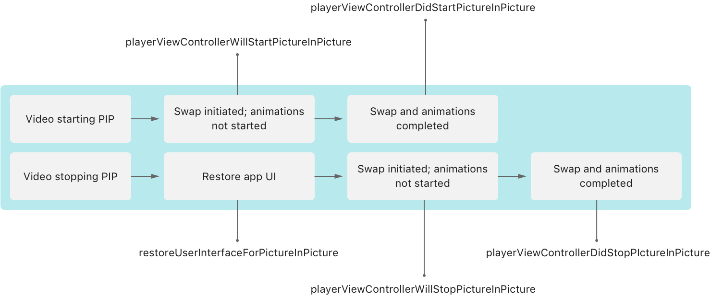

> Navigation: [Technologies](../technologies.md) · [AVKit](../avkit.md)

# Adopting Picture in Picture in a Standard Player

<sub>Article</sub>

Add Picture in Picture (PiP) playback to your app using a player view controller.

## Overview

The [AVPlayerViewController](avplayerviewcontroller.md) provides the standard video playback experience across iOS, iPadOS, and tvOS. In tvOS, it supports a wide variety of remotes, skipping, scanning, scrubbing, Siri commands, interstitial support, and more. After you configure your audio session and set the project capabilities as described in [Configuring your app for media playback](../avfoundation/configuring-your-app-for-media-playback.md), your player automatically supports PiP playback. When your app runs on a supported device, the user can manage PiP in the standard player.

### Familiarize Yourself with the PiP Controls

PiP playback starts when the user selects the PiP button in the player interface. In iOS and iPadOS, PiP playback starts automatically if your video is playing in full-screen mode and the user exits the app. When a video isn’t filling the entire screen in width, use [canStartPictureInPictureAutomaticallyFromInline](avplayerviewcontroller/canstartpictureinpictureautomaticallyfrominline.md) to indicate a video is the primary focus. In either case, the player window minimizes to a movable, floating window. In general, the system automatically pauses the video upon scene backgrounding, so you don’t need to pause video based on activation state.

> [!tip] Tip
> In iOS and iPadOS, you can disable automatic invocation of Picture in Picture in Settings \> General \> Picture in Picture. Check this setting if you think you’ve set up everything correctly but find that your video doesn’t enter PiP mode when you return to the Home screen.

Selecting the stop button in the PiP interface terminates PiP and restores video playback within your app. AVKit can’t make assumptions about how you designed your app, so it doesn’t know how to properly restore your video playback interface. Instead, it delegates that responsibility to you.

Starting in iOS 14, the PiP user interface provides controls that allow users to skip forward and backward within a video. The system enables these controls by default for apps linked in iOS 14 or later. If you need to restrict skipping content for legal disclaimers or advertisements, use [requiresLinearPlayback](avplayerviewcontroller/requireslinearplayback.md) during the required section of your video. Set this property back to `false` once you can allow seeking again.

### Restore Your Video Playback Interface

To handle the restore process, your code must adopt the [AVPlayerViewControllerDelegate](avplayerviewcontrollerdelegate.md) protocol and implement the [- playerViewController:restoreUserInterfaceForPictureInPictureStopWithCompletionHandler:](<avplayerviewcontrollerdelegate/playerviewcontroller(__restoreuserinterfaceforpictureinpicturestopwithcompletionhandler_).md>) method. The framework calls this method when control returns to your app, giving you the opportunity to determine how to properly restore your video player’s interface. If you originally presented your video player using the [present(_:animated:completion:)](<../uikit/uiviewcontroller/present(__animated_completion_).md>) method of [UIViewController](../uikit/uiviewcontroller.md), restore your player interface in the same way in the delegate callback method.

```swift
func playerViewController(_ playerViewController: AVPlayerViewController,
                          restoreUserInterfaceForPictureInPictureStopWithCompletionHandler completionHandler: @escaping (Bool) -> Void) {
    present(playerViewController, animated: false) {
        completionHandler(true)
    }
}
```

Avoid adding animations during the swap so you can ensure quick restoration for your user.

> [!important] Important
> To allow the system to finish restoring your user interface, call the completion handler with a value of `true`.

### Swap PiP Content in tvOS

In tvOS, users can play videos in PiP alongside a full-screen video. Video playback can move between PiP and full screen, so your app needs to be ready to handle the swap to provide a seamless PiP experience. When you swap your content with another app, consider your content that’s going into PiP and your content leaving PiP to go full screen. The illustration below shows the life cycle of your full-screen content swapping with another app’s PiP.



<sub>A diagram that describes the sequence of delegate calls your app receives when your full-screen video moves to PiP. When the swap starts, the player view controller calls the will start PiP method. At this point the animations haven’t started. When the swap and animations complete, the player view controller calls the did stop PiP method. Finally, your app is in the background state. </sub>

The illustration below shows the life cycle of your app’s PiP content moving to full screen.



<sub>A diagram that describes the sequence of delegate calls your app receives when your PiP video moves to full screen. When the swap initiates, the system moves your app to the foreground, and the player view controller calls the restore user interface for PiP method. At this point, the swap starts, but animations haven’t started. The player view controller calls the will stop PiP method, and then the did stop PiP method when the swap and animations complete.</sub>

When you swap content within your app, you need to handle both sides of the life cycle events from both video players. The following sequence shows you the callbacks to expect with a video that swaps content between PiP and full screen.

1. The video starting PiP receives [- playerViewControllerWillStartPictureInPicture:](<avplayerviewcontrollerdelegate/playerviewcontrollerwillstartpictureinpicture(__).md>), but the system hasn’t started the animations.
2. The video going full screen receives [- playerViewController:restoreUserInterfaceForPictureInPictureStopWithCompletionHandler:](<avplayerviewcontrollerdelegate/playerviewcontroller(__restoreuserinterfaceforpictureinpicturestopwithcompletionhandler_).md>) to restore its full-screen user interface.
3. The video going full screen receives [- playerViewControllerWillStopPictureInPicture:](<avplayerviewcontrollerdelegate/playerviewcontrollerwillstoppictureinpicture(__).md>), and the system hasn’t started the animations.
4. The video starting PiP receives [- playerViewControllerDidStartPictureInPicture:](<avplayerviewcontrollerdelegate/playerviewcontrollerdidstartpictureinpicture(__).md>), and the system completes the swap and animations for the video that started PiP.
5. The video going full screen receives [- playerViewControllerDidStopPictureInPicture:](<avplayerviewcontrollerdelegate/playerviewcontrollerdidstoppictureinpicture(__).md>), and the system completes the swap and animations for the video that moved full screen.



<sub>A diagram that describes the sequence of delegate calls your app receives when your app owns the full-screen and PiP videos. The sequence of calls you should expect, between your full-screen and PiP players, precedes the diagram.</sub>

## See Also

### Picture in Picture

- [Adopting Picture in Picture Playback in tvOS](adopting-picture-in-picture-playback-in-tvos.md) — Add advanced multitasking capabilities to your video apps by using Picture in Picture playback in tvOS.
- [Adopting Picture in Picture in a Custom Player](adopting-picture-in-picture-in-a-custom-player.md) — Add controls to your custom player user interface to invoke Picture in Picture (PiP) playback.
- [Adopting Picture in Picture for video calls](adopting-picture-in-picture-for-video-calls.md) — Add multitasking capability to your video-call apps by using Picture in Picture (PiP).
- [Accessing the camera while multitasking on iPad](accessing-the-camera-while-multitasking-on-ipad.md) — Operate the camera in Split View, Slide Over, Picture in Picture, and Stage Manager modes.
- [AVPictureInPictureController](avpictureinpicturecontroller.md) — A controller that responds to user-initiated Picture in Picture playback of video in a floating, resizable window.
