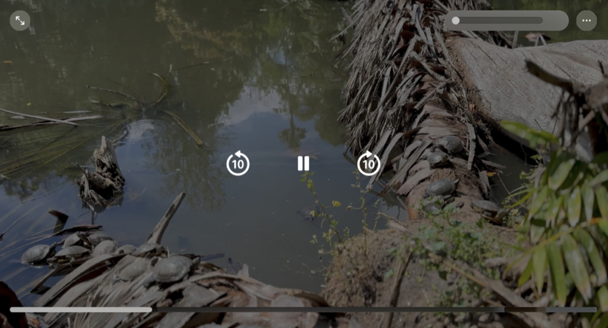
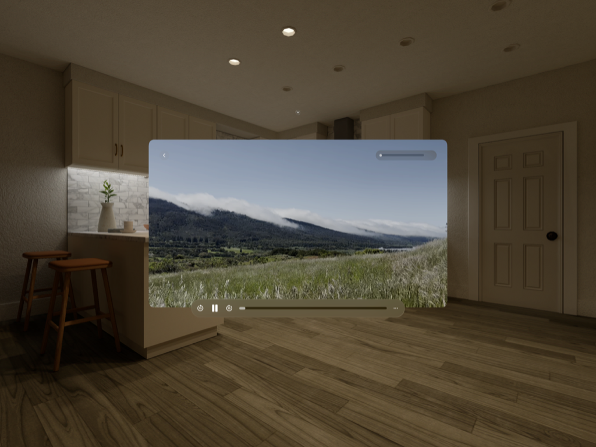
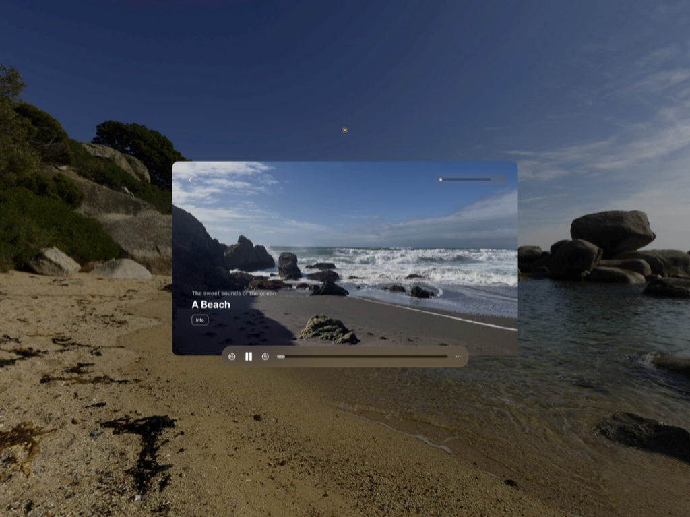
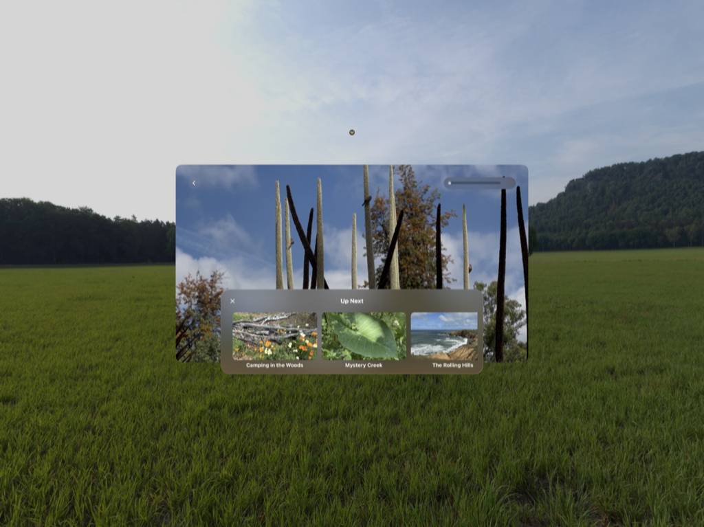
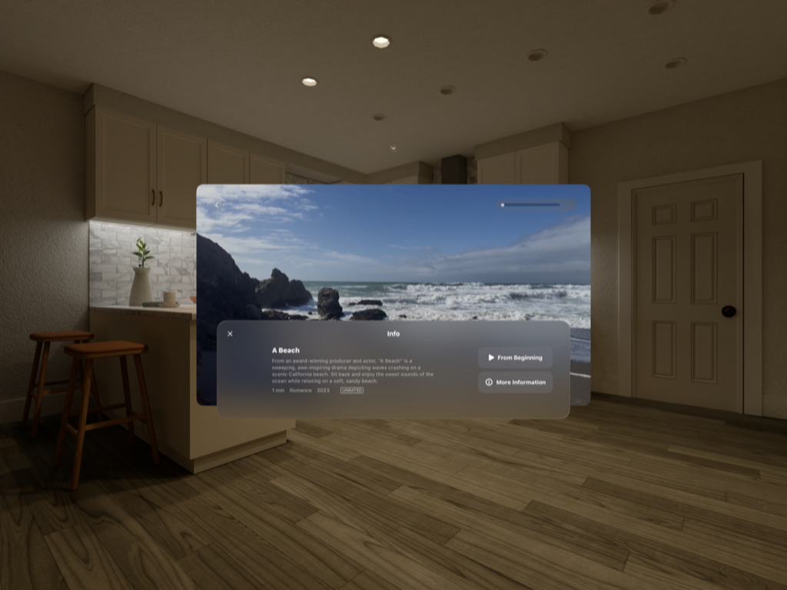
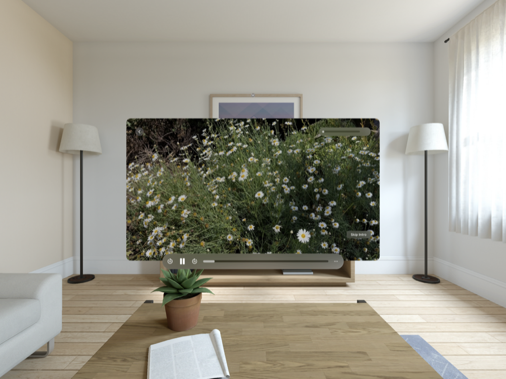

> Navigation: [Technologies](../technologies.md) · [AVKit](../avkit.md)

# Adopting the system player interface in visionOS

<sub>Article</sub>

Provide an optimized viewing experience for watching 3D video content.

## Overview

The recommended way to provide a video playback interface for your visionOS app is to adopt [AVPlayerViewController](avplayerviewcontroller.md). Using this class makes it simple to provide the same playback user interface and features found in system apps like TV and Music. It also provides essential system integration to deliver an optimal viewing experience whether you’re playing standard 2D content or immersive 3D video with spatial audio. This article describes best practices for presenting the player in visionOS and covers the options the player provides to customize its user interface to best fit your app.

> [!note] Note
> In addition to providing the system playback interface, you can also use [AVPlayerViewController](avplayerviewcontroller.md) to present a media-trimming experience similar to QuickTime Player in macOS. See [Trimming and exporting media in visionOS](trimming-and-exporting-media-in-visionos.md) for more information.

### Explore presentation options

Use [AVPlayerViewController](avplayerviewcontroller.md) to play video in windowed environments in visionOS. It automatically adapts its user interface to best fit its presentation. For example, when you present it nested inside another view, it displays an inline user interface:



<sub>A screenshot of a player view controller’s interface when you present it inline. In the center of the image is a button to toggle playback. On the button’s leading side, is a button to skip backwards 10 seconds, and on its trailing side, is a button to skip forward 10 seconds. Along the bottom of the image is a progress indicator that you can pinch and drag to scrub through the video presentation. At the top of the image, along the leading edge, is a button that you can tap to expand the player to fullscreen. On the top’s trailing edge is a horizontal slider to adjust the audio volume. Closer to the trailing edge is a button with an ellipsis icon that you can tap to display additional player controls.</sub>

> [!note] Note
> When you present the player inline, it only displays standard 2D video. To play 3D content, present it fullscreen.

Present the player in full-screen mode by setting it as the exclusive root view of your app, or by presenting it using the [fullScreenCover(item:onDismiss:content:)](<../swiftui/view/fullscreencover(item_ondismiss_content_).md>) modifier. In full-screen mode, the player presents a more content-forward design that dims the environment by default to provide more suitable viewing. This provides a streamlined viewing experience for both 2D and 3D content.



<sub>A screenshot of a player view controller’s interface when you present it fullscreen. At the top, along the leading edge, is a back button to close the player, and along the trailing edge is a horizontal slider to control the audio volume. Centered along the bottom edge is a bar that contains user interface to control playback. On the leading edge of this bar are controls to toggle the state of playback and skip through the presentation. In the center is a horizontal progress slider that you can pinch to scrub through the presentation. On the trailing edge is a button with an ellipsis icon that you can tap to display additional player controls.</sub>

### Display supporting metadata

The user interface displays a title view above the transport bar when the current player item contains title and subtitle metadata. When playing live-streaming content, the title view may also display a badge to indicate the content state to the viewer.



<sub>A screenshot of the fullscreen player interface when the media contains embedded metadata. The interface displays two strings towards the bottom of its leading edge that represent the title and subtitle. The title is shown prominently in a large, bold font. Above it, the subtitle displayed in a smaller, secondary font.</sub>

The title view displays the values of an asset’s [commonIdentifierTitle](../avfoundation/avmetadataidentifier/commonidentifiertitle.md) and [iTunesMetadataTrackSubTitle](../avfoundation/avmetadataidentifier/itunesmetadatatracksubtitle.md) metadata items, when available. If your media doesn’t provide embedded metadata, you can add supplemental metadata to display by creating instances of [AVMetadataItem](../avfoundation/avmetadataitem.md). The table below lists the metadata values the player user interface supports.

| Metadata | Identifier | Type |
|---|---|---|
| Title | [commonIdentifierTitle](../avfoundation/avmetadataidentifier/commonidentifiertitle.md) | String |
| Subtitle | [iTunesMetadataTrackSubTitle](../avfoundation/avmetadataidentifier/itunesmetadatatracksubtitle.md) | String |
| Artwork | [commonIdentifierArtwork](../avfoundation/avmetadataidentifier/commonidentifierartwork.md) | Data |
| Description | [commonIdentifierDescription](../avfoundation/avmetadataidentifier/commonidentifierdescription.md) | String |
| Genre | [quickTimeMetadataGenre](../avfoundation/avmetadataidentifier/quicktimemetadatagenre.md) | String |
| Content rating | [iTunesMetadataContentRating](../avfoundation/avmetadataidentifier/itunesmetadatacontentrating.md) | String |

In an app that defines a simple structure to hold string and data items, you can map its values to their appropriate metadata identifiers and build an array of metadata items:

```swift
private func createMetadataItems(for metadata: Metadata) -> [AVMetadataItem] {
    [
        metadataItem(key: .commonIdentifierTitle, value: metadata.title),
        metadataItem(key: .iTunesMetadataTrackSubTitle, value: metadata.subtitle),
        metadataItem(key: .commonIdentifierArtwork, value: metadata.imageData),
        metadataItem(key: .commonIdentifierDescription, value: metadata.description),
        metadataItem(key: .iTunesMetadataContentRating, value: metadata.rating),
        metadataItem(key: .quickTimeMetadataGenre, value: metadata.genre)
    ]
}

private func metadataItem(key identifier: AVMetadataIdentifier,
                          value: Any) -> AVMetadataItem {
    let item = AVMutableMetadataItem()
    item.identifier = identifier
    item.value = value as? NSCopying & NSObjectProtocol
    item.extendedLanguageTag = "und"
    // Return an immutable copy of the item.
    return item.copy() as! AVMetadataItem
}
```

To apply the metadata to the current player item, set the array of metadata items as the value of the player item’s [externalMetadata](../avfoundation/avplayeritem/externalmetadata.md) property:

```swift
let metadata: Metadata = // A structure that contains simple string values.
playerItem.externalMetadata = createMetadataItems(for: metadata)
```

Only the title and subtitle values display in the title view. The player presents the other supported metadata values in its Info tab, which the section below describes.

### Display custom informational views

The visionOS player UI can display one or more content tabs in the user interface to show supporting information or related content. By default, the player presents an Info tab when an asset contains embedded metadata or when you set external metadata on the player item, as the Display supporting metadata section above describes.

Your app can also present custom tabs to show supporting content. You define your tab content as standard SwiftUI views, wrap them in a [UIHostingController](../swiftui/uihostingcontroller.md), and set them as the [customInfoViewControllers](avplayerviewcontroller/custominfoviewcontrollers.md) property. The player UI uses the [title](../uikit/uiviewcontroller/title.md) property of the hosting controller to display as the tab title in the interface, so set this value before setting it on the player view controller.

```swift
let view = UpNextView(videos: upNextVideos)
let hostingController = UIHostingController(rootView: view)

// Set custom content tabs on the player UI.
hostingController.title = String(localized: "Up Next")

hostingController.preferredContentSize = CGSize(width: 300, height: 100)
controller.customInfoViewControllers = [hostingController]
```



<sub>A screenshot of the fullscreen player’s displaying a custom horizontal list from a custom info view controller. The player displays a panel along its bottom edge. At the top of the panel is a close button, anchored to the leading edge, and a title that’s centered. Below these items, the custom info view controller displays a horizontally scrollable list of video cards that you can select to watch another video.</sub>

### Present actions in the Info tab

The player UI presents an Info tab when the asset it displays provides embedded or external metadata. The tab’s view displays the metadata details, and it may show up to two [UIAction](../uikit/uiaction.md) controls along its trailing edge:



<sub>A screenshot of the fullscreen player displaying its Info tab. At the top of the Info tab is a close button, anchored to the leading edge, and the word “Info” centered along the top. Below that, on the leading edge displays metadata for the video including title, description, and content rating. Along the trailing edge of this panel are two buttons arranged vertically. The top button displays a play button and the string From Beginning that you tap to play the video from the beginning. The button is a custom action that shows an information icon - a letter I with a circle around it - and the string More Information. The action that occurs when you tap this button is up to the app.</sub>

Customize the actions the view presents by setting a value for the player view controller’s [infoViewActions](avplayerviewcontroller/infoviewactions.md) property. When playing nonlive content, this property contains a single-element array that presents an action to play the content from the beginning. You can replace the default value (if present), add an additional action, or set this property value to an empty array to display no actions. The example below shows how to add a Add to Favorites action to the view:

```swift
let infoCircle = UIImage(systemName: "info.circle")
let showMoreInfo = UIAction(title: "More Information", image: infoCircle) { action in
    // Navigate to a screen to display more information.
}
// Append the action to the array.
playerViewController.infoViewActions.append(showMoreInfo)
```

### Display actions contextually

You can use the visionOS player UI to present controls contextually, which your app displays for a specific range of time in the content and then dismiss. A common use for this type of control is a skip button that displays during the title sequence of a movie or TV show. People can tap the button to bypass the introduction and quickly skip to the main content.



<sub>A screenshot of the fullscreen player interface, with its standard controls presented. Along the bottom of the player interface’s trailing edge is a custom contextual action that displays a button with the title Skip Into. Tapping this button seeks the player forward to where the main video content begins.</sub>

[AVPlayerViewController](avplayerviewcontroller.md) provides a [contextualActions](avplayerviewcontroller/contextualactions.md) property you can use to specify one or more actions to present. The player displays them along the bottom-trailing side of the screen. The following code example shows a simple implementation of an action that seeks the player forward to the time of the main content:

```swift
// Define an action to skip the intro of a media item.
private lazy var skipActions: [UIAction] = {
    [UIAction(title: "Skip Intro") { [weak self] _ in
        guard let self else { return }
        avPlayer.seek(to: skipToTime)
    }]
}()
```

When you set a value for the [contextualActions](avplayerviewcontroller/contextualactions.md) property, the player presents the controls immediately. To present them only during a relevant section of the content, observe the player timing by adding a periodic or boundary time observer. The following example defines a periodic time observer that fires every second during normal playback. In each invocation, it evaluates the new time to determine whether it falls within the presentation range. If it does, the example sets the skip action as the contextual actions value; otherwise, it clears the value by setting it to an empty array.

```swift
private func addTimeObserver() {
    // Observe the player's timing every second.
    let interval = CMTime(value: 1, timescale: 1)
    let fifteenSeconds = CMTime (value: 15, timescale: 1)
    timeObserver = avPlayer.addPeriodicTimeObserver(forInterval: interval,
                                                    queue: .main) { [weak self] time in
        guard let self else { return }
        let duration = avPlayer.currentItem?.duration ?? .zero
        // Show the Skip Intro button during the first 15 seconds of the content.
        showSkipIntroAction = time <= fifteenSeconds
    }
}
```

## See Also

### visionOS playback

- [Playing immersive media with AVKit](playing-immersive-media-with-avkit.md) — Adopt the system playback interface to provide an immersive video watching experience.
- [Creating a multiview video playback experience in visionOS](creating-a-multiview-video-playback-experience-in-visionos.md) — Build an interface that plays multiple videos simultaneously and handles transitions to different experience types gracefully.
- [Trimming and exporting media in visionOS](trimming-and-exporting-media-in-visionos.md) — Display standard controls in your app to edit the timeline of the currently playing media.
- [AVPlayerViewController](avplayerviewcontroller.md) — A view controller that displays content from a player and presents a native user interface to control playback.
- [AVPlayerViewControllerDelegate](avplayerviewcontrollerdelegate.md) — A protocol that defines the methods to implement to respond to player view controller events.
- [AVExperienceController](avexperiencecontroller.md) — An object that controls video experiences.
- [AVMultiviewManager](avmultiviewmanager.md) — An object that manages viewing multiple videos at once.
- [AVGroupExperienceCoordinator](avgroupexperiencecoordinator.md) — An object that synchronizes viewing environment state across participants in a SharePlay session.
- [AVViewport](avviewport.md) — A configuration object that manages viewport settings for different presentation modes. _(beta)_
- [AVPortalViewport](avportalviewport.md) — A viewport configuration used when displaying content in portals. _(beta)_
- [Third-party casting support](third-party-casting-support.md) — Provide custom playback controls for third-party casting services and other media sources.
