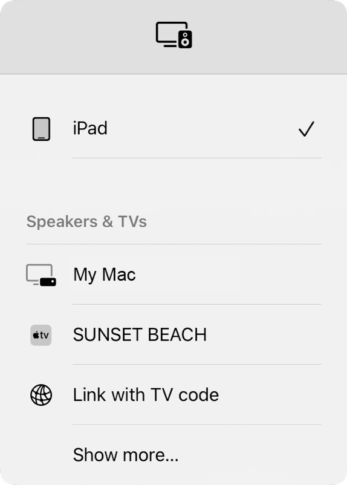

> Navigation: [Technologies](../technologies.md) · [AVKit](../avkit.md)

# AVRoutePickerView

<sub>Class</sub>

A view that presents a list of nearby media receivers.

<sub>iOS, iPadOS, Mac Catalyst, macOS, tvOS</sub>

```swift
class AVRoutePickerView
```

## Overview

This view represents a button that users tap to stream audio/video content to a media receiver, such as a Mac or Apple TV.


<sub>A screenshot of an AV route picker view that composes a button with text that says Choose output device on the left, and an icon of a computer screen next to a set-top box remote on the right.</sub>

When the user taps the button, the system presents a popover that displays all of the nearby AirPlay devices that can receive and play back media. If your app prefers video content, the system displays video-capable devices higher in the list.



<sub>A screenshot of a popover with a list of items. The top item is an iPad icon with a check mark to the right. Below that is the title Speakers and TVs with a list of six subitems. The first subitem says Third-party device, followed by AirPlay and Third-party protocol. The remaining subitems are Sunset Beach with an Apple TV icon on the left, Link with TV code with a globe icon on the left, and Show more.</sub>

In iOS 16 and later, you can add devices to the list that implement custom protocols. For more information about displaying third-party routes, see [AVRouting](../avrouting.md).

### Configure the button’s text, color, and media preference

The following code example creates the view alongside custom text:

```swift
HStack {
    Text("Choose output device")
        .font(.title)
        .frame(maxWidth: .infinity, alignment: .center)
        .fixedSize()
        .padding(.leading)

    if routeDetected {
        DevicePickerView() // See implementation below.
        .frame(width: 60, height: 60)
        .padding(.trailing)
    }
}
```

Your app configures the button’s color scheme and indicates whether your app prefers video content, as the following code demonstrates:

```swift
struct DevicePickerView: UIViewRepresentable {
    func makeUIView(context: Context) -> UIView {
        let routePickerView = AVRoutePickerView()

        // Configure the button's color.
        routePickerView.delegate = context.coordinator
        routePickerView.backgroundColor = UIColor.white
        routePickerView.tintColor = UIColor.black

        // Indicate whether your app prefers video content.
        routePickerView.prioritizesVideoDevices = true

        return routePickerView
```

## Relationships

- **Inherits From**: [NSView](../appkit/nsview.md), [UIView](../uikit/uiview.md)

- **Conforms To**: [CALayerDelegate](../quartzcore/calayerdelegate.md), [CLBodyIdentifiable](../corelocation/clbodyidentifiable.md), [CMBodyIdentifiable](../coremotion/cmbodyidentifiable.md), [CVarArg](../swift/cvararg.md), [CustomDebugStringConvertible](../swift/customdebugstringconvertible.md), [CustomStringConvertible](../swift/customstringconvertible.md), [Equatable](../swift/equatable.md), [Hashable](../swift/hashable.md), [NSAccessibilityElementProtocol](../appkit/nsaccessibilityelementprotocol.md), [NSAccessibilityProtocol](../appkit/nsaccessibilityprotocol.md), [NSAnimatablePropertyContainer](../appkit/nsanimatablepropertycontainer.md), [NSAppearanceCustomization](../appkit/nsappearancecustomization.md), [NSCoding](../foundation/nscoding.md), [NSDraggingDestination](../appkit/nsdraggingdestination.md), [NSObjectProtocol](../objectivec/nsobjectprotocol.md), [NSStandardKeyBindingResponding](../appkit/nsstandardkeybindingresponding.md), [NSTouchBarProvider](../appkit/nstouchbarprovider.md), [NSUserActivityRestoring](../appkit/nsuseractivityrestoring.md), [NSUserInterfaceItemIdentification](../appkit/nsuserinterfaceitemidentification.md), [Sendable](../swift/sendable.md), [SendableMetatype](../swift/sendablemetatype.md), [UIAccessibilityIdentification](../uikit/uiaccessibilityidentification.md), [UIActivityItemsConfigurationProviding](../uikit/uiactivityitemsconfigurationproviding.md), [UIAppearance](../uikit/uiappearance.md), [UIAppearanceContainer](../uikit/uiappearancecontainer.md), [UICoordinateSpace](../uikit/uicoordinatespace.md), [UIDynamicItem](../uikit/uidynamicitem.md), [UIFocusEnvironment](../uikit/uifocusenvironment.md), [UIFocusItem](../uikit/uifocusitem.md), [UIFocusItemContainer](../uikit/uifocusitemcontainer.md), [UILargeContentViewerItem](../uikit/uilargecontentvieweritem.md), [UIPasteConfigurationSupporting](../uikit/uipasteconfigurationsupporting.md), [UIPopoverPresentationControllerSourceItem](../uikit/uipopoverpresentationcontrollersourceitem.md), [UIResponderStandardEditActions](../uikit/uiresponderstandardeditactions.md), [UITraitChangeObservable](../uikit/uitraitchangeobservable-67e94.md), [UITraitEnvironment](../uikit/uitraitenvironment.md), [UIUserActivityRestoring](../uikit/uiuseractivityrestoring.md)

## Topics

### Configuring the delegate

- [delegate](avroutepickerview/delegate.md) — The delegate object for the route picker.
- [AVRoutePickerViewDelegate](avroutepickerviewdelegate.md) — A protocol that defines the methods to adopt to respond to route picker view presentation events.

### Configuring the route picker view

- [activeTintColor](avroutepickerview/activetintcolor.md) — The view’s tint color when AirPlay is active.
- [routePickerButtonBordered](avroutepickerview/isroutepickerbuttonbordered.md) — A Boolean value that indicates whether the route picker button has a border.
- [prioritizesVideoDevices](avroutepickerview/prioritizesvideodevices.md) — A Boolean value that indicates whether the route picker sorts video output devices to the top of the list.
- [routePickerButtonStyle](avroutepickerview/routepickerbuttonstyle.md) — The button style for the route picker.
- [AVRoutePickerViewButtonStyle](avroutepickerviewbuttonstyle.md) — Constants that define the button styles a route picker view supports.
- [- routePickerButtonColorForState:](<avroutepickerview/routepickerbuttoncolor(for_).md>) — Returns the color of the picker button for the specified state.
- [- setRoutePickerButtonColor:forState:](<avroutepickerview/setroutepickerbuttoncolor(__for_).md>) — Sets the route picker button color for the specified state.
- [ButtonState](avroutepickerview/buttonstate.md) — Constants that describe the available button states.

### Accessing the player

- [player](avroutepickerview/player.md) — The player object to perform routing operations for.

### Setting a custom routing controller

- [customRoutingController](avroutepickerview/customroutingcontroller.md) — A routing controller that enables connections to non-AirPlay devices.
