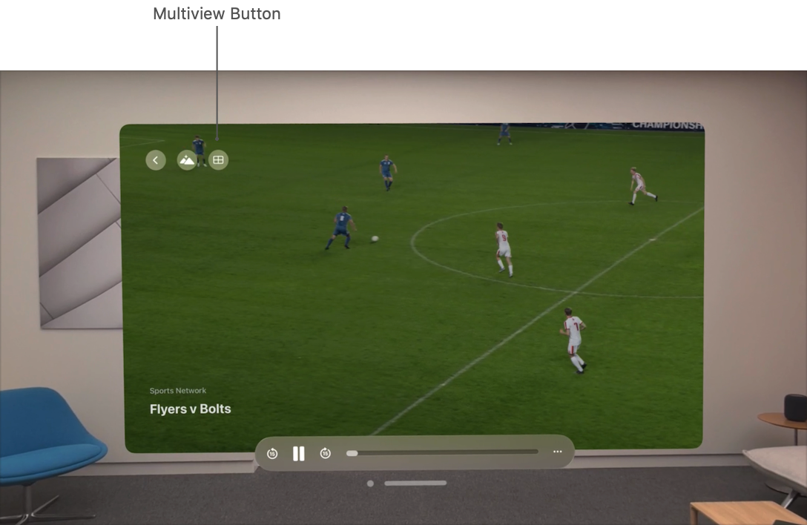
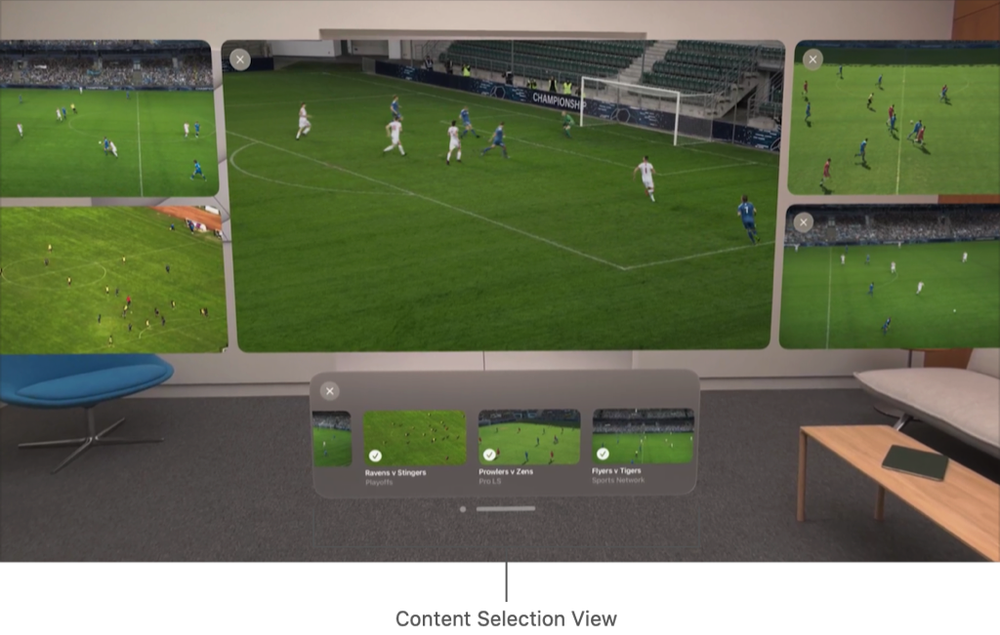

> Navigation: [Technologies](../technologies.md) · [AVKit](../avkit.md)

# Creating a multiview video playback experience in visionOS

<sub>Sample Code</sub>

Build an interface that plays multiple videos simultaneously and handles transitions to different experience types gracefully.

## Overview

This sample code project demonstrates how to use the multiview video playback APIs using SwiftUI. It illustrates how an app might display video when showing a video in the embedded experience, and how apps might immediately display a video in the expanded experience. From these experiences, someone can enter the multiview video playback experience to display multiple videos simultaneously.

The multiview experience lets your app display multiple videos simultaneously. Use this type of experience in apps where watching multiple videos makes sense, such as in a sports app or a security camera app. In a multiview experience, a person starts with one video as their main focus, and adds more videos that interest them. In visionOS, your app can display up to five simultaneous videos.


Multiview experiences work with the existing [AVPlayerViewController](avplayerviewcontroller.md) class to manage your content. Each instance of the player view controller exposes an [experienceController](avplayerviewcontroller/experiencecontroller.md) property that manages the available experiences for your content and the transitions between embedded, expanded, and multiview experiences. Use this experience controller to configure the experiences you support, and to initiate transitions between different experience types.

To facilitate the addition of new videos to your app’s multiview experience, create a custom browsing user interface and provide it to the shared [AVMultiviewManager](avmultiviewmanager.md) class. The `AVMultiviewManager` instance coordinates the arrangement of [AVPlayerViewController](avplayerviewcontroller.md) instances in the multiview experience. As your app adds new view controllers, the `AVMultiviewManager` updates the layout to maintain a comfortable and engaging user experience.

### Display the system video player

Adding support for the multiview experience starts with displaying the [AVPlayerViewController](avplayerviewcontroller.md). The `AVPlayerViewController` is a UIKit view controller that AVKit provides. Use [UIViewControllerRepresentable](../swiftui/uiviewcontrollerrepresentable.md) to adapt this for SwiftUI. The following code example creates a `SystemVideoPlayer` view with an [AVPlayer](../avfoundation/avplayer.md) property. This property allows the SwiftUI view that contains the `SystemVideoPlayer` view to initialize the player with an [AVPlayerItem](../avfoundation/avplayeritem.md) and change the video using the [replaceCurrentItem(with:)](<../avfoundation/avplayer/replacecurrentitem(with_).md>) method.

```swift
struct SystemVideoPlayer: UIViewControllerRepresentable {
    let player: AVPlayer

    func makeUIViewController(context: Context) -> AVPlayerViewController {
        let playerController = AVPlayerViewController()
        playerController.player = player

        return playerController
    }

    func updateUIViewController(_ uiViewController: AVPlayerViewController, context: Context) {}
}
```

### Enable the multiview experience on your video players

The multiview experience is disabled by default, so your app needs to allow it by setting [allowedExperiences](avexperiencecontroller/allowedexperiences.md) on [AVExperienceController](avexperiencecontroller.md) to include `.multiview`. In the multiview experience, you can present video from multiple [AVPlayerViewController](avplayerviewcontroller.md) instances together in an interface that an [AVMultiviewManager](avmultiviewmanager.md) manages.

```swift
let playerController = AVPlayerViewController()
// Enable the multiview experience, along with the default recommended set.
playerController.experienceController.allowedExperiences = .recommended(
    including: [.multiview]
)
```

After allowing the multiview experience, the system player includes a Multiview button in the top left corner of the expanded and embedded video player. People can close the multiview experience to return to the embedded video player at any time.



<sub>A visonOS screenshot of a video playing in the system player with a Back button, Environments button, and Multiview button at the top-left.</sub>

### Create a content browser for adding and removing videos

An [AVPlayerViewController](avplayerviewcontroller.md) displays a single video. When someone enters the multiview experience, [AVMultiviewManager](avmultiviewmanager.md) manages the layout of the system video players and displays your content browser beneath the videos. The content browser allows people to select additional videos to play within the experience. Anyone can remove a video from the multiview experience by clicking the close button in the corner of a video, or by using your content browser. After selecting multiple videos, a person can close the content browser to navigate to the playback controls for each video. To provide the view for the content browser, set the [contentSelectionViewController](avmultiviewmanager/contentselectionviewcontroller.md) property on the shared `AVMultiviewManager`.



When designing your content selection view, follow the [Human Interface Guidelines](https://developer.apple.com/design/human-interface-guidelines/designing-for-visionos) to create an intuitive experience. This sample code project uses a [UIHostingController](../swiftui/uihostingcontroller.md) class to provide a SwiftUI view as the content selection view controller.

```swift
let hostingController = UIHostingController(rootView: rootView)
let contentSelectionViewController = AVContentSelectionViewController()
contentSelectionViewController.preferredContentSize = .init(width: 1200, height: 340.0)

// Add the `hostingController` and its view to the empty `contentSelectionViewController`.
contentSelectionViewController.addChild(hostingController)
contentSelectionViewController.view.addSubview(hostingController.view)

// Notify the `hostingController` that the move is complete.
hostingController.didMove(toParent: contentSelectionViewController)

// Set the constraints so that the `hostingController` matches the size of the `contentSelectionViewController`.
hostingController.view.translatesAutoresizingMaskIntoConstraints = false
NSLayoutConstraint.activate([
    contentSelectionViewController.view.leadingAnchor.constraint(equalTo: hostingController.view.leadingAnchor),
    contentSelectionViewController.view.trailingAnchor.constraint(equalTo: hostingController.view.trailingAnchor),
    contentSelectionViewController.view.topAnchor.constraint(equalTo: hostingController.view.topAnchor),
    contentSelectionViewController.view.bottomAnchor.constraint(equalTo: hostingController.view.bottomAnchor)
])

AVMultiviewManager.default.contentSelectionViewController = contentSelectionViewController
```

To provide visual context, it’s important to show an image that represents each video. Depending on your app, this may be a generated thumbnail or a graphic unique to each video. For information about creating an image from a video asset, see [Creating images from a video asset](../avfoundation/creating-images-from-a-video-asset.md).

### Observe changes in the multiview experience

Using the [Delegate](avexperiencecontroller/delegate-swift.protocol.md) methods, your app can react to changes in the multiview experience. This protocol informs your app about the transitions you programmatically initiate and the transitions that trigger within the multiview experience. Update your class to conform to this protocol and set it as the delegate.

The sample code project uses this protocol to start videos that someone adds to the multiview experience, swap which video is showing in the embedded video player, and update the state that shows which videos are part of the multiview experience. The sample app creates a `MultiviewStateModel` class to conform to this protocol, retains the videos and their player view controllers, and sets this delegate on each of the `VideoModel` objects in the initialization of the `MultiviewStateModel`.

```swift
self.videoModels.forEach { videoModel in
    videoModel.viewController.experienceController.delegate = self
}
```

### Change the embedded video

If your app displays the video player in the embedded state, your view needs to handle changing the [AVPlayerViewController](avplayerviewcontroller.md) that’s displaying when someone changes the video within the multiview experience.

The `SystemVideoPlayer` view in the “Display the system video player” section above is responsible for displaying a single video. To switch which video is playing in the embedded experience and retain the current playback state of the video, create a [UIViewControllerRepresentable](../swiftui/uiviewcontrollerrepresentable.md) that has an `AVPlayerViewController` property. To insure that SwiftUI provides the updated view controller in `makeUIViewController`, identify the view using the video’s ID.

```swift
if let embeddedVideo = multiviewStateModel.embeddedVideo {
    // When displaying an embedded video, identify it based on the item
    // so that `UIViewControllerRepresentable` can provide the new
    // view controller in `makeUIViewController`.
    ItemVideoPlayer(videoModel: embeddedVideo)
        .id(embeddedVideo.video.id)
}
```

To support changing the embedded video set the `embeddedVideo` property to the video item that you want to play. If the video is already selected, consider pausing the video and removing it from the view hierarchy.

```swift
// Pause the current embedded video, if there is one.
await embeddedVideo?.pauseVideoAndResetPlaybackCursor()

// If the selected video isn't in the view hierarchy,
// add and play it; otherwise, pause and remove it.
if videoModel.viewController.parent == nil {
    embeddedVideo = videoModel
    await videoModel.resetPlaybackCursorAndPlayVideo()
} else {
    embeddedVideo = nil
    await videoModel.pauseVideoAndResetPlaybackCursor()
}
```

### Show and hide videos from your content browser

Your content selection view is responsible for adding and removing videos from the multiview experience. To determine whether to add or remove a video when a person selects an item, keep track of which videos are present in the [AVMultiviewManager](avmultiviewmanager.md). Depending on the needs of your app, you can either create all [AVPlayerViewController](avplayerviewcontroller.md) instances on initialization, or create them on demand as you display additional videos.

When a person selects a video in the content browser, your app adds or removes the video from the multiview experience by calling [transition(to:)](<avexperiencecontroller/transition(to_).md>) on the associated `AVPlayerViewController` instance.

```swift
// Deselecting a video from the content selection view transitions it
// to the embedded experience even when there's one video playing.
// Deselecting the last video removes the user from the multiview
// experience, and returns them to the embedded playback experience.
await videoModel.viewController.experienceController.transition(
    to: videoModel.isAddedToMultiview ? .embedded : .multiview
)
```

The [transition(to:)](<avexperiencecontroller/transition(to_).md>) function performs a request to transition the video to the provided state, but this doesn’t always succeed. This transition fails if you already presented the maximum number of videos. Transitioning to the `.embedded` state fails for the last video in the `AVMultiviewManager` if the view controller isn’t in the view hierarchy. Only update the state and view hierarchy when the transition completes successfully. Use the [experienceController(_:didChangeTransitionContext:)](<avexperiencecontroller/delegate-swift.protocol/experiencecontroller(__didchangetransitioncontext_).md>)  delegate method to update your state and view hierarchy for completed transitions. The system calls these delegate methods for changes that your content selection view and the `AVMultiviewManager` trigger.

```swift
func experienceController(
    _ controller: AVExperienceController,
    didChangeTransitionContext context: AVExperienceController.TransitionContext
) {
    guard let videoModel = videoModel(for: controller) else {
        assertionFailure("Failed to get item for experience controller")
        return
    }

    if case .transitioning = context.status, videosInMultiview == 0 {
        // If there aren't any videos in the multiview experience,
        // update the selection state so that while the transition
        // is occurring, the UI reflects the added video.
        videoModel.isAddedToMultiview = context.toExperience != .embedded
    }

    guard
        case .finished(let result) = context.status,
        .completed == result
    else { return }

    videoModel.isAddedToMultiview = context.toExperience == .multiview

    // Play new videos that someone successfully adds to the multiview experience.
    if videoModel.isAddedToMultiview, videosInMultiview > 1 {
        Task { await videoModel.resetPlaybackCursorAndPlayVideo() }
    }

    // If the initial playback experience isn't embedded, remove the embedded video
    // from the view hierarchy when transitioning back to the embedded experience.
    if !supportsEmbeddedPlaybackExperience, context.toExperience == .embedded {
        embeddedVideo = nil
        Task { await videoModel.pauseVideoAndResetPlaybackCursor() }
    }
}
```

### Set the newly selected embedded video

People can add and remove videos from the multiview experience through the user interface that your content selection view or the `AVMultiviewManager` provides. If your app supports displaying embedded videos, the video playing when someone first enters the multiview experience may be different than the one playing when they return to the embedded experience. Continue to show the currently playing video when a person returns to the embedded experience.

For example, a person may start the multiview experience viewing video A, and then add video B and others. They may then remove video A prior to closing the experience and returning to your view with the embedded experience. In this case, update the view they return to so it displays video B rather than the initial video A. You can perform view hierarchy and state changes to prepare for a transition in [experienceController(_:prepareForTransitionUsing:)](<avexperiencecontroller/delegate-swift.protocol/experiencecontroller(__preparefortransitionusing_).md>).

```swift
func experienceController(
    _ controller: AVExperienceController,
    prepareForTransitionUsing context: AVExperienceController.TransitionContext
) async {
    guard let videoModel = videoModel(for: controller) else {
        assertionFailure("Failed to get item for experience controller")
        return
    }

    if context.toExperience == .embedded, videosInMultiview == 1 {
        embeddedVideo = videoModel
    }

    setFallbackScene(for: controller, using: context)
}
```

### Show expanded videos outside the view hierarchy

To display a video in the expanded or embedded states, the original container needs to be in the view hierarchy. This transition fails to complete when the [AVPlayerViewController](avplayerviewcontroller.md) isn’t in the view hierarchy because the system requires a scene to transition to these states.

If you aren’t embedding the video in the view hierarchy, specify a [fallbackPlacement](avexperiencecontroller/expandedconfiguration/fallbackplacement.md) to display the video over the provided scene. You can specify this just before presenting the video in [experienceController(_:prepareForTransitionUsing:)](<avexperiencecontroller/delegate-swift.protocol/experiencecontroller(__preparefortransitionusing_).md>), or set it earlier in the app life cycle. Retrieve this `UIScene` argument from the [UIWindowSceneDelegate](../uikit/uiwindowscenedelegate.md) object. For more information about how to provide this delegate in your SwiftUI app, see [UIApplicationDelegateAdaptor](../swiftui/uiapplicationdelegateadaptor.md).

```swift
// The fallback placement is required for cases where the video doesn't start from the embedded state,
// or the video needs to present on top of another scene.
// If the video starts in the embedded state, you don't need to set the fallback placement.
if !supportsEmbeddedPlaybackExperience, context.toExperience == .expanded {
    if let scene {
        controller.configuration.expanded.fallbackPlacement = .over(scene: scene)
    } else {
        controller.configuration.expanded.fallbackPlacement = .unspecified
    }
}
```

## See Also

### visionOS playback

- [Playing immersive media with AVKit](playing-immersive-media-with-avkit.md) — Adopt the system playback interface to provide an immersive video watching experience.
- [Adopting the system player interface in visionOS](adopting-the-system-player-interface-in-visionos.md) — Provide an optimized viewing experience for watching 3D video content.
- [Trimming and exporting media in visionOS](trimming-and-exporting-media-in-visionos.md) — Display standard controls in your app to edit the timeline of the currently playing media.
- [AVPlayerViewController](avplayerviewcontroller.md) — A view controller that displays content from a player and presents a native user interface to control playback.
- [AVPlayerViewControllerDelegate](avplayerviewcontrollerdelegate.md) — A protocol that defines the methods to implement to respond to player view controller events.
- [AVExperienceController](avexperiencecontroller.md) — An object that controls video experiences.
- [AVMultiviewManager](avmultiviewmanager.md) — An object that manages viewing multiple videos at once.
- [AVGroupExperienceCoordinator](avgroupexperiencecoordinator.md) — An object that synchronizes viewing environment state across participants in a SharePlay session.
- [AVViewport](avviewport.md) — A configuration object that manages viewport settings for different presentation modes. _(beta)_
- [AVPortalViewport](avportalviewport.md) — A viewport configuration used when displaying content in portals. _(beta)_
- [Third-party casting support](third-party-casting-support.md) — Provide custom playback controls for third-party casting services and other media sources.

## Download

- [CreatingAMultiviewVideoPlaybackExperienceInVisionOS.zip](https://docs-assets.developer.apple.com/published/d63cdb997493/CreatingAMultiviewVideoPlaybackExperienceInVisionOS.zip)
