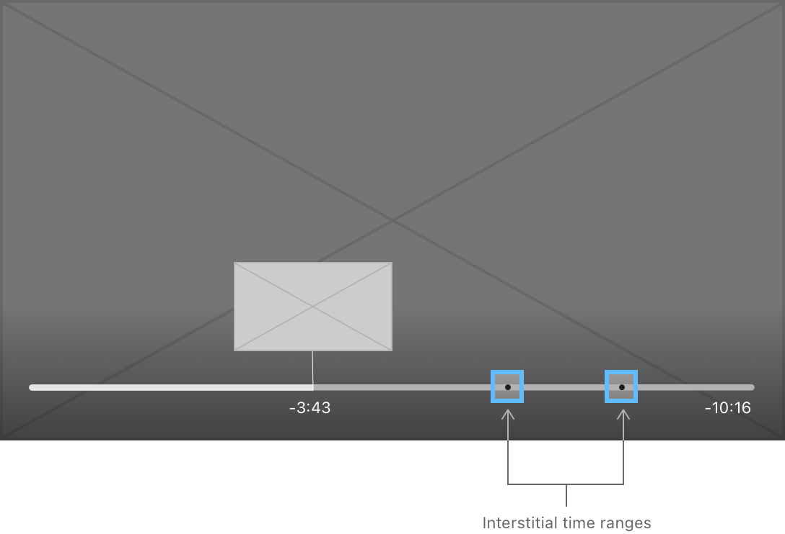

> Navigation: [Technologies](../technologies.md) · [AVKit](../avkit.md)

# Working with Interstitial Content

<sub>Article</sub>

Present additional content alongside your main media presentation using HTTP Live Streaming support.

## Overview

Media playback apps often present additional content such as legal text, content warnings, or advertisements alongside their main media content. One method is to use HTTP Live Streaming’s (HLS) support for serving stitched playlists. Stitched playlists let you combine multiple media playlists into a single, unified playlist that’s delivered to the client as a single stream. This stream provides a smooth playback experience to users, with no breaks or interruptions in the action when the player presents the interstitial content. For more information about including ad content in your HLS playlist, see [Incorporating Ads into a Playlist](../http-live-streaming/incorporating-ads-into-a-playlist.md).

### Define Interstitial Time Ranges

AVKit in tvOS simplifies working with interstitial content delivered as part of a stitched playlist. You define the time ranges in your presentation that contain interstitial content. As the player encounters the time ranges during playback, you receive callbacks when they begin and end, giving you the opportunity to enforce business rules or capture analytics.

[AVPlayerItem](../avfoundation/avplayeritem.md) in tvOS adds an [interstitialTimeRanges](../avfoundation/avplayeritem/interstitialtimeranges.md) property that you set to an array of [AVInterstitialTimeRange](avinterstitialtimerange.md) objects that the system uses to annotate the timeline with break markers. Each object defines a [CMTimeRange](../coremedia/cmtimerange.md) marking the interstitial time range in your media’s timeline. The following code example shows how to create interstitial time ranges.

```swift
func setupPlayback() {
    ...
    playerItem.interstitialTimeRanges = makeInterstitialTimeRanges()
    ...
}

private func makeInterstitialTimeRanges() -> [AVInterstitialTimeRange] {
    // Present a 10-second content warning at the beginning of the video.
    let timeRange1 = CMTimeRange(start: .zero,
                                 duration: CMTime(value: 10, timescale: 1))
    
    // Present 1 minute of advertisements 10 minutes into the video.
    let timeRange2 = CMTimeRange(start: CMTime(value: 600, timescale: 1),
                                 duration: CMTime(value: 60, timescale: 1))
    
    // Return an array of AVInterstitialTimeRange objects.
    return [
        AVInterstitialTimeRange(timeRange: timeRange1),
        AVInterstitialTimeRange(timeRange: timeRange2)
    ]
}
```

When you define interstitial time ranges, [AVPlayerViewController](avplayerviewcontroller.md) updates its user interface in two important ways, as shown below. First, the player represents any interstitial time ranges as small dots on the player’s timeline. This helps users understand where they are between interstitial breaks and helps orient them to where they are in the overall media timeline. Second, the player collapses interstitial time ranges from the time display. The current time and duration presented represent only your main content, providing a better sense of the primary media’s timeline.



<sub>An abstract representation of a video player with a timeline along the bottom and two interstitial time ranges highlighted.</sub>

> [!note] Note
> The player interface’s collapsing of time ranges is only visual. Any programmatic operations you perform, such as seeking, happen on the full asset timeline, inclusive of interstitial content.

### Enforce Linear Playback

When you adopt the [AVPlayerViewControllerDelegate](avplayerviewcontrollerdelegate.md) protocol, the player can notify your app as it traverses interstitial time ranges, which is useful to help you enforce business rules. For instance, a common requirement when presenting advertisements is to prevent users from skipping past them. You can use the [requiresLinearPlayback](avplayerviewcontroller/requireslinearplayback.md) property of [AVPlayerViewController](avplayerviewcontroller.md) to control whether users can navigate through the content using the Siri Remote. During playback, this property is normally set to `false`, but when presenting an advertisement, you can set it to `true` to prevent user navigation, as shown in the following example.

```swift
public func playerViewController(_ playerViewController: AVPlayerViewController,
                                 willPresent interstitial: AVInterstitialTimeRange) {
    playerViewController.requiresLinearPlayback = true
}

public func playerViewController(_ playerViewController: AVPlayerViewController,
                                 didPresent interstitial: AVInterstitialTimeRange) {
    playerViewController.requiresLinearPlayback = false
}
```

### Prevent Skipping of Interstitial Content

If your app presents interstitial content, such as ads or legal text, you may want to prevent users from skipping past it. Implement this functionality by using the [- playerViewController:timeToSeekAfterUserNavigatedFromTime:toTime:](<avplayerviewcontrollerdelegate/playerviewcontroller(__timetoseekafterusernavigatedfrom_to_).md>) delegate method. The system calls this method whenever a user performs a seek operation using the Siri Remote, which happens either by swiping left or right on the remote clickpad or by navigating chapter markers in the Info panel. The following code shows a simple example of how you might implement this method to prevent users from skipping past advertisements.

```swift
public func playerViewController(_ playerViewController: AVPlayerViewController, timeToSeekAfterUserNavigatedFrom oldTime: CMTime, to targetTime: CMTime) -> CMTime {

    // Only evaluate if the user performed a forward seek.
    guard !canSkipInterstitials && oldTime < targetTime else {
        return targetTime
    }

    // Define the time range of the user's seek operation.
    let seekRange = CMTimeRange(start: oldTime, end: targetTime)

    // Iterate over the defined interstitial time ranges.
    for interstitialRange in playerItem.interstitialTimeRanges {
        // If the current interstitial content is contained within the
        // user's seek range, return the interstitial content's start time.
        if seekRange.containsTimeRange(interstitialRange.timeRange) {
            return interstitialRange.timeRange.start
        }
    }

    // No match. Return the target time.
    return targetTime
}
```

For any forward seeks, the example code ensures that the user can’t skip past an ad break. It attempts to find an interstitial time range within the time range of the user’s seek request. If it finds an interstitial time range, the code returns its start time, forcing playback to begin at the start of the advertisement.

### Generate Interstitial Events Automatically

tvOS 15 adds support for coordinating and observing playback of interstitial assets. Automatic handling of interstitial events allows the system to make smooth transitions between your main and interstitial content, and doesn’t require you to coordinate playback between the players.

While an [AVInterstitialTimeRange](avinterstitialtimerange.md) can be any arbitrary time range in the media, an [AVPlayerInterstitialEvent](../avfoundation/avplayerinterstitialevent.md) represents an HLS ad break or interstitial event. When you use [AVPlayerInterstitialEvent](../avfoundation/avplayerinterstitialevent.md), AVKit internally enforces linear playback and other navigation restrictions based on the event type.

You use [translatesPlayerInterstitialEvents](../avfoundation/avplayeritem/translatesplayerinterstitialevents.md) to indicate whether AVKit should generate the value of [interstitialTimeRanges](../avfoundation/avplayeritem/interstitialtimeranges.md) from [AVPlayerInterstitialEvent](../avfoundation/avplayerinterstitialevent.md). When you play a stream that defines interstitial events, or when the client creates or modifies events using a [AVPlayerInterstitialEventController](../avfoundation/avplayerinterstitialeventcontroller.md), the system populates interstitials. AVKit continues to update [interstitialTimeRanges](../avfoundation/avplayeritem/interstitialtimeranges.md) when there are changes to the set of events.

On the server that distributes HLS content, use the `EXT-X-DATERANGE` tag to associate a date range with a set of attributes.

```swift
#EXT-X-DATERANGE:ID="ad1",CLASS="com.example.hls.interstitial",START-DATE="2020-01-02T21:55:43.000Z",DURATION=6.0,X-ASSET-LIST=“The path to your asset list”,X-RESUME-OFFSET=2,X-RESTRICT-JUMP=1
```

Use `AVPlayerInterstitialEventObserver` to monitor the player for server-side events.

```swift
let player = AVPlayer(url: movieURL) 
let observer = AVPlayerInterstitialEventObserver(primaryPlayer: player)
NotificationCenter.default.addObserver(
    forName: AVPlayerInterstitialEventObserver.currentEventDidChangeNotification,
    object: observer,
    queue: OperationQueue.main) { notification in
        // Update user interface by using the current event data.
        self.updateUI(observer.currentEvent)
    }
```

You can supplement interstitial events with custom attribute-value pairs. For example, imagine adding beacon positions and beacon URLs for advertisements delivered as an interstitial. Inspect [userDefinedAttributes](../avfoundation/avplayerinterstitialevent/userdefinedattributes.md) on your event to get the information.

```swift
if let currentEvent = observer.currentEvent {
    if !respondedSet.contains(currentEvent.identifier) {
        let eventAttributes = observer.currentEvent?.userDefinedAttributes
        if let beaconURL = eventAttributes[“X-com-example-beaconURL”] {
            // Send a GET request for beaconURL.
            respondedSet.insert(currentEvent.identifier)
        }
    }
}
```

If you don’t update to the latest SDK and begin using streams that contain [AVPlayerInterstitialEventController](../avfoundation/avplayerinterstitialeventcontroller.md), you need to manage your own interstitials except for AirPlay.

```swift
let appInterstitials: [AVInterstitialTimeRange] = createMyInterstitials()
let playerItem: AVPlayerItem(url: movieURL)
playerItem.translatesPlayerInterstitialEvents = false
playerItem.interstitialTimeRanges = appInterstitials
```

## See Also

### tvOS playback and capture

- [Customizing the tvOS Playback Experience](customizing-the-tvos-playback-experience.md) — Adopt the latest features of the redesigned tvOS player user interface to provide a more streamlined way to watch your content.
- [Presenting Navigation Markers](presenting-navigation-markers.md) — Present navigation markers in the Chapters panel to help users quickly navigate your content.
- [Presenting Content Proposals in tvOS](presenting-content-proposals-in-tvos.md) — Display a preview of an upcoming media item at the conclusion of the currently playing media item.
- [Working with Overlays and Parental Controls in tvOS](working-with-overlays-and-parental-controls-in-tvos.md) — Add interactive overlays, parental controls, and livestream channel flipping using a player view controller.
- [Supporting Continuity Camera in your tvOS app](supporting-continuity-camera-in-your-tvos-app.md) — Capture high-quality photos, video, and audio in your Apple TV app by connecting an iPhone or iPad as a continuity device.
- [AVPlayerViewController](avplayerviewcontroller.md) — A view controller that displays content from a player and presents a native user interface to control playback.
- [AVPlayerViewControllerDelegate](avplayerviewcontrollerdelegate.md) — A protocol that defines the methods to implement to respond to player view controller events.
- [AVInterstitialTimeRange](avinterstitialtimerange.md) — A time range in an audiovisual presentation for content with an interstitial designation, such as advertisements or legal notices.
- [AVNavigationMarkersGroup](avnavigationmarkersgroup.md) — A set of markers for navigating playback of an audiovisual presentation.
- [AVContentProposalViewController](avcontentproposalviewcontroller.md) — A view controller that proposes content to watch next.
- [AVDisplayManager](avdisplaymanager.md) — A tvOS management object that controls whether a TV switches modes to match the video’s native mode.
- [AVContinuityDevicePickerViewController](avcontinuitydevicepickerviewcontroller.md) — A view controller that provides an interface to a person so they can select and connect a continuity device to the system.
- [AVContinuityDevicePickerViewControllerDelegate](avcontinuitydevicepickerviewcontrollerdelegate.md) — An interface that responds to events from a continuity device picker view controller.
- [Third-party casting support](third-party-casting-support.md) — Provide custom playback controls for third-party casting services and other media sources.
