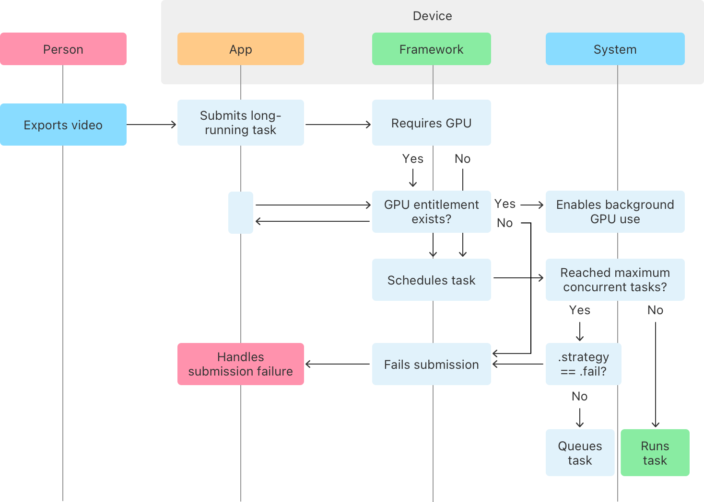
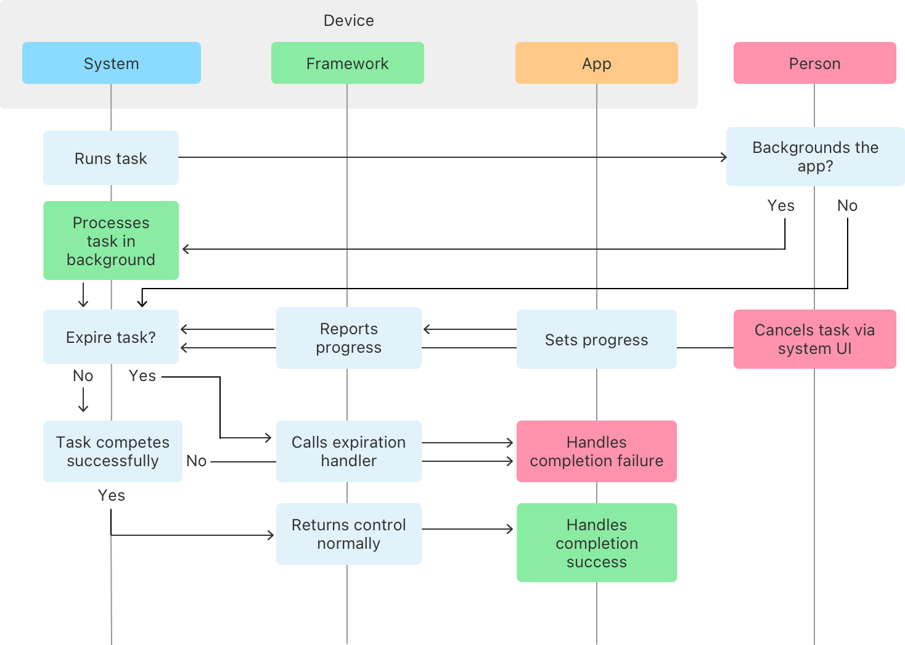

> Navigation: [Technologies](../technologies.md) · [Background Tasks](../backgroundtasks.md)

# Performing long-running tasks on iOS and iPadOS

<sub>Article</sub>

Use a continuous background task to do work that can complete as needed.

## Overview

On iOS and iPadOS, apps can execute long-running jobs using the Continuous Background Task ([BGContinuedProcessingTask](bgcontinuedprocessingtask.md)), which enables your app’s critical work that can take minutes or more, to complete in the background if a person backgrounds the app before the job completes.

Unlike other [BGTask](bgtask.md) subclasses, [BGContinuedProcessingTask](bgcontinuedprocessingtask.md) starts in the foreground. In addition, your app needs to run the task only in response to someone’s action, such as tapping a button. If a person backgrounds the app before the task completes, a continuous background task can still perform operations, for example, Core ML processing or sensor data analysis, that leverage the GPU (on supported devices). In the background, continuous background tasks can also use the network and perform intenstive CPU-based operations, for example, image processing with Core Image, Vision, and Accelerate. Example tasks include:

- Exporting video in a film-editing app, or audio in a digital audio workstation (DAW)
- Creating thumbnails for a new batch of photo uploads
- Applying visual filters (HDR, etc) or compressing images for social media posts

For added flexibility, you can set the system to fail any task if, under resource constraints, the system can’t begin processing the task immediately. Otherwise, the system queues the task to begin as soon as possible.



<sub>A flow chart that contains interconnected boxes, which represent actors, actions, or conditions. The flowchart shows a long-running task as it begins with a person and flows to and from the app, the framework, and the system, including submission failures. The flow culminates when the system queues the task or runs it.</sub>

When the system runs a continuous background task and a person backgrounds the app, the system keeps them informed of the task’s progress through a system interface. For power and performance considerations, people can cancel a continuous background task if they desire, through the interface. Your app regularly reports progress of the task, which enables the system to make informed suggestions through the interface about possibly stuck tasks that a person can cancel.

If a person cancels a task through the interface, the framework invokes the task’s expiration handler and the app handles the failure. Otherwise, the framework returns control to the app’s completion handler with a success status.



<sub>A flow chart that contains interconnected boxes, which represent actors, actions, or conditions. The flowchart shows a long-running task as it begins with the system and flows to and from the framework, the app, and a person, including background processing or task expiration. The flow culminates when the task completes and the app handles success or failure.</sub>

## Create a Continuous Background Task request

To begin a job that you want to complete even if a person backgrounds the app, start by creating a task request ([BGContinuedProcessingTaskRequest](bgcontinuedprocessingtaskrequest.md)). Choose a name the system can use to identify the specific job in the `taskIdentifier` parameter of the initializer and prefix it with your app’s bundle ID:

```swift
private let taskIdentifier = "<bundle-id><task-name>" // Use your app's bundle ID.   

// Create the task request. 
let request = BGContinuedProcessingTaskRequest(
    identifier: taskIdentifier,
    title: "A video export",
    subtitle: "About to start...",
)
```

Make the `task-name` portion of the task identifier unique for this specific job. The system displays the `title` and `subtitle` arguments you choose in a Live Activity, where a person can monitor the job’s progress and cancel it, if they choose.

## Enable background GPU use

If your job includes API that can utilize the GPU, enable background GPU use for your task by setting [requiredResources](bgcontinuedprocessingtaskrequest/requiredresources.md) to [BGContinuedProcessingTaskRequestResourcesGPU](bgcontinuedprocessingtaskrequest/resources/gpu.md). First, check whether the device supports background GPU use by seeing if [supportedResources](bgtaskscheduler/supportedresources.md) contains `.gpu`:

```swift
if BGTaskScheduler.supportedResources.contains(.gpu) {
    request.requiredResources = .gpu
}
```

The system requires your app to have the [Background GPU Access](../bundleresources/entitlements/com.apple.developer.background-tasks.continued-processing.gpu.md) entitlement with a value of `true` to use the GPU in the background. To do that, enable the Background GPU Access capability on your app’s target. For more information about capabilities in Xcode, see [Adding capabilities to your app](../xcode/adding-capabilities-to-your-app.md).

## Choose a processing strategy

When the system is busy or resource constrained, it might queue your task request for later execution. The default submission strategy, [BGContinuedProcessingTaskRequestSubmissionStrategyQueue](bgcontinuedprocessingtaskrequest/submissionstrategy/queue.md), instructs the system to add your task request to a queue if there’s no immediately available room to run it.

If instead you want the task submission to fail if the system is unable to run the task immediately, set [strategy](bgcontinuedprocessingtaskrequest/strategy.md) to [BGContinuedProcessingTaskRequestSubmissionStrategyFail](bgcontinuedprocessingtaskrequest/submissionstrategy/fail.md)  .

```swift
request.strategy = .fail
```

The system cancels a `fail` task right away if it can’t begin processing the task immediately, for example, when the system reaches a maximum number of concurrent tasks.

## Run the continuous background task

To run the job, register the task request with the shared [BGTaskScheduler](bgtaskscheduler.md) using the unique `taskIdentifier`:

```swift
BGTaskScheduler.shared.register(forTaskWithIdentifier: taskIdentifier, using: nil) { task in
    guard let task = task as? BGContinuedProcessingTask else { return }
    ... 
```

The [- registerForTaskWithIdentifier:usingQueue:launchHandler:](<bgtaskscheduler/register(fortaskwithidentifier_using_launchhandler_).md>) launch handler provides the [BGContinuedProcessingTask](bgcontinuedprocessingtask.md) reference for you to control execution.

Inside the launch handler, define your task’s long-running code:

```swift
// App-defined function that registers a continuous background task and defines its long-running work.
private func register() {
    // Submission bookkeeping. 
    if submitted {
        return
    }
    submitted = true
    
    // Register the continuous background task. 
    scheduler.register(forTaskWithIdentifier: taskIdentifier, using: nil) { task in
        guard let task = task as? BGContinuedProcessingTask else {
            return
        }
        /* Do long-running work here. */
    }
}

```

Next, submit the request by passing it to the shared scheduler’s [- submitTaskRequest:error:](<bgtaskscheduler/submit(__).md>) method:

```swift
// App-defined function that submits a video export job through a continuous background task.
private func submit() {
    // Create the task request. 
    let request = BGContinuedProcessingTaskRequest(identifier: taskIdentifier, title: "A video export", subtitle: "About to start...")

    // Submit the task request.
    do {
        try scheduler.submit(request)
    } catch {
        print("Failed to submit request: \(error)")
    }
}
```

## Report progress

The system displays the job and other continuous background tasks in a Live Activity to inform people of background task progress. It’s important to display accurate progress, as a person can cancel a task through the Live Activity widget if the task appears to be stuck.

To set progress, use the [ProgressReporting](../foundation/progressreporting.md) protocol that [BGContinuedProcessingTask](bgcontinuedprocessingtask.md) conforms to:

```swift
// Create a progress instance.
let stepCount: Int64 = 100 // For example, percentage of completion.
let progress = Progress(totalUnitCount: stepCount)

for i in 1...stepCount {
    // Update progress.
    task.progress.completedUnitCount = Int64(i)
} 
```

The system also prioritizes the termination of tasks that reflect minimal progress, if resource constraints occur at run time.

## Respond to task completion

Prepare to handle task failure or success by checking the tasks [expirationHandler](bgtask/expirationhandler.md):

```swift
/// App-defined function that exports a video through a continuous background task.
func export(_ task: BGContinuedProcessingTask) -> Result<(), PipelineError> {
    var wasExpired = false

    // Check the expiration handler to confirm job completion.
    task.expirationHandler = {
        wasExpired = true
    }

    // Update progress.
    let progress = task.progress
    progress.totalUnitCount = 100
    while !progress.isFinished && !wasExpired {
        progress.completedUnitCount += 1
        let formattedProgress = String(format: "%.2f", progress.fractionCompleted * 100)

        // Update task for displayed progress.
        task.updateTitle(task.title, subtitle: "Completed \(formattedProgress)%")
        sleep(1)
    }

    // Check progress to confirm job completion.
    if progress.isFinished {
        return .success(())
    } else {
        return .failure(.expired)
    }
}
```

A task can fail if your code encounters an error or the system expires your task, as occurs when a person cancels the task in the system UI.

> [!note] Note
> The system cancels any running tasks if a person closes the app in the app switcher, but the app doesn’t receive an indication of cancellation in that case.

## See Also

### Foreground tasks with background support

- [BGContinuedProcessingTask](bgcontinuedprocessingtask.md) — A task that starts in the foreground and can continue running in the background as needed.
- [Background GPU Access](../bundleresources/entitlements/com.apple.developer.background-tasks.continued-processing.gpu.md) — The entitlement the system requires for a continuous background task to use the GPU.
