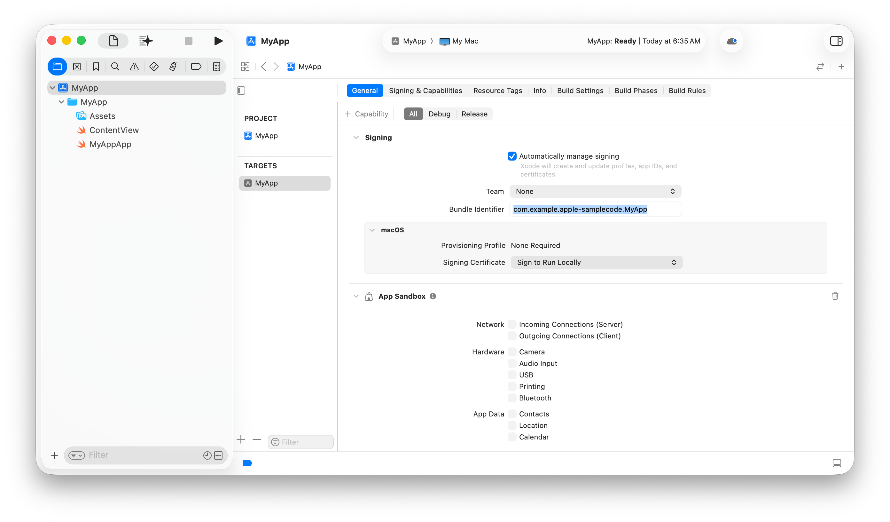
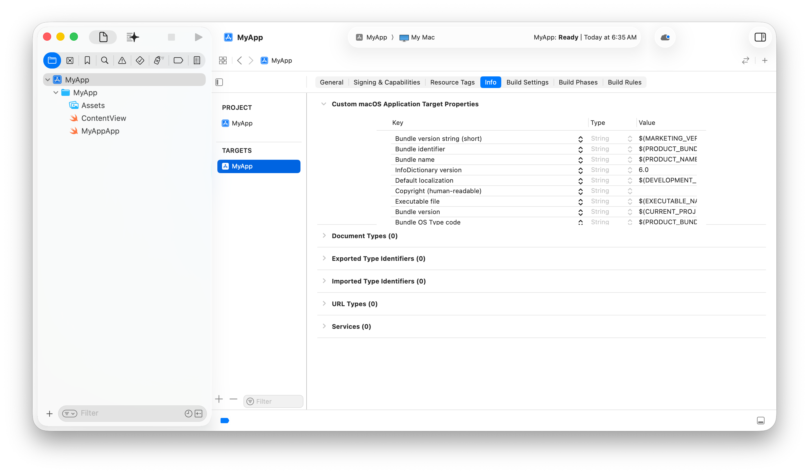

> Navigation: [Technologies](../technologies.md) · [Bundle Resources](../bundleresources.md) · [Information Property List](information-property-list.md)

# Managing your app’s information property list values

Article

Customize the information property list values for your app using Xcode.

## Overview

All bundles, which represent runnable code, need to contain an information property list file describing the bundle. The details of what to include in the property list vary by bundle type and platform. By default, Xcode manages information property list values using your target’s build settings, but if you need to use a different workflow — for example, generating the file from an external build tool — you can create and edit the information property list file yourself. In general, rely on Xcode to help create the information property list file for a given bundle.

### Create a new project

When you create a project from a template, as described in [Creating an Xcode project for an app](../xcode/creating-an-xcode-project-for-an-app.md), Xcode populates the project’s build settings with values that it uses to generate the information property list, or with variable values that it replaces at build time using build settings. For example, Xcode sets [CFBundleIdentifier](information-property-list/cfbundleidentifier.md) with a value of `$(PRODUCT_BUNDLE_IDENTIFIER)`.

In most cases, the project itself doesn’t contain an actual information property list file. Instead, when you build your app, Xcode uses the values from those build settings to generate the file in the app’s bundle. For some situations, such as iOS apps that use storyboards for their UI, Xcode creates an information property list file for the app that contains some of the properties, and merges its content with values from build settings to produce the final information property list file.

Xcode generates an information property list file for each target in the project. For example, watchOS apps that depend on an iOS app require a separate information property list for each of the watchOS and iOS targets.

### Configure target build settings

You can change some of the default settings and add others by configuring your project or target in Xcode. For example, changing the bundle identifier field in the target’s General pane affects the value of the `PRODUCT_BUNDLE_IDENTIFIER` build setting.

As noted in the previous section, this build setting controls the value of the [CFBundleIdentifier](information-property-list/cfbundleidentifier.md) key. For more information about configuring the target, see [Preparing your app for distribution](../xcode/preparing-your-app-for-distribution.md) and [Adding capabilities to your app](../xcode/adding-capabilities-to-your-app.md).

### Configure information property list values

You can edit information property list values, and add and remove keys, in the target’s Info pane. The Info pane ensures that the value types you use with each key are the types that the system expects, and supplies templates for complex types like dictionaries.

Configure purpose strings that explain why your app uses protected resources in the target’s Signing and Capabilities pane. For more information, see [Requesting access to protected resources](../uikit/requesting-access-to-protected-resources.md).

### Configure information property list build settings

When Xcode generates the information property list for a target, it uses values in the target’s build settings to populate the information property list file, and the target’s Info pane displays and changes the values of the corresponding build settings. Each information property list key corresponds with a build setting that’s named for the key with a `INFOPLIST_KEY_` prefix. For example, the `INFOPLIST_KEY_CFBundleDisplayName` key contains the value that Xcode uses to generate the [CFBundleDisplayName](information-property-list/cfbundledisplayname.md) key in the information property list file.

Xcode organizes these build settings in the Info.plist Values group in the target’s Build Settings pane.

To learn more about configuring your target’s build settings, see [Configuring the build settings of a target](../xcode/configuring-the-build-settings-of-a-target.md). For a full list of build settings, see [Build settings reference](../xcode/build-settings-reference.md).

> [!note] Note
> Xcode doesn’t use values from user-defined build settings when it generates the information property list, even if you create settings with the `INFOPLIST_KEY_` prefix. For example, a user-defined build setting called `INFOPLIST_KEY_ExampleKey` doesn’t result in Xcode generating an `ExampleKey` in the information property list.

### Manually supply an information property list file

If necessary, you can create a property list file that you use as your target’s information property list file, and edit the information property list directly in Xcode using the property list editor. To create an information property list file for your target, follow these steps:

1. Choose File \> New \> File from Template.
2. Select the Property List template, and click Next.
3. Give the file a name, for example, `Info.plist`.
4. Remove the file from any target in the list of targets.
5. Click Create.
6. Navigate to your target’s Build Settings pane.
7. Set the value for the `INFOPLIST_FILE` build setting to the path to the newly created file.

> [!important] Important
> Don’t add the property list file to your target. If you do, Xcode copies it into the Resources folder of your bundle, which isn’t the correct location for the file. Additionally, Xcode copies the file without processing its values, and copies information about your project’s build settings into the bundle that you distribute to your customers.

You can add or remove keys in the property list file, or change their values directly. For more information, see [Editing property list files](../xcode/editing-property-list-files.md).

How Xcode uses this file depends on the value of the `GENERATE_INFOPLIST_FILE` build setting. If the value is `Yes`, then Xcode merges the content of the property list file with the values from the Info.plist Values build settings when it generates your bundle’s information property list file. If it’s `No`, then Xcode doesn’t use build settings to generate the information property list file. Instead, it processes the values in the property list file you supply to substitute any build settings variables with their values, and copies the processed file into your bundle.

If you set `GENERATE_INFOPLIST_FILE` to `No`, Xcode shows keys and values from the property list file you supply in the target’s Info pane.

### Add platform- and device-specific properties

You can add platform- or device-specific keys to the information property list file by using this syntax for the key:

`[key name]-[platform]~[device]`

In this syntax, `platform` and `device` are optional qualifiers that restrict the value for the key to the platform or device. For example, use the `UISupportedInterfaceOrientations~ipad` key to set different orientation values for iPad devices.

The possible values for `platform` are:

- `freebsd`
- `hpux`
- `iphoneos`
- `linux`
- `macos`
- `solaris`
- `tvos`
- `visionos`
- `watchos`
- `windows`

The possible values for `device` are:

- `appletv`
- `applevision`
- `applewatch`
- `iphone`
- `ipad`
- `mac`

### Build the app’s information property list

Whether you let Xcode generate the information property list file for your target or supply a source file that Xcode copies into the target, Xcode ensures that the final file has the correct name and resides in the correct location for the given bundle type.

During the operation, Xcode uses build settings to perform variable substitution. It also inserts additional keys representing the target’s configuration that you specify in other ways. For example, you indicate the deployment target for an iOS app in Xcode’s project editor. Xcode translates that into the [MinimumOSVersion](information-property-list/minimumosversion.md) key that it adds during the copy.

### Localize the information property list

Many strings in the information property list are human-readable strings displayed to the user, so you should localize the file. For example, localize [CFBundleDisplayName](information-property-list/cfbundledisplayname.md), [CFBundleName](information-property-list/cfbundlename.md), and all of the `UsageDescription` keys found in [Protected resources](protected-resources.md). For more information, see [Localization](../xcode/localization.md).
