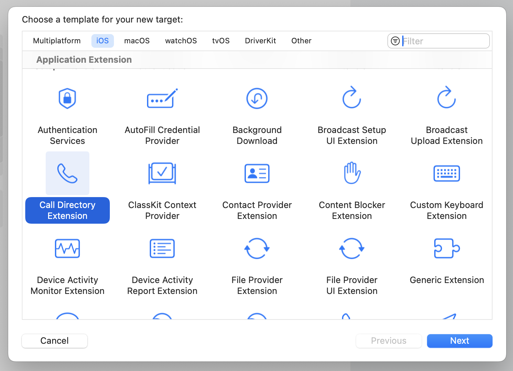

> Navigation: [Technologies](../technologies.md) · [CallKit](../callkit.md)

# Identifying and blocking calls

<sub>Article</sub>

Create a Call Directory app extension to identify and block incoming callers by their phone number.

## Overview

Use the Call Directory app extension to manage callers by their phone number. The system communicates with the app extension and checks a person’s contacts and block lists to identify callers.

> [!note] Note
> The [CXCallDirectoryPhoneNumber](cxcalldirectoryphonenumber.md) type represents phone numbers in a Call Directory app extension, and consists of a country calling code (such as `1` for the United States) followed by a sequence of digits.

### Create a Call Directory app extension

You can create a Call Directory app extension for your containing app by adding a new project target and selecting the Call Directory Extension template under Application Extension.



You set up both identification and blocking of incoming calls in the implementation of the [- beginRequestWithExtensionContext:](<cxcalldirectoryprovider/beginrequest(with_).md>) method of the [CXCallDirectoryProvider](cxcalldirectoryprovider.md) subclass of your Call Directory app extension. The system calls this method when it launches the app extension.

For more information about how app extensions work, see [App extensions](https://developer.apple.com/app-extensions/).

### Identify incoming callers

When a phone receives an incoming call, the system first checks the person’s contacts to find a matching phone number. If there’s no match, the system then checks your app’s Call Directory app extension to find a matching entry to identify the phone number. This is useful for apps that maintain a contact list that’s separate from the system contacts, such as for a social network, or for identifying incoming calls that may initiate from within the app, such as for customer service support or a delivery notification.

For example, consider a person who is friends with Maria in a social networking app, but who doesn’t have her phone number in their contacts. The social networking app has a Call Directory app extension, which downloads and adds the phone numbers of all of the person’s friends. Because of this, when there’s an incoming call from Maria, the system displays something like _(App Name) Caller ID: Maria Ruiz_ rather than _Unknown Caller_.

To provide identifying information about incoming callers, you use the [- addIdentificationEntryWithNextSequentialPhoneNumber:label:](<cxcalldirectoryextensioncontext/addidentificationentry(withnextsequentialphonenumber_label_).md>) method in the implementation of [- beginRequestWithExtensionContext:](<cxcalldirectoryprovider/beginrequest(with_).md>).

**Swift**

```swift
class CustomCallDirectoryProvider: CXCallDirectoryProvider {
    override func beginRequest(with context: CXCallDirectoryExtensionContext) {
        let labelsKeyedByPhoneNumber: [CXCallDirectoryPhoneNumber: String] = [ … ]
        for (phoneNumber, label) in labelsKeyedByPhoneNumber.sorted(by: <) {
            context.addIdentificationEntry(withNextSequentialPhoneNumber: phoneNumber, label: label)        
        }

        context.completeRequest()
    }
}
```

**Objective-C**

```objc
@interface CustomCallDirectoryProvider: CXCallDirectoryProvider
@end
 
@implementation CustomCallDirectoryProvider
- (void)beginRequestWithExtensionContext:(NSExtensionContext *)context {
    NSDictionary<NSNumber *, NSString *> *labelsKeyedByPhoneNumber = @{ … };
    for (NSNumber *phoneNumber in [labelsKeyedByPhoneNumber.allKeys sortedArrayUsingSelector:@selector(compare:)]) {
       NSString *label = labelsKeyedByPhoneNumber[phoneNumber];
       [context addIdentificationEntryWithNextSequentialPhoneNumber:(CXCallDirectoryPhoneNumber)[phoneNumber unsignedLongLongValue] label:label];
    }
 
    [context completeRequestWithCompletionHandler:nil];
}
@end
```

Because the system calls this method only when it launches the app extension and not for each individual call, you need to specify call identification information all at once. For example, you can’t make a request to a web service to find information about an incoming call.

#### Block incoming calls

When a phone receives an incoming call, the system first checks the person’s block list to determine whether to block the call. If the phone number isn’t on a user- or system-defined block list, the system then checks your app’s Call Directory app extension to find a matching blocked number. This is useful for apps that maintain a database of known solicitors, or allow someone to block any numbers that match a set of criteria.

To block incoming calls for a particular phone number, you use the [- addBlockingEntryWithNextSequentialPhoneNumber:](<cxcalldirectoryextensioncontext/addblockingentry(withnextsequentialphonenumber_).md>) method in the implementation of [- beginRequestWithExtensionContext:](<cxcalldirectoryprovider/beginrequest(with_).md>).

> [!note] Note
> You can specify that your Call Directory app extension adds identification and blocks phone numbers in its implementation of [- beginRequestWithExtensionContext:](<cxcalldirectoryprovider/beginrequest(with_).md>).

**Swift**

```swift
class CustomCallDirectoryProvider: CXCallDirectoryProvider {
    override func beginRequest(with context: CXCallDirectoryExtensionContext) {
        let blockedPhoneNumbers: [CXCallDirectoryPhoneNumber] = [ … ]
        for phoneNumber in blockedPhoneNumbers.sorted(by: <) {
            context.addBlockingEntry(withNextSequentialPhoneNumber: phoneNumber)
        }
        
        context.completeRequest()
    }
}
```

**Objective-C**

```objc
@interface CustomCallDirectoryProvider: CXCallDirectoryProvider
@end
 
@implementation CustomCallDirectoryProvider
- (void)beginRequestWithExtensionContext:(NSExtensionContext *)context {
    NSArray<NSNumber *> *blockedPhoneNumbers.sorted = @[ … ];
     for (NSNumber *phoneNumber in [blockedPhoneNumbers.sorted sortedArrayUsingSelector:@selector(compare:)]) {
        [context addBlockingEntryWithNextSequentialPhoneNumber:(CXCallDirectoryPhoneNumber)[phoneNumber unsignedLongLongValue]];
     }
 
    [context completeRequestWithCompletionHandler:nil];
}
@end
```

### Handle audio session interruptions

Like other audio apps, VoIP apps need to handle audio session interruptions. Interruptions may occur for several reasons, including a person accepting another call or closing the Smart Folio of their iPad. In these situations, an interruption notification contains the reason for the interruption and allows your app to correctly terminate the call, if necessary. For more information, see [Handling audio interruptions](../avfaudio/handling-audio-interruptions.md).

## See Also

### Caller ID

- [CXCallDirectoryProvider](cxcalldirectoryprovider.md) — The principal object for a Call Directory app extension for a host app.
- [CXCallDirectoryExtensionContext](cxcalldirectoryextensioncontext.md) — A programmatic interface for adding identification and blocking entries to a Call Directory app extension.
- [CXCallDirectoryExtensionContextDelegate](cxcalldirectoryextensioncontextdelegate.md) — A collection of methods a Call Directory extension context object calls when a request fails.
- [CXCallDirectoryManager](cxcalldirectorymanager.md) — The programmatic interface to an object that manages a Call Directory app extension.
