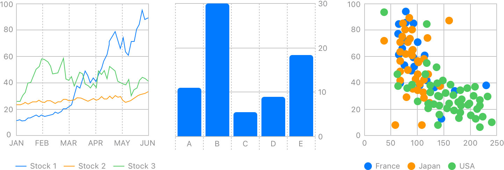

> Navigation: [Technologies](technologies.md)

# Swift Charts

Framework

Construct and customize charts on every Apple platform.

## Overview

Swift Charts is a powerful and concise SwiftUI framework you can use to transform your data into informative visualizations. With Swift Charts, you can build effective and customizable charts with minimal code. This framework provides marks, scales, axes, and legends as building blocks that you can combine to develop a broad range of data-driven charts.

There are many ways you can use Swift Charts to communicate patterns or trends in your data. You can create a variety of charts including line charts, bar charts, and scatter plots as shown above. When you create a chart using this framework, it automatically generates scales and axes that fit your data.

Swift Charts supports localization and accessibility features. You can also override default behavior to customize your charts by using chart modifiers. For example, you can create a dynamic experience by adding animations to your charts.

## Topics

### Essentials

- [Swift Charts updates](updates/swiftcharts.md) — Learn about important changes to Swift Charts.

### Charts

- [Creating a chart using Swift Charts](charts/creating-a-chart-using-swift-charts.md) — Make a chart by combining chart building blocks in SwiftUI.
- [Visualizing your app’s data](charts/visualizing-your-app-s-data.md) — Build complex and interactive charts using Swift Charts.
- [Chart](charts/chart.md) — A SwiftUI view that displays a chart.
- [ChartContent](charts/chartcontent.md) — A type that represents the content that you draw on a chart.
- [ChartContentBuilder](charts/chartcontentbuilder.md) — A result builder that you use to compose the contents of a chart.
- [Plot](charts/plot.md) — A mechanism for grouping chart contents into a single entity.

### 3D charts

- [Chart3D](charts/chart3d.md) — A SwiftUI view that displays interactive 3D charts and visualizations.
- [Chart3DContent](charts/chart3dcontent.md) — A type that represents the three-dimensional content that you draw on a chart.
- [Chart3DContentBuilder](charts/chart3dcontentbuilder.md) — A result builder that you use to compose the three-dimensional contents of a chart.
- [SurfacePlot](charts/surfaceplot.md) — Chart content that represents a mathematical function of two variables using a 3D surface.

### Marks

- [AreaMark](charts/areamark.md) — Chart content that represents data using the area of one or more regions.
- [LineMark](charts/linemark.md) — Chart content that represents data using a sequence of connected line segments.
- [PointMark](charts/pointmark.md) — Chart content that represents data using points.
- [RectangleMark](charts/rectanglemark.md) — Chart content that represents data using rectangles.
- [RuleMark](charts/rulemark.md) — Chart content that represents data using a single horizontal or vertical rule.
- [BarMark](charts/barmark.md) — Chart content that represents data using bars.
- [SectorMark](charts/sectormark.md) — A sector of a pie or donut chart, which shows how individual categories make up a meaningful total.

### Vectorized plots

- [Creating a data visualization dashboard with Swift Charts](charts/creating-a-data-visualization-dashboard-with-swift-charts.md) — Visualize an entire data collection efficiently by instantiating a single vectorized plot in Swift Charts.
- [AreaPlot](charts/areaplot.md) — Chart content that represents a function or a collection of data using the area of one or more regions.
- [LinePlot](charts/lineplot.md) — Chart content that represents a function or a collection of data using a sequence of connected line segments.
- [PointPlot](charts/pointplot.md) — Chart content that represents a collection of data using points.
- [RectanglePlot](charts/rectangleplot.md) — Chart content that represents a collection of data using rectangles.
- [RulePlot](charts/ruleplot.md) — Chart content that represents a collection of data using a single horizontal or vertical rule.
- [BarPlot](charts/barplot.md) — Chart content that represents a collection of data using bars.
- [SectorPlot](charts/sectorplot.md) — Chart content that represents a collection of data using a sector of a pie or donut chart, which shows how individual categories make up a meaningful total.
- [VectorizedChartContent](charts/vectorizedchartcontent.md) — A generic type that represents content conveyed via a chart.

### Mark configuration

- [MarkStackingMethod](charts/markstackingmethod.md) — The ways in which you can stack marks in a chart.
- [MarkDimension](charts/markdimension.md) — An individual dimension representing a mark’s width or height.
- [InterpolationMethod](charts/interpolationmethod.md) — The ways in which line or area marks interpolate their data.
- [BasicChartSymbolShape](charts/basicchartsymbolshape.md) — A basic chart symbol shape.
- [ChartSymbolShape](charts/chartsymbolshape.md) — A type that can act as a shape for the marks that you add to a chart.
- [AnyChartSymbolShape](charts/anychartsymbolshape.md) — A type-erased plotting shape.

### Labeled data

- [PlottableValue](charts/plottablevalue.md) — Labeled data that you plot in a chart using marks.
- [Plottable](charts/plottable.md) — A type that can serve as data to plot in a chart.

### Scales

- [ScaleRange](charts/scalerange.md) — A type that you can use to configure the range of a chart.
- [PositionScaleRange](charts/positionscalerange.md) — A type that configures the x-axis and y-axis values.
- [PlotDimensionScaleRange](charts/plotdimensionscalerange.md) — A range that represents the plot area’s width or height.
- [ScaleDomain](charts/scaledomain.md) — A type that you can use to configure the domain of a chart.
- [AutomaticScaleDomain](charts/automaticscaledomain.md) — A domain that the chart infers from its data.
- [ScaleType](charts/scaletype.md) — The ways you can scale the domain or range of a plot.

### Axes

- [Customizing axes in Swift Charts](charts/customizing-axes-in-swift-charts.md) — Improve the clarity of your chart by configuring the appearance of its axes.
- [ChartAxisContent](charts/chartaxiscontent.md) — A view that represents a chart’s axis.
- [AxisContent](charts/axiscontent.md) — A type that represents the elements you use to build a chart’s axes.
- [AxisMarks](charts/axismarks.md) — A group of visual marks that a chart draws to indicate the composition of a chart’s axes.
- [AnyAxisContent](charts/anyaxiscontent.md) — A type-erased element of a chart’s axis.
- [AxisContentBuilder](charts/axiscontentbuilder.md) — A result builder that constructs axis content.

### Axis marks

- [AxisMark](charts/axismark.md) — A type that serves as the basic building block for the elements of an axis.
- [AxisTick](charts/axistick.md) — A mark that a chart draws on an axis to indicate a reference point along that axis.
- [AxisGridLine](charts/axisgridline.md) — A line that a chart draws across its plot area to indicate a reference point along a particular axis.
- [AxisValueLabel](charts/axisvaluelabel.md) — A label that describes the value for an axis mark.
- [AxisValue](charts/axisvalue.md) — A value for an axis mark.
- [AnyAxisMark](charts/anyaxismark.md) — A type-erased axis mark.
- [AxisMarkBuilder](charts/axismarkbuilder.md) — A result builder that constructs axis marks and overrides default marks.

### Annotations

- [AnnotationContext](charts/annotationcontext.md) — Information about an item that you add an annotation to.
- [AnnotationPosition](charts/annotationposition.md) — The position of an annotation.
- [AnnotationOverflowResolution](charts/annotationoverflowresolution.md)

### Data bins

- [NumberBins](charts/numberbins.md) — A collection of bins for a chart that plots data against numbers.
- [DateBins](charts/datebins.md) — A collection of bins for a chart that plots data against dates.
- [ChartBinRange](charts/chartbinrange.md) — The range of data that a single bin of a chart represents.

### Chart management

- [ChartPlotContent](charts/chartplotcontent.md) — A view that represents a chart’s plot area.
- [ChartProxy](charts/chartproxy.md) — A proxy that you use to access the scales and plot area of a chart.

### Scrolling

- [ChartScrollTargetBehavior](charts/chartscrolltargetbehavior.md) — A type that configures the scroll behavior of charts.
- [ChartScrollTargetBehaviorContext](charts/chartscrolltargetbehaviorcontext.md) — Contextual information that you can use to determine how to best adjust how charts scroll.

### Structures

- [Chart3DRenderingStyle](charts/chart3drenderingstyle.md)
