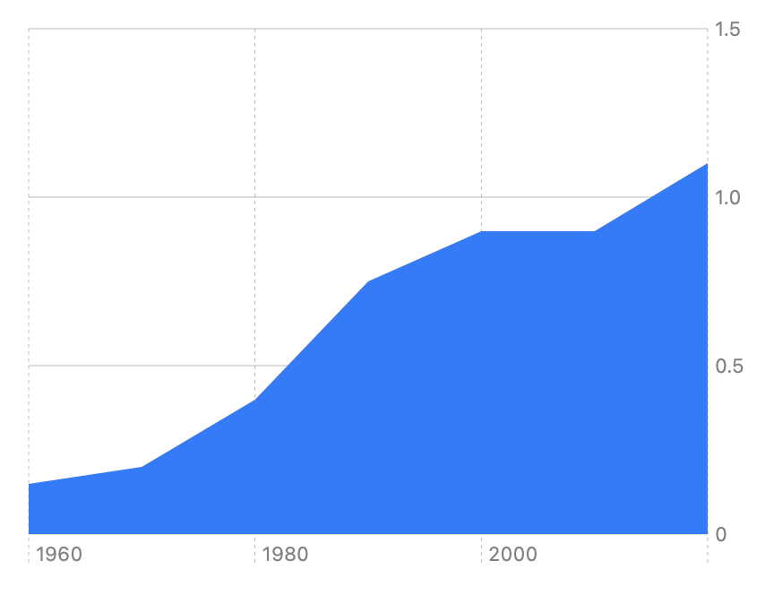

> Navigation: [Technologies](../../technologies.md) · [Swift Charts](../../charts.md) · [AreaMark](../areamark.md)

# init(x:y:stacking:)

<sub>Initializer</sub>

Creates an area mark using the specified horizontal and vertical positions.

<sub>iOS, iPadOS, Mac Catalyst, macOS, tvOS, visionOS, watchOS</sub>

```swift
nonisolated init<X, Y>(x: PlottableValue<X>, y: PlottableValue<Y>, stacking: MarkStackingMethod = .standard) where X : Plottable, Y : Plottable
```

## Parameters

- `x` — The horizontal position for the mark.

- `y` — The vertical position for the mark.

- `stacking` — The way in which the chart stacks area regions. The default is [standard](../markstackingmethod/standard.md).

## Discussion

You can use this initializer to create a basic area chart:

```swift
Chart(cheeseburgerCost) { cost in
    AreaMark(
        x: .value("Date", cost.date),
        y: .value("Price", cost.price)
    )
}
```

The resulting chart automatically scales and labels the axes based on the data, and fills the area under the data points with a default color:



<sub>A chart that shows the years 1960 to 2020 on the x-axis and a number in the range of 0 to 1.5 on the y-axis. An irregular, monotonically increasing, piecewise linear curve starts near the lower left and continues toward the upper right. The area under the curve is filled in with a blue color.</sub>

## See Also

### Creating an area mark

- [init(x:y:series:stacking:)](<init(x_y_series_stacking_).md>) — Creates an area mark and associates it with the specified series.
