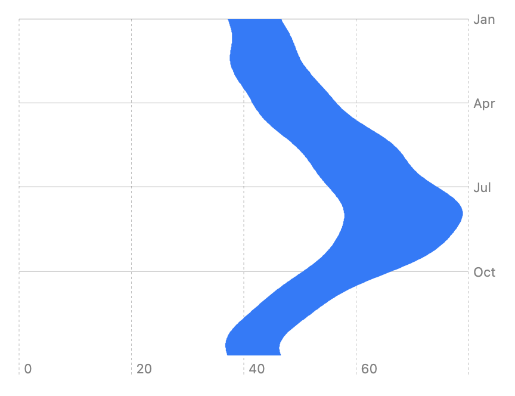

> Navigation: [Technologies](../../technologies.md) · [Swift Charts](../../charts.md) · [AreaMark](../areamark.md)

# init(xStart:xEnd:y:)

<sub>Initializer</sub>

Creates an area mark that plots values with a horizontal interval.

<sub>iOS, iPadOS, Mac Catalyst, macOS, tvOS, visionOS, watchOS</sub>

```swift
nonisolated init<X, Y>(xStart: PlottableValue<X>, xEnd: PlottableValue<X>, y: PlottableValue<Y>) where X : Plottable, Y : Plottable
```

## Parameters

- `xStart` — The starting horizontal position for the mark.

- `xEnd` — The ending horizontal position for the mark.

- `y` — The vertical position for the mark.

## Discussion

Use this initializer to create a range area chart with horizontal intervals. For example you can create a region that encompasses all the temperatures over the course of a day, across a number of days:

```swift
Chart(data) { day in
    AreaMark(
        xStart: .value("Minimum Temperature", minimumTemperature),
        xEnd: .value("Maximum Temperature", day.maximumTemperature),
        y: .value("Date", day.date)
    )
}
```



<sub>A chart that shows month names on the y-axis, ranging from January to October, and a number in the range 0 to 80 on the x-axis. A solid blue region spans the chart from top to bottom. The region is close to the middle of the x-axis on either end, and closer to the right of the chart in the middle. The region is thinner at the ends and thicker in the middle.</sub>

If you want to plot values that have a vertical interval, use [init(x:yStart:yEnd:)](<init(x_ystart_yend_).md>) instead.

## See Also

### Creating a range area chart

- [init(x:yStart:yEnd:)](<init(x_ystart_yend_).md>) — Creates an area mark that plots values with a vertical interval.
- [init(x:yStart:yEnd:series:)](<init(x_ystart_yend_series_).md>) — Creates an area mark that plots values with a vertical interval and associates it with the specified series.
- [init(xStart:xEnd:y:series:)](<init(xstart_xend_y_series_).md>) — Creates an area mark that plots values with a horizontal interval and associates it with the specified series.
