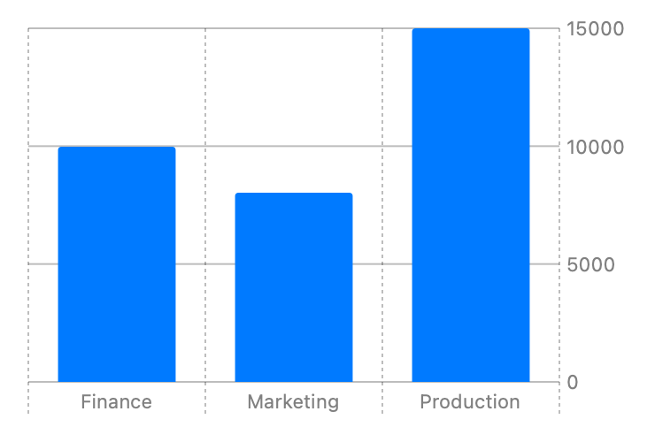
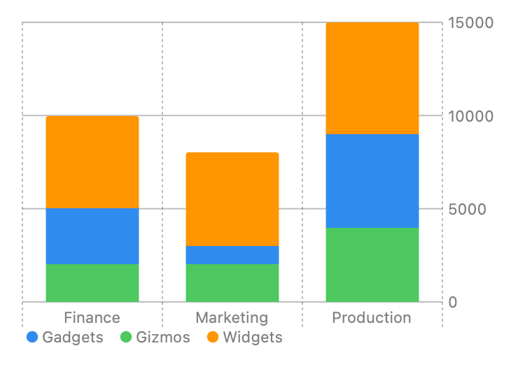
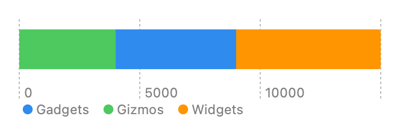

> Navigation: [Technologies](../technologies.md) · [Swift Charts](../charts.md)

# BarMark

<sub>Structure</sub>

Chart content that represents data using bars.

<sub>iOS, iPadOS, Mac Catalyst, macOS, tvOS, visionOS, watchOS</sub>

```swift
@MainActor @preconcurrency struct BarMark
```

## Overview

You can create different kinds of bar charts using the `BarMark` chart content. To create a simple vertical bar chart that plots categories with x positions and numbers with y positions, use [init(x:y:width:height:stacking:)](<barmark/init(x_y_width_height_stacking_).md>). For example, you can display profit by department:

```swift
struct Profit {
    let department: String
    let profit: Double
}

let data: [Profit] = [
    Profit(department: "Production", profit: 15000),
    Profit(department: "Marketing", profit: 8000),
    Profit(department: "Finance", profit: 10000)
]

var body: some View {
    Chart(data) {
        BarMark(
            x: .value("Department", $0.department),
            y: .value("Profit", $0.profit)
        )
    }
}
```


<sub>Vertical bar chart with x-axis showing department categories Production, Marketing, Finance and with y-axis ranging from 0 to 15000. There are 3 bars: Production 15000, Marketing 8000, Finance 10000.</sub>

Swift Charts provides several other initializers for `BarMark`. Below are a few more examples using them. For a full list of initializers see the topic section.

### Stacked Bar Chart

`BarkMark` automatically stacks content when more than one bar maps to the same location. You can see this if you split the profit data up by category:

```swift
struct ProfitByCategory {
    let department: String
    let profit: Double
    let productCategory: String
}

let data: [ProfitByCategory] = [
    ProfitByCategory(department: "Production", profit: 4000, productCategory: "Gizmos"),
    ProfitByCategory(department: "Production", profit: 5000, productCategory: "Gadgets"),
    ProfitByCategory(department: "Production", profit: 6000, productCategory: "Widgets"),
    ProfitByCategory(department: "Marketing", profit: 2000, productCategory: "Gizmos"),
    ProfitByCategory(department: "Marketing", profit: 1000, productCategory: "Gadgets"),
    ProfitByCategory(department: "Marketing", profit: 5000, productCategory: "Widgets"),
    ProfitByCategory(department: "Finance", profit: 2000, productCategory: "Gizmos"),
    ProfitByCategory(department: "Finance", profit: 3000, productCategory: "Gadgets"),
    ProfitByCategory(department: "Finance", profit: 5000, productCategory: "Widgets")
]

var body: some View {
    Chart(data) {
        BarMark(
            x: .value("Category", $0.department),
            y: .value("Profit", $0.profit)
        )
    }
}
```



<sub>Vertical bar chart with x-axis showing department categories Production, Marketing, Finance with stacked product categories Gizmos, Gadgets, Widgets, and with y-axis ranging from 0 to 20,000. There are 3 bars: Production 15000, Marketing 8000, and Finance 10000.</sub>

This results in a chart that looks identical to the chart seen in the Overview section because the bars with the same department category are stacked on top of each other. To differentiate the product categories, add a [foregroundStyle(by:)](<chartcontent/foregroundstyle(by_).md>) modifer that specifies a visual encoding for the `productCategory`:

```swift
Chart(data) {
    BarMark(
        x: .value("Category", $0.department),
        y: .value("Profit", $0.profit)
    )
    .foregroundStyle(by: .value("Product Category", $0.productCategory))
}
```



<sub>Vertical bar chart with x-axis showing department categories Production, Marketing, Finance with stacked product categories Gizmos, Gadgets, Widgets, and with y-axis ranging from 0 to 15000. There are 3 bars: Production 15,000: Gizmos 4000, Gadgets 5000, and Widgets 6000, Marketing 8000: Gizmos 2000, Gadgets 1000, and Widgets 5000, Finance 10000: Gizmos 2000, Gadgets 3000, and Widgets 500. Legend showing the color mapped to a product category.</sub>

You can use the optional `stacking:` parameter in the `BarMark` initializer to modify the stacking mechanism. See [MarkStackingMethod](markstackingmethod.md) for the stacking options.

### 1D Bar Chart

To build a one dimensional chart, use one of the initializers that only requires a [PlottableValue](plottablevalue.md) for one dimension, like [init(x:yStart:yEnd:width:stacking:)](<barmark/init(x_ystart_yend_width_stacking_).md>) for plotting with x. The example below reuses the data from the previous example to get the production department values:

```swift
Chart(data) { // Get the Production values.
    BarMark(
        x: .value("Profit", $0.profit)
    )
    .foregroundStyle(by: .value("Product Category", $0.productCategory))
}
```



<sub>Horizontal bar chart with one bar on the x-axis showing profit ranging from 0 to 15000 with stacked categoreis Gizmos, Gadgets and Widgets. Legend showing the color mapped to a product category.</sub>

### Interval Bar Chart

Use `BarMark` to represent intervals by using the [init(xStart:xEnd:y:height:)](<barmark/init(xstart_xend_y_height_).md>), [init(xStart:xEnd:y:height:stacking:)](<barmark/init(xstart_xend_y_height_stacking_).md>), [init(x:yStart:yEnd:width:)](<barmark/init(x_ystart_yend_width_).md>) or  [init(x:yStart:yEnd:width:stacking:)](<barmark/init(x_ystart_yend_width_stacking_).md>). The example below displays a Gantt chart by plotting the `start` and `end` properties to x positions and the `task` property to y positions:

```swift
struct Job {
    let job: String
    let start: Double
    let end: Double
}

let data: [Job] = [
    Job(job: "Job 1", start: 0, end: 15),
    Job(job: "Job 2", start: 5, end: 25),
    Job(job: "Job 1", start: 20, end: 35),
    Job(job: "Job 1", start: 40, end: 55),
    Job(job: "Job 2", start: 30, end: 60),
    Job(job: "Job 2", start: 30, end: 60)
]

var body: some View {
    Chart(data) {
        BarMark(
            xStart: .value("Start Time", $0.start),
            xEnd: .value("End Time", $0.end),
            y: .value("Job", $0.job)
        )
    }
}
```


<sub>Horizontal bar chart with x-axis showing start and end time and y-axis showing task name. It has 5 bars, Task 1 range 0 to 15, range 20 to 35, and range 40 to 55, and Task 2 range 5 to 25 and range 30 to 60 task.</sub>

## Relationships

- **Conforms To**: [ChartContent](chartcontent.md), [Copyable](../swift/copyable.md), [Escapable](../swift/escapable.md), [Sendable](../swift/sendable.md), [SendableMetatype](../swift/sendablemetatype.md)

## Topics

### Creating a bar mark

- [init(x:yStart:yEnd:width:)](<barmark/init(x_ystart_yend_width_).md>) — Creates a bar mark that plots values with x and its y interval.
- [init(xStart:xEnd:y:height:)](<barmark/init(xstart_xend_y_height_).md>) — Creates a bar mark that plots values with its x interval and y.
- [init(x:y:width:height:stacking:)](<barmark/init(x_y_width_height_stacking_).md>) — Creates a bar mark that plots values with x and y.
- [init(xStart:xEnd:yStart:yEnd:)](<barmark/init(xstart_xend_ystart_yend_)-98wo9.md>) — Creates a bar mark that plots values with its x interval and fixed y position.
- [init(xStart:xEnd:yStart:yEnd:)](<barmark/init(xstart_xend_ystart_yend_)-7541n.md>) — Creates a bar mark with fixed x interval that plots values with its y interval.
- [init(x:y:width:height:stacking:)](<barmark/init(x_y_width_height_stacking_).md>) — Creates a bar mark that plots values with x and y.
- [init(x:yStart:yEnd:width:stacking:)](<barmark/init(x_ystart_yend_width_stacking_).md>) — Creates a bar mark that plots a value on x with fixed y interval.
- [init(xStart:xEnd:y:height:stacking:)](<barmark/init(xstart_xend_y_height_stacking_).md>) — Creates a bar mark that plots values on y with fixed x interval.

## See Also

### Marks

- [AreaMark](areamark.md) — Chart content that represents data using the area of one or more regions.
- [LineMark](linemark.md) — Chart content that represents data using a sequence of connected line segments.
- [PointMark](pointmark.md) — Chart content that represents data using points.
- [RectangleMark](rectanglemark.md) — Chart content that represents data using rectangles.
- [RuleMark](rulemark.md) — Chart content that represents data using a single horizontal or vertical rule.
- [SectorMark](sectormark.md) — A sector of a pie or donut chart, which shows how individual categories make up a meaningful total.
