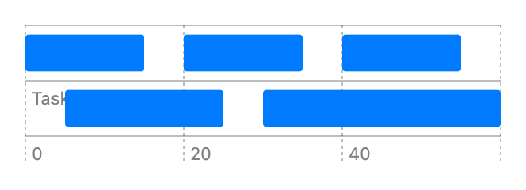

> Navigation: [Technologies](../../technologies.md) · [Swift Charts](../../charts.md) · [BarMark](../barmark.md)

# init(xStart:xEnd:y:height:)

<sub>Initializer</sub>

Creates a bar mark that plots values with its x interval and y.

<sub>iOS, iPadOS, Mac Catalyst, macOS, tvOS, visionOS, watchOS</sub>

```swift
nonisolated init<X, Y>(xStart: PlottableValue<X>, xEnd: PlottableValue<X>, y: PlottableValue<Y>, height: MarkDimension = .automatic) where X : Plottable, Y : Plottable
```

## Parameters

- `xStart` — The value plotted with x start.

- `xEnd` — The value plotted with x end.

- `y` — The value plotted with y.

- `height` — The bar height.  If `height` is `nil`, the default bar size will be applied.

### Discussion

Use this initializer to show horizontal intervals for one or more categories:

```swift
Chart(data) {
   BarMark(
       xStart: .value("Start Time", $0.start),
       xEnd: .value("End Time", $0.end),
       y: .value("Job", $0.job)
   )
}
```



<sub>Horizontal bar chart with x-axis showing start and end time and y-axis showing task name. It has 5 bars, Task 1 range 0 to 15, range 20 to 35, and range 40 to 55, and Task 2 range 5 to 25 and range 30 to 60 task</sub>

## See Also

### Creating a bar mark

- [init(x:yStart:yEnd:width:)](<init(x_ystart_yend_width_).md>) — Creates a bar mark that plots values with x and its y interval.
- [init(x:y:width:height:stacking:)](<init(x_y_width_height_stacking_).md>) — Creates a bar mark that plots values with x and y.
- [init(xStart:xEnd:yStart:yEnd:)](<init(xstart_xend_ystart_yend_)-98wo9.md>) — Creates a bar mark that plots values with its x interval and fixed y position.
- [init(xStart:xEnd:yStart:yEnd:)](<init(xstart_xend_ystart_yend_)-7541n.md>) — Creates a bar mark with fixed x interval that plots values with its y interval.
- [init(x:y:width:height:stacking:)](<init(x_y_width_height_stacking_).md>) — Creates a bar mark that plots values with x and y.
- [init(x:yStart:yEnd:width:stacking:)](<init(x_ystart_yend_width_stacking_).md>) — Creates a bar mark that plots a value on x with fixed y interval.
- [init(xStart:xEnd:y:height:stacking:)](<init(xstart_xend_y_height_stacking_).md>) — Creates a bar mark that plots values on y with fixed x interval.
