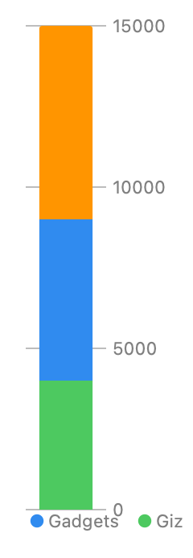

> Navigation: [Technologies](../../technologies.md) · [Swift Charts](../../charts.md) · [BarMark](../barmark.md)

# init(xStart:xEnd:y:height:stacking:)

<sub>Initializer</sub>

Creates a bar mark that plots values on y with fixed x interval.

<sub>iOS, iPadOS, Mac Catalyst, macOS, tvOS, visionOS, watchOS</sub>

```swift
nonisolated init<Y>(xStart: CGFloat? = nil, xEnd: CGFloat? = nil, y: PlottableValue<Y>, height: MarkDimension = .automatic, stacking: MarkStackingMethod = .standard) where Y : Plottable
```

## Parameters

- `xStart` — The x start position. If `xStart` is `nil` then the rectangle will start at the leading edge of the plotting area.

- `xEnd` — The x end position. If `xStart` is `nil` then the rectangle will end at the trailing edge of the plotting area.

- `y` — The value plotted with y.

- `height` — The bar height.  If `height` is `nil`, the default bar size will be applied.

- `stacking` — The stacking method for the bars with the same categorical/date values. If `stacking` is `nil`, the bars will not be stacked.

### Discussion

Use this initializer to create a chart with a single vertical bar:

```swift
Chart(data) {
    BarMark(
        y: .value("Profit", $0.profit)
    )
    .foregroundStyle(by: .value("Product Category", $0.productCategory))
}
```



<sub>Vertical bar chart with one bar on the y-axis showing profit ranging from 0 to 15000 with stacked categories Gizmos, Gadgets and Widgets. Legend showing the color mapped to a product category.</sub>

## See Also

### Creating a bar mark

- [init(x:yStart:yEnd:width:)](<init(x_ystart_yend_width_).md>) — Creates a bar mark that plots values with x and its y interval.
- [init(xStart:xEnd:y:height:)](<init(xstart_xend_y_height_).md>) — Creates a bar mark that plots values with its x interval and y.
- [init(x:y:width:height:stacking:)](<init(x_y_width_height_stacking_).md>) — Creates a bar mark that plots values with x and y.
- [init(xStart:xEnd:yStart:yEnd:)](<init(xstart_xend_ystart_yend_)-98wo9.md>) — Creates a bar mark that plots values with its x interval and fixed y position.
- [init(xStart:xEnd:yStart:yEnd:)](<init(xstart_xend_ystart_yend_)-7541n.md>) — Creates a bar mark with fixed x interval that plots values with its y interval.
- [init(x:y:width:height:stacking:)](<init(x_y_width_height_stacking_).md>) — Creates a bar mark that plots values with x and y.
- [init(x:yStart:yEnd:width:stacking:)](<init(x_ystart_yend_width_stacking_).md>) — Creates a bar mark that plots a value on x with fixed y interval.
