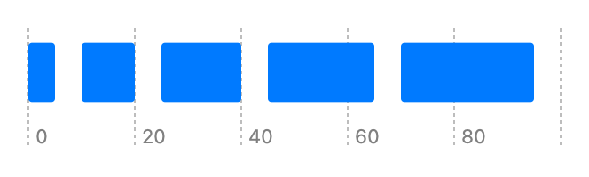

> Navigation: [Technologies](../../technologies.md) · [Swift Charts](../../charts.md) · [BarMark](../barmark.md)

# init(xStart:xEnd:yStart:yEnd:)

<sub>Initializer</sub>

Creates a bar mark that plots values with its x interval and fixed y position.

<sub>iOS, iPadOS, Mac Catalyst, macOS, tvOS, visionOS, watchOS</sub>

```swift
nonisolated init<X>(xStart: PlottableValue<X>, xEnd: PlottableValue<X>, yStart: CGFloat? = nil, yEnd: CGFloat? = nil) where X : Plottable
```

## Parameters

- `xStart` — The value plotted with x start.

- `xEnd` — The value plotted with x end.

### Discussion

Use this initializer to show horizontal intervals for one category:

```swift
Chart(data) {
   BarMark(
       xStart: .value("Start Time", $0.start),
       xEnd: .value("End Time", $0.end)
   )
}
```



<sub>Horizontal bar chart with x-axis showing start and end time. It has 5 bars, Task 1 range 0 to 5, range 10 to 20, range 25 to 40, range 45 to 65, and range 70-95.</sub>

## See Also

### Creating a bar mark

- [init(x:yStart:yEnd:width:)](<init(x_ystart_yend_width_).md>) — Creates a bar mark that plots values with x and its y interval.
- [init(xStart:xEnd:y:height:)](<init(xstart_xend_y_height_).md>) — Creates a bar mark that plots values with its x interval and y.
- [init(x:y:width:height:stacking:)](<init(x_y_width_height_stacking_).md>) — Creates a bar mark that plots values with x and y.
- [init(xStart:xEnd:yStart:yEnd:)](<init(xstart_xend_ystart_yend_)-7541n.md>) — Creates a bar mark with fixed x interval that plots values with its y interval.
- [init(x:y:width:height:stacking:)](<init(x_y_width_height_stacking_).md>) — Creates a bar mark that plots values with x and y.
- [init(x:yStart:yEnd:width:stacking:)](<init(x_ystart_yend_width_stacking_).md>) — Creates a bar mark that plots a value on x with fixed y interval.
- [init(xStart:xEnd:y:height:stacking:)](<init(xstart_xend_y_height_stacking_).md>) — Creates a bar mark that plots values on y with fixed x interval.
