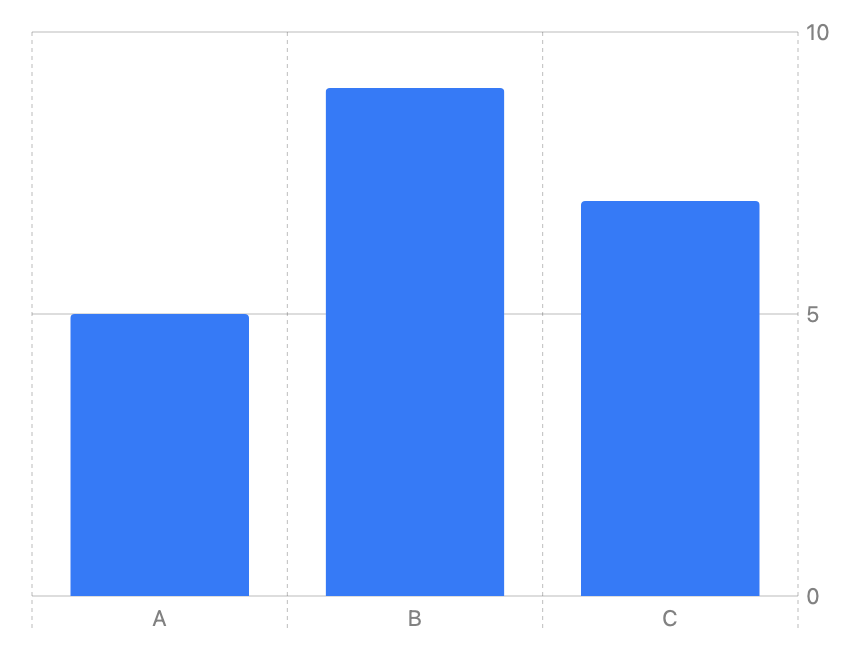
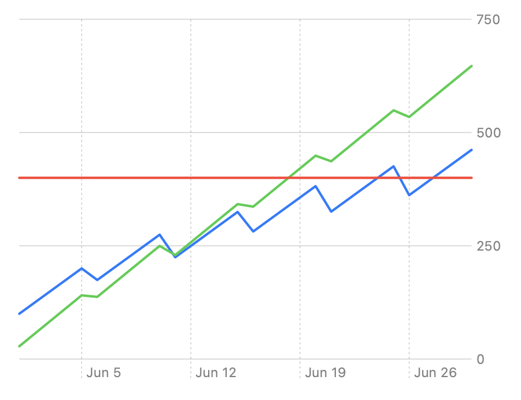

> Navigation: [Technologies](../technologies.md) · [Swift Charts](../charts.md)

# Chart

<sub>Structure</sub>

A SwiftUI view that displays a chart.

<sub>iOS, iPadOS, Mac Catalyst, macOS, tvOS, visionOS, watchOS</sub>

```swift
@MainActor @preconcurrency struct Chart<Content> where Content : ChartContent
```

## Overview

To create a chart, instantiate a `Chart` structure with marks that display the properties of your data. For example, suppose you have an array of `ValuePerCategory` structures that define data points composed of a `category` and a `value`:

```swift
struct ValuePerCategory {
    var category: String
    var value: Double
}

let data: [ValuePerCategory] = [
    .init(category: "A", value: 5),
    .init(category: "B", value: 9),
    .init(category: "C", value: 7)
]
```

You can use [BarMark](barmark.md) inside a chart to represent the `category` property as different bars in the chart and the `value` property as the y value for each bar:

```swift
Chart(data, id: \.category) { item in
    BarMark(
        x: .value("Category", item.category),
        y: .value("Value", item.value)
    )
}
```

This chart initializer behaves a lot like a SwiftUI [ForEach](../swiftui/foreach.md), creating a mark — in this case, a bar — for each of the values in the `data` array:



<sub>A bar chart with three categories A, B, and C on the x-axis and a range of 0 to 10 on the y-axis. A bar appears in each category. All the bars are the same color. The first has a value of 5. The second has a value of 9. The third has a value of 7.</sub>

### Controlling data series inside a chart

You can compose more sophisticated charts by providing more than one series of marks to the chart. For example, suppose you have profit data for two companies:

```swift
struct ProfitOverTime {
    var date: Date
    var profit: Double
}

let departmentAProfit: [ProfitOverTime] = <#Profit array A#>
let departmentBProfit: [ProfitOverTime] = <#Profit array B#>
```

The following chart creates two different series of [LineMark](linemark.md) instances with different colors to represent the data for each company. In effect, it moves the `ForEach` construct from the chart’s initializer into the body of the chart, enabling you to represent multiple different series:

```swift
Chart {
    ForEach(departmentAProfit, id: \.date) { item in
        LineMark(
            x: .value("Date", item.date),
            y: .value("Profit A", item.profit),
            series: .value("Company", "A")
        )
        .foregroundStyle(.blue)
    }
    ForEach(departmentBProfit, id: \.date) { item in
        LineMark(
            x: .value("Date", item.date),
            y: .value("Profit B", item.profit),
            series: .value("Company", "B")
        )
        .foregroundStyle(.green)
    }
    RuleMark(
        y: .value("Threshold", 400)
    )
    .foregroundStyle(.red)
}
```

You indicate which series a line mark belongs to by specifying its `series` input parameter. The above chart also uses a [RuleMark](rulemark.md) to produce a horizontal line segment that displays a constant threshold value across the width of the chart:



<sub>A line chart with three lines. Dates appear on the x-axis, spanning one full month, and company profit appears on the y-axis in the range of 0 to 750. Two of the lines trend upward from left to right, with occasional downward movement. The third line is purely horizontal at the level of 400.</sub>

## Relationships

- **Conforms To**: [Sendable](../swift/sendable.md), [SendableMetatype](../swift/sendablemetatype.md), [View](../swiftui/view.md)

## Topics

### Creating a chart

- [init(content:)](<chart/init(content_).md>) — Creates a chart composed of any number of data series and individual marks.
- [init(_:content:)](<chart/init(__content_).md>) — Creates a chart composed of a series of identifiable marks.
- [init(_:id:content:)](<chart/init(__id_content_).md>) — Creates a chart composed of a series of marks.

### Supporting types

- [body](chartcontent/body-swift.property.md) — The content and behavior of the chart content.

## See Also

### Charts

- [Creating a chart using Swift Charts](creating-a-chart-using-swift-charts.md) — Make a chart by combining chart building blocks in SwiftUI.
- [Visualizing your app’s data](visualizing-your-app-s-data.md) — Build complex and interactive charts using Swift Charts.
- [ChartContent](chartcontent.md) — A type that represents the content that you draw on a chart.
- [ChartContentBuilder](chartcontentbuilder.md) — A result builder that you use to compose the contents of a chart.
- [Plot](plot.md) — A mechanism for grouping chart contents into a single entity.
