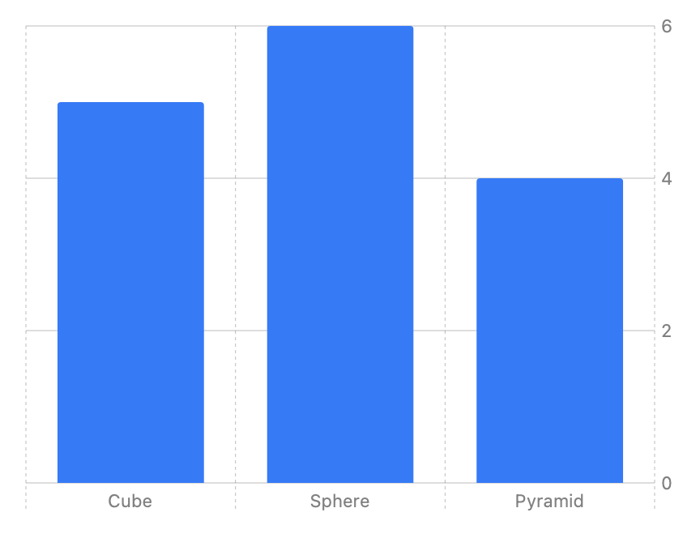
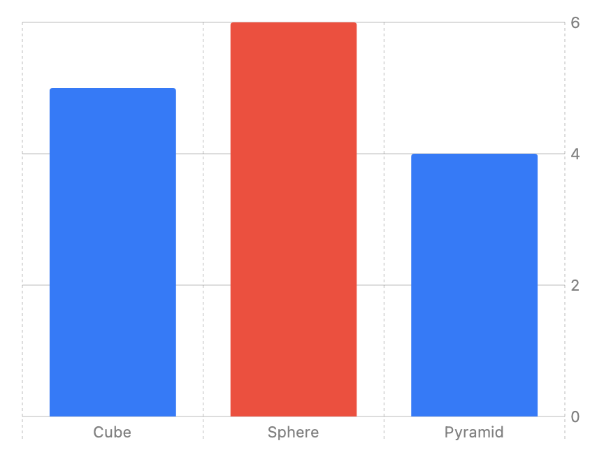

> Navigation: [Technologies](../technologies.md) · [Swift Charts](../charts.md)

# ChartContent

<sub>Protocol</sub>

A type that represents the content that you draw on a chart.

<sub>iOS, iPadOS, Mac Catalyst, macOS, tvOS, visionOS, watchOS</sub>

```swift
@MainActor @preconcurrency protocol ChartContent
```

## Overview

You build a [Chart](chart.md) by adding instances that conform to the `ChartContent` protocol to the chart’s `content` closure. The following example adds three explicit [BarMark](barmark.md) instances to a chart:

```swift
Chart {
    BarMark(
        x: .value("Shape Type", "Cube"),
        y: .value("Total Count", 5)
    )
    BarMark(
        x: .value("Shape Type", "Sphere"),
        y: .value("Total Count", 6)
    )
    BarMark(
        x: .value("Shape Type", "Pyramid"),
        y: .value("Total Count", 4)
    )
}
```

The chart draws marks that correspond to the instances that you specify:



<sub>A bar chart with three vertical bars, all in the same color. The first is labeled Cube and has a value of 5. The second is labeled Sphere and has a value of 6. The third is labeled Pyramid and has a value of 4.</sub>

You can combine any number of marks or types of marks in a single chart by listing them individually as shown in the above example, wrapping them in a [ForEach](../swiftui/foreach.md), or any combination of these. For some mark types, like [LineMark](linemark.md), you can group the marks into series using the mark’s `series` initialization parameter.

### Configure chart content

The `ChartContent` protocol provides a set of modifiers that you use to configure the properties of chart content. These behave like SwiftUI view modifiers, except that they act on chart content rather than views. Any of the types that conform to the protocol can use these modifiers. For example, you can add the [foregroundStyle(_:)](<chartcontent/foregroundstyle(__).md>) modifier to the bar representing the number of spheres in the previous example to make it red:

```swift
BarMark(
    x: .value("Shape Type", "Sphere"),
    y: .value("Total Count", 6)
)
.foregroundStyle(.red)
```



<sub>A bar chart with three vertical bars. The first and third bars are blue while the middle bar is red. The first is labeled Cube and has a value of 5. The second is labeled Sphere and has a value of 6. The third is labeled Pyramid and has a value of 4.</sub>

## Relationships

- **Inherited By**: [VectorizedChartContent](vectorizedchartcontent.md)

- **Conforming Types**: [AnyChartContent](anychartcontent.md), [AreaMark](areamark.md), [AreaPlot](areaplot.md), [BarMark](barmark.md), [BarPlot](barplot.md), [BuilderConditional](builderconditional.md), [FunctionAreaPlotContent](functionareaplotcontent.md), [FunctionLinePlotContent](functionlineplotcontent.md), [LineMark](linemark.md), [LinePlot](lineplot.md), [Plot](plot.md), [PointMark](pointmark.md), [PointPlot](pointplot.md), [RectangleMark](rectanglemark.md), [RectanglePlot](rectangleplot.md), [RuleMark](rulemark.md), [RulePlot](ruleplot.md), [SectorMark](sectormark.md), [SectorPlot](sectorplot.md), [VectorizedAreaPlotContent](vectorizedareaplotcontent.md), [VectorizedBarPlotContent](vectorizedbarplotcontent.md), [VectorizedLinePlotContent](vectorizedlineplotcontent.md), [VectorizedPointPlotContent](vectorizedpointplotcontent.md), [VectorizedRectanglePlotContent](vectorizedrectangleplotcontent.md), [VectorizedRulePlotContent](vectorizedruleplotcontent.md), [VectorizedSectorPlotContent](vectorizedsectorplotcontent.md)

## Topics

### Styling marks

- [foregroundStyle(_:)](<chartcontent/foregroundstyle(__).md>) — Sets the foreground style for the chart content.
- [opacity(_:)](<chartcontent/opacity(__).md>) — Sets the opacity for the chart content.
- [blur(radius:)](<chartcontent/blur(radius_).md>) — Applies a Gaussian blur to this chart content.
- [cornerRadius(_:style:)](<chartcontent/cornerradius(__style_).md>) — Sets the corner radius of the chart content.
- [lineStyle(_:)](<chartcontent/linestyle(__).md>) — Sets the style for line marks.
- [shadow(color:radius:x:y:)](<chartcontent/shadow(color_radius_x_y_).md>) — A chart content that adds a shadow to this chart content.
- [interpolationMethod(_:)](<chartcontent/interpolationmethod(__).md>) — Plots line and area marks with the interpolation method that you specify.

### Positioning marks

- [offset(_:)](<chartcontent/offset(__).md>) — Applies an offset that you specify as a size to the chart content.
- [offset(x:y:)](<chartcontent/offset(x_y_).md>) — Applies a vertical and horizontal offset to the chart content.
- [offset(x:yStart:yEnd:)](<chartcontent/offset(x_ystart_yend_).md>) — Applies an offset to the chart content.
- [offset(xStart:xEnd:y:)](<chartcontent/offset(xstart_xend_y_).md>) — Applies an offset to the chart content.
- [offset(xStart:xEnd:yStart:yEnd:)](<chartcontent/offset(xstart_xend_ystart_yend_).md>) — Applies an offset to the chart content.
- [alignsMarkStylesWithPlotArea(_:)](<chartcontent/alignsmarkstyleswithplotarea(__).md>) — Aligns this item’s styles with the chart’s plot area.

### Setting symbol appearance

- [symbol(_:)](<chartcontent/symbol(__).md>) — Sets a plotting symbol type for the chart content.
- [symbol(symbol:)](<chartcontent/symbol(symbol_).md>) — Sets a SwiftUI view to use as the symbol for the chart content.
- [symbolSize(_:)](<chartcontent/symbolsize(__)-7s0vk.md>) — Sets the plotting symbol size for the chart content.
- [symbolSize(_:)](<chartcontent/symbolsize(__)-8dtyt.md>) — Sets the plotting symbol size for the chart content according to a perceived area.

### Encoding data into mark characteristics

- [foregroundStyle(by:)](<chartcontent/foregroundstyle(by_).md>) — Represents data using a foreground style.
- [lineStyle(by:)](<chartcontent/linestyle(by_).md>) — Represents data using line styles.
- [position(by:axis:span:)](<chartcontent/position(by_axis_span_).md>) — Represents data using position.
- [symbol(by:)](<chartcontent/symbol(by_).md>) — Represents data using different kinds of symbols.
- [symbolSize(by:)](<chartcontent/symbolsize(by_).md>) — Represents data using symbol sizes.

### Annotating marks

- [annotation(position:alignment:spacing:content:)](<chartcontent/annotation(position_alignment_spacing_content_)-65emh.md>) — Annotates this mark or collection of marks with a view positioned relative to its bounds.
- [annotation(position:alignment:spacing:content:)](<chartcontent/annotation(position_alignment_spacing_content_)-26b2f.md>) — Annotates this mark or collection of marks with a view positioned relative to its bounds.
- [annotation(position:alignment:spacing:overflowResolution:content:)](<chartcontent/annotation(position_alignment_spacing_overflowresolution_content_)-1kiow.md>) — Annotates this mark or collection of marks with a view positioned relative to its bounds.
- [annotation(position:alignment:spacing:overflowResolution:content:)](<chartcontent/annotation(position_alignment_spacing_overflowresolution_content_)-6w4p3.md>) — Annotates this mark or collection of marks with a view positioned relative to its bounds.

### Layering chart content

- [compositingLayer()](<chartcontent/compositinglayer().md>)
- [compositingLayer(style:)](<chartcontent/compositinglayer(style_).md>)
- [zIndex(_:)](<chartcontent/zindex(__).md>) — Controls the display order of overlapping chart content.

### Masking and clipping

- [mask(content:)](<chartcontent/mask(content_).md>) — Masks chart content using the alpha channel of the specified content.
- [clipShape(_:style:)](<chartcontent/clipshape(__style_).md>) — Sets a clip shape for the chart content.

### Configuring accessibility

- [accessibilityHidden(_:)](<chartcontent/accessibilityhidden(__).md>) — Specifies whether to hide this chart content from system accessibility features.
- [accessibilityIdentifier(_:)](<chartcontent/accessibilityidentifier(__).md>) — Adds an identifier string to the chart content.
- [accessibilityLabel(_:)](<chartcontent/accessibilitylabel(__)-40zjp.md>) — Adds a label to the chart content that describes its contents.
- [accessibilityLabel(_:)](<chartcontent/accessibilitylabel(__)-5gk8d.md>) — Adds a label to the chart content that describes its contents.
- [accessibilityLabel(_:)](<chartcontent/accessibilitylabel(__)-28985.md>) — Adds a label to the chart content that describes its contents.
- [accessibilityLabel(_:)](<chartcontent/accessibilitylabel(__)-9tbjv.md>) — Adds a label to the chart content that describes its contents.
- [accessibilityValue(_:)](<chartcontent/accessibilityvalue(__)-33c0e.md>) — Adds a description of the value that the chart content contains.
- [accessibilityValue(_:)](<chartcontent/accessibilityvalue(__)-4k545.md>) — Adds a description of the value that the chart content contains.
- [accessibilityValue(_:)](<chartcontent/accessibilityvalue(__)-5g7o4.md>) — Adds a description of the value that the chart content contains.
- [accessibilityValue(_:)](<chartcontent/accessibilityvalue(__)-4f8vo.md>) — Adds a description of the value that the chart content contains.

### Implementing chart content

- [body](chartcontent/body-swift.property.md) — The content and behavior of the chart content.
- [Body](chartcontent/body-swift.associatedtype.md) — The type of chart content contained in the body of this instance.

### Supporting types

- [AnyChartContent](anychartcontent.md) — A type-erased chart content.

## See Also

### Charts

- [Creating a chart using Swift Charts](creating-a-chart-using-swift-charts.md) — Make a chart by combining chart building blocks in SwiftUI.
- [Visualizing your app’s data](visualizing-your-app-s-data.md) — Build complex and interactive charts using Swift Charts.
- [Chart](chart.md) — A SwiftUI view that displays a chart.
- [ChartContentBuilder](chartcontentbuilder.md) — A result builder that you use to compose the contents of a chart.
- [Plot](plot.md) — A mechanism for grouping chart contents into a single entity.
