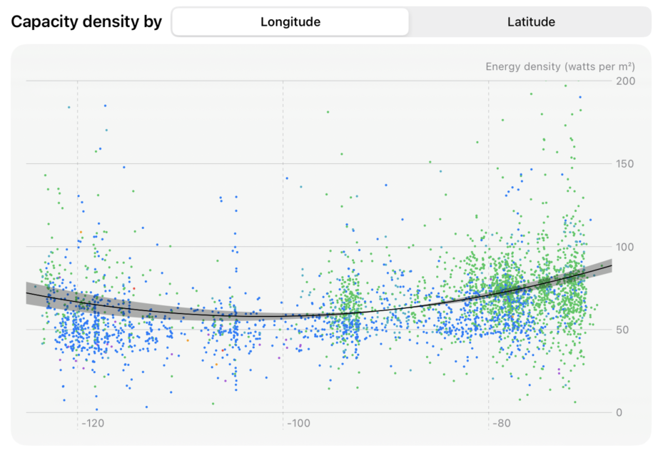
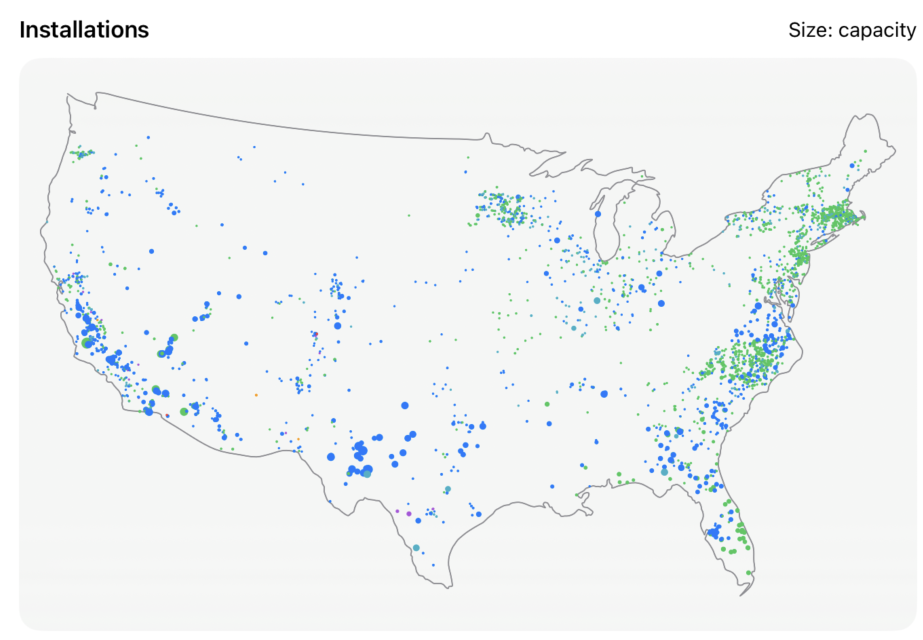

> Navigation: [Technologies](../technologies.md) · [Swift Charts](../charts.md)

# Creating a data visualization dashboard with Swift Charts

<sub>Sample Code</sub>

Visualize an entire data collection efficiently by instantiating a single vectorized plot in Swift Charts.

## Overview

> [!note] Note
> This sample code project is associated with WWDC24 session 10155: [Swift Charts: Vectorized and function plots](https://developer.apple.com/wwdc24/10155/).

This sample shows how to visualize a dataset using a variety of chart types including histograms, scatterplots, heatmaps, and more. The sample takes advantage of vectorized plots to enable efficient plotting data of an entire `RandomAccessCollection`, and function plotting to visualize meaningful trends in that data. The app is a dashboard that visualizes large-scale solar photovoltaic facilities in the contiguous United States by consuming data from the U.S. Geological Survey and Lawrence Berkeley National Laboratory.

### Plot entire collections with vectorized plots

The `Scatterplot` view displays a scatterplot that maps the capacity density of each facility by its location. The sample app allows toggling between using longitude or latitude as the basis for location.



<sub>A screenshot of the sample app that shows a scatterplot with many datapoints and a line representing a regression equation running through the data. A segmented control to choose longitude or latitude for the x-axis appears above the scatterplot.</sub>

The scatterplot uses the [PointPlot](pointplot.md) type to plot the data efficiently, enabling a smooth animation in the chart as the underlying data changes.

```swift
PointPlot(
    data,
    x: .value("Longitude", xKeyPath),
    y: .value("Capacity density", \.capacityDensity)
)
.foregroundStyle(by: .value("Breakdown", model.breakdownField.keyPath))
.symbolSize(4)
```

### Visualize data trends with function plotting

The `Scatterplot` view displays a scatterplot that maps the capacity density (the ratio of power-generating capacity to the area) of each facility by its location. The sample applies quadratic regression to the data to generate the regression equation:

```swift
let regression = QuadraticRegression(data, x: xKeyPath, y: \.capacityDensity)
```

The scatterplot uses the [LinePlot](lineplot.md) type to draw the regression equation as a trend line on top of the datapoints:

```swift
LinePlot(x: "x", y: "y") { x in
    regression(x)
}
.foregroundStyle(colorScheme == .dark ? .white : .black)
.lineStyle(.init(lineWidth: colorScheme == .dark ? 1.5 : 1))
```

### Add custom shapes to a chart

The `ThematicMap` view displays a chart that shows the datapoints in an outline of a map of the contiguous United States.



<sub>A screenshot of the sample app that shows an outline map of the contiguous United States, showing many datapoints inside the map outline. The points on the map vary by size to represent a range of capacities for each installation.</sub>

The sample uses [LinePlot](lineplot.md) to draw the outline of a simple thematic map, connecting longitude and latitude points of the federal borders of the contiguous United States:

```swift
LinePlot(
    contiguousUSABorderCoordinates,
    x: .value("Longitude", \.mapProjection.x),
    y: .value("Latitude", \.mapProjection.y)
)
.interpolationMethod(.catmullRom)
.lineStyle(.init(lineWidth: 1, lineCap: .round, lineJoin: .round))
.foregroundStyle(.gray)
```

The sample uses [PointPlot](pointplot.md) to plot the location of each facility on the thematic map, using color to distinguish categorical data. The point size correlates with each facility’s capacity:

```swift
PointPlot(
    model.filteredData,
    x: .value("Longitude", \.mapProjection.x),
    y: .value("Latitude", \.mapProjection.y)
)
.symbolSize(by: .value("Capacity", \.capacityDC))
.foregroundStyle(by: .value("Breakdown", model.breakdownField.keyPath))
```

## See Also

### Vectorized plots

- [AreaPlot](areaplot.md) — Chart content that represents a function or a collection of data using the area of one or more regions.
- [LinePlot](lineplot.md) — Chart content that represents a function or a collection of data using a sequence of connected line segments.
- [PointPlot](pointplot.md) — Chart content that represents a collection of data using points.
- [RectanglePlot](rectangleplot.md) — Chart content that represents a collection of data using rectangles.
- [RulePlot](ruleplot.md) — Chart content that represents a collection of data using a single horizontal or vertical rule.
- [BarPlot](barplot.md) — Chart content that represents a collection of data using bars.
- [SectorPlot](sectorplot.md) — Chart content that represents a collection of data using a sector of a pie or donut chart, which shows how individual categories make up a meaningful total.
- [VectorizedChartContent](vectorizedchartcontent.md) — A generic type that represents content conveyed via a chart.

## Download

- [CreatingADataVisualizationDashboardWithSwiftCharts.zip](https://docs-assets.developer.apple.com/published/9dc7606e4293/CreatingADataVisualizationDashboardWithSwiftCharts.zip)
