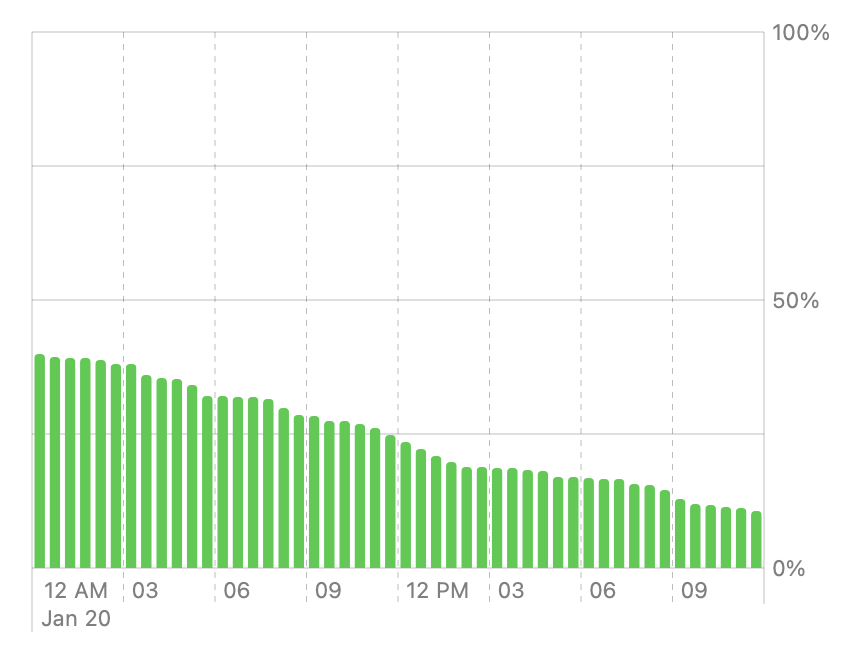
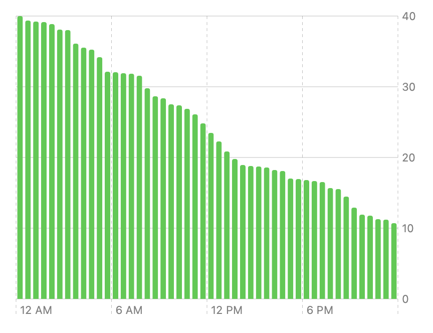
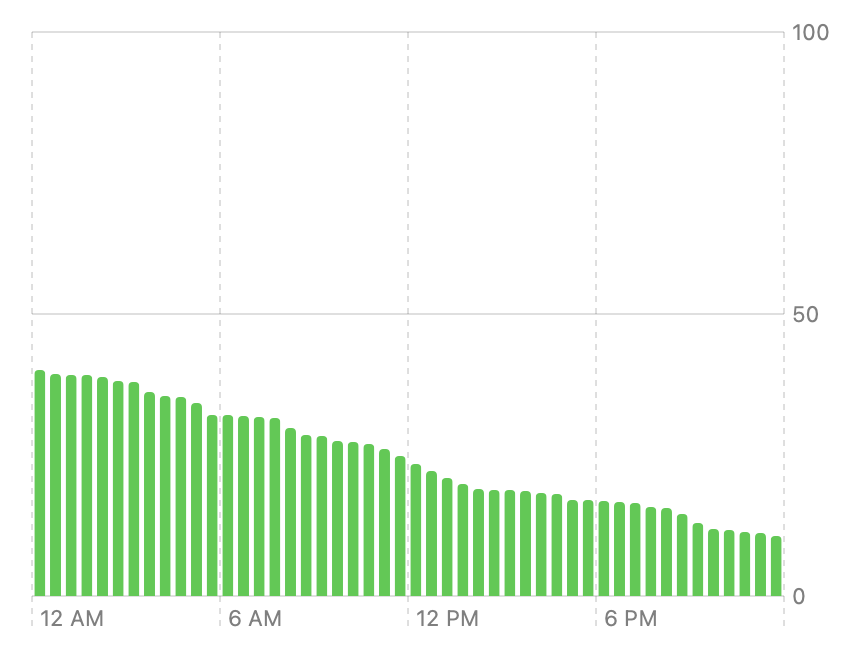
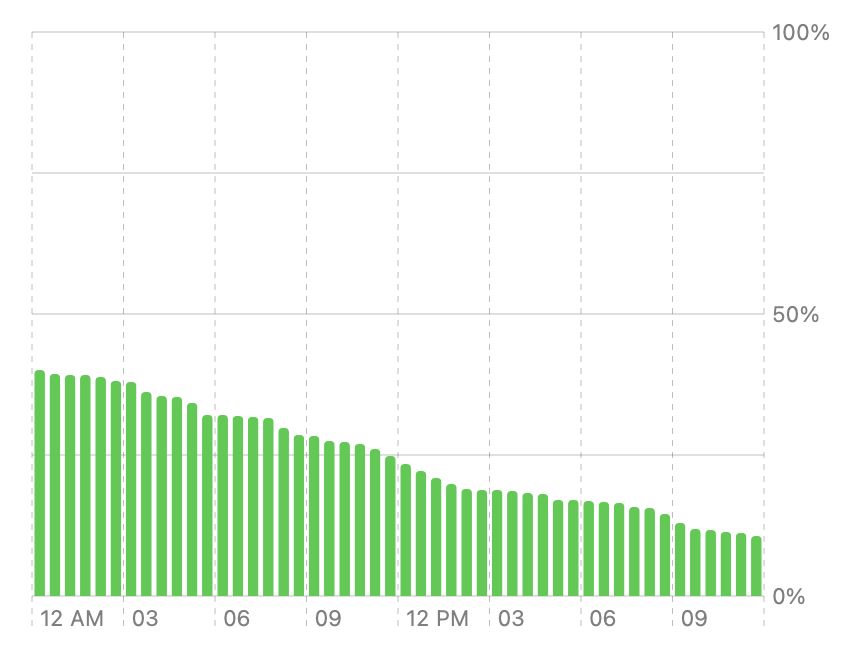

> Navigation: [Technologies](../technologies.md) · [Swift Charts](../charts.md)

# Customizing axes in Swift Charts

<sub>Article</sub>

Improve the clarity of your chart by configuring the appearance of its axes.

## Overview

Swift Charts automatically configures the axes in your charts based on the data that you specify. Sometimes you can communicate the data more clearly by customizing the axis configuration. For example, you can:

- Specify a range for an axis.
- Choose the specific values — like categories, dates, or numbers — the axes display.
- Set the visual style of grid lines, ticks, or labels that represent each value.

This article demonstrates how to use these features to create the following chart that displays battery levels over the course of a day:



<sub>A bar chart that has 48 vertical bars, with each bar shorter than the previous one by a small amount. The y-axis represents percentages, ranging from 0 to 100, with labels at 0, 50, and 100. There are also two additional horizontal grid lines without labels at 25 and 75. The x-axis represents time, starting at 12 AM, spanning one 24 hour period, with labels every three hours, and AM and PM markers at midnight and noon, respectively. The month and day appear below the first time label, aligned with the leading edge of the chart. The first bar has a height of 40, while the last has a height of about 10.</sub>

For design guidance about charts and their axes, see the [Charts](https://developer.apple.com/design/human-interface-guidelines/components/content/charts) section in the Human Interface Guidelines.

### Start with default axes

Generating a chart using the framework default axis configuration typically provides a good foundation to start from. For example, the following code creates a basic battery chart from an array of data points:

```swift
struct BatteryData {
    let date: Date
    let level: Double

    static let data: [BatteryData] = /* Array of BatteryData instances */
}

Chart(BatteryData.data, id: \.date) {
    BarMark(
        // Create one bar for every 1800 seconds (30 minutes).
        x: .value("Time", $0.date ..< $0.date.advanced(by: 1800)),
        y: .value("Battery Level", $0.level)
    )
    .foregroundStyle(.green)
}
```

The framework chooses a default axis configuration that’s sensible for the data. The data fills the available space without overflowing in any dimension. Both axes have labels that indicate the values that the chart’s content represents. The following chart displays the default axis configuration:



<sub>A bar chart that has 48 vertical bars, with each bar shorter than the previous one by a small amount. The y-axis represents integers, ranging from 0 to 40, with labels at 0, 10, 20, 30, and 40. The x-axis represents time, starting at 12 AM, spanning one 24 hour period, with labels every six hours, and AM or PM markers on all the labels. The first bar has a height of 40, while the last has a height of about 10.</sub>

However, given that batteries have a maximum capacity of 100 percent and that people typically charge their phones once per day, you can improve this chart by configuring the axes.

### Set the domain of an axis

Battery levels always fall within a range of 0 to 100 percent. Being able to visually compare a given value against the whole range helps people to better understand how the current battery state compares to a full battery. So it makes sense to fix the range of the y-axis to the full possible range, regardless of the range of the data in the current data set.

Set a range for the y-axis using the [chartYScale(domain:type:)](<../swiftui/view/chartyscale(domain_type_).md>) view modifier:

```swift
.chartYScale(domain: [0, 100])
```


<sub>A bar chart that has 48 vertical bars, with each bar shorter than the previous one by a small amount. The y-axis represents integers, ranging from 0 to 100, with labels at 0, 25, 50, 75, and 100. The x-axis represents time, starting at 12 AM, spanning one 24 hour period, with labels every six hours, and AM or PM markers on all the labels. The first bar has a height of 40, while the last has a height of about 10.</sub>

### Specify axis values

Swift Charts chooses a default number of grid lines and labels to display on each axis. You can specify a different number of values by using the [chartYAxis(content:)](<../swiftui/view/chartyaxis(content_).md>) modifier, which takes one or more [AxisMarks](axismarks.md) instances in its `content` parameter. Request a specific number of values by initializing the axis marks instance with the [automatic(desiredCount:roundLowerBound:roundUpperBound:)](<axismarkvalues/automatic(desiredcount_roundlowerbound_roundupperbound_).md>) value. For example, you can request that the axis have three values:

```swift
.chartYAxis {
    AxisMarks(values: .automatic(desiredCount: 3))
}
```

For the battery chart, this creates labels at `0`, `50`, and `100`:



<sub>A bar chart that has 48 vertical bars, with each bar shorter than the previous one by a small amount. The y-axis represents integers, ranging from 0 to 100, with labels at 0, 50, and 100. The x-axis represents time, starting at 12 AM, spanning one 24 hour period, with labels every six hours, and AM or PM markers on all the labels. The first bar has a height of 40, while the last has a height of about 10.</sub>

> [!note] Note
> The actual number of values that the framework uses might differ from the value that you request. For example, if you request four values in the above example, the framework uses five instead to avoid displaying fractional labels.

Alternatively, you can indicate exact values to mark on the axis using an array of values:

```swift
.chartYAxis {
    AxisMarks(values: [0, 50, 100])
}
```

### Format values

You can add clarity to any chart by properly formatting its axis values. The values on the y-axis in the battery chart represent percentages, so you can pass the `format` parameter to the axis marks initializer to apply an appropriate formatting:

```swift
.chartYAxis {
    AxisMarks(
        format: Decimal.FormatStyle.Percent.percent.scale(1),
        values: [0, 50, 100]
    )
}
```


<sub>A bar chart that has 48 vertical bars, with each bar shorter than the previous one by a small amount. The y-axis represents percentages, ranging from 0 to 100, with labels at 0, 50, and 100. The x-axis represents time, starting at 12 AM, spanning one 24 hour period, with labels every six hours, and AM or PM markers on all the labels. The first bar has a height of 40, while the last has a height of about 10.</sub>

### Compose axis marks

To add more complex styling, compose axis marks inside the modifier’s `content` closure. For example, to add more horizontal grid lines without adding more labels, use two separate [AxisMarks](axismarks.md) instances to render the grid lines and labels separately:

```swift
.chartYAxis {
    AxisMarks(
        values: [0, 50, 100]
    ) {
        AxisValueLabel(format: Decimal.FormatStyle.Percent.percent.scale(1))
    }
    
    AxisMarks(
        values: [0, 25, 50, 75, 100]
    ) {
        AxisGridLine()
    }
}
```

The `AxisMarks` initializers in the above code each take a `content` parameter that’s an axis builder indicating which elements the marks apply to. Use the builder to compose [AxisGridLine](axisgridline.md), [AxisTick](axistick.md), and [AxisValueLabel](axisvaluelabel.md) elements. The above example renders grid lines at `0`, `25`, `50`, `75`, and `100`, but places labels only at `0`, `50`, and `100`:


<sub>A bar chart that has 48 vertical bars, with each bar shorter than the previous one by a small amount. The y-axis represents percentages, ranging from 0 to 100, with labels at 0, 50, and 100. There are also two additional horizontal grid lines without labels at 25 and 75. The x-axis represents time, starting at 12 AM, spanning one 24 hour period, with labels every six hours, and AM or PM markers on all the labels. The first bar has a height of 40, while the last has a height of about 10.</sub>

For additional customization, apply the styling methods that [AxisMark](axismark.md) provides. For example, you can adjust the font of the value labels by applying the [font(_:)](<axismark/font(__).md>) method to the [AxisValueLabel](axisvaluelabel.md) instance.

### Conditionally format labels

For the specified data, the battery chart marks every sixth hour along the x-axis and includes the AM or PM indicator with each hour by default. You can make the chart more readable by including a mark every three hours, and displaying the AM or PM indicator only when it changes.

Use the [chartXAxis(content:)](<../swiftui/view/chartxaxis(content_).md>) view modifier to configure the x-axis, much like you use the [chartYAxis(content:)](<../swiftui/view/chartyaxis(content_).md>) modifier for the y-axis. The following code passes a [stride(by:count:roundLowerBound:roundUpperBound:calendar:)](<axismarkvalues/stride(by_count_roundlowerbound_roundupperbound_calendar_).md>) value to an [AxisMarks](axismarks.md) instance to control the frequency of marks, and uses conditional formatting to show AM or PM only at noon and midnight:

```swift
.chartXAxis {
    AxisMarks(values: .stride(by: .hour, count: 3)) { value in
        if let date = value.as(Date.self) {
            let hour = Calendar.current.component(.hour, from: date)
            switch hour {
            case 0, 12:
                AxisValueLabel(format: .dateTime.hour())
            default:
                AxisValueLabel(format: .dateTime.hour(.defaultDigits(amPM: .omitted)))
            }
        }
        
        AxisGridLine()
        AxisTick()
    }
}
```



<sub>A bar chart that has 48 vertical bars, with each bar shorter than the previous one by a small amount. The y-axis represents percentages, ranging from 0 to 100, with labels at 0, 50, and 100. There are also two additional horizontal grid lines without labels at 25 and 75. The x-axis represents time, starting at 12 AM, spanning one 24 hour period, with labels every three hours, and AM and PM markers at midnight and noon, respectively. The first bar has a height of 40, while the last has a height of about 10.</sub>

### Style grid lines and ticks

You can provide people reading this chart with additional context by displaying the date below the first value label and for subsequent labels where the date changes. Create a stack of text views in the [AxisValueLabel](axisvaluelabel.md) builder, and use the value’s index combined with the hour to conditionally display the date:

```swift
.chartXAxis {
    AxisMarks(values: .stride(by: .hour, count: 3)) { value in
        if let date = value.as(Date.self) {
            let hour = Calendar.current.component(.hour, from: date)
            AxisValueLabel {
                VStack(alignment: .leading) {
                    switch hour {
                    case 0, 12:
                        Text(date, format: .dateTime.hour())
                    default:
                        Text(date, format: .dateTime.hour(.defaultDigits(amPM: .omitted)))
                    }
                    if value.index == 0 || hour == 0 {
                        Text(date, format: .dateTime.month().day())
                    }
                }
            }

            if hour == 0 {
                AxisGridLine(stroke: StrokeStyle(lineWidth: 0.5))
                AxisTick(stroke: StrokeStyle(lineWidth: 0.5))
            } else {
                AxisGridLine()
                AxisTick()
            }
        }
    }
}
```

> [!note] Note
> For the condition `(hour==0)` to work, ensure that your data starts at an hour that’s divisible by the stride. For the above example with a stride of three, the data can start at `3`, `6`, or `9`, or `12`, either AM or PM.

The above code also helps to clarify the date boundaries by using a solid grid line and tick at midnight, including at both the beginning and end of the chart:


<sub>A bar chart that has 48 vertical bars, with each bar shorter than the previous one by a small amount. The y-axis represents percentages, ranging from 0 to 100, with labels at 0, 50, and 100. There are also two additional horizontal grid lines without labels at 25 and 75. The x-axis represents time, starting at 12 AM, spanning one 24 hour period, with labels every three hours, and AM and PM markers at midnight and noon, respectively. The month and day appear below the first time label, aligned with the leading edge of the chart. The first bar has a height of 40, while the last has a height of about 10.</sub>

Compare this chart with the one at the beginning of this article that uses the default axis configuration.

## See Also

### Axes

- [ChartAxisContent](chartaxiscontent.md) — A view that represents a chart’s axis.
- [AxisContent](axiscontent.md) — A type that represents the elements you use to build a chart’s axes.
- [AxisMarks](axismarks.md) — A group of visual marks that a chart draws to indicate the composition of a chart’s axes.
- [AnyAxisContent](anyaxiscontent.md) — A type-erased element of a chart’s axis.
- [AxisContentBuilder](axiscontentbuilder.md) — A result builder that constructs axis content.
