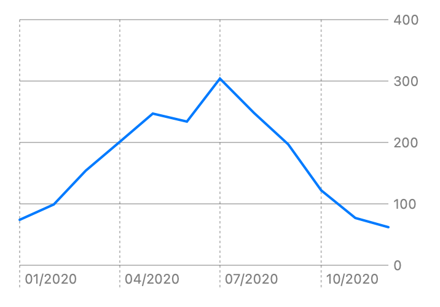

> Navigation: [Technologies](../../technologies.md) · [Swift Charts](../../charts.md) · [LineMark](../linemark.md)

# init(x:y:)

<sub>Initializer</sub>

Creates a line mark.

<sub>iOS, iPadOS, Mac Catalyst, macOS, tvOS, visionOS, watchOS</sub>

```swift
nonisolated init<X, Y>(x: PlottableValue<X>, y: PlottableValue<Y>) where X : Plottable, Y : Plottable
```

## Parameters

- `x` — The value plotted with x.

- `y` — The value plotted with y.

### Discussion

Use this initializer to create a chart with a single line.

```swift
Chart(sunshineData) {
    LineMark(
        x: .value("Month", $0.date),
        y: .value("Hours of Sunshine", $0.hoursOfSunshine)
    )
}
```



<sub>Line chart with date on x-axis and hours of sunshine on y-axis. One line showing 12 points representing hours of sunshine in a month 1 74, 2 99, 3 154, 4 201, 5 247, 6 234, 7 304, 8 248, 9 197, 10 122, 11 77, 12 62.</sub>

## See Also

### Creating a line mark

- [init(x:y:series:)](<init(x_y_series_).md>) — Creates a separate line for each unique value of series.
