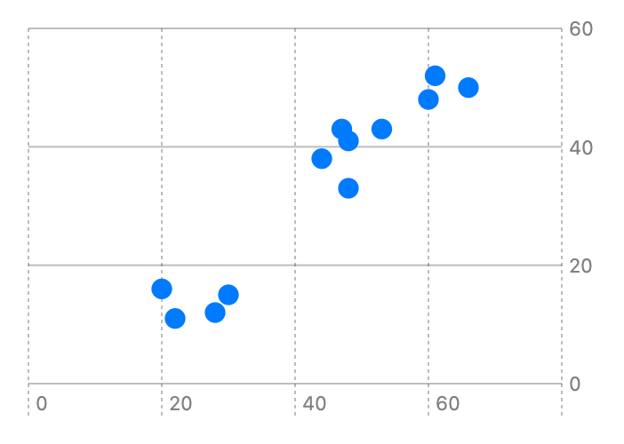

> Navigation: [Technologies](../../technologies.md) · [Swift Charts](../../charts.md) · [PointMark](../pointmark.md)

# init(x:y:)

<sub>Initializer</sub>

Creates a point mark that plots values to x and y.

<sub>iOS, iPadOS, Mac Catalyst, macOS, tvOS, visionOS, watchOS</sub>

```swift
nonisolated init<X, Y>(x: PlottableValue<X>, y: PlottableValue<Y>) where X : Plottable, Y : Plottable
```

## Parameters

- `x` — The value plotted with x.

- `y` — The value plotted with y.

### Discussion

Use this initializer to plot one property with x and another property with y:

```swift
Chart(data) {
    PointMark(
        x: .value("Wing Length", $0.wingLength),
        y: .value("Wing Length", $0.wingWidth)
    )
}
```



<sub>A scatter plot with wing width plotted on the x-axis and wing height plotted on the y-axis. There are 12 points on the chart that demonstrate a roughly linear relationship between wing width and height.</sub>

For more background, see the first example used in [PointMark](../pointmark.md) which shows the structure that contains the `wingLength` and `wingHeight` properties.

## See Also

### Creating a point mark

- [init(x:y:)](<init(x_y_)-9dswq.md>) — Creates a point mark with fixed x position and plots values with y.
- [init(x:y:)](<init(x_y_)-9hppd.md>) — Creates a point mark that plots a value on x with fixed y position.
- [init(x:y:z:)](<init(x_y_z_).md>) — Creates a 3D point mark that plots values to x, y and z.
